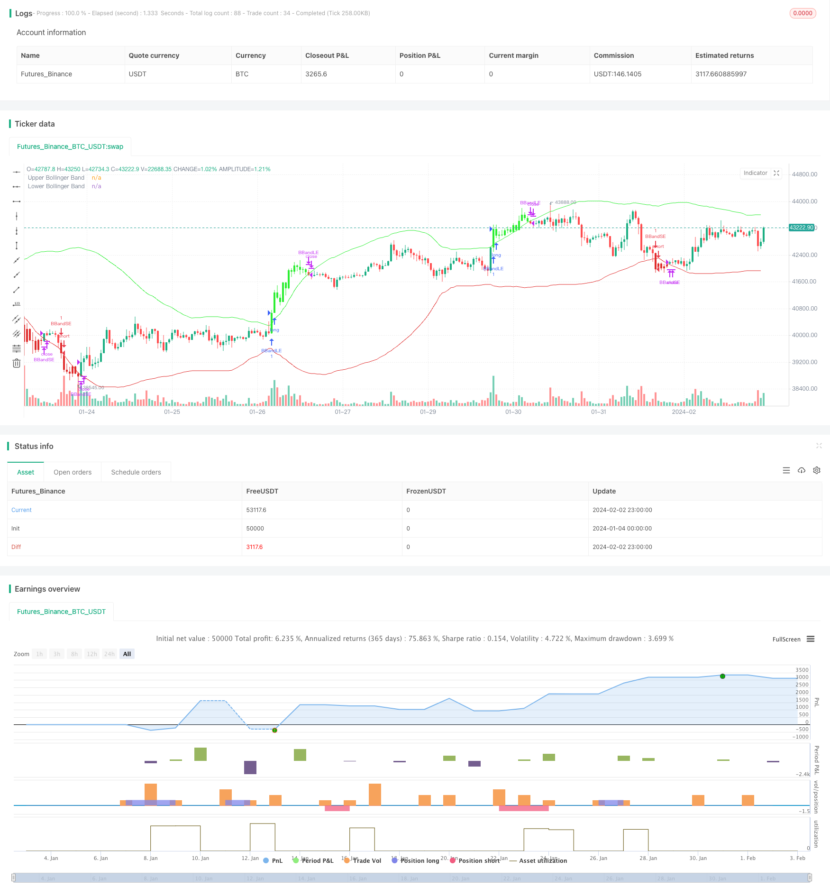

> Name

Quantitative trading strategy based on Bollinger Bands breakout-Bollinger-Bands-Breakout-Quantitative-Trading-Strategy
> Author

ChaoZhang

> Strategy Description


[trans]
### Overview
This strategy realizes the Bollinger Bands breakthrough trading strategy by calculating the upper, middle, and lower rails of the Bollinger Bands, and judging based on the closing price of the K line. When the price breaks through the upper band, go long; when the price breaks through the lower band, go short. Set stop loss and take profit prices at the same time.
### Strategy Principles
1. Calculate the middle track SMA of Bollinger Bands, which has a length of 60 periods and represents the middle track of the price trend.
2. Calculate the upper and lower rails of Bollinger Bands. The upper rails are the middle rails + 2 times the standard deviation, and the lower rails are the middle rails - 2 times the standard deviation. The bandwidth is controlled by multi-value.
3. When the closing price is greater than the upper track, enter the market by going long; when the closing price is less than the lower track, enter the market by going short.
4. Set up a stop-loss and stop-profit mechanism. The stop loss ratio is 1.5% and the take profit ratio is 6%.
5. When the price re-enters the Bollinger Bands or triggers the stop-loss and take-profit exit position, close the position and exit.
### Advantage Analysis
1. Use the Bollinger Bands indicator to judge price breakthroughs and have strong trend judgment ability.
2. The strategy is simple to operate and easy to understand and implement.
3. Set up a stop-loss and stop-profit mechanism to control risks.
### Risk Analysis
1. Bollinger Band breakthrough cannot accurately determine the price trend reversal point, and there may be a risk of false breakthrough.
2. Unreasonable stop-loss and stop-profit settings may bring greater risks.
3. The frequency of transactions may be high, and the impact of transaction costs needs to be considered.
### Optimization direction
1. Combine with other indicators to filter out false breakthrough signals. For example, KDJ indicator determines the trend, and MACD determines the divergence.
2. Dynamically adjust Bollinger Band parameters and calculate reasonable bandwidth based on market volatility.
3. Optimize the stop loss and take profit strategy, trailing stop or stop loss and take profit in batches.
4. Consider the impact of transaction costs and adjust the position holding time.
### Summarize
This strategy uses the Bollinger Bands indicator to determine price breakthroughs and achieve trend following, which has a certain effect. But the possibility of false breakouts carries greater risks. You can consider combining it with other indicators and continuously testing optimization parameters to control risks and improve profitability.
||

### Overview

This strategy calculates the upper band, middle band and lower band of Bollinger Bands and combines the closing price of K-line to implement Bollinger Bands breakout trading strategy. It goes long when price breaks through the upper band and goes short when price breaks through the lower band. Stop loss and take profit prices are also set.

### Strategy Principle 

1. Calculate the middle band SMA of Bollinger Bands with period 60, representing the middle band of price trend.

2. Calculate the upper band and lower band of Bollinger Bands. The upper band is middle band + 2 times standard deviation and the lower band is middle band - 2 times standard deviation. The band width is controlled by multiplier.

3. When closing price is greater than the upper band, go long. When closing price is less than the lower band, go short. 

4. Set stop loss and take profit mechanism. The stop loss percentage is 1.5% and take profit percentage is 6%.

5. When price re-enters the Bollinger Bands or reaches stop loss/take profit price, close position.

### Advantage Analysis

1. Bollinger Bands indicator has strong ability of trend judgment by breakout.

2. Simple strategy logic and easy to understand and implement.

3. Stop loss and take profit control risks.

### Risk Analysis

1. Bollinger Bands breakout cannot accurately determine price trend reversal points, with the risk of false breakout.

2. Unreasonable stop loss and take profit settings may bring greater risks.

3. High trading frequency may be affected by transaction costs.

### Optimization Directions

1. Combine with other indicators to filter out false signals, e.g. KDJ for trend and MACD for divergence.

2. Dynamically adjust Bollinger Bands parameters based on market volatility to calculate reasonable band width.

3. Optimize stop loss and take profit strategy, e.g. trailing stop or partial closing. 

4. Consider transaction costs' impact and adjust holding period.

### Conclusion

This strategy follows trend by Bollinger Bands breakout and has some positive effects. But false breakout may bring greater risks. Combining with other indicators and keep optimizing parameters can control risks and improve profitability.

[/trans]

> Strategy Arguments


|Argument|Default|Description|
|----|----|----|
|v_input_int_1|60|length|
|v_input_float_1|2|mult|


> Source (PineScript)

``` pinescript
/*backtest
start: 2024-01-04 00:00:00
end: 2024-02-03 00:00:00
period: 1h
basePeriod: 15m
exchanges: [{"eid":"Futures_Binance","currency":"BTC_USDT"}]
*/

//@version=5
strategy("Fuera Bolinga", overlay=true)

length = input.int(60, minval=1)
mult = input.float(2.0, minval=0.001, maxval=50)
take_profit_percentage = 6.0

basis = ta.sma(close, length)
dev = mult * ta.stdev(close, length)
upper = basis + dev
lower = basis - dev

stop_loss_percentage = 1.5

// Determinar si la vela cierra por fuera de las bandas
above_upper_band = close > upper
under_lower_band = close < lower

// Pintar las velas que cierran por fuera de las bandas
barcolor(above_upper_band ? color.new(#2cee32, 0) : na)
barcolor(under_lower_band ? color.new(#e02c2c, 0) : na)

// Entrada larga con stop loss y take profit
if (ta.crossover(close, upper))
    strategy.entry("BBandLE", strategy.long, oca_name="BollingerBands",  comment="BBandLE")
else
    strategy.cancel(id="BBandLE")

// Entrada corta con stop loss y take profit
if (ta.crossunder(close, lower))
    strategy.entry("BBandSE", strategy.short, oca_name="BollingerBands",comment="BBandSE")
else
    strategy.cancel(id="BBandSE")

//// Salida de operación larga
if ((ta.crossunder(close, upper) or ta.crossunder(close, lower)) and (strategy.opentrades != 0))
    strategy.close("BBandLE")

// Salida de operación corta
if ((ta.crossover(close, lower) or ta.crossover(close, upper)) and (strategy.opentrades != 0))
    strategy.close("BBandSE")
	
// Plot de las bandas de Bollinger
plot(upper, color=color.new(#2cee32, 0), title="Upper Bollinger Band")
plot(lower, color=color.new(#e02c2c, 0), title="Lower Bollinger Band")

```

> Detail

https://www.fmz.com/strategy/440977

> Last Modified

2024-02-04 14:52:52
