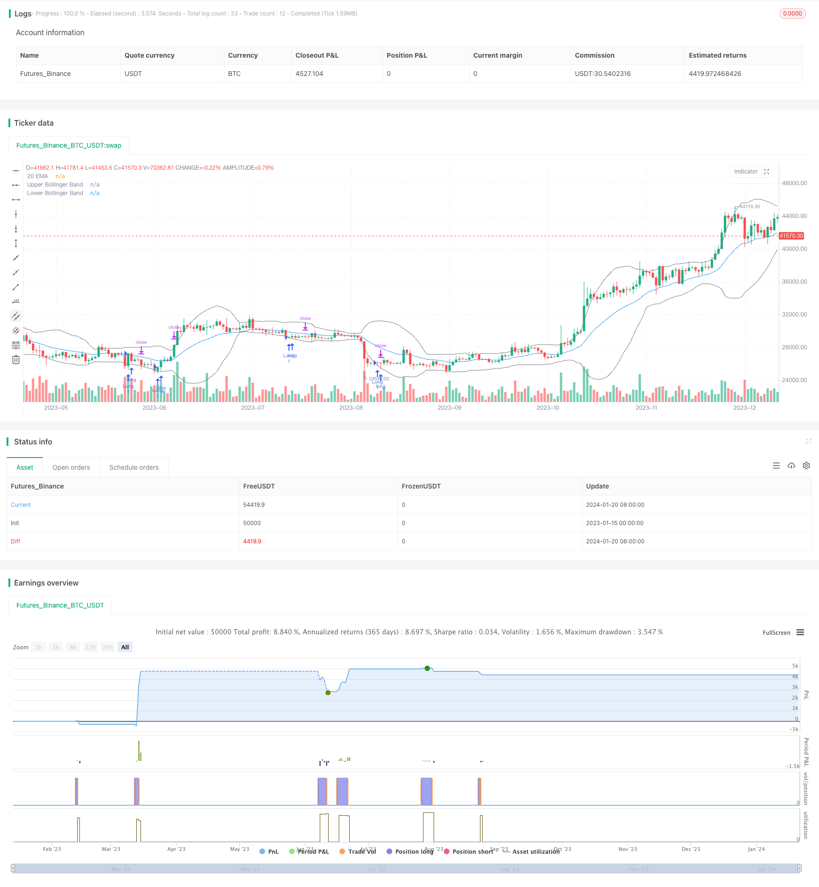

> Name

Bollinger-Bands-Channel-Breakout-Mean-Reversion-Strategy Based on Bollinger Bands Channel Breakout Reversion Strategy
> Author

ChaoZhang

> Strategy Description



 [trans]

## Overview
This strategy is a regression breakout strategy based on the Bollinger Bands channel. When the price falls below the lower track of the Bollinger Bands channel, enter a long position. The stop loss price is set to the lowest price of the entry breakthrough point. The take-profit target is the upper Bollinger Band.
## Strategy Principle
This strategy uses 20-period Bollinger Bands channels. The Bollinger Bands channel consists of the middle track, the upper track and the lower track. The middle rail is a 20-period simple moving average, the upper rail is composed of the middle rail plus 2 times the standard deviation, and the lower rail is composed of the middle rail minus 2 times the standard deviation.
When the price falls below the lower track, it indicates that the price has entered an oversold state, and it is time to enter a long position. After entering the market, the stop-loss price is set to the lowest price of the K-line at the time of entry, and the take-profit target is the upper Bollinger Band. In this way, the strategy is to chase the process of price returning to the moving average from an oversold state to achieve profits.
## Strategic advantage analysis
This strategy has the following advantages:
1. Using the Bollinger Bands Channel to determine the overbought and oversold status of the market has certain timeliness.
2. Return to the trading strategy to avoid chasing highs and selling lows in docname
3. Reasonable setting of stop-profit and stop-loss points is conducive to risk control
## Risk Analysis
There are also some risks with this strategy:
1. Bollinger Bands cannot perfectly judge the price trend, and prices may not rebound if they break through the lower track.
2. When the market continues to fall, Floating P/L may trigger stop loss first.
3. The take-profit point is close to the upper track, and there is a risk that the take-profit cost will be too high.
## Strategy optimization direction
This strategy can be optimized from the following aspects:
1. Optimize Bollinger Band parameters and find the best parameter combination
2. Add other indicators to filter signals and improve entry accuracy
3. Optimize the stop-profit and stop-loss strategy to improve the profit-loss ratio
## Summarize
The overall idea of ​​this strategy is clear and has certain operability. However, its use of Bollinger Bands to determine overbought and oversold is not timely and cannot perfectly determine the price trend. In addition, the stop-profit and stop-loss mechanism also needs to be optimized. Subsequent optimization can be done by selecting more accurate indicators, optimizing parameters, and improving the stop-profit and stop-loss mechanisms to improve strategy profitability.
||

## Overview

This is a mean reversion breakout strategy based on the Bollinger Bands channel. It goes long when the price breaks below the lower band of the Bollinger Bands. The stop loss is set at the low of the breakout bar. The profit target is the upper band of the Bollinger Bands.

## Strategy Logic  

The strategy uses a 20-period Bollinger Bands channel, which consists of a middle band, an upper band and a lower band. The middle band is a 20-period simple moving average. The upper band is the middle band plus 2 standard deviations. The lower band is the middle band minus 2 standard deviations.  

When the price breaks below the lower band, it indicates the price has entered an oversold status. The strategy will go long at this point. After entering the position, the stop loss is set at the low of the entry bar, and the profit target is the upper band. Thus the strategy aims to capture the reversion process from oversold to the mean, in order to make profits.

## Advantage Analysis   

The advantages of this strategy are:

1. Use Bollinger Bands to judge overbought/oversold status, which has some timeliness
2. Reversion trading strategy, avoiding chasing highs and killing lows
3. Reasonable stop loss and take profit setting for better risk control

## Risk Analysis

The risks of this strategy include:
 
1. Bollinger Bands cannot perfectly determine price trends, breakouts may fail
2. Continous market crash may hit stop loss
3. Take profit near upper band has the risk of high cost

## Optimization Directions   

The strategy can be improved from the following aspects:

1. Optimize parameters of Bollinger Bands to find the best combination
2. Add filter indicators to improve entry accuracy 
3. Optimize stop loss and take profit for higher profitability

## Conclusion  

The strategy has clear logic and is tradable to some extent. However, its effectiveness in judging overbought/oversold with Bollinger Bands is limited, and it cannot perfectly determine the trend. Also, the stop loss and take profit mechanism needs improvement. Going forwards, it can be optimized by choosing more accurate indicators, tuning parameters, and enhancing the exit logic to improve profitability.

[/trans]

> Strategy Arguments


|Argument|Default|Description|
|----|----|----|
|v_input_int_1|20|Bollinger Bands Length|
|v_input_float_1|2|Multiplier|
|v_input_3_close|0|Source: close|high|low|open|hl2|hlc3|hlcc4|ohlc4|
|v_input_bool_1|true|(?Backtest Time Period)Filter Date Range of Backtest|
|v_input_1|timestamp(1 Jan 1997)|Start Date|
|v_input_2|timestamp(1 Sept 2023)|End Date|


> Source (PineScript)

``` pinescript
/*backtest
start: 2023-01-15 00:00:00
end: 2024-01-21 00:00:00
period: 1d
basePeriod: 1h
exchanges: [{"eid":"Futures_Binance","currency":"BTC_USDT"}]
*/

// This source code is subject to the terms of the Mozilla Public License 2.0 at https://mozilla.org/MPL/2.0/
// © Ronsword
//@version=5

strategy("bb 2ND target", overlay=true)
 
// STEP 1. Create inputs that configure the backtest's date range
useDateFilter = input.bool(true, title="Filter Date Range of Backtest",
     group="Backtest Time Period")
backtestStartDate = input(timestamp("1 Jan 1997"), 
     title="Start Date", group="Backtest Time Period",
     tooltip="This start date is in the time zone of the exchange " + 
     "where the chart's instrument trades. It doesn't use the time " + 
     "zone of the chart or of your computer.")
backtestEndDate = input(timestamp("1 Sept 2023"),
     title="End Date", group="Backtest Time Period",
     tooltip="This end date is in the time zone of the exchange " + 
     "where the chart's instrument trades. It doesn't use the time " + 
     "zone of the chart or of your computer.")

// STEP 2. See if the current bar falls inside the date range
inTradeWindow = true

// Bollinger Bands inputs
length = input.int(20, title="Bollinger Bands Length")
mult = input.float(2.0, title="Multiplier")
src = input(close, title="Source")
basis = ta.sma(src, length)
dev = mult * ta.stdev(src, length)
upper = basis + dev
lower = basis - dev

// EMA Settings
ema20 = ta.ema(close, 20)
plot(ema20, color=color.blue, title="20 EMA")

// Entry condition
longEntryCondition = ta.crossover(close, lower)

// Define stop loss level as the low of the entry bar
var float stopLossPrice = na
if longEntryCondition
    stopLossPrice := low

// Top Bollinger Band itself is set as the target
topBandTarget = upper

// Enter long position when conditions are met
if inTradeWindow and longEntryCondition
    strategy.entry("Long", strategy.long, qty=1)

// Set profit targets
strategy.exit("ProfitTarget2", from_entry="Long", limit=topBandTarget)

// Set stop loss
strategy.exit("StopLoss", stop=stopLossPrice)

// Plot Bollinger Bands with the same gray color
plot(upper, color=color.gray, title="Upper Bollinger Band")
plot(lower, color=color.gray, title="Lower Bollinger Band")


```

> Detail

https://www.fmz.com/strategy/439608

> Last Modified

2024-01-22 10:47:45
