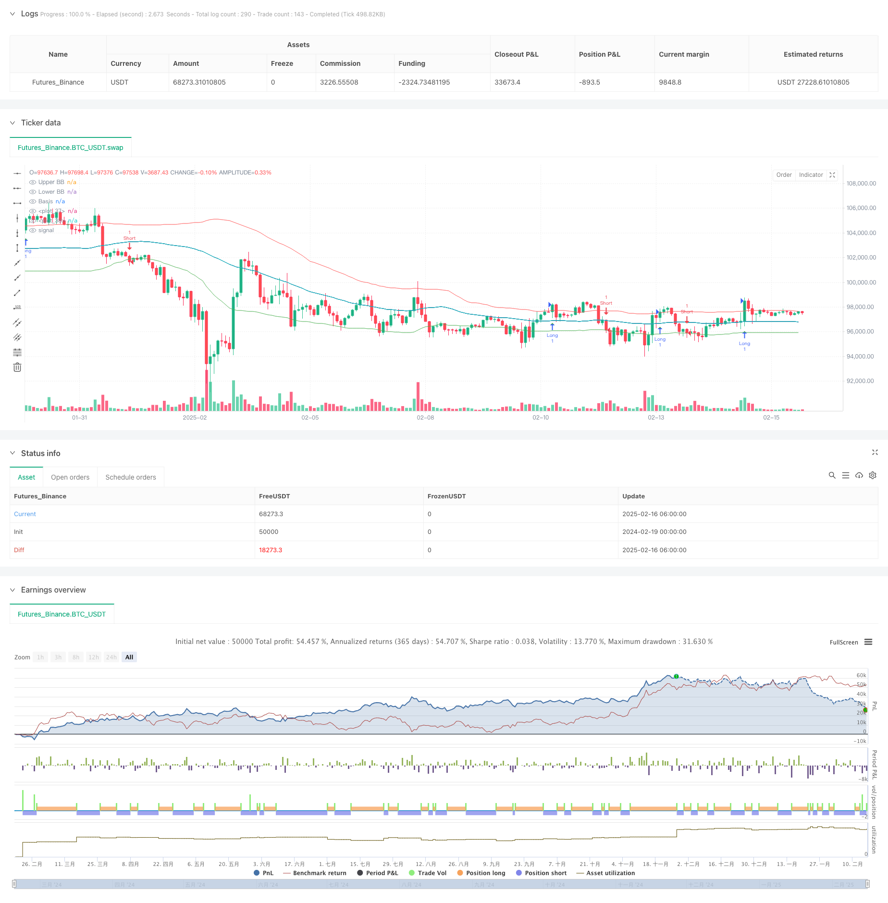

> Name

Bollinger Bands Crossover Signal Filtering Trading Strategy-Bollinger-Bands-Crossover-Signal-Filtering-Strategy
> Author

ChaoZhang

> Strategy Description



[trans]
#### Overview
This is a trading strategy based on the Bollinger Bands indicator, which uses the cross relationship between price and Bollinger Bands to identify market trends and generate trading signals. This strategy uses the 55-period moving average as the middle track of the Bollinger Bands, and uses 1.0 times the standard deviation as the calculation basis for the upper and lower tracks of the Bollinger Bands. The core of the strategy is to determine the timing of long and short positions through the price breaking through the upper and lower bands of the Bollinger Bands.
#### Strategy Principle
The operating principle of the strategy mainly includes the following key parts:
1. Calculation of Bollinger Bands: Use the 55-period simple moving average (SMA) as the middle track and the standard deviation multiplier as 1.0 to calculate the upper and lower tracks.
2. Signal generation logic:
   - When the closing price breaks through the upper band, a long signal is generated
   - When the closing price breaks through the lower band, a short signal is generated
3. Signal confirmation mechanism: Use the barssince function to calculate the number of cycles since the last breakthrough, and determine the final trading direction by comparing the cycle distance of long and short signals.
4. Visualization part: Display trading signals through triangle marks on the chart, and use different colors to distinguish long and short.
#### Strategic Advantages
1. Clear signals: Trading signals are generated through the clear cross relationship between price and Bollinger Bands, avoiding fuzzy areas.
2. Trend following: The strategy is essentially trend following and can obtain better returns in strong market conditions.
3. Visually intuitive: Through color filling and shape marking, the identification of trading signals is very intuitive.
4. Flexible parameters: The period and standard deviation multiple of Bollinger Bands can be adjusted according to different market conditions.
5. Complete system: includes complete signal generation, visualization and alarm functions.
#### Strategy Risk
1. Risk of market shock: Frequent false signals may occur in a volatile market.
2. Lagging risk: Due to the use of a longer period (55) moving average, there may be a certain lag in the signal.
3. Reversal risk: When the trend suddenly reverses, it may suffer a large retracement.
4. Parameter sensitivity: The selection of Bollinger Band parameters has a great impact on strategy performance.
#### Strategy optimization direction
1. Introducing volume confirmation: Volume indicators can be added as auxiliary conditions for signal confirmation.
2. Dynamic parameter optimization: The standard deviation multiple of Bollinger Bands can be dynamically adjusted according to market volatility.
3. Add trend filter: Longer period trend indicators can be added to filter out false signals.
4. Improve the stop loss mechanism: It is recommended to add a trailing stop loss or a fixed stop loss to control risks.
5. Market status classification: A market status identification module can be added to use different parameter settings under different market status.
#### Summary
This is a classic trend following strategy based on Bollinger Bands, which captures market trends through the cross relationship between price and Bollinger Bands. The strategy design is concise and clear, with good visualization effects and signal generation mechanism. Although it may face challenges in volatile markets, the stability and reliability of the strategy can be further improved through appropriate parameter optimization and the addition of auxiliary indicators. It is recommended to conduct sufficient backtesting and parameter optimization before using it in real market. ||
#### Overview
This is a trading strategy based on Bollinger Bands indicator that identifies market trends and generates trading signals through price crossovers with the bands. The strategy uses a 55-period moving average as the middle band and 1.0 standard deviation for calculating the upper and lower bands. The core concept is to determine long and short entry points through price breakouts of the Bollinger Bands.

#### Strategy Principles
The strategy operates on the following key components:
1. Bollinger Bands Calculation: Uses 55-period Simple Moving Average (SMA) as the middle band, with a standard deviation multiplier of 1.0 for upper and lower bands.
2. Signal Generation Logic:
   - Long signal generated when closing price breaks above the upper band
   - Short signal generated when closing price breaks below the lower band
3. Signal Confirmation Mechanism: Uses the barssince function to calculate periods since last breakout, comparing the period distance between long and short signals to determine final trading direction.
4. Visualization: Displays trading signals with triangle markers on the chart, using different colors for long and short positions.

#### Strategy Advantages
1. Clear Signals: Generates trading signals through definitive price crossovers with Bollinger Bands, avoiding ambiguous zones.
2. Trend Following: The strategy is essentially trend-following, capable of capturing good returns in strong market trends.
3. Visual Clarity: Trading signals are highly intuitive through color filling and shape markers.
4. Flexible Parameters: Bollinger Bands period and standard deviation multiplier can be adjusted for different market conditions.
5. Complete System: Includes comprehensive signal generation, visualization, and alert functions.

#### Strategy Risks
1. Choppy Market Risk: May generate frequent false signals in sideways, volatile markets.
2. Lag Risk: Due to the relatively long period (55) of moving average, signals may have some delay.
3. Reversal Risk: May suffer significant drawdowns during sudden trend reversals.
4. Parameter Sensitivity: Strategy performance is highly dependent on Bollinger Bands parameter selection.

#### Strategy Optimization Directions
1. Volume Confirmation: Add volume indicators as auxiliary conditions for signal confirmation.
2. Dynamic Parameter Optimization: Dynamically adjust the standard deviation multiplier based on market volatility.
3. Add Trend Filter: Incorporate longer-period trend indicators to filter false signals.
4. Improve Stop Loss Mechanism: Add trailing stop or fixed stop loss for better risk control.
5. Market State Classification: Add market state identification module to use different parameter settings under different market conditions.

#### Summary
This is a classic trend-following strategy based on Bollinger Bands, capturing market trends through price crossovers with the bands. The strategy design is clear and concise, featuring good visualization effects and signal generation mechanisms. While it may face challenges in choppy markets, the strategy's stability and reliability can be further enhanced through appropriate parameter optimization and additional auxiliary indicators. Thorough backtesting and parameter optimization are recommended before live trading.[/trans]


> Source (PineScript)

``` pinescript
/*backtest
start: 2024-02-19 00:00:00
end: 2025-02-16 08:00:00
period: 2h
basePeriod: 2h
exchanges: [{"eid":"Futures_Binance","currency":"BTC_USDT"}]
*/

//@version=5
strategy("Bollinger Bands Filter [Strategy]", overlay=true)

// -- INPUTS (kratke tooltipy, ziadne prelomenie riadku)
src    = input.source(close, title="Source", tooltip="Source for BB calc")
length = input.int(55, minval=1, title="SMA length", tooltip="Period for BB basis")
mult   = input.float(1.0, minval=0.1, maxval=5, title="Std Dev", tooltip="Std Dev multiplier")
CC     = input.bool(true, "Color Bars", tooltip="If true, color bars by BB logic")

// -- Bollinger calc
basis = ta.sma(src, length)
dev   = mult * ta.stdev(src, length)
upper = basis + dev
lower = basis - dev

// -- Long/Short logic
longCondition  = close > upper
shortCondition = close < lower

L1 = ta.barssince(longCondition)
S1 = ta.barssince(shortCondition)

longSignal  = L1 < S1 and not (L1 < S1)[1]
shortSignal = S1 < L1 and not (S1 < L1)[1]

// -- Plot signals
plotshape(shortSignal ? close : na, color=color.red, style=shape.triangledown, size=size.small, location=location.abovebar, title="Short Signal")
plotshape(longSignal  ? close : na, color=color.green, style=shape.triangleup,  size=size.small, location=location.belowbar, title="Long Signal")

// -- Plot BB lines
plot(upper, color=color.new(color.red,  40), title="Upper BB")
plot(lower, color=color.new(color.green,40), title="Lower BB")
plot(basis, color=color.new(color.blue, 10), title="Basis")

// -- Fill
fill(plot(na), plot(na)) // 'dummy' fill reset
fill(plot(upper, display=display.none), plot(basis, display=display.none), color=color.new(color.teal, 80))
fill(plot(lower, display=display.none), plot(basis, display=display.none), color=color.new(color.orange, 80))

// -- barcolor
bcol = close > upper ? color.lime : close < lower ? color.red : na
barcolor(CC ? bcol : na)

// -- Alerts
alertcondition(longSignal,  title="Long - BB",  message="BB Filter Long")
alertcondition(shortSignal, title="Short - BB", message="BB Filter Short")

// -- Strategy entries
if longSignal
    strategy.entry("Long", strategy.long)

if shortSignal
    strategy.entry("Short", strategy.short)

```

> Detail

https://www.fmz.com/strategy/482443

> Last Modified

2025-02-18 14:47:16
