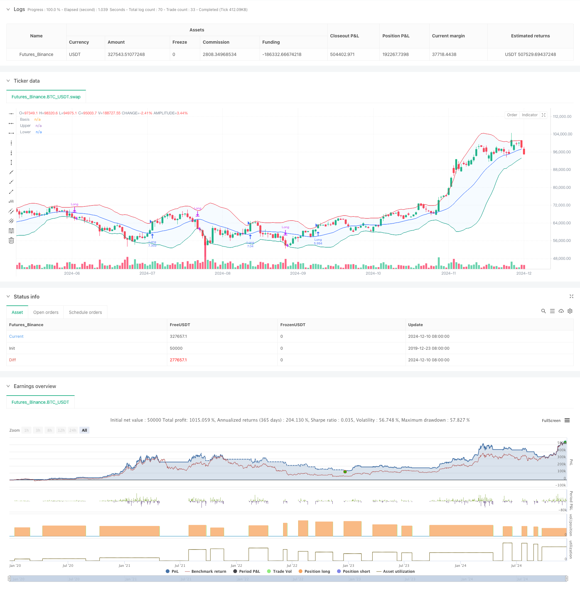

> Name

Adaptive trend following trading strategy based on Bollinger-Bands-Momentum-Breakout-Adaptive-Trend-Following-Strategy
> Author

ChaoZhang

> Strategy Description



[trans]
#### Overview
This strategy is a momentum breakout trading system based on Bollinger Bands, which mainly captures trend opportunities through the relationship between price and the upper limit of Bollinger Bands. The strategy adopts an adaptive moving average type selection mechanism and combines the standard deviation channel to identify market fluctuation characteristics, which is particularly suitable for application in volatile market environments.
#### Strategy Principle
The core logic of the strategy is based on the following key elements:
1. Calculate the middle track of Bollinger Bands using customizable moving averages (including SMA, EMA, SMMA, WMA, VWMA).
2. Dynamically determine the position of the upper and lower rails through multiples of the standard deviation (default 2.0).
3. Entering the market to go long when the price breaks through the upper track indicates the formation of a strong breakthrough trend.
4. When the price falls below the lower track, close the position and exit, indicating that the upward trend may have ended.
5. The system has built-in consideration of transaction costs (0.1%) and slippage (3 points), which is more in line with the actual trading environment.
#### Strategic Advantages
1. Strong adaptability: Through the selection of multiple moving average types, the strategy can adapt to different market conditions.
2. Improved risk control: By using the lower track of the Bollinger band as a stop loss point, clear risk control is provided.
3. Reasonable fund management: The position proportion management method is adopted to avoid the risks caused by fixed lot sizes.
4. Transaction costs are fully considered: commissions and slippage factors are included, and the backtest results are closer to reality.
5. Flexible time frame: A specific trading time range can be selected through parameter settings.
#### Strategy Risk
1. False breakthrough risk: Frequent false breakthrough signals may appear in volatile markets.
Solution: You can add confirmation indicators or delayed entry mechanisms.
2. Trend reversal risk: Large losses may occur when a strong trending market suddenly reverses.
Solution: You can add a trend strength filter.
3. Parameter sensitivity: Different parameter combinations may lead to large differences in strategy performance.
Solution: Adequate parameter optimization and robustness testing are required.
#### Strategy optimization direction
1. Introduce trend strength indicator:
- ADX or similar indicators can be added to filter signals for weakly trending markets
- This can reduce losses caused by false breakthroughs
2. Optimize the stop loss mechanism:
- Dynamic stop loss can be implemented, such as trailing stop loss
- Helps achieve greater gains while the trend continues
3. Add transaction filter:
- Confirmation signals based on volume
- Avoid trading in low liquidity environments
4. Improve the entry mechanism:
- A mechanism for callback entry can be added
- Helps get better entry prices
#### Summary
This is a well designed and logical trend following strategy. It captures market momentum through the dynamic characteristics of Bolinger Bands and has a good risk control mechanism. The strategy is highly customizable and can be adapted to different market environments through parameter adjustment. It is recommended that sufficient parameter optimization and backtest verification be carried out during real-time application, and strategy improvements should be made in conjunction with the recommended optimization direction. ||
#### Overview
This strategy is a momentum breakout trading system based on Bollinger Bands, primarily capturing trend opportunities through the relationship between price and the upper Bollinger Band. The strategy employs an adaptive moving average type selection mechanism, combined with standard deviation channels to identify market volatility characteristics, particularly suitable for markets with high volatility.

#### Strategy Principle
The core logic of the strategy is based on the following key elements:
1. Uses customizable moving averages (including SMA, EMA, SMMA, WMA, VWMA) to calculate the middle band of Bollinger Bands.
2. Dynamically determines upper and lower band positions through standard deviation multiplier (default 2.0).
3. Enters long positions when price breaks above the upper band, indicating formation of strong breakout trends.
4. Exits positions when price falls below the lower band, suggesting potential end of uptrend.
5. Incorporates trading costs (0.1%) and slippage (3 points), better reflecting real trading conditions.

#### Strategy Advantages
1. High Adaptability: Through multiple moving average type options, the strategy can adapt to different market conditions.
2. Robust Risk Control: Uses Bollinger Bands lower band as stop loss, providing clear risk control.
3. Rational Money Management: Employs position sizing based on equity percentage, avoiding risks of fixed position sizes.
4. Comprehensive Cost Consideration: Includes commission and slippage factors, making backtesting results more realistic.
5. Flexible Time Framework: Allows selection of specific trading time ranges through parameter settings.

#### Strategy Risks
1. False Breakout Risk: Frequent false breakout signals may occur in ranging markets.
Solution: Add confirmation indicators or delayed entry mechanisms.
2. Trend Reversal Risk: Sudden reversals in strong trend markets may cause significant losses.
Solution: Implement trend strength filters.
3. Parameter Sensitivity: Different parameter combinations may lead to varying strategy performance.
Solution: Requires thorough parameter optimization and robustness testing.

#### Strategy Optimization Directions
1. Introduce Trend Strength Indicators:
- Add ADX or similar indicators to filter signals in weak trend markets
- This can reduce losses from false breakouts
2. Optimize Stop Loss Mechanism:
- Implement dynamic stop loss, such as trailing stops
- Helps capture larger profits in continuing trends
3. Add Trading Filters:
- Volume-based confirmation signals
- Avoid trading in low liquidity environments
4. Enhance Entry Mechanism:
- Add pullback entry mechanisms
- Helps achieve better entry prices

#### Summary
This is a well-designed trend following strategy with clear logic. It captures market momentum through the dynamic nature of Bollinger Bands and includes good risk control mechanisms. The strategy is highly customizable and can adapt to different market environments through parameter adjustments. For live trading implementation, it is recommended to conduct thorough parameter optimization and backtesting validation, while incorporating the suggested optimization directions for strategy improvement.[/trans]


> Source (PineScript)

``` pinescript
/*backtest
start: 2019-12-23 08:00:00
end: 2024-12-11 08:00:00
period: 1d
basePeriod: 1d
exchanges: [{"eid":"Futures_Binance","currency":"BTC_USDT"}]
*/

//@version=5
strategy("Demo GPT - Bollinger Bands", overlay=true, initial_capital=10000, commission_type=strategy.commission.percent, commission_value=0.1, slippage=3, default_qty_type=strategy.percent_of_equity, default_qty_value=100)

// Inputs
length = input.int(20, minval=1, title="Length")
maType = input.string("SMA", "Basis MA Type", options = ["SMA", "EMA", "SMMA (RMA)", "WMA", "VWMA"])
src = input(close, title="Source")
mult = input.float(2.0, minval=0.001, maxval=50, title="StdDev")
offset = input.int(0, "Offset", minval=-500, maxval=500)

// Date range inputs
startYear = input.int(2018, "Start Year", minval=1970, maxval=2100)
startMonth = input.int(1, "Start Month", minval=1, maxval=12)
startDay = input.int(1, "Start Day", minval=1, maxval=31)
endYear = input.int(2069, "End Year", minval=1970, maxval=2100)
endMonth = input.int(12, "End Month", minval=1, maxval=12)
endDay = input.int(31, "End Day", minval=1, maxval=31)

// Time range
startTime = timestamp("GMT+0", startYear, startMonth, startDay, 0, 0)
endTime = timestamp("GMT+0", endYear, endMonth, endDay, 23, 59)

// Moving average function
ma(source, length, _type) =>
    switch _type
        "SMA" => ta.sma(source, length)
        "EMA" => ta.ema(source, length)
        "SMMA (RMA)" => ta.rma(source, length)
        "WMA" => ta.wma(source, length)
        "VWMA" => ta.vwma(source, length)

// Calculate Bollinger Bands
basis = ma(src, length, maType)
dev = mult * ta.stdev(src, length)
upper = basis + dev
lower = basis - dev

// Plot
plot(basis, "Basis", color=#2962FF, offset=offset)
p1 = plot(upper, "Upper", color=#F23645, offset=offset)
p2 = plot(lower, "Lower", color=#089981, offset=offset)
fill(p1, p2, title="Background", color=color.rgb(33, 150, 243, 95))

// Strategy logic: Only go long and flat
inDateRange = time >= startTime and time <= endTime
noPosition = strategy.position_size == 0
longPosition = strategy.position_size > 0

// Buy if close is above upper band
if inDateRange and noPosition and close > upper
    strategy.entry("Long", strategy.long)

// Sell/Exit if close is below lower band
if inDateRange and longPosition and close < lower
    strategy.close("Long")

```

> Detail

https://www.fmz.com/strategy/474977

> Last Modified

2024-12-13 11:43:10
