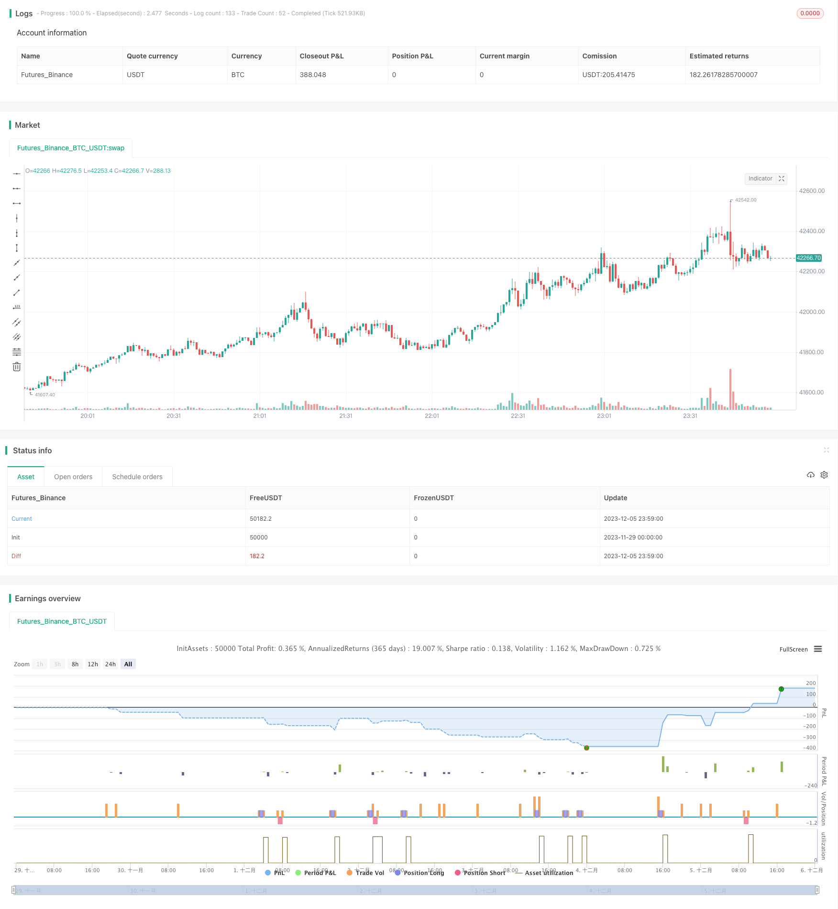

> Name

Bollinger-Bands-Reversal-Trend-Strategy
> Author

ChaoZhang

> Strategy Description


[trans]

## Overview
This strategy uses the relationship between the upper, middle, and lower Bollinger Bands and the 200-day moving average to determine the trend direction. In a bullish trend, go long when the price touches the lower Bollinger Band; in a bearish trend, go short when the price touches the upper Bollinger Band.
## Principle
1. Determine the trend: When the upper and lower rails of the Bollinger Bands are both greater than the 200-day moving average, it is a bullish trend; when the upper and lower rails of the Bollinger Bands are both less than the 200-day moving average, it is a short trend.
2. Entry: During the bullish trend, go long when the price touches the lower Bollinger Band; during the bearish trend, go short when the price touches the upper Bollinger Band.
3. Exit: When a long position is held, the position is closed when the price touches the upper Bollinger Band or falls below the 250-day simple moving average; when a short position is held, the position is closed when the price touches the lower Bollinger Band or falls below the 300-day simple moving average.
## Advantages
1. Use Bollinger Bands to determine the trend direction and avoid repeated trading when there is no clear direction.
2. When the trend direction is clear, use the Bollinger Bands fluctuation range to determine appropriate entry and exit.
3. Added moving average auxiliary judgment to avoid unexpected losses
## Risks and Solutions
1. Improper setting of Bollinger Band parameters leads to errors in judgment: Bollinger Band parameters should be adjusted to find the most suitable period length.
2. The moving average getParameter is improper and frequent stop losses or unexpected losses occur: different parameters should be tested to find the most stable parameters.
3. Sudden changes in the market, such as major news, leading to abnormal fluctuations: stop loss should be set to control single losses
## Optimization direction
1. Test the strategy performance under different cycle parameters and find the optimal parameters
2. Add a stop-loss mechanism to avoid large losses under abnormal market conditions
3. Combine with other indicators to confirm entry timing and improve strategy winning rate
## Summary
This strategy uses Bollinger Bands to determine the trend direction, and after the trend is clear, the trading system formed by Bollinger Bands-assisted moving averages not only ensures the correctness of the trading direction, but also uses the fluctuation range to lock in appropriate profits. There are also some problems with parameter selection and stop loss. By optimizing parameter settings and adding stop-loss mechanisms, better strategy performance can be achieved.
||

## Overview
This strategy uses the relationship between the upper band, middle band, lower band of Bollinger Bands and 200-day moving average to determine the trend direction. It goes long when price touches the lower band during an uptrend and goes short when price touches the upper band during a downtrend.

## Principles  
1. Determine trend: When both upper and lower bands of Bollinger Bands are above 200-day moving average, it is an uptrend. When both are below, it is a downtrend.   
2. Entry: Go long when price touches lower band in an uptrend. Go short when price touches upper band in a downtrend.  
3. Exit: When long, close position when price touches upper band or breaks below 250-day simple moving average. When short, close position when price touches lower band or breaks above 300-day simple moving average.

## Advantages
1. Use Bollinger Bands to determine trend direction, avoiding repetitive trading without a clear direction. 
2. Take proper entries and exits based on the volatility range of Bollinger Bands when trend direction is clear.
3. Added filtering with moving averages, avoiding unexpected losses.  

## Risks and Solutions
1. Improper Bollinger Bands parameter setting leads to misjudgment: Adjust parameters to find the optimal period length.  
2. Improper moving average parameter leading to over trading or unwanted losses: Test different parameters to find the most stable ones.
3. Sudden market change due to major news events causes anomalies: Set stop loss to limit per trade loss.   

## Optimization Directions  
1. Test strategy performance across different parameter periods to find the optimal parameters.
2. Add stop loss mechanism to avoid huge losses in anomalous market conditions.   
3. Incorporate other indicators to confirm entry signals to improve win rate.
   
## Conclusion
This strategy determines trend direction with Bollinger Bands first. It then utilizes the volatility range of Bollinger Bands together with moving averages to form a trading system that ensures directional correctness and locks in decent profits. There are still some issues with parameter selection and stop loss that can be further improved via optimization and mechanism additions to achieve better performance.  
[/trans]

> Strategy Arguments


|Argument|Default|Description|
|----|----|----|
|v_input_int_1|20|length|
|v_input_float_1|2.3|mult|
|v_input_int_2|200|trend|


> Source (PineScript)

``` pinescript
/*backtest
start: 2023-11-29 00:00:00
end: 2023-12-06 00:00:00
period: 1m
basePeriod: 1m
exchanges: [{"eid":"Futures_Binance","currency":"BTC_USDT"}]
*/

// This source code is subject to the terms of the Mozilla Public License 2.0 at https://mozilla.org/MPL/2.0/
// © Aayonga

//@version=5
strategy("boll trend", overlay=true,initial_capital=1000,default_qty_type=strategy.fixed, default_qty_value=1 )
bollL=input.int(20,minval=1,title = "length")
bollmult=input.float(2.3,minval=0,step=0.1,title = "mult")
basis=ta.ema(close,bollL)
dev=bollmult*ta.stdev(close,bollL)
upper=basis+dev

lower=basis-dev

smaL=input.int(200,minval=1,step=1,title = "trend")
sma=ta.sma(close,smaL)
//多头趋势
longT=upper>sma and basis>sma and lower>=sma
//空头趋势
shortT=upper<sma and basis<sma and lower<=sma

//入场位
longE=ta.crossover(close,lower)

shortE=ta.crossover(close,upper)

//出场位

longEXIT=ta.crossover(high,upper) or ta.crossunder(close,ta.sma(close,300))
shortEXIT=ta.crossunder(low,lower) or ta.crossover(close,ta.sma(close,250)) 

if longT and longE 
    strategy.entry("多long",strategy.long)

if longEXIT
    strategy.close("多long",comment = "close long")

if shortE and shortT 
    strategy.entry("空short",strategy.short)

if shortEXIT
    strategy.close("空short",comment = "close short")
```

> Detail

https://www.fmz.com/strategy/434569

> Last Modified

2023-12-07 16:08:05
