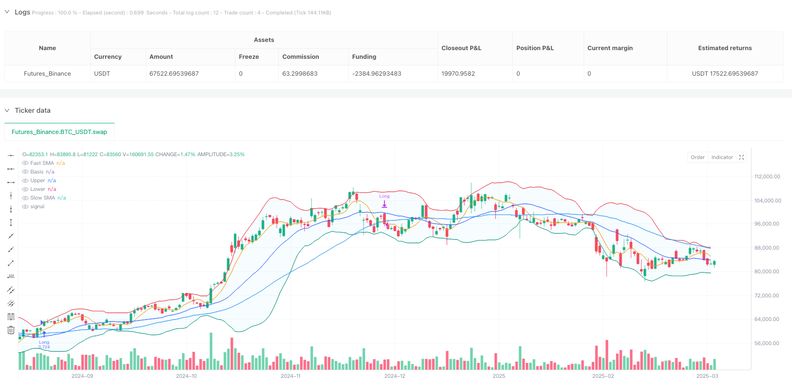
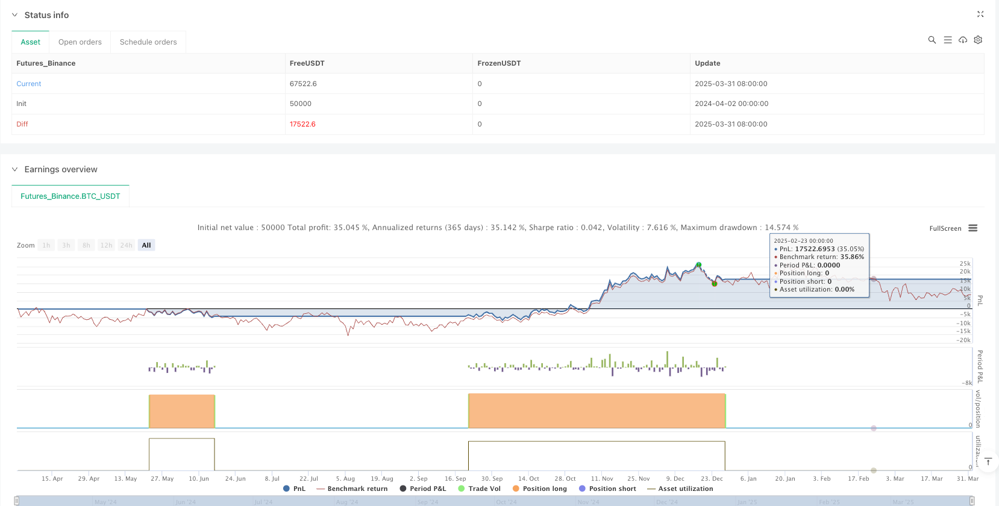

> Name

Bollinger Bands-with-Dual-SMA-Momentum-Enhanced-Quantitative-Trading-Strategy
> Author

ianzeng123

> Strategy Description





[trans]

## Overview
The multi-dimensional trend-enhanced quantitative trading strategy of Bollinger Bands combined with fast and slow moving averages is a trend following system designed specifically for market fluctuations. This strategy cleverly integrates the volatility channel of Bollinger Bands and the trend confirmation mechanism of dual moving averages to form a trading decision-making framework with multiple conditions. The core of the strategy is to capture the strong signal that the price breaks through the upper Bollinger Band, and confirm the trend direction through the positional relationship between the fast and slow moving averages, and only enter a long position when multiple conditions are met at the same time, thereby improving the accuracy and reliability of the transaction.
## Strategy Principle
The technical principle of this strategy is based on the synergy of three core indicators:
1. **Bollinger Band System**: The strategy uses 21-period Bollinger Bands with a standard deviation multiple of 2.0. The base moving average type (SMA, EMA, SMMA, WMA or VWMA) can be flexibly selected according to parameter settings. Bollinger Bands provide a reference for trading from a volatility perspective by capturing the range of price fluctuations.
2. **Double Moving Average System**: The strategy introduces a 6-period Fast Simple Moving Average (Fast SMA) and a 45-period Slow Simple Moving Average (Slow SMA) to form a dual moving average system. The intersection and positional relationship of these two moving averages can effectively identify and confirm the direction and strength of the current trend.
3. **Multiple Condition Entry Mechanism**: The strategy only opens a long position when all of the following conditions are met:
   - The closing price breaks through the upper Bollinger Band (close > upper)
   - The closing price is above the slow moving average (close > slowSma)
   - The fast moving average is above the slow moving average (fastSma > slowSma)
This design of multiple conditions ensures that the market will only be entered when a strong upward trend is confirmed by multiple technical indicators, effectively filtering out false breakthroughs and weak signals.
The closing conditions are also based on clear technical indicator signals. When the closing price falls below the lower Bollinger Band or the fast moving average falls below the slow moving average, the strategy will automatically close the position and exit. This design allows the strategy to stop losses or lock in profits in time to avoid losses caused by trend reversal.
## Strategic Advantages
1. **Multiple signal confirmation mechanism**: Combined with Bollinger Band breakthrough and double moving average trend confirmation, it significantly reduces false breakthrough signals and improves the quality and success rate of transactions.
2. **Adaptive Volatility**: The design of Bollinger Bands itself has adaptive characteristics to market volatility. The channel will naturally expand in a high-volatility environment and naturally narrow in a low-volatility environment, allowing the strategy to adapt to different market environments.
3. **Trend Strength Verification**: By requiring the price to not only break through the Bollinger Band upper limit, but also be above the slow moving average, and the fast moving average to exceed the slow moving average, these three conditions ensure that only strong trends will trigger transactions.
4. **Flexible parameter configuration**: The strategy allows users to adjust the Bollinger Band length, moving average type, standard deviation multiple, and fast and slow moving average periods, which can be optimized and adjusted according to different market conditions and personal trading styles.
5. **Clear entry and exit logic**: The trading rules of the strategy are concise and clear, and the entry and exit conditions are based on objective technical indicators, reducing the impact of subjective judgment.
## Strategy Risk
1. **Delayed Trend Identification**: Both Bollinger Bands and moving averages are lagging indicators. In a violently volatile market, it may lead to late entry timing and miss some early gains in the market. The solution can be to appropriately shorten the period of the fast moving average or adjust the Bollinger Band parameters.
2. **Frequent trading risk**: In a volatile market, the price may frequently break through the upper Bollinger Band and then fall back, resulting in multiple transactions and increased transaction costs. False signals can be reduced by adding additional filtering conditions or extending the acknowledgment period.
3. **One-way trading restrictions**: The current strategy only supports long transactions and cannot make profits in a downward trend, resulting in insufficient capital utilization. You can consider adding a short trading strategy to achieve two-way trading.
4. **Parameter sensitivity**: Strategy performance is highly dependent on parameter settings, and different market environments may require different parameter combinations. It is recommended to conduct sufficient backtesting and parameter optimization, or adopt an adaptive parameter adjustment mechanism.
5. **Transaction cost impact**: The 0.1% commission and 3-point slippage set by the strategy may be different in actual transactions, affecting actual returns. It should be adjusted and tested based on the actual trading platform’s fee structure.
## Strategy optimization direction
1. **Add filter conditions**: You can consider adding additional conditions such as transaction volume confirmation, trend strength indicators (such as ADX) or price pattern recognition to further improve signal quality. For example, you can require that the Bollinger Bands breakout is accompanied by an increase in trading volume, or that the ADX value is greater than a specific threshold.
2. **Optimize Fund Management**: The current strategy uses 100% of account funds for trading. You can consider introducing a risk percentage model or volatility-adjusted position management to dynamically adjust the position size based on market volatility and signal strength.
3. **Add time frame verification**: Multi-time frame analysis can be introduced, requiring the trend direction to be confirmed on a higher time frame to reduce misjudgments in volatile markets. For example, the daily and 4-hour charts are required to meet trend conditions at the same time.
4. **Introduction of dynamic stop loss strategy**: You can set dynamic stop loss based on ATR (average true range), or use moving stop loss (such as tracking the Bollinger Bands mid-track or slow moving average) to better protect profits.
5. **Increase two-way trading capabilities**: Expand the strategy to support short trading. When the opposite conditions are met (the price falls below the lower Bollinger Band and the fast moving average is lower than the slow moving average), establish a short position and make full use of the downward trend to make profits.
6. **Parameter adaptive mechanism**: Develop a parameter dynamic adjustment mechanism based on market status, automatically optimize Bollinger Bands and moving average parameters under different volatility and trend intensity environments, and improve the adaptability of the strategy.
## Summarize
Bollinger Bands combines the multi-dimensional trend-enhanced quantitative trading strategy of fast and slow moving averages to build a multi-level trading decision-making system by integrating volatility and trend indicators. The core advantage of the strategy lies in the multiple condition confirmation mechanism, which significantly improves signal quality and reliability. Although there are certain hysteresis and parameter sensitivity issues, through reasonable risk management and parameter optimization, this strategy can achieve solid performance in markets with clear trends.
Further optimization can start from aspects such as adding filtering conditions, improving fund management, introducing multi-time frame analysis, and developing parameter adaptive mechanisms to make the strategy more comprehensive and robust. Taken together, this is a trend following strategy with a clear structure and rigorous logic, suitable for traders who have a certain understanding of technical analysis, especially in market environments with clear mid- to long-term trends. ||
## Overview

The Bollinger Bands with Dual SMA Momentum Enhanced Quantitative Trading Strategy is a trend-following system specifically designed for market volatility. This strategy cleverly integrates the volatility channel of Bollinger Bands with a dual moving average trend confirmation mechanism, forming a multi-condition filtering trading decision framework. The core of the strategy lies in capturing strong signals when prices break through the upper Bollinger Band, and confirming trend direction through the positional relationship between fast and slow moving averages. It only enters long positions when multiple conditions are simultaneously satisfied, thereby improving trading accuracy and reliability.

## Strategy Principles

The technical principles of this strategy are built on the synergistic effect of three core indicators:

1. **Bollinger Bands System**: The strategy employs a 21-period Bollinger Band with a standard deviation multiplier of 2.0, and flexibly allows selection of the basis moving average type (SMA, EMA, SMMA, WMA, or VWMA) based on parameter settings. Bollinger Bands capture the range of price volatility, providing a volatility perspective reference for trading.

2. **Dual Moving Average System**: The strategy introduces a 6-period Fast Simple Moving Average (Fast SMA) and a 45-period Slow Simple Moving Average (Slow SMA), forming a dual moving average system. The crossover and positional relationship between these two moving averages can effectively identify and confirm the current trend's direction and strength.

3. **Multi-Condition Entry Mechanism**: The strategy only establishes long positions when all the following conditions are met:
   - Closing price breaks above the upper Bollinger Band (close > upper)
   - Closing price is above the Slow Moving Average (close > slowSma)
   - Fast Moving Average is above the Slow Moving Average (fastSma > slowSma)

This multi-condition design ensures that positions are only entered when a strong upward trend is confirmed by multiple technical indicators, effectively filtering out false breakouts and weak signals.

The position closing conditions are similarly based on clear technical indicator signals. When the closing price falls below the lower Bollinger Band or the Fast Moving Average drops below the Slow Moving Average, the strategy will automatically close positions. This design enables the strategy to cut losses or lock in profits in a timely manner, avoiding losses caused by trend reversals.

## Strategy Advantages

1. **Multiple Signal Confirmation Mechanism**: Combining Bollinger Band breakouts with dual moving average trend confirmation significantly reduces false breakout signals, improving trade quality and success rate.

2. **Adaptive Volatility**: The design of Bollinger Bands inherently possesses adaptive characteristics for market volatility. The channel naturally widens in high-volatility environments and narrows in low-volatility environments, allowing the strategy to adapt to different market conditions.

3. **Trend Strength Verification**: By requiring not only that the price breaks through the upper Bollinger Band, but also that it is above the slow moving average, and simultaneously that the fast moving average exceeds the slow moving average, these triple conditions ensure that only strong trends trigger trades.

4. **Flexible Parameter Configuration**: The strategy allows users to adjust Bollinger Band length, moving average type, standard deviation multiplier, and fast/slow moving average periods, enabling optimization adjustments based on different market conditions and personal trading styles.

5. **Clear Entry and Exit Logic**: The trading rules of the strategy are concise and explicit, with entry and exit conditions based on objective technical indicators, reducing the influence of subjective judgment.

## Strategy Risks

1. **Delayed Trend Identification**: Bollinger Bands and moving averages are lagging indicators, which may lead to delayed entry timing in highly volatile markets, missing some of the early gains. A solution could be to appropriately shorten the period of the fast moving average or adjust Bollinger Band parameters.

2. **Frequent Trading Risk**: In oscillating markets, prices may frequently break through the upper Bollinger Band and then fall back, leading to multiple trades and increased transaction costs. This can be mitigated by adding additional filtering conditions or extending the confirmation period to reduce false signals.

3. **Unidirectional Trading Limitation**: The current strategy only supports long trades, unable to profit in downtrend markets, resulting in insufficient capital utilization. Consider adding short trading strategies to implement bidirectional trading.

4. **Parameter Sensitivity**: Strategy performance is highly dependent on parameter settings, and different market environments may require different parameter combinations. It is recommended to conduct thorough backtesting and parameter optimization, or adopt an adaptive parameter adjustment mechanism.

5. **Transaction Cost Impact**: The strategy's set 0.1% commission and 3-point slippage may differ in actual trading, affecting real returns. Adjustments and testing should be done according to the actual fee structure of the trading platform.

## Strategy Optimization Directions

1. **Add Filtering Conditions**: Consider adding additional conditions such as volume confirmation, trend strength indicators (like ADX), or price pattern recognition to further improve signal quality. For example, require increased trading volume when Bollinger Bands break out, or ADX values greater than a specific threshold.

2. **Optimize Capital Management**: The current strategy uses 100% of account funds for trading. Consider introducing risk percentage models or volatility-adjusted position management to dynamically adjust position size based on market volatility and signal strength.

3. **Add Timeframe Verification**: Introduce multi-timeframe analysis, requiring trend direction confirmation on higher timeframes to reduce misjudgments in oscillating markets. For instance, require trend conditions to be met simultaneously on daily and 4-hour charts.

4. **Introduce Dynamic Stop-Loss Strategy**: Set dynamic stop-loss levels based on ATR (Average True Range), or use trailing stops (such as following the Bollinger Band middle line or slow moving average) to better protect profits.

5. **Add Bidirectional Trading Capability**: Extend the strategy to support short trading, establishing short positions when opposite conditions are met (price breaks below the lower Bollinger Band and fast moving average is below slow moving average), fully utilizing downtrend profits.

6. **Parameter Adaptive Mechanism**: Develop a parameter dynamic adjustment mechanism based on market states, automatically optimizing Bollinger Bands and moving average parameters in different volatility and trend strength environments to improve strategy adaptability.

## Conclusion

The Bollinger Bands with Dual SMA Momentum Enhanced Quantitative Trading Strategy integrates volatility and trend indicators to build a multi-level trading decision system. The core advantage of the strategy lies in its multiple condition confirmation mechanism, significantly improving signal quality and reliability. Despite certain lagging and parameter sensitivity issues, with proper risk management and parameter optimization, this strategy can achieve solid performance in markets with clear trends.

Further optimizations can be approached from aspects such as adding filtering conditions, improving capital management, introducing multi-timeframe analysis, and developing parameter adaptive mechanisms to make the strategy more comprehensive and robust. Overall, this is a clearly structured and logically rigorous trend-following strategy, suitable for traders with a certain understanding of technical analysis, especially in medium to long-term trend-oriented market environments.[/trans]


> Source (PineScript)

``` pinescript
/*backtest
start: 2024-04-02 00:00:00
end: 2025-04-01 00:00:00
period: 1d
basePeriod: 1d
exchanges: [{"eid":"Futures_Binance","currency":"BTC_USDT"}]
*/

//@version=6
strategy("BTC Bollinger Bands w Fast and Slow SMAs", overlay=true, commission_value=0.1, slippage=3, default_qty_type=strategy.percent_of_equity, default_qty_value=100)

length = input.int(21, minval=1)
fastSmaLength = input.int(6, title="Fast SMA Length", minval=1)  // Fast SMA with default 20
slowSmaLength = input.int(45, title="Slow SMA Length", minval=1)  // Slow SMA with default 60
maType = input.string("SMA", "Basis MA Type", options=["SMA", "EMA", "SMMA (RMA)", "WMA", "VWMA"])
src = input(close, title="Source")
mult = input.float(2.0, minval=0.001, maxval=50, title="StdDev")

// Calculate SMAs dynamically
fastSma = ta.sma(src, fastSmaLength)  // Fast SMA
slowSma = ta.sma(src, slowSmaLength)  // Slow SMA

// Bollinger Bands Calculation
ma(source, length, _type) =>
    switch _type
        "SMA" => ta.sma(source, length)
        "EMA" => ta.ema(source, length)
        "SMMA (RMA)" => ta.rma(source, length)
        "WMA" => ta.wma(source, length)
        "VWMA" => ta.vwma(source, length)

basis = ma(src, length, maType)
dev = mult * ta.stdev(src, length)
upper = basis + dev
lower = basis - dev

offset = input.int(0, "Offset", minval=-500, maxval=500)

// Plotting the bands, basis, and both dynamic SMAs
plot(basis, "Basis", color=#2962FF, offset=offset)
p1 = plot(upper, "Upper", color=#F23645, offset=offset)
p2 = plot(lower, "Lower", color=#089981, offset=offset)
plot(fastSma, "Fast SMA", color=color.orange, offset=offset)  // Plot the Fast SMA
plot(slowSma, "Slow SMA", color=color.blue, offset=offset)  // Plot the Slow SMA
fill(p1, p2, title="Background", color=color.rgb(33, 150, 243, 95))

// Strategy logic: Open long position when the price closes above the upper Bollinger Band, 
// the price is above the Slow SMA, and the Fast SMA is above the Slow SMA

// Condition to open a long position:
// 1. Price closes above the upper Bollinger Band
// 2. Price is above the Slow SMA
// 3. Fast SMA is above Slow SMA
if (close > upper and close > slowSma and fastSma > slowSma)
    // Open Long position on the next candle's open
    strategy.entry("Long", strategy.long)  // Open Long on the current candle

// Condition to close the long position: previous close below the lower Bollinger Band or Fast SMA is below Slow SMA
if (close < lower or fastSma < slowSma)
    // Close Long on the next candle's open
    strategy.close("Long")  // Close Long on the next bar's open

```

> Detail

https://www.fmz.com/strategy/489156

> Last Modified

2025-04-02 11:28:15
