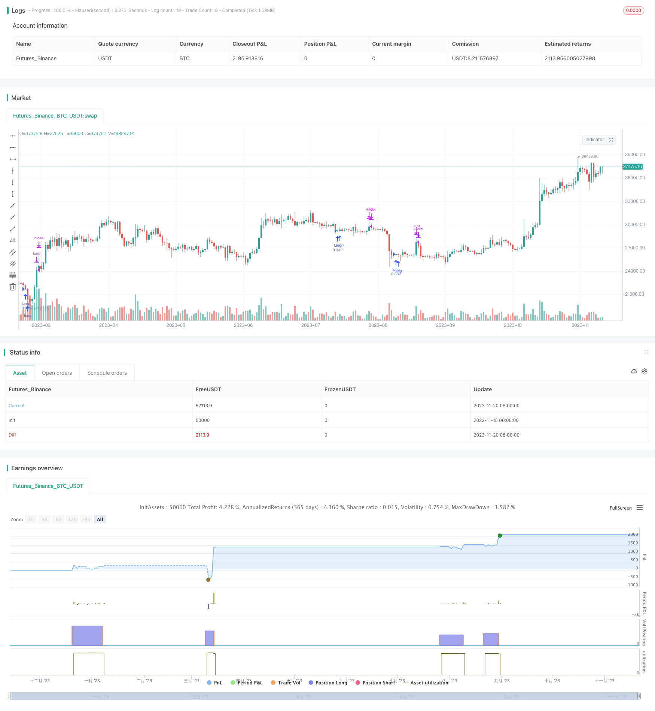

> Name

Bollinger-Band-Reversal-Based-Quantitative-Strategy based on fluctuation band reversal-Bollinger-Quantitative-Strategy
> Author

ChaoZhang

> Strategy Description


[trans]

## Overview
The name of this strategy is "Bollinger Quantitative Strategy Based on Volatility Band Reversal". This strategy uses the upper and lower bands of the Bollinger Band to make buy and sell decisions. When the stock price is near the lower track of the fluctuation band and there are signs of a downward breakthrough, it indicates that the stock price may be in the opportunity for reversal, and then buy; when the stock price rises near the upper limit of the fluctuation band, it indicates that the stock price may reverse and fall, then sell.
## Strategy Principle
This strategy uses the RSI indicator to determine when to buy. Specifically, it will determine whether the closing price of the most recent bar is lower than the lowest price of the previous 6 bars, while the Bollinger Band Width (BBW) is greater than the set threshold, and the Bollinger Band Ratio (BBR) is within the set interval. If these conditions are met, it indicates that the stock price may be at an opportunity to reverse, and a buying position should be opened at this time.
Exit is relatively simple. When the RSI is greater than 70, it indicates that the stock price is overheated. At this time, sell to close the position.
## Advantage Analysis
The biggest advantage of this strategy is that it uses the upper and lower rails of the Bollinger Bands to judge. When the Bollinger Bands reverse, buy and sell to seize short-term reversal opportunities. Compared with the simple RSI strategy, this strategy is more rigorous in judging the buying time and can avoid the probability of wrong transactions.
In addition, this strategy is sensitive to parameters and can be optimized for different varieties by adjusting the parameters of BBW and BBR to achieve better results.
## Risk Analysis
The main risk of this strategy is that Bollinger Bands cannot predict price reversal 100%. If the timing is not judged properly, it is easy to miss the best buying opportunity or suffer virtual losses.
In addition, short-term fluctuations in stock prices may cause strategies to frequently open and close positions, increasing transaction costs and slippage costs. If the reversal is not strong enough, you will face the risk of closing the position at a loss.
## Optimization direction
This strategy can be optimized from the following aspects:
1. Optimize parameters. You can use more sophisticated methods to test and optimize parameters such as BBW and BBR, and select the optimal parameters for different trading varieties.
2. Add a stop loss mechanism. You can set a trailing stop loss or a time stop loss to control the maximum loss.
3. Combine with other indicators. It can be combined with other indicators such as KDJ and MACD to make the buying signal more accurate and reliable.
4. Optimize the exit mechanism. The current exit mechanism is relatively simple and can be optimized, such as setting an appropriate moving take-profit, or exiting based on fluctuations.
## Summarize
This strategy uses the characteristics of the Bollinger Band to determine when the price may reverse, and then buy and sell. Compared with a single indicator such as RSI, this strategy is more accurate in judging timing. Through parameter optimization and stop loss and take profit settings, the strategy can be made more reliable. However, Bollinger Band prediction is not perfect, so the effect of strategy implementation still has a certain degree of randomness.
||

## Overview

The strategy is named "Bollinger Band Reversal Based Quantitative Strategy". It utilizes the upper and lower rails of the Bollinger Bands to determine entries and exits. When the price is near the lower rail of the bands and shows signs of a downward breakthrough, it indicates the price may be reversing, so go long. When the price rises to the upper rail, it indicates the price may reverse downwards, so go short.

## Strategy Logic

The strategy uses the RSI indicator to determine long entries. Specifically, it checks if the closing price of the most recent bar is lower than the lowest price of the previous 6 bars, meantime the Bollinger Band Width (BBW) is greater than a threshold, and the Bollinger Band Ratio (BBR) is within a range. If these criteria are met, it indicates the price may be reversing, so go long.

The exit is simple. When RSI goes above 70, indicating the price is overheated, close the long position.  

## Advantage Analysis

The biggest advantage of this strategy is utilizing the upper and lower rails of Bollinger Bands to determine entries. When BB reverses direction, go long or short to catch short-term reversal opportunities. Compared to simple RSI strategies, this strategy has more prudent criteria for entries, thus avoiding wrong trades.

Also, the strategy is sensitive to parameters. By tuning BBW and BBR, it can be optimized for different products and achieve better results.

## Risk Analysis

The main risk is that BB does not perfectly predict price reversals. If the timing is inappropriate, it easily leads to missing best entries or floating losses.

Also, short-term fluctuations may trigger frequent entries and exits, increasing costs from commissions and slippages. If the reversing momentum is not enough, it risks taking losses from exits.

## Optimization Directions 

The strategy can be improved in the following aspects:

1. Optimize parameters. Test and tune BBW, BBR and other parameters more finely for different products.

2. Add stop loss mechanisms, such as trailing stop loss and time stop loss, to limit maximum losses.

3. Incorporate other indicators, like KDJ and MACD, to make entries more reliable. 

4. Improve exit logic. The current exit is simple. Can optimize with trailing profit taking or exits based on volatility.

## Conclusion

This strategy utilizes the characteristics of Bollinger Bands to determine potential reversal points for entries and exits. Compared to single indicators like RSI, it has more accurate timing. With parameter tuning, stop losses and take profits, it can be more reliable. But BB's prediction is not perfect, so there are still some randomness in performance.

[/trans]

> Strategy Arguments


|Argument|Default|Description|
|----|----|----|
|v_input_1|15|bbw3|
|v_input_2|0.45|bbr3level|
|v_input_3|0.448|bbrlower|
|v_input_4|0.456|bbrhigher|
|v_input_5|7|sincelowestmin|
|v_input_6|57|sincelowestmax|
|v_input_7|20|length|


> Source (PineScript)

``` pinescript
/*backtest
start: 2022-11-15 00:00:00
end: 2023-11-21 00:00:00
period: 1d
basePeriod: 1h
exchanges: [{"eid":"Futures_Binance","currency":"BTC_USDT"}]
*/

//@version=4

//study(title = "Bolinger strategy", overlay=true)
strategy("Bolinger strategy",currency="SEK",default_qty_value=10000,default_qty_type=strategy.cash,max_bars_back=50)
len = 5
src = close
up = rma(max(change(src), 0), len)
down = rma(-min(change(src), 0), len)
rsi = down == 0 ? 100 : up == 0 ? 0 : 100 - (100 / (1 + up / down))


bbw3level = input(15, title="bbw3")
bbr3level = input(0.45, title="bbr3level")
bbrlower = input(0.4480, title="bbrlower")
bbrhigher = input(0.4560, title="bbrhigher")
sincelowestmin = input(7, title="sincelowestmin")
sincelowestmax = input(57, title="sincelowestmax")


length = input(20, minval=1)
mult = 20
src3 = close[3]
basis3 = sma(src3, length)
dev3 = mult * stdev(src3, length)
upper3 = basis3 + dev3
lower3 = basis3 - dev3
bbr3 = (src3 - lower3)/(upper3 - lower3)
bbw3 = (upper3-lower3)/basis3*100


basis = sma(src, length)
dev = mult * stdev(src, length)
upper = basis + dev
lower = basis - dev
bbr = (src - lower)/(upper - lower)
bbw = (upper-lower)/basis*100

criteriamet = 0
crossUnderB0 = crossunder(bbr,0)

since_x_under = barssince(crossUnderB0)


sincelowest = barssince(close[6] > close[3] and close[5] > close[3] and close[4] > close[3] and close[2] > close[3] and close[1] > close[3] and close > close[3] and bbw3 > bbw3level and bbr3 < bbr3level) //  and bbr3 < 0 

if sincelowest > sincelowestmin and sincelowest < sincelowestmax and bbr > bbrlower and bbr < bbrhigher
	criteriamet := 1
else
	criteriamet := 0	
//plot (criteriamet)

//exit 
exitmet = 0
if rsi > 70
	exitmet := 1
else
	exitmet := 0

if criteriamet == 1
	strategy.entry("long", strategy.long)
if exitmet == 1
	strategy.close("long")


```

> Detail

https://www.fmz.com/strategy/432923

> Last Modified

2023-11-22 17:44:40
