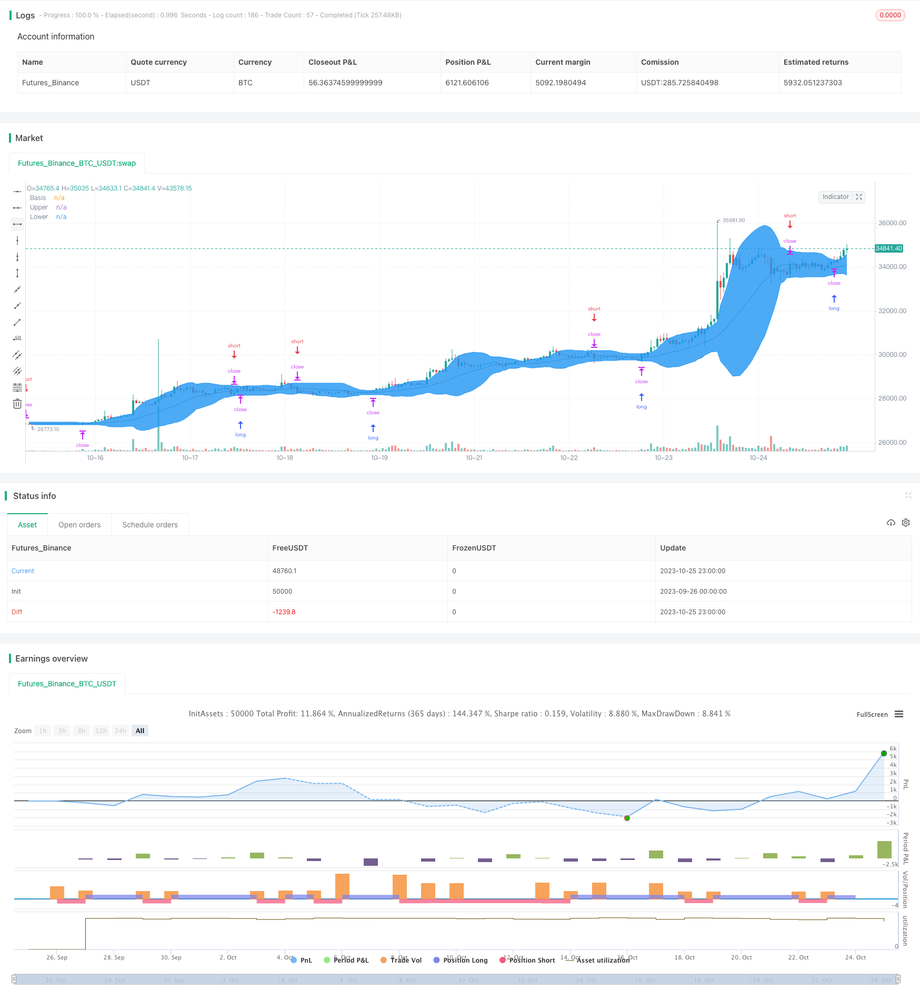

> Name

Bollinger-Breakout-Stop-loss-Strategy
> Author

ChaoZhang

> Strategy Description



[trans]

## Overview
This strategy is based on the Bollinger Bands indicator to judge trading signals, and uses stop-loss and take-profit methods for position management. The strategy will monitor the breakthrough of the upper and lower bands of the Bollinger Bands, go long when the price breaks through the upper band of the Bollinger Bands, go short when it breaks through the lower bands, and use stop-loss orders to close the position when the price breaks through in the opposite direction.
## Strategy Principle
This strategy uses the middle, upper and lower bands from the Bollinger Bands indicator. The middle rail is calculated as the median price within a certain period. The upper rail is the middle rail plus twice the standard deviation, and the lower rail is the middle rail minus twice the standard deviation.
The code first calculates the middle, upper and lower Bollinger Bands. Then, judge whether the price breaks through the upper track or the lower track. If it breaks through the upper track, go long. If it breaks through the lower track, go short. At the same time, if the price breaks through the upper or lower rail in the opposite direction, use a stop loss order to close the position.
Specifically, the strategy logic is as follows:
1. Calculate the middle track, upper track, and lower track of Bollinger Bands
2. If the price breaks through the upper track, go long and open a position
3. If the price breaks through the lower track, open a short position
4. If you have a long position and the price breaks through the lower track, use a stop loss order to close the position.
5. If there is a short position and the price breaks through the upper track, use a stop loss order to close the position.
In this way, you can capture the trend when the stock price fluctuates greatly, and you can also limit losses through stop loss.
## Advantage Analysis
- Use the Bollinger Bands indicator to determine the timing of entry, which can effectively capture the trend after the price breaks through.
- The signals for long and short are clear and the operating rules are simple and clear.
- Use stop loss order strategy to limit the maximum loss of a single transaction
- ParameterHandler can adjust Bollinger Band parameters and optimize strategies
## Risk Analysis
- Bollinger Bands trading is prone to multiple small stop-loss order losses, causing overall profit and loss losses.
- Improper setting of Bollinger Band parameters may lead to excessive trading frequency or missed signals
- Only price factors are considered, and other indicators are not combined to comprehensively judge the market.
- Failure to consider the adjustment of the stop loss line near the breakthrough point may expand losses
It can be optimized by combining indicators and appropriately adjusting the stop loss unit.
## Optimization direction
- You can consider combining other indicators, such as trading volume, moving averages, etc., to confirm breakthrough signals
- Bollinger Band parameters can be adjusted according to different markets and the parameter combination can be optimized
- The close stop loss distance can be adjusted according to the breakthrough point to avoid being too sensitive
- You can consider combining the Turtle Trading Rules and only trade after the trend is formed.
- Can be combined with machine learning algorithms to automatically optimize Bollinger Band parameters
## Summarize
This strategy designs a relatively simple trend following strategy based on the Bollinger Bands indicator. It can quickly form a position when the price breaks through, while using stop loss to control risk. However, only considering price factors may lead to misjudgment, and an overly sensitive stop loss may increase the frequency of transactions. We can further improve this strategy through parameter optimization, indicator combination, stop loss adjustment, etc. Overall, this strategy provides us with a relatively simple and reliable quantitative trading idea.
||

## Overview

This strategy generates trading signals based on the Bollinger Bands indicator and manages positions using stop-loss/take-profit. It monitors the breakout of the Bollinger Bands upper and lower bands, goes long when price breaks above the upper band, goes short when price breaks the lower band, and exits when price breaks the bands in reverse using stop-loss orders.

## Strategy Logic

The strategy utilizes the middle, upper and lower bands from the Bollinger Bands indicator. The middle band is the moving average, the upper band is middle band plus 2 standard deviations, and the lower band is the middle band minus 2 standard deviations.

First it calculates the Bollinger Bands middle, upper and lower bands. Then it checks if price breaks above the upper band or below the lower band. If price breaks above upper band, it goes long. If price breaks below lower band, it goes short. Also if price breaks the bands in reverse, it exits positions using stop-loss orders. 

Specifically, the strategy logic is:

1. Calculate Bollinger Bands middle, upper and lower bands
2. If price breaks above upper band, go long 
3. If price breaks below lower band, go short
4. If already long, close long when price breaks below lower band 
5. If already short, close short when price breaks above upper band

This allows catching trends when price makes big moves, while limiting losses using stop-loss. 

## Advantages

- Using Bollinger Bands for entry signals catches trends after breakouts
- Clear long/short signals, simple rules
- Stop-loss strategy limits max loss per trade  
- Parameter tunability to optimize strategy

## Risks 

- Frequent small stop-loss trades may hurt overall P/L
- Poor parameter tuning may cause too many signals or missed trades
- Only considers price, no other indicators for confirmation
- No adjustment of stop-loss near breakout may increase loss

Can optimize via combining indicators, adjusting stop-loss units etc.

## Enhancement Opportunities

- Combine other indicators like volume, moving averages to confirm signals
- Optimize Bollinger parameters for different markets  
- Adjust stop-loss distance near breakout to avoid oversensitivity
- Trade only after trends develop, like Turtle Trading rules
- Auto-optimize parameters via machine learning algorithms

## Conclusion

This is a relatively simple trend following strategy based on Bollinger Bands. It can quickly take positions when price breaks out and uses stop-loss to control risk. But relying solely on price may cause misjudgements, while sensitive stop-loss may increase trade frequency. We can further improve it via parameter tuning, combining indicators, adjusting stops etc. Overall it provides a simple and reliable quant trading framework.

[/trans]

> Strategy Arguments


|Argument|Default|Description|
|----|----|----|
|v_input_1|true|long|
|v_input_2|true|short|
|v_input_int_1|20|length|
|v_input_float_1|2|mult|
|v_input_3_close|0|source: close|high|low|open|hl2|hlc3|hlcc4|ohlc4|
|v_input_4|true|Show Bollinger Bands|
|v_input_5|true|Show Offset|
|v_input_6|timestamp(01 Jan 2000 00:00 +0000)|Start Time|
|v_input_7|timestamp(31 Dec 2099 23:59 +0000)|Final Time|


> Source (PineScript)

``` pinescript
/*backtest
start: 2023-09-26 00:00:00
end: 2023-10-26 00:00:00
period: 1h
basePeriod: 15m
exchanges: [{"eid":"Futures_Binance","currency":"BTC_USDT"}]
*/

// This source code is subject to the terms of the Mozilla Public License 2.0 at https://mozilla.org/MPL/2.0/
// © ROBO_Trading

//@version=5
strategy(title = "Bollinger Stop Strategy", shorttitle = "BBStop", overlay = true, default_qty_type = strategy.percent_of_equity, initial_capital = 10000, default_qty_value = 100, commission_value = 0.1)

//Settings
long = input(true)
short = input(true)
length = input.int(20, minval=1)
mult = input.float(2.0, minval=0.001, maxval=50)
source = input(close)
showbb = input(true, title = "Show Bollinger Bands")
showof = input(true, title = "Show Offset")
startTime = input(defval = timestamp("01 Jan 2000 00:00 +0000"), title = "Start Time", inline = "time1")
finalTime = input(defval = timestamp("31 Dec 2099 23:59 +0000"), title = "Final Time", inline = "time1")

//Bollinger Bands
basis = ta.sma(source, length)
dev = mult * ta.stdev(source, length)
upper = basis + dev
lower = basis - dev

//Show indicator
offset = showof ? 1 : 0
colorBasis = showbb ? color.gray : na
colorUpper = showbb ? color.blue : na
colorLower = showbb ? color.blue : na
colorBands = showbb ? color.blue : na
p0 = plot(basis, "Basis", color = colorBasis, offset = offset)
p1 = plot(upper, "Upper", color = colorUpper, offset = offset)
p2 = plot(lower, "Lower", color = colorLower, offset = offset)
fill(p1, p2, title = "Background", color = colorBands, transp = 90)

//Trading
truetime = true
if basis > 0 and truetime
    if long
        strategy.entry("Long", strategy.long, stop = upper, when = truetime)
    if short
        strategy.entry("Short", strategy.short, stop = lower, when = truetime)
    if long == false
        strategy.exit("Exit", "Short", stop = upper)
    if short == false
        strategy.exit("Exit", "Long", stop = lower)
if time > finalTime
    strategy.close_all()
```

> Detail

https://www.fmz.com/strategy/430382

> Last Modified

2023-10-27 16:50:24
