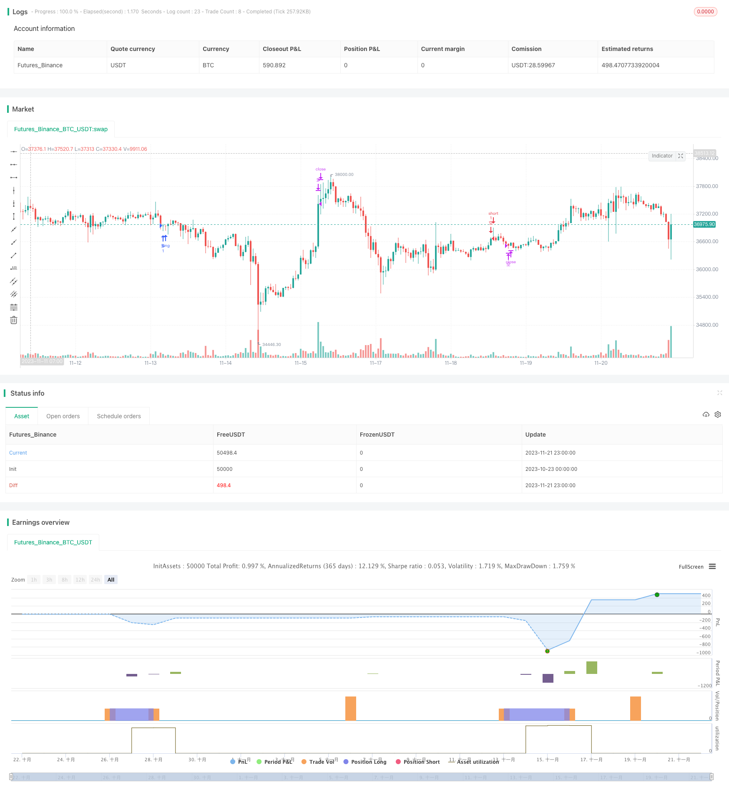

> Name

Bollinger-Trend-Shock-Trading-Strategy
> Author

ChaoZhang

> Strategy Description



[trans]

### Overview
This strategy determines the direction of the market trend based on the Bollinger Bands indicator, and performs reverse operations when the trend direction turns. In a long market, go long when the price falls below the lower track of the Bollinger Band; in a short market, go short when the price breaks through the upper track of the Bollinger Band. At the same time, the strategy also sets a moving average as a criterion for judging long-term trends, making the strategy more stable.
### Strategy Principles
This strategy uses the middle track, upper track, and lower track of Bollinger Bands to determine the market trend direction. The middle track of the Bollinger Bands is an n-period exponential moving average, and the upper and lower tracks of the Bollinger Bands are respectively the middle track +2.3 times the standard deviation and the middle track -2.3 times the standard deviation. When the price breaks through the lower track, it means that we are currently in a long market; when the price breaks through the upper track, it means that we are currently in a short market.
In addition, the strategy also sets the 200-period simple moving average SMA as a long-term trend judgment indicator. Only when the Bollinger Bands indicator and the SMA indicator move in the same direction will a trading signal be issued. This can effectively filter out some false breakthroughs.
The specific transaction logic is as follows:
1. Determine the bullish trend: upper Bollinger Band > sma, middle track > sma, lower track > = sma
2. Determine the short trend: upper Bollinger Band <sma, middle track <sma, lower track <=sma
3. Long conditions: bull trend + price falls below the lower Bollinger Band
4. Exit conditions: price breaks through the Bollinger Band upper track
5. Short selling conditions: short trend + price breaks through the upper Bollinger Band
6. Exit conditions: The price falls below the middle track of the Bollinger Bands or the price falls back above the 230-period moving average.
### Advantage Analysis
1. Using Bollinger Bands to determine the trend direction can effectively capture breakthrough opportunities.
2. Adding long-term moving average filtering can reduce the risk of false breakthroughs
3. The logic of long and short operations is clear and easy to understand.
4. The short exit conditions are set relatively strictly, which can reduce losses.
### Risk Analysis
1. When Bollinger Bands and moving averages send trading signals, there may be large slippage.
2. The conditions for short positions are too strict, which may result in low profits for short positions.
3. Improper parameter settings may lead to too high or too low transaction frequency
4. Breakthrough strategies are prone to huge losses
Improvement method:
1. Optimize Bollinger Band parameters and reduce trading frequency
2. Set a stop loss point to avoid huge losses in a single transaction
3. Add trading volume indicator filtering to ensure the effectiveness of breakthroughs
### Summarize
This strategy is relatively simple and easy to understand overall. It uses Bollinger Bands to determine the trend and perform reverse operations at turning points. At the same time, adding long-term and short-term judgment indicators can effectively filter signals. There is still a lot of room for strategy optimization, and further improvements can be made by appropriately adjusting parameters and adding volume and energy indicators.
||

### Overview

This strategy uses the Bollinger Bands indicator to determine market trend direction, and takes counter-trend trades when trend reversal occurs. It goes long when price breaks below the lower band in an uptrend; and goes short when price breaks above the upper band in a downtrend. Also, a moving average is used as the benchmark for long-term trend to make the strategy more stable.

### Strategy Principle  

This strategy utilizes the middle band, upper band and lower band of Bollinger Bands to determine market trend direction. The middle band is the n-period exponential moving average, while the upper band and lower band are middle band +2.3 standard deviation and middle band -2.3 standard deviation respectively. When price breaks below the lower band, it indicates a current uptrend. When price breaks above the upper band, it indicates a current downtrend.

In addition, the strategy sets a 200-period simple moving average (sma) as the benchmark for long-term trend judgement. Trading signals are only triggered when BB and sma indicators agree on the same direction. This can effectively filter out some false breakouts.

The specific trading logic is as follows:

1. Determine uptrend: BB upper band > sma, middle band > sma, lower band >= sma
2. Determine downtrend: BB upper band < sma, middle band < sma, lower band <= sma
3. Long condition: Uptrend + Price breaks BB lower band
4. Exit condition: Price breaks BB upper band  
5. Short condition: Downtrend + Price breaks BB upper band 
6. Exit condition: Price breaks below BB middle band or rebounds back above the 230-period MA

### Advantage Analysis
  

1. BB judges trend direction effectively and captures breakout trading opportunities  
2. Adding long-term MA filter reduces risks associated with false breakouts
3. Clear long and short logic, easy to understand and follow
4. Strict criteria for short exit helps limit losses

### Risk Analysis

1. Potential large slippage when BB and MA issue trading signals
2. Overly strict short conditions lead to limited short side profit  
3. Improper parameter tuning can result in too high/low trading frequency
4. Breakout strategies prone to huge losses

Improvements:

1. Optimize BB parameters to reduce trading frequency  
2. Set stop loss to avoid huge losses per trade
3. Add volume filter to ensure breakout validity   

### Summary

Overall this is a simple and easy to understand strategy, using BB to determine trends and taking counter-trend trades at turning points. Adding short-term and benchmark indicators also helps filter signals. Still large room for optimizations, like parameter tuning, volume indicators etc. can further improve it.

[/trans]

> Strategy Arguments


|Argument|Default|Description|
|----|----|----|
|v_input_int_1|20|Length|
|v_input_float_1|2.3|Standard deviation|
|v_input_int_2|200|Trend dividing line|

> Source (PineScript)

``` pinescript
/*backtest
start: 2023-10-23 00:00:00
end: 2023-11-22 00:00:00
period: 1h
basePeriod: 15m
exchanges: [{"eid":"Futures_Binance","currency":"BTC_USDT"}]
*/

// This source code is subject to the terms of the Mozilla Public License 2.0 at https://mozilla.org/MPL/2.0/
// © Aayonga

//@version=5
strategy("布林趋势震荡单", overlay=true,initial_capital=10000,default_qty_type=strategy.fixed, default_qty_value=1 )
bollL=input.int(20,minval=1,title = "长度")
bollmult=input.float(2.3,minval=0,step=0.1,title = "标准差")
basis=ta.ema(close,bollL)
dev=bollmult*ta.stdev(close,bollL)
upper=basis+dev
lower=basis-dev
smaL=input.int(200,minval=1,step=1,title = "趋势分界线")
sma=ta.sma(close,smaL)
//多头趋势
longT=upper>sma and basis>sma and lower>=sma
//空头趋势
shortT=upper<sma and basis<sma and lower<=sma

//入场位
longE=ta.crossover(close,lower)
shortE=ta.crossover(close,upper)
//出场位

longEXIT=ta.crossover(high,upper) 
shortEXIT=ta.crossunder(close,basis) or ta.crossover(close,ta.sma(close,230)) 

if longT and longE
    strategy.entry("多",strategy.long)

if longEXIT
    strategy.close("多",comment = "多出场")

if shortE and shortT
    strategy.entry("空",strategy.short)

if shortEXIT
    strategy.close("空",comment = "空出场")
```

> Detail

https://www.fmz.com/strategy/432969

> Last Modified

2023-11-23 10:57:10
