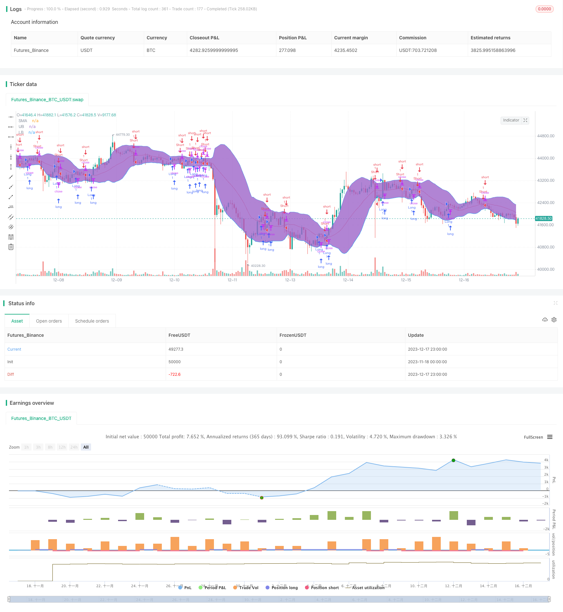

> Name

Bollinger-Bands-Momentum-Breakout-Strategy Bollinger-Bands-Momentum-Breakout-Strategy
> Author

ChaoZhang

> Strategy Description


 [trans]

## Overview
The Bollinger Volume Breakout Strategy is a typical quantitative trading strategy that uses Bollinger indicators to identify stock value. This strategy uses the upper and lower bands of the Bollinger Band to determine whether a stock is overvalued or undervalued, and combines it with the moving average of the stock price to issue trading signals. When the price breaks through the upper band, the stock is considered undervalued, forming a buy signal; when the price falls below the lower band, the stock is considered overvalued, forming a sell signal.
## Principle
The Bollinger belt is composed of the middle track, the upper track and the lower track. The middle rail is a simple moving average of n days; the upper and lower rails are the positions of two standard deviations above and below the middle rail. When the stock price is close to the upper band, the stock price is considered to be overvalued, and when it is close to the lower band, the stock price is considered to be undervalued.
This strategy first calculates the mid-range, upper track, and lower track of the stock price for 20 days. Then determine whether the stock price is above or below the mid-rail line. If it is above the mid-rail line, it is a buy signal, and if it is below the mid-rail line, it is a sell signal. At the same time, if the stock price crosses the upper rail line, it is a signal to close the position, and if the stock price crosses the lower rail line, it is a signal to close the position.
## Advantages
The biggest advantage of this strategy is that it uses Bollinger bands to determine whether the stock price is high or low, thus avoiding the problem of blind trading. The strategy will issue a sell signal when the stock price is overvalued and a buy signal when the stock price is undervalued. This can effectively filter out some noise, and the incoming trading signals are of higher quality.
In addition, this strategy adds moving averages as auxiliary judgment indicators. The stock price actually breaks through the moving average, which is also a strong trend signal. Combined with the high and low estimate judgment of Bollinger bands, the strategy signal can be made more accurate.
## Risk
The biggest risk with this strategy is the Bollinger Band indicator itself. When stock prices fluctuate abnormally, the range of Bollinger bands will also change. At this time, the stock price may be obviously overvalued or undervalued, but it has not touched the upper and lower rails of the Bollinger Band. This leads to the problem that the strategy cannot give trading signals.
In addition, if you only rely on technical indicators without considering the fundamental information of the stock, there will also be certain risks. For example, stocks with declining profits but undervalued stock prices, or stocks with rapid growth but high stock prices. In these cases, the strategy signal may deviate from the actual value of the stock.
## Optimization direction
This strategy can be optimized from the following aspects:
1. Add a stop loss mechanism. When the stock price drops by a certain percentage compared with the purchase price, stop loss is forced to exit. This can effectively control the maximum loss of the strategy.
2. Combine stock fundamentals with technical indicators. Add judgment rules for fundamental indicators such as PE and PB to avoid buying stocks that are actually overvalued.
3. Dynamically adjust parameters. The Bollinger band's cycle length, standard deviation multiple and other parameters are dynamically adjusted according to different stock volatility. This allows the Bollinger Bands to better adapt to the price fluctuations of individual stocks.
## Summarize
Bollinger's volume breakthrough strategy sends trading signals through auxiliary judgment indicators, avoiding the risk of blind trading and effectively filtering noise signals. At the same time, there are certain limitations and the impact of abnormal fluctuations cannot be completely avoided. In the future, optimization can be done from aspects such as stop loss, combining fundamentals, and dynamic parameter adjustment to make the strategy more stable and reliable.
||

## Overview

The Bollinger Bands momentum breakout strategy is a typical quantitative trading strategy that utilizes the Bollinger Bands indicator to identify mispriced stocks. This strategy uses the upper and lower bands of Bollinger Bands to judge whether a stock is overvalued or undervalued, and combines the moving average of the stock price to generate trading signals. When the price breaks through the upper band, the stock is considered undervalued and a buy signal is formed. When the price breaks through the lower band, the stock is considered overvalued and a sell signal is formed.

## Principle  

The Bollinger Bands consist of a middle band, an upper band and a lower band. The middle band is the n-day simple moving average; the upper and lower bands are respectively two standard deviations above and below the middle band. When the stock price is close to the upper band, it is considered overvalued, and when it is close to the lower band, it is considered undervalued.

This strategy first calculates the 20-day middle, upper and lower Bollinger Bands. Then it judges whether the stock price is higher or lower than the middle band. If it is higher than the middle band, a buy signal is formed. If it is lower than the middle band, a sell signal is formed. At the same time, if the stock price breaks through the upper band, it serves as a closing signal, and if the price breaks through the lower band, it also serves as a closing signal.

## Advantages

The biggest advantage of this strategy is that it uses Bollinger Bands to judge the overvaluation and undervaluation of stock prices, avoiding the problem of blind trading. When the stock price is overvalued, the strategy will issue a sell signal. When the stock price is undervalued, the strategy will issue a buy signal. This can effectively filter out some noise and the quality of trading signals entered is higher.

In addition, the moving average is used as an auxiliary judgment indicator in this strategy. The actual breakthrough of the moving average by the stock price is also a strong trend signal. Combined with Bollinger Band's judgment of overvaluation and undervaluation, the strategy signals can be more accurate.

## Risks

The biggest risk of this strategy lies in the Bollinger Bands indicator itself. When the stock price fluctuates abnormally, the range of Bollinger Bands will also change accordingly. At this time, there may be situations where the stock price is clearly overvalued or undervalued, but has not reached the upper or lower rails of the Bollinger Bands. As a result, the strategy fails to give trading signals.  

In addition, relying solely on technical indicators without considering the fundamentals of the stock also poses some risks. For example, stocks with declining profits but undervalued prices, or stocks with high-speed earnings growth but relatively high prices. In these cases, there may be some deviation between strategy signals and actual stock value.

## Optimization Directions   

This strategy can be optimized in the following aspects:

1. Add a stop loss mechanism. When the stock price decreases by a certain percentage compared to the purchase price, forced stop loss exit. This can effectively control the maximum loss of the strategy.

2. Combine fundamentals with technical indicators. Add judgment rules such as PE and PB ratios to avoid buying stocks that are already overvalued.  

3. Dynamically adjust parameters. Make parameters of Bollinger Bands such as cycle length and standard deviation multiplier adjust dynamically according to volatility of different stocks. This allows Bollinger Bands to better adapt to stock price fluctuations.   

## Conclusion

The Bollinger Bands momentum breakout strategy avoids the risk of blind trading by issuing trading signals with auxiliary judgment indicators, which can effectively filter out noise signals. At the same time, there are certain limitations that cannot completely avoid the impact of abnormal fluctuations. In the future, optimization can be carried out in aspects such as stop loss, combining fundamentals, and dynamically adjusting parameters to make the strategy more stable and reliable.

[/trans]

> Strategy Arguments


|Argument|Default|Description|
|----|----|----|
|v_input_1|20|Period|
|v_input_2|1.5|Standard Deviation|


> Source (PineScript)

``` pinescript
/*backtest
start: 2023-11-18 00:00:00
end: 2023-12-18 00:00:00
period: 1h
basePeriod: 15m
exchanges: [{"eid":"Futures_Binance","currency":"BTC_USDT"}]
*/

//@version=4
strategy(title="NoScoobies Bollinger Bands", overlay=true)
source = close
length = input(20, minval=1, title = "Period") //Length of the Bollinger Band 
mult = input(1.5, minval=0.001, maxval=50, title = "Standard Deviation") // Use 1.5 SD for 20 period MA; Use 2 SD for 10 period MA 

basis = sma(source, length)
dev = mult * stdev(source, length)

upper = basis + dev
lower = basis - dev

long=crossover(source, basis)
short=crossunder(source, basis)
close_long=crossunder(source, upper)
close_short=crossover(source, lower)

if long
    strategy.entry("Long", strategy.long)
    strategy.close("Long", when = close_long)

if short
    strategy.entry("Short", strategy.short)
    strategy.close("Short", when = close_short)

plot(basis, color=color.red,title= "SMA")
p1 = plot(upper, color=color.blue,title= "UB")
p2 = plot(lower, color=color.blue,title= "LB")
fill(p1, p2)
```

> Detail

https://www.fmz.com/strategy/435903

> Last Modified

2023-12-19 16:24:24
