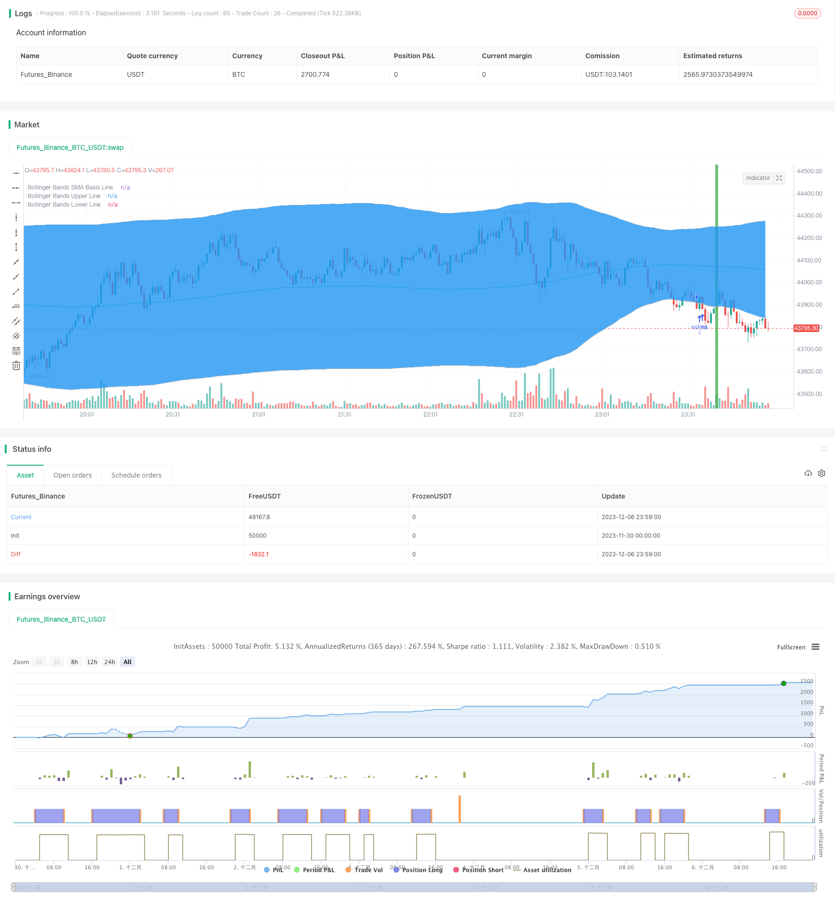

> Name

BollingerRSI Dual-Strategy-Long-Only-v12 Bollinger-RSI-Double-Strategy-Long-Only-v12
> Author

ChaoZhang

> Strategy Description


[trans]

## 1. Strategy name
Bollinger+RSI dual long strategy
## 2. Strategy Overview
This strategy uses the combination of the Bollinger Bands indicator and the RSI indicator to open a long position when both show oversold signals at the same time, and close the position when both show overbought signals at the same time. Compared with a single indicator, it can confirm trading signals more reliably and avoid false signals.
## 3. Strategy Principles
1. Use RSI indicator to determine overbought and oversold
    - RSI below 50 is considered oversold
    - RSI above 50 is considered overbought
2. Use Bollinger Bands to determine price anomalies
    - Prices below the lower band are considered oversold
    - Prices above the upper band are considered overbought
3. When RSI and Bollinger Bands show oversold signals at the same time, go long and open a position
    - RSI indicator line is below 50
    - The price line is below the lower Bollinger Band
4. When RSI and Bollinger Bands show overbought signals at the same time, close the position
    - RSI indicator line is above 50
    - The price line is above the upper Bollinger Bands
## 4. Strategic advantages
1. The combination of two indicators makes the signal more reliable and avoids false signals.
2. Only establish long positions to simplify logic and reduce transaction risks.
## 5. Strategic risks and solutions
1. The Bollinger Band parameters are improperly set, and the upper and lower rail limits are too broad, which increases the risk of mistaken transactions.
    - Optimize the Bollinger Band parameters and reasonably set the Bollinger Band period and standard deviation
2. Improper setting of RSI parameters and improper judgment criteria for overbought and oversold increase the risk of mistaken transactions.
    - Optimize RSI parameters, adjust RSI cycles, and reasonably set overbought and oversold standards
3. Ravin does not work well when the market is not trending
    - Combine with trend indicators to avoid volatile market operations
## 6. Strategy optimization direction
1. Optimize Bollinger Bands and RSI parameter settings
2. Add a stop loss mechanism
3. Combined with trend indicators such as MACD
4. Add short-term and long-term combined judgment
## 7. Summary
This strategy combines the advantages of Bollinger Bands and RSI, and trades when both show overbought and oversold signals at the same time, avoiding false signals generated by a single indicator, thereby improving signal accuracy. Compared with the previous version, only long positions are established, which reduces transaction risks. Subsequent strategy optimization can be carried out through parameter optimization, stop loss mechanism, and combination with trend indicators to make it more adaptable to different market environments.
||

## I. Strategy Name  
Bollinger Bands + RSI Double Long Strategy

## II. Strategy Overview
This strategy combines the Bollinger Bands indicator and the RSI indicator to go long when both show an oversold signal, and to close the long position when both show an overbought signal. Compared with a single indicator, it can more reliably confirm trading signals and avoid false signals.  

## III. Strategy Principle  
1. Use RSI indicator to judge overbought/oversold
    - RSI below 50 is considered oversold 
    - RSI above 50 is considered overbought
2. Use Bollinger Bands to judge price extremes
    - Price below lower band is oversold
    - Price above upper band is overbought
3. Go long when both RSI and Bollinger Bands show oversold signal  
    - RSI below 50
    - Price below Bollinger lower band
4. Close long position when both RSI and Bollinger Bands show overbought signal
    - RSI above 50 
    - Price above Bollinger upper band

## IV. Strategy Strengths
1. Combining two indicators makes signals more reliable and avoids false signals 
2. Only long positions simplify logic and reduce trading risk

## V. Strategy Risks and Solutions
1. Improper Bollinger Bands parameter setting, too wide upper/lower bands increase false trading risk
    - Optimize Bollinger Bands parameters, set reasonable period and standard deviation
2. Improper RSI parameter setting, wrong overbought/oversold standards increase false trading risk
    - Optimize RSI parameters, adjust RSI period, set reasonable overbought/oversold standards  
3. Poor profitability when market lacks a trend  
    - Combine with trend indicators to avoid choppy markets

## VI. Strategy Optimization Directions
1. Optimize Bollinger Bands and RSI parameter settings
2. Add stop loss mechanism 
3. Combine with trend indicators like MACD
4. Add combination of short-term and long-term analysis  

## VII. Summary
This strategy combines the strengths of Bollinger Bands and RSI indicators to trade when both show extremes. This avoids false signals from a single indicator and improves signal accuracy. Compared to previous versions, only establishing long positions reduces trading risk. Future optimizations can be done through parameter tuning, stop loss mechanisms, combining with trend indicators etc. to make the strategy adaptable to different market environments.[/trans]

> Strategy Arguments


|Argument|Default|Description|
|----|----|----|
|v_input_1|6|RSI Period Length|
|v_input_2|200|Bollinger Period Length|
|v_input_3|true|Enable Bar Color?|
|v_input_4|true|Enable Background Color?|


> Source (PineScript)

``` pinescript
/*backtest
start: 2023-11-30 00:00:00
end: 2023-12-07 00:00:00
period: 1m
basePeriod: 1m
exchanges: [{"eid":"Futures_Binance","currency":"BTC_USDT"}]
*/

//@version=3
strategy("Bollinger + RSI, Double Strategy Long-Only (by ChartArt) v1.2", shorttitle="CA_-_RSI_Bol_Strat_1.2", overlay=true)

// ChartArt's RSI + Bollinger Bands, Double Strategy UPDATE: Long-Only
//
// Version 1.2
// Idea by ChartArt on October 4, 2017.
//
// This strategy uses the RSI indicator 
// together with the Bollinger Bands 
// to buy when the price is below the
// lower Bollinger Band (and to close the
// long trade when this value is above
// the upper Bollinger band).
//
// This simple strategy only longs when
// both the RSI and the Bollinger Bands
// indicators are at the same time in
// a oversold condition.
//
// In this new version 1.2 the strategy was
// simplified by going long-only, which made
// it more successful in backtesting. 
//
// List of my work: 
// https://www.tradingview.com/u/ChartArt/
// 
//  __             __  ___       __  ___ 
// /  ` |__|  /\  |__)  |   /\  |__)  |  
// \__, |  | /~~\ |  \  |  /~~\ |  \  |  
// 
// 


///////////// RSI
RSIlength = input(6,title="RSI Period Length") 
RSIoverSold = 50
RSIoverBought = 50
price = close
vrsi = rsi(price, RSIlength)


///////////// Bollinger Bands
BBlength = input(200, minval=1,title="Bollinger Period Length")
BBmult = 2 // input(2.0, minval=0.001, maxval=50,title="Bollinger Bands Standard Deviation")
BBbasis = sma(price, BBlength)
BBdev = BBmult * stdev(price, BBlength)
BBupper = BBbasis + BBdev
BBlower = BBbasis - BBdev
source = close
buyEntry = crossover(source, BBlower)
sellEntry = crossunder(source, BBupper)
plot(BBbasis, color=aqua,title="Bollinger Bands SMA Basis Line")
p1 = plot(BBupper, color=silver,title="Bollinger Bands Upper Line")
p2 = plot(BBlower, color=silver,title="Bollinger Bands Lower Line")
fill(p1, p2)


///////////// Colors
switch1=input(true, title="Enable Bar Color?")
switch2=input(true, title="Enable Background Color?")
TrendColor = RSIoverBought and (price[1] > BBupper and price < BBupper) and BBbasis < BBbasis[1] ? red : RSIoverSold and (price[1] < BBlower and price > BBlower) and BBbasis > BBbasis[1] ? green : na
barcolor(switch1?TrendColor:na)
bgcolor(switch2?TrendColor:na,transp=50)


///////////// RSI + Bollinger Bands Strategy
long = (crossover(vrsi, RSIoverSold) and crossover(source, BBlower))
close_long = (crossunder(vrsi, RSIoverBought) and crossunder(source, BBupper))

if (not na(vrsi))

    if long
        strategy.entry("RSI_BB", strategy.long, stop=BBlower, comment="RSI_BB")
    else
        strategy.cancel(id="RSI_BB")
        
    if close_long
        strategy.close("RSI_BB")


//plot(strategy.equity, title="equity", color=red, linewidth=2, style=areabr)
```

> Detail

https://www.fmz.com/strategy/434670

> Last Modified

2023-12-08 10:39:52
