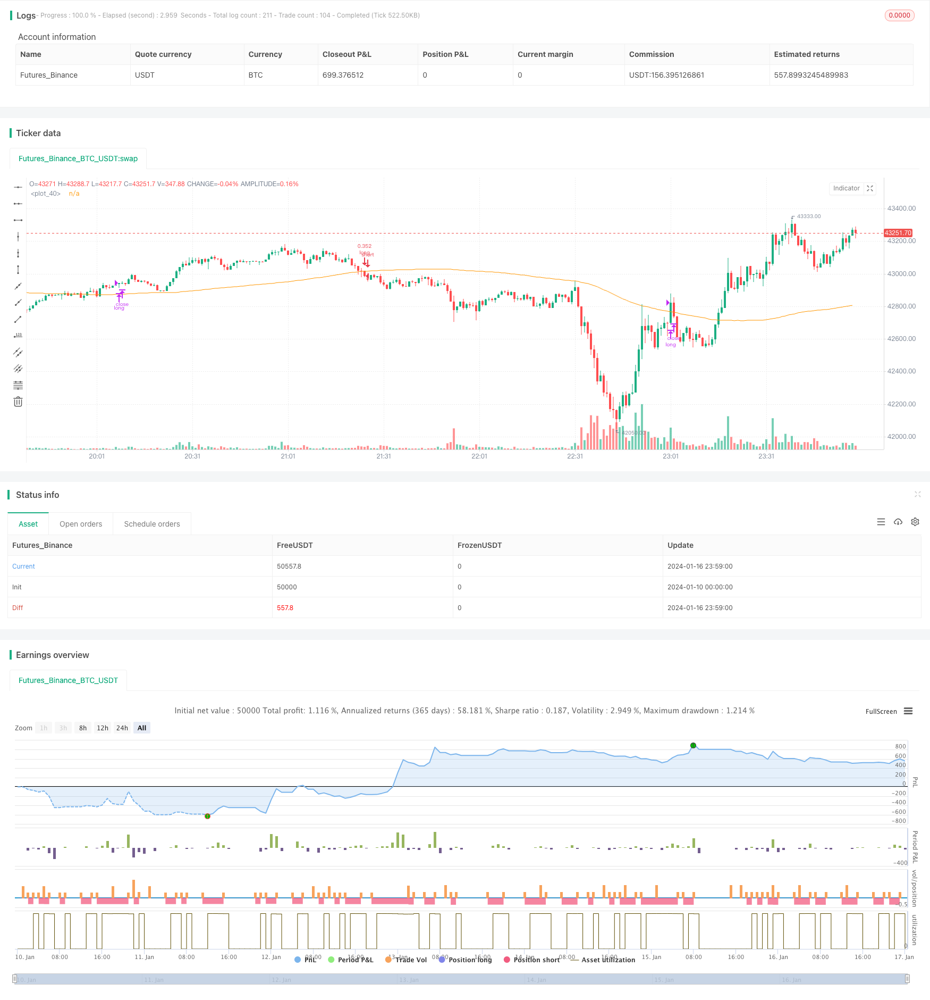

> Name

Bottom-Fishing-Strategy
> Author

ChaoZhang

> Strategy Description


[trans]
## Overview
The bottom-covering strategy is a typical buy-low-sell-high strategy. It uses the RSI indicator to identify oversold points, issues a buy signal after the price drops to a certain level, and Accumulate tokens at a lower price; when the price rises again, profit taking is achieved by setting an RSI exit threshold. This strategy is suitable for medium and long-term holdings, and can effectively filter out false breakthroughs in volatile market conditions and optimize the cost of holding currency.
## Strategy Principle
This strategy is primarily based on the RSI indicator to identify oversold points. The normal range of the RSI indicator is between 0 and 100. When the RSI indicator falls below the set entry threshold of 35, a buy signal is issued; when the RSI indicator rises again above the set exit threshold of 65, a sell signal is issued. This allows timely entry and exit when the price trend reverses, implementing buy low and sell high.
In addition, the strategy also introduces a 100-period simple moving average, which forms a combination condition with the RSI indicator. Only when the price falls below the moving average and RSI enters the oversold zone, a buy signal will be triggered. This can effectively filter out some false breakthroughs and reduce unnecessary transactions.
## Strategic Advantages
- Use RSI to effectively identify oversold and overbought points, and enter the market at the reversal point to obtain a better buying cost.
- Combined with moving averages to filter out false signals and avoid chasing highs
- Suitable for medium and long-term holdings, and can explore potential upward trends
## Strategic risks and solutions
- There is a certain delay and you may miss the opportunity for quick reversal
    - Appropriately shorten the RSI calculation period and speed up the indicator response
- There may be more liquidation losses in volatile market conditions
    - Adjust the moving average period, or cancel the moving average
    - Appropriately relax RSI entry and exit parameters
## Strategy optimization direction
- Test parameter optimization for different currencies and time periods
- Try to combine judgment with other indicators, such as MACD, Bollinger Bands, etc.
- Dynamically adjust RSI parameters or moving average parameters
- Optimize position management strategy
## Summarize
The bottom-covering strategy is generally a stable and practical strategy of buying low and selling high. Through the double filtering of RSI and moving average, false signals can be effectively suppressed, and under optimized parameters, lower currency holding costs can be obtained. At the same time, proper optimization of indicator parameters and adjustment of position strategies are expected to achieve higher capital utilization efficiency.
||

## Overview

The bottom fishing strategy is a typical low buying and high selling strategy. It utilizes the RSI indicator to identify oversold points and issues a buy signal when the price drops to a certain extent, in order to accumulate tokens at a lower price. When the price rebounds, it realizes profits by setting the RSI exit threshold. This strategy is suitable for medium and long term holding. It can effectively filter out false breakouts in volatile markets and optimize the cost basis of holdings.  

## Strategy Logic 

This strategy mainly relies on the RSI indicator to identify oversold conditions. The normal range of the RSI indicator is from 0 to 100. When the RSI indicator falls below the set entry threshold of 35, a buy signal is issued. When the RSI indicator rises back above the set exit threshold of 65, a sell signal is issued. This allows timely entry and exit at trend reversal points to implement low buying and high selling.

In addition, a 100-period simple moving average is also introduced in the strategy to form a combined condition with the RSI indicator. Only when the price drops below the moving average while the RSI enters the oversold zone will the buy signal be triggered. This can help filter out false breakouts to some extent and reduce unnecessary trades.   

## Advantages of the Strategy

- Effectively identify oversold and overbought points with RSI for entry at reversal points, obtaining better cost basis  

- Filter out false signals by combining with moving average, avoiding buying at the peak

- Suitable for medium to long term holding, able to discover potential uptrends   

## Risks and Solutions  

- There is a certain lag, possibly missing out fast reversal opportunities 
    - Shorten RSI calculation period appropriately to speed up indicator reaction

- More break-even or losing closes may occur in ranging markets
    - Adjust moving average period or remove moving average
    - Relax RSI entry and exit parameters appropriately  

## Optimization Directions 

- Test parameters optimization on different coins and time frames

- Try combining other indicators such as MACD, Bollinger Bands etc. 

- Dynamically adjust RSI parameters or moving average parameters
  
- Optimize position sizing strategies

## Summary  

The bottom fishing strategy is an overall robust and practical low buying and high selling strategy. By double filtering with RSI and moving average, it can effectively curb false signals and obtain lower cost basis with optimized parameters. At the same time, appropriately optimizing indicator parameters and adjusting position strategies may lead to higher capital usage efficiency.

[/trans]

> Strategy Arguments


|Argument|Default|Description|
|----|----|----|
|v_input_1|true|From Month|
|v_input_2|true|From Day|
|v_input_3|2020|From Year|
|v_input_4|true|Thru Month|
|v_input_5|true|Thru Day|
|v_input_6|2112|Thru Year|
|v_input_7|true|Show Date Range|
|v_input_8|35|RSI Entry|
|v_input_9|65|RSI Close|
|v_input_10|100|v_input_10|


> Source (PineScript)

``` pinescript
/*backtest
start: 2024-01-10 00:00:00
end: 2024-01-17 00:00:00
period: 1m
basePeriod: 1m
exchanges: [{"eid":"Futures_Binance","currency":"BTC_USDT"}]
*/

// This source code is subject to the terms of the Mozilla Public License 2.0 at https://mozilla.org/MPL/2.0/
// © Coinrule

//@version=4
strategy(shorttitle='Optimized RSI Strategy',title='Optimized RSI Strategy - Buy The Dips (by Coinrule)', overlay=true, initial_capital = 1000, default_qty_type = strategy.percent_of_equity, default_qty_type = strategy.percent_of_equity, default_qty_value = 30, commission_type=strategy.commission.percent, commission_value=0.1)

//Backtest dates
fromMonth = input(defval = 1,    title = "From Month",      type = input.integer, minval = 1, maxval = 12)
fromDay   = input(defval = 1,    title = "From Day",        type = input.integer, minval = 1, maxval = 31)
fromYear  = input(defval = 2020, title = "From Year",       type = input.integer, minval = 1970)
thruMonth = input(defval = 1,    title = "Thru Month",      type = input.integer, minval = 1, maxval = 12)
thruDay   = input(defval = 1,    title = "Thru Day",        type = input.integer, minval = 1, maxval = 31)
thruYear  = input(defval = 2112, title = "Thru Year",       type = input.integer, minval = 1970)

showDate  = input(defval = true, title = "Show Date Range", type = input.bool)

start     = timestamp(fromYear, fromMonth, fromDay, 00, 00)        // backtest start window
finish    = timestamp(thruYear, thruMonth, thruDay, 23, 59)        // backtest finish window
window()  => true       // create function "within window of time"


// RSI inputs and calculations
lengthRSI = (14)
RSI = rsi(close, lengthRSI)

RSI_entry = input(35, title = 'RSI Entry', minval=1)
RSI_exit = input(65, title = 'RSI Close', minval=1)

//Calculate Moving Averages
movingaverage_signal = sma(close, input(100))

//Entry 
strategy.entry(id="long", long = true, when = RSI< RSI_entry and close < movingaverage_signal and window())

//Exit
//RSI
strategy.close("long", when = RSI > RSI_exit and window())

plot (movingaverage_signal)

```

> Detail

https://www.fmz.com/strategy/439241

> Last Modified

2024-01-18 15:44:10
