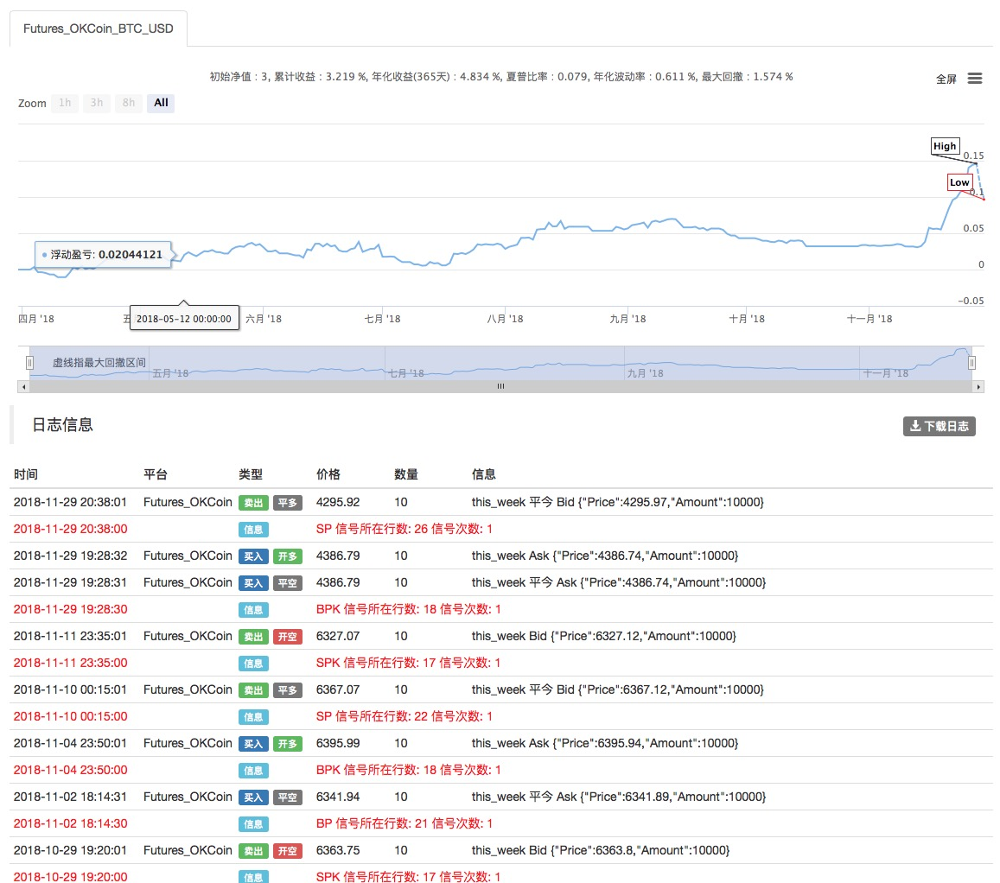
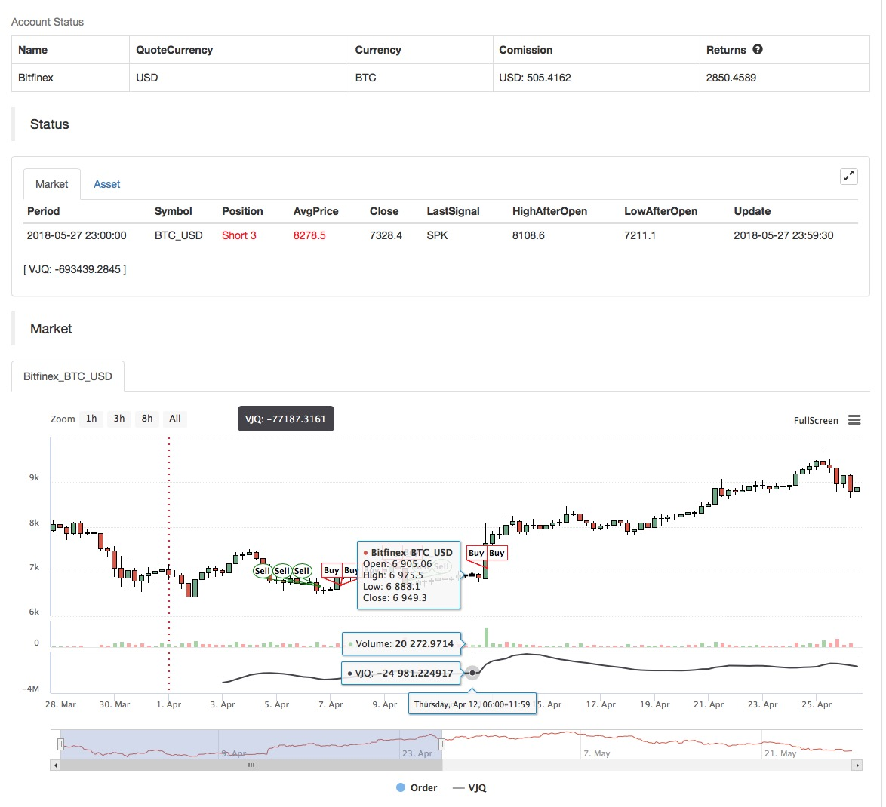
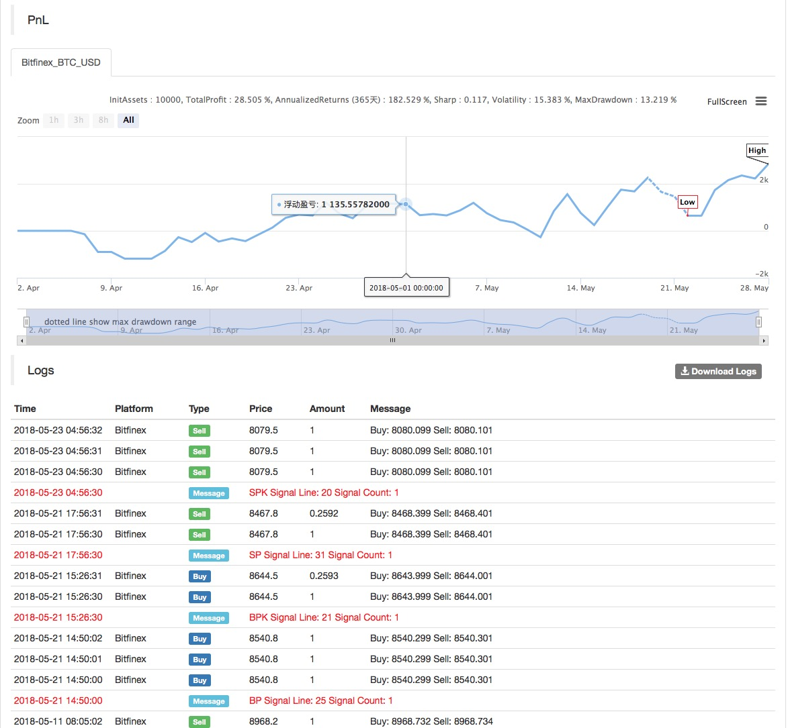

> Name

Break-High-and-Low-Volume-Index-Weighting-Strategy
> Author

Archimedes' bathtub
> Strategy Description

[trans]
- Strategy name: High and low breakout volume index weighted strategy
- Data period: multi-period
- You can choose OKEX futures for backtesting
- Contract: this_week current week contract
- Official website: www.quantinfo.com


- Main picture:
  None
- Sub-picture
  VJQ, calculation formula: VJQ:EMA(V*(C-REF(C,NC)),N);//Define the volume-weighted index as VJQ
|| 

- Data cycle: multiple cycles
- Backtest can choose OKEX futures
- Contract: this_week contract

    
   

- Main chart: 
  none

- Secondary chart:
  VJQ, calculation formula: VJQ: EMA (V* (C-REF (C, NC)), N)

[/trans]

> Strategy Arguments


|Argument|Default|Description|
|----|----|----|
|SLOSS|2|Percentage of stop loss|
|N|300|EMA index parameter|EMA index parameter|
|NC|50|closing price of how many cycles ago|
|MINAMOUNT|true|minimum order quantity at a time|minimum order quantity at a time|

> Source (MyLanguage)

``` pascal
(*backtest
start: 2018-04-01 00:00:00
end: 2018-05-28 00:00:00
period: 1h
exchanges: [{"eid":"Futures_OKCoin","currency":"BTC_USD"}]
args: [["N",100],["MINAMOUNT",10],["TradeAmount",10,126961],["ContractType","this_week",126961]]
*)

LOTS:=MAX(MINAMOUNT,INTPART(MONEYTOT/O * 0.8));
VJQ:EMA(V*(C-REF(C,NC)),N);
B:=VJQ>0;
S:=VJQ<0;
BUYPK:=BARPOS>N AND BKVOL=0 AND B AND H>=HHV(H,N);
SELLPK:=BARPOS>N AND SKVOL=0 AND S AND L<=LLV(L,N);
BUYP:=SKVOL>0 AND B;
SELLP:=BKVOL>0 AND S;

// 入场
// Enter
SELLPK,SPK(LOTS);
BUYPK,BPK(LOTS);

// 出场
// Leave
BUYP,BP(SKVOL);
SELLP,SP(BKVOL);

// 止损
// Stop loss
C>=SKPRICE*(1+SLOSS*0.01),BP(SKVOL);
C<=BKPRICE*(1-SLOSS*0.01),SP(BKVOL);
AUTOFILTER;
```

> Detail

https://www.fmz.com/strategy/128125

> Last Modified

2018-12-15 15:42:32
