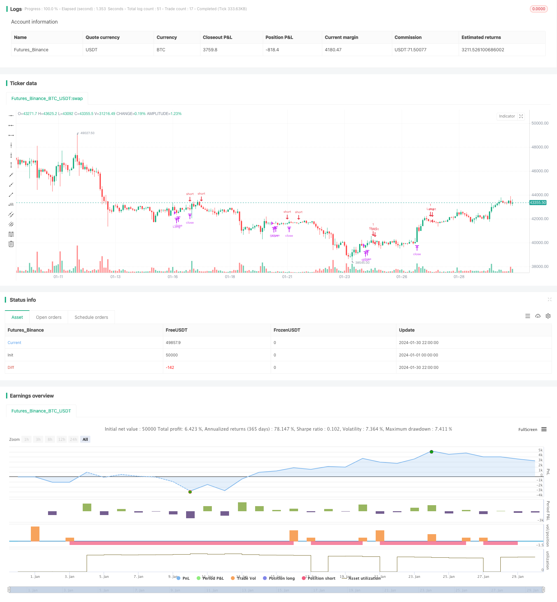

> Name

Breakback-Storm-Strategy-in-Hidden-Opportunities
> Author

ChaoZhang

> Strategy Description


[trans]

## Overview
The Breakback Storm Strategy (Breakback Storm Strategy) specifically takes advantage of the opportunity for entry after the price breaks through and pulls back, and captures the surge opportunities hidden in the pullback market in the short term. It combines trend judgment and reversal signals, entering long when the price retreats to the previous support position after breaking through a new high; entering short when the price rebounds to the previous pressure position after breaking through a new low. The strategy avoids most false breakthroughs through strict breakthrough filtering, thereby ensuring the quality of entry.
## Strategy Principle
This strategy is mainly based on two trigger signals: a recent new high breakthrough on the long-term and a pullback pattern on the short-term. Specifically, the strategy first requires the price to break through the highest point of the 80-cycle period, and judge from the longer term that it is currently in an upward trend. Secondly, the price is required to break through the highest point of the next day to form a short-term upward breakthrough. When the price retreats after the close on the second day of the breakthrough and falls back to the lowest point of the previous day, it is a long signal.
The principle of short selling signals is symmetrical and requires a recent breakthrough of new lows coupled with a retreat from highs. First, it is judged that the long-term is in a downward trend, and then there is a downward breakthrough in the short-term. When the price rebounds to the highest point of the previous day, a short signal is formed.
Such a combination design can effectively filter out false breakthrough opportunities and ensure that the breakthrough direction is correct. The entry point takes advantage of the short-term pullback opportunity and enters near the early low (or high) of the reversal, avoiding the mid-term reversal and obtaining the main part of the subsequent reversal market.
## Advantage Analysis
This strategy combines long-short two-way trading and breakout concepts, and has the following significant advantages:
1. Break through the filter to ensure the correctness of the trading direction
2. Pull back the entry point to ensure risk-reward ratio
3. Exit regularly to balance profit and risk control
Specifically, the 80-period long-term filter avoids most of the breakthrough illusions in the short-term market. Breaking through the next day's high (or low) is a reliable way to capture the short-term trend. Such high-quality entry signals ensure the correctness of the trading direction.
The entry point is set near the reversal point of the previous day, which is enough to give a certain space for the stop loss range, and can also capture the main part of the mid-term reversal market. This ensures stable profitability of the strategy.
Finally, the time exit mechanism also comprehensively considers profit factors and risk control, and reduces the interference of traders' subjective emotions on strategy implementation by defining profit and loss results in advance.
## Risks and Solutions
However, this strategy also has certain risks:
1. Entering the time node concentration, it is easy to VALID each other
2. Frequent long-short conversions increase transaction costs
3. Reversal volatility may not be enough to make profits
The first risk mainly comes from the setting of entry timing. When there are two waves of rising and falling prices in the market at the same time, it is easy to create an entry timing conflict. This can result in no chance of getting into either side.
You can avoid excessive density of signals on both sides by adjusting the filtering exiting parameters and setting the minimum breakthrough amplitude.
The second risk is related to frequent reversals. When the market fluctuates multiple times, buying and selling conversions may be too frequent. This increases transaction costs and actual losses.
You can reduce unnecessary buying and selling switching by adjusting the position parameters and stop loss range.
Finally, the reversal fluctuation after the breakthrough may not give enough room for profit. This usually occurs during market consolidation mehr. By combining longer-term online trend judgment, you can avoid such consolidation opportunities and ensure transaction quality.

## Strategy optimization
Based on the above analysis, this strategy can also be optimized from the following aspects:
1. Add a profit-taking mechanism
2. Combined with volatility indicators
3. Watch for seasonal opportunities
First, you can add additional moving take-profit or break-through new high (or new low) take-profit methods. This locks in most of the profits and avoids losses after a reversal.
In addition, volatility indicators such as ATR and RVI can also be combined to determine the market shock pattern. This can filter out periods of insufficient trading opportunities and reduce unnecessary transactions.
Finally, you can also pay attention to cyclical trends such as seasonal changes. This type of long-term opportunity can provide greater trend space and avoid some side effects.
## Summary
In general, the "Invisible Storm Strategy on Breakout Pullback" strategy is designed to capture short-term trend reversal opportunities after a trend breakout. By combining long-term trend filters, short-term reversal signals, breakout verifications, and retracement entries, it provides a powerful framework for trading retracements within larger trends. When optimized with appropriate profit taking, volatility indicators, and seasonality filters, such a framework can produce stable profits under a variety of market conditions.
||

## Overview

The Breakback Storm strategy specializes in capturing pullback opportunities after price breakouts to seize hidden explosive moves within short-term reversals. It combines trend determinations and reversal signals to go long after upward breakouts when prices pull back to previous support levels, and go short after downward breakouts when prices bounce back to previous resistance levels. The strategy filters out most false breakouts through strict breakout validations, ensuring high quality entries.

## Strategy Logic  

The strategy is based on two main triggers: recent high/low breakouts on the long-term timeframe and pullback patterns on the short-term. Specifically, it first requires prices to break above the 80-period high to determine an upward trend from the higher timeframe. Secondly, it demands prices to break the previous day's high to confirm a short-term upward breakout. The long signal then triggers when prices close below the previous day's low after the breakout.

The short signal works symmetrically, requiring a recent low breakout plus a bounce back to the previous day's high. This combination ensures the quality of trend direction and timing of entry points, capturing most of the trend while avoiding middles. 

## Advantage Analysis

This strategy combines dual directional trading and breakout concepts with significant edges:

1. Breakout filter ensures directional accuracy
2. Pullback entry ensures risk-reward
3. Timed exit balances profit and risk

Specifically, the 80-period filter avoids most false breakouts on short-term noise. Breaking the previous day's extreme points reliably catches short-term trend evolutions. Such quality signals ensure directional accuracy of trades.

The pullback entry giving certain stop loss buffer then captures most of the trend middle part afterwards. This guarantees profitable stability of the strategy.

Finally, the timed exit mechanism also balances both profitability and risk control factors by predefining outcome scenarios, minimizing emotional interference.

## Risks and Solutions

However, some risks exist in this strategy:

1. Concentrated entry timing causes crowding
2. Frequent long/short switches increase costs
3. Insufficient reversal magnitude to profit

The first risk comes from the pullback entry setting. When concurrent uptrend and downtrend waves appear in the market, entry signals on both sides can crowd, preventing entries on either side. 

This can be avoided by adjusting the exit filters and setting minimum breakout ranges to space out signals.

The second risk relates to whipsaws from frequent reversals. Excessive long/short switches increase costs and actual losses. 

This can be reduced by tuning the holding period and stop loss parameters to minimize unnecessary exits.

Finally, the ensuing reversal momentum may also lack enough magnitude within consolidation ranges at times. Additional long-term trend metrics can help avoid low quality setups.

## Optimization Directions  

Based on the analysis, further optimizations include:

1. Adding profit taking mechanisms  
2. Incorporating volatility metrics
3. Considering seasonal opportunities

Moving profit stops or break-even stops can first lock in profits and avoid retracements.

Volatility indicators like ATR and RVI can also gauge oscillation regimes to avoid low-opportunity periods.

Finally, cyclic trends around seasonal shifts also provide larger trend spaces to minimize side effects.

## Conclusion

Overall, the Breakback Storm strategy aims to capture short-term trend reversal opportunities after trend breakouts. By combining long-term trend filters, short-term reversal signals, breakout validations and pullback entries, it provides a robust framework to trade pullbacks within larger trend moves. When optimized with appropriate profit taking, volatility metrics and seasonal filters, such framework can generate stable profits across various market conditions.

[/trans]

> Strategy Arguments


|Argument|Default|Description|
|----|----|----|
|v_input_1|40|Max Days to Hold|


> Source (PineScript)

``` pinescript
/*backtest
start: 2024-01-01 00:00:00
end: 2024-01-31 00:00:00
period: 2h
basePeriod: 15m
exchanges: [{"eid":"Futures_Binance","currency":"BTC_USDT"}]
*/

//@version=3
strategy("Smash Day Pattern (Type B)", overlay=true, default_qty_type = strategy.fixed, default_qty_value = 1, initial_capital = 10000)
in1 = input(40, "Max Days to Hold") - 1

isLong = strategy.position_size > 0
isShort = strategy.position_size < 0

longTrigger = close[1]<low[2]
shortTrigger = close[1]>high[2]

longFilter = close[1] > close[80]
shortFilter = close[1] < close[80]

longEntry = (not isLong) and longTrigger and longFilter
shortEntry = (not isShort) and shortTrigger and shortFilter

longStop = valuewhen(longEntry, low[1], 0)
longPrice = valuewhen(longEntry, high[1], 0)
shortStop = valuewhen(shortEntry, high[1],0)
shortPrice = valuewhen(shortEntry, low[1], 0)

strategy.entry(id = "Long", long = true, stop = longPrice+.001, when = longEntry)
strategy.exit(id = "Stop Long", from_entry = "Long", stop = longStop, when = isLong)
strategy.close("Long", barssince(longEntry==true)>=in1)

strategy.entry(id = "Short", long = false, stop = shortPrice-.001, when = shortEntry)
strategy.exit(id = "Stop Short", from_entry = "Short", stop = shortStop, when = isShort)
strategy.close("Short", barssince(shortEntry==true)>=in1)
```

> Detail

https://www.fmz.com/strategy/440678

> Last Modified

2024-02-01 10:25:35
