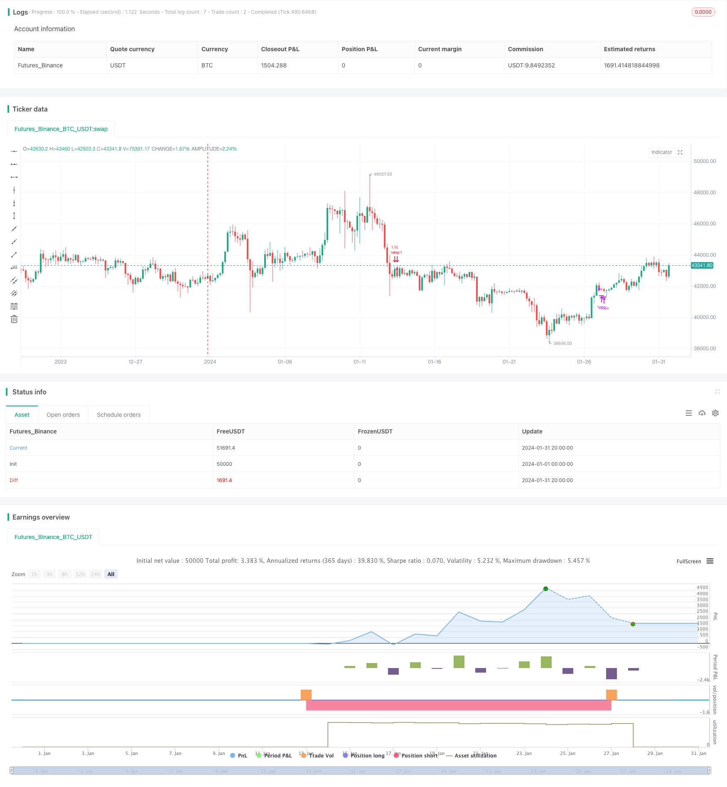

> Name

Breakout-Bollinger-Bands-Oscillation-Trading-Strategy Based on Breakout Bollinger Bands Oscillation Trading Strategy
> Author

ChaoZhang

> Strategy Description


[trans]

## Overview
The Bollinger Bands Breakout Swing Trading Strategy is a trading strategy used when the market is in a state of shock. This strategy uses the Bollinger Band indicator to determine the market's volatility and sends a trading signal when the price touches the Bollinger Band's upper and lower rails. Unlike traditional trend following strategies, this strategy is more suitable for sideways market environments.
## Strategy Principle
This strategy is mainly implemented based on the Bollinger Bands indicator. Bollinger Bands consists of the middle track, upper track and lower track. When the price is close to the upper or lower rail, it means that the market is overly bullish or bearish, and there is a high probability of a reversal.
Specifically, this strategy first uses the DMI indicator to determine whether the market is in a state of shock. When the difference between +DMI and -DMI is less than 20, the market is considered to be in sideways fluctuations. Under this condition, go long when the price crosses the lower band, and go short when the price breaks below the upper band. The stop loss point is placed near the opposite track.
## Strategic Advantages
Compared with the trend following strategy, this strategy is more suitable for sideways and volatile market environments and will not cause interest losses by chasing the trend. Compared with traditional shock trading strategies, this strategy uses the Bollinger Bands indicator to more accurately determine the overbought and oversold conditions of the market, thereby increasing the probability of entry.
## Strategy Risk
This strategy mainly relies on Bollinger Bands to judge market shocks and overbought and oversold conditions. When the Bollinger Bands diverge or shrink abnormally, it will lead to false signals. In addition, the stop loss point is close and the single stop loss may be larger. It is recommended to use capital management to optimize stop loss strategies.
## Strategy optimization direction
You can consider combining other indicators to filter entry signals, such as RSI and other oscillators, to improve entry accuracy. In addition, it is also important to optimize the stop loss strategy to avoid large stop losses in a single transaction. You can also choose trading varieties that are more suitable for this strategy, such as low market capitalization coins.
## Summarize
This strategy is generally suitable for volatile markets and can be used when trend strategies fail. However, there is still room for optimization in its reliance on indicators to judge market conditions. We can further improve this strategy through multi-index combination, fund management and other methods to make its effect more stable and excellent.
||

## Overview

The Breakout Bollinger Bands Oscillation Trading Strategy is a trading strategy for when the market is in an oscillating state. This strategy uses the Bollinger Bands indicator to judge the oscillating condition of the market and sends out trading signals when the price touches the upper or lower rails of the Bollinger Bands. Unlike traditional trend following strategies, this strategy is more suitable for range-bound sideways markets.

## Strategy Logic

This strategy is mainly implemented based on the Bollinger Bands indicator. Bollinger Bands consist of a middle rail, upper rail and lower rail. When the price approaches the upper or lower rail, it represents over-optimism or over-pessimism in the market, which means a relatively high probability of reversal.

Specifically, this strategy first uses the DMI indicator to determine if the market is in an oscillating state. When the difference between +DMI and -DMI is less than 20, the market is considered to be ranging sideways. Under this condition, go long when the price breaks above the lower rail, and go short when the price breaks below the upper rail. The stop loss point is set near the opposite rail.

## Advantages

Compared with trend following strategies, this strategy is more suitable for range-bound market environments and will not lose money chasing trends. Compared with traditional oscillation trading strategies, this strategy can more accurately judge the overbought and oversold situations in the market by using the Bollinger Bands indicator, thus improving the probability of entering the market.

## Risks

This strategy mainly relies on Bollinger Bands to determine market oscillation and overbought/oversold conditions. When Bollinger Bands diverge or contract abnormally, it may lead to wrong signals. In addition, the stop loss point is close, so a single stop loss could be relatively large. It is recommended to optimize the stop loss strategy with money management.

## Optimization

We can consider combining other indicators to filter entry signals, such as RSI and other oscillators, to improve entry accuracy. In addition, optimizing the stop loss strategy is also very important to avoid a single large stop loss. We can also choose trading varieties that are more suitable for this strategy, such as low market cap coins.

## Conclusion  

In general, this strategy is suitable for oscillating markets and can be used when trend strategies fail. But there is still room for improving its effectiveness by judging market states with indicators. We can further improve this strategy by methods like multi-indicator combos, money management, etc. to make it more stable and profitable.

[/trans]

> Strategy Arguments


|Argument|Default|Description|
|----|----|----|
|v_input_1|true|From Month|
|v_input_2|true|From Day|
|v_input_3|2021|From Year|
|v_input_4|12|Thru Month|
|v_input_5|31|Thru Day|
|v_input_6|2022|Thru Year|
|v_input_7|true|Show Date Range|
|v_input_8|20|lengthBB|
|v_input_9_close|0|Source: close|high|low|open|hl2|hlc3|hlcc4|ohlc4|
|v_input_10|2|StdDev|
|v_input_11|false|Offset|


> Source (PineScript)

``` pinescript
/*backtest
start: 2024-01-01 00:00:00
end: 2024-01-31 23:59:59
period: 4h
basePeriod: 15m
exchanges: [{"eid":"Futures_Binance","currency":"BTC_USDT"}]
*/

//@version=4
strategy(shorttitle='Sideways Strategy DMI + Bollinger Bands',title='Sideways Strategy DMI + Bollinger Bands (by Coinrule)', overlay=true, initial_capital = 100, process_orders_on_close=true, default_qty_type = strategy.percent_of_equity, default_qty_value = 100, commission_type=strategy.commission.percent, commission_value=0.1)

// Works on ETHUSD 3h, 1h, 2h, 4h

//Backtest dates
fromMonth = input(defval = 1,    title = "From Month",      type = input.integer, minval = 1, maxval = 12)
fromDay   = input(defval = 1,    title = "From Day",        type = input.integer, minval = 1, maxval = 31)
fromYear  = input(defval = 2021, title = "From Year",       type = input.integer, minval = 1970)
thruMonth = input(defval = 12,    title = "Thru Month",      type = input.integer, minval = 1, maxval = 12)
thruDay   = input(defval = 31,    title = "Thru Day",        type = input.integer, minval = 1, maxval = 31)
thruYear  = input(defval = 2022, title = "Thru Year",       type = input.integer, minval = 1970)

showDate  = input(defval = true, title = "Show Date Range", type = input.bool)

start     = timestamp(fromYear, fromMonth, fromDay, 00, 00)        // backtest start window
finish    = timestamp(thruYear, thruMonth, thruDay, 23, 59)        // backtest finish window
window()  => true

[pos_dm, neg_dm, adx] = dmi(14, 14)


lengthBB = input(20, minval=1)
src = input(close, title="Source")
mult = input(2.0, minval=0.001, maxval=50, title="StdDev")
basis = sma(src, lengthBB)
dev = mult * stdev(src, lengthBB)
upper = basis + dev
lower = basis - dev
offset = input(0, "Offset", type = input.integer, minval = -500, maxval = 500)

sideways = (abs(pos_dm - neg_dm) < 20)


//Stop_loss= ((input (3))/100)
//Take_profit= ((input (2))/100)

//longStopPrice  = strategy.position_avg_price * (1 - Stop_loss)
//longTakeProfit = strategy.position_avg_price * (1 + Take_profit)

//closeLong = close < longStopPrice or close > longTakeProfit or StopRSI


//Entry 
strategy.entry(id="long", long = true, when = sideways and (crossover(close, lower)) and window())


//Exit
strategy.close("long", when = (crossunder(close, upper)))

```

> Detail

https://www.fmz.com/strategy/442375

> Last Modified

2024-02-21 14:39:14
