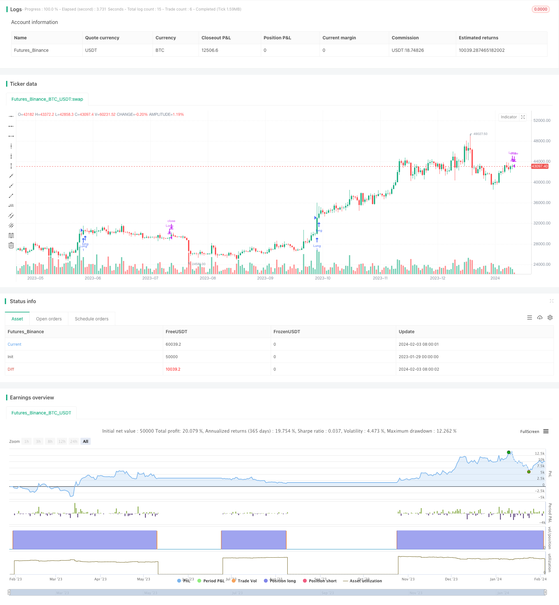

> Name

Breakout-Reversal-Strategy-with-Stop-Loss
> Author

ChaoZhang

> Strategy Description


[trans]
## Overview
This strategy is a long- and short-term quantitative trading strategy based on breakthrough theory. It determines whether a breakthrough has occurred by calculating the highest closing price in the last 100 trading days. If the closing price of the most recent day exceeds the highest closing price of the previous 100 days, a buy signal is issued. After entering a long position, the position will be forced to be stopped and closed after 25 trading days.
## Strategy Principle
The core logic of this strategy is based on the "breakout" theory in technical analysis. Breakthrough theory believes that when the price exceeds the highest point or lowest point in the previous period, it represents a turning point in the market and may enter a new upward or downward trend.
Specifically, this strategy calculates the highest closing price of the past 100 bars by calling the Pine Script built-in function `ta.highest()`. Then compare whether the closing price of the current K-line is higher than the highest closing price. If the closing price exceeds the 100-day highest closing price and breaks upward, a buy signal will be generated.
Once you enter a long position, the strategy will set a stop-loss condition for closing the position. By calling the `ta.barssince()` function, the number of bars after entering the long position is counted. When the number of bars exceeds 25, the position will be forced to stop loss and close the position.
The market entry logic of this strategy can be summarized as:
1. Calculate the highest closing price in the last 100 trading days
2. Compare whether the current K-line closing price is higher than the highest closing price
3. If it is higher, a buy signal will be generated and you will enter the long direction.
4. After the position enters 25 trading days, the position is forced to stop loss and close.
## Advantage Analysis
The biggest advantage of this strategy is to capture the turning point of the price trend and have a high success rate of trading with the trend. In addition, the setting of stop loss logic can also effectively control single losses.
The specific advantages can be summarized as:
**1. Trading with the trend has a higher success rate**
Breakout theory holds that when price exceeds a key price area, it represents the entry into a new trend. This strategy is designed based on this theory, so it has a higher probability of catching the price reversal point and realizing trend trading.
**2. Risks are controllable and there is a stop loss mechanism**
The strategy sets a stop-loss exit mechanism after 25 trading days, which can control a single loss within a certain range, avoid large losses, and make the overall risk controllable.
**3. Suitable for medium and long-term positions**
The default position holding time of the strategy is 25 trading days, which is about 1 month. This is a more appropriate holding time range for medium and long-term strategies. It will not cause whipsaw if it is too short-term, nor will it increase risks if the position is held for too long.
**4. Few parameters and easy to optimize**
The main parameters of this strategy are only the breakthrough window period and the holding time. The number of parameters is small, it is easy to test and optimize to find the optimal parameters, and the cost of real-time application is low.
**5. Can switch between multiple varieties**
The strategy does not use unique indicators of specific varieties. Its trading logic is applicable to multiple varieties such as stock indexes, foreign exchange, commodities, and cryptocurrencies. It can be switched between different varieties according to market conditions to increase the adaptability of the strategy.
## Risk Analysis
Although this strategy has the above advantages, it will also face certain risks in practical application, mainly reflected in:
**1. There is a risk of being trapped**
The strategy does not set a trailing stop or trailing stop mechanism. If the entering trend has not formed, or the breakthrough is actually just a false breakthrough, it is easy to be trapped to the stop loss point. This is the biggest risk point of this strategy.
**2. Parameters may need to be optimized**
The default parameters may not be the optimal parameters. During the actual trading process, it may be necessary to find parameter configurations suitable for specific varieties and market environments through optimization methods, which will increase the workload of strategy adjustment and tracking.
**3. The effect is closely related to the market**
This strategy relies too much on trends, performs poorly in consolidation markets, and has low adaptability to market environments with different patterns. If you encounter a volatile market, you will be trapped frequently or stop losses will be triggered, and your profits and losses may be unstable.
## Optimization direction
In order to make this strategy achieve more stable performance in real trading, it can be optimized and improved in the following aspects:
**1. Add trailing stop loss mechanism**
Add a trailing stop loss logic, and set a moving stop loss point for tracking based on the paper profit of the position, thereby limiting the maximum loss of each transaction to a certain range. This can significantly reduce individual risks.
**2. Adjust parameters according to market conditions**
You can set a range or value list for the two major parameters of the strategy (breakout window and holding time), and dynamically set the parameter values ​​based on the relative strength of the market (such as through calculation and use of the ATR indicator) to further optimize the parameters.
**3. Combined with trend judgment rules**
Minimize the risk of being trapped in unclear trends or false breakthroughs. It can be combined with the results of prior trend analysis (such as visual judgment or quantitative analysis), and then participate in transactions when the analysis determines that there is a clearer trend.
**4. Testing of different varieties and market environments**
Test optimized strategy parameters and rules under a variety of varieties (such as stock indices, commodities, foreign exchange and cryptocurrencies, etc.) and various trading ranges (such as daily, 60-minute, etc.) to adapt to a wider market environment and increase stability.
## Summarize
This breakthrough stop-loss reversal strategy is simple to use and has strong ability to judge and grasp the trend. It can effectively configure long and short positions and continue to make profits. We conducted code analysis on it to find out the strategic advantages and risk points, and gave suggestions to further improve the stability and practicality of the strategy. After optimization and improvement, I believe this strategy can become an excellent basic model in quantitative investment.
||

## Overview

This is a long/short quantitative trading strategy based on breakout theory. It calculates the highest close price over the past 100 trading days and determines if a breakout happens based on if the latest closing price exceeds that level. If a breakout is detected, a long signal is triggered. After entering long, the position will be closed by a stop loss after 25 bars.

## Strategy Logic

The core logic of this strategy leverages the "breakout" theory in technical analysis. The breakout theory believes that when price breaks through the recent highest or lowest level over a period of time, it signals a reversal and the market may start a new uptrend or downtrend. 

Specifically, this strategy uses the Pine Script built-in function `ta.highest()` to calculate the highest close over the past 100 bars. It then compares if the current bar's closing price is higher than that level. If the closing price breaks through and exceeds the 100-day highest closing price, a long entry signal is triggered.

Once entering a long position, the strategy sets a stop loss condition to close the position. By calling `ta.barssince()` to count the number of bars elapsed since entering long, it will force to close the position after 25 bars. 

The entry logic can be summarized as:

1. Calculate the highest close of recent 100 trading days
2. Compare if current bar's closing price exceeds that highest close 
3. If exceeds, trigger long entry signal
4. Close long position by stop loss after 25 bars

## Advantage Analysis 

The biggest advantage of this strategy is to capture price reversal points with relatively high success rate of trend-following trades. Also, the stop loss logic can effectively control single trade loss amount.

The concrete advantages are:

**1. Trend-following, higher success rate**

The breakout theory believes after price exceeds a key level, it may start a new trend. This strategy is designed based on this logic, thus with relatively high probability to capture price reversal points and benefit from trend-following.

**2. Controllable risk, with stop loss**

The strategy sets a forced stop loss exit after 25 bars to maximum single trade loss, avoiding huge loss. So the overall risk is controllable. 

**3. Suitable for mid-to-long-term holding**  

The default holding period is 25 bars, about 1 month. This frequency is suitable for mid-to-long-term strategies, not too short for whipsaws, and not too long to increase risk.

**4. Few parameters, easy to optimize**

There are mainly 2 tunable parameters. With few parameters it's easy to test and find optimal parameters for actual trading.

**5. Transferable across different products** 

This strategy does not reply on peculiar indicators of certain products. Its logic applies to stocks, forex, commodities, cryptocurrencies etc. So it's flexible to switch between products.

## Risk Analysis

While this strategy has some edges, there are also some risks when deploying it in actual trading, mainly:

**1. Risk of holding losing positions**

The strategy does not have trailing stop loss to follow profitable positions. If the price trend does not proceed as expected, or breakout turns out to be false breakout, then forced exit at pre-set stop loss point may lead to big loss. This is the biggest risk.

**2. Parameter tuning may be needed** 

Default parameters may not be optimal. They need to be optimized during live trading to find the best fit for specific product and market regimes. This adds extra work.

**3. Performance correlation with markets**

The strategy relies too much on persistent price trends. It does not work well during range-bound regimes. If encountered whipsaw markets, forced exit will frequently occur leading to unstable gains/losses.  

## Optimization 

To make this strategy more robust and profitable for actual deployment, some enhancements can be conducted from the following aspects:

**1. Add trailing stop loss mechanism** 

Add trailing stop loss logic to follow profitable positions, by dynamically updating stop loss point based on floating profits. This can limit max loss of single trades.

**2. Adaptive parameters based on markets**

Make parameters like breakout period and holding period adaptive based on market strength, quantified using metrics like ATR. This can dynamically tune parameters.

**3. Combine trend filters **

Better filtering of unclear trends when applying strategy, through trend analysis beforehand, either discretionary or quantitatively. Only take trades when seeing a clear trend.  

**4. Test on different products and intervals** 

Testing the optimized parameters and rules on different products (e.g. indexes, commodities, forex, crypto) and intervals (e.g. daily, 60m bars) will make this strategy more robust and widely applicable.

## Conclusion

This breakout reversal strategy with stop loss is easy to implement with clear rules on trend identification and position management. We analyze its strength and risks, provide suggestions to enhance its profitability and applicability. With further optimization, it can become a solid quantitative trading strategy.

[/trans]

> Strategy Arguments


|Argument|Default|Description|
|----|----|----|
|v_input_int_1|100|Breakout Period|
|v_input_int_2|2022|Start Year|
|v_input_int_3|true|Start Month|
|v_input_int_4|true|Start Day|
|v_input_int_5|2023|End Year|
|v_input_int_6|12|End Month|
|v_input_int_7|31|End Day|


> Source (PineScript)

``` pinescript
/*backtest
start: 2023-01-29 00:00:00
end: 2024-02-04 00:00:00
period: 1d
basePeriod: 1h
exchanges: [{"eid":"Futures_Binance","currency":"BTC_USDT"}]
*/

// This Pine Script™ code is subject to the terms of the Mozilla Public License 2.0 at https://mozilla.org/MPL/2.0/
// © All_Verklempt

//@version=5
strategy("Breakout Strategy", overlay=true)

// Input variable for breakout period
breakoutPeriod = input.int(100, title="Breakout Period", minval=1)

// Calculate the highest close of the past breakout period
highestClose = ta.highest(close, breakoutPeriod)

// Input variables for start and end dates
startYear = input.int(2022, title="Start Year", minval=1900)
startMonth = input.int(1, title="Start Month", minval=1, maxval=12)
startDay = input.int(1, title="Start Day", minval=1, maxval=31)

endYear = input.int(2023, title="End Year", minval=1900)
endMonth = input.int(12, title="End Month", minval=1, maxval=12)
endDay = input.int(31, title="End Day", minval=1, maxval=31)

// Convert start and end dates to timestamp
startDate = timestamp(startYear, startMonth, startDay, 00, 00)
endDate = timestamp(endYear, endMonth, endDay, 23, 59)

// Entry condition: Breakout and higher close within the specified date range
enterLong = close > highestClose[1] and close > close[1]

// Exit condition: Close the long position after twenty-five bars
exitLong = ta.barssince(enterLong) >= 25

// Strategy logic
if (enterLong)
    strategy.entry("Long", strategy.long)

if (exitLong)
    strategy.close("Long")

```

> Detail

https://www.fmz.com/strategy/441092

> Last Modified

2024-02-05 14:56:16
