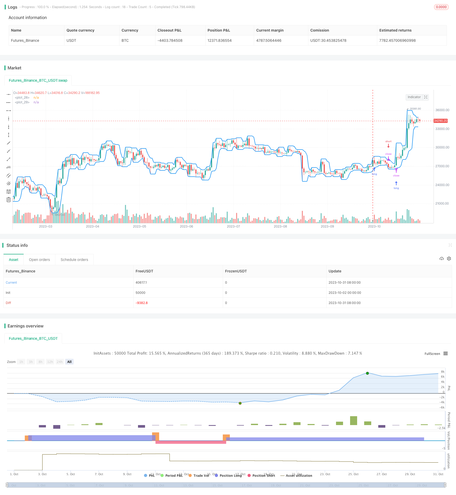

> Name

Breakout-Trading-Strategy
> Author

ChaoZhang

> Strategy Description


[trans]

## Overview
This strategy is based on the breakout theory. By comparing the moving average of the highest price and the lowest price, it determines whether the trend has reversed, so as to discover potential breakthrough points and trade when the breakthrough point occurs. The strategy is simple and direct, suitable for tracking targets with drastic market changes.
## Strategy Principle
This strategy first calculates the moving average of the highest price and lowest price within a certain period based on user settings. The highest price moving average represents the upper track, and the lowest price moving average represents the lower track. When the price breaks through the upper rail, it indicates that the price is on an upward trend, and this strategy will open a long position; when the price falls below the lower rail, it indicates that the price is on a downward trend, and this strategy will open a short position. Users can set only long or short positions.
The strategy also offers optional Stop Loss and Take Profit settings. When going long, the stop loss point is the upper track; when going short, the stop loss point is the lower track. This can reduce losses. Users can also choose to use the breakthrough point as the stop loss point, that is, the long stop loss point is the lower track and the short stop loss point is the upper track, which can lead to greater profit potential.
## Strategic Advantages
This strategy has the following advantages:
1. The strategic ideas are simple and direct, easy to understand and implement.
2. Can quickly capture the turning point of the price trend and adjust positions in a timely manner.
3. Provides optional stop-loss and stop-profit methods, which can be set according to personal risk preferences.
4. The trading signals are clearly generated and there will be no frequent false signals.
5. There are fewer configurable parameters and it is easy to use.
6. It can be flexibly configured to only do long or only short.
## Strategy Risk
There are also some risks with this strategy:
1. The breakthrough signal may be a false breakthrough and cannot be sustained.
2. Improper setting of the breakout cycle may miss the longer-term trend.
3. Failure to consider trading volume when making breakthroughs may lead to chasing highs and selling lows.
4. There is a certain lag and you may miss the better part of the market.
5. When the market fluctuates violently, there is a risk that the stop loss point will be breached.
6. Trading based solely on breakthrough points will result in uncertainty in returns.
## Strategy optimization
This strategy can be optimized from the following aspects:
1. Combine with trading volume indicators to avoid false breakthroughs. For example, the trading volume increases during a breakthrough, indicating that the breakthrough may be real and effective.
2. Optimize the period parameters of the moving average so that it can match the trend changes in different period periods. You can also try different types of moving averages.
3. You can set the callback amplitude and further confirm after the breakthrough point occurs to avoid false breakthroughs.
4. You can add exponential moving average tools such as Bollinger channel to the breakthrough basis to obtain more direction indicators.
5. It can be combined with other INDICATORs such as RSI and MACD to obtain more auxiliary trading signals and improve the accuracy of decision-making.
6. Optimize the stop-loss and take-profit strategies to better adapt to market fluctuations while controlling risks.
## Summarize
The overall idea of ​​this breakthrough trading strategy is clear and easy to understand. It judges the timing of entry and exit by tracking price breakthroughs above and below the rails. The space for strategy optimization is large, and the strategy effect can be enhanced by integrating more indicator information and parameter optimization. After becoming familiar with the basic ideas of this strategy, you can obtain better trading results by adjusting the parameters according to your own needs.
|| 

## Overview

This strategy is based on the breakout theory, comparing the moving averages of highest and lowest prices to determine if the trend is reversing, in order to find potential breakout points and trade when breakout happens. The strategy is simple and straightforward, suitable for tracking symbols with drastic price changes.

## Strategy Logic  

This strategy first calculates the moving averages of highest and lowest prices within a user-defined period. The highest price moving average represents the upper band, and the lowest price moving average represents the lower band. When price breaks through the upper band, it signals an uptrend, and the strategy will open long position. When price breaks through the lower band, it signals a downtrend, and the strategy will open short position. Users can configure to only long or only short.

The strategy also provides optional stop loss and take profit settings. When long, the stop loss is set at upper band; when short, stop loss is set at lower band. This reduces losses. Users can also choose to set stop loss at the breakout point, i.e. when long, stop loss is lower band, and when short, stop loss is upper band. This allows more profit potential.

## Advantages

The advantages of this strategy are:

1. The logic is simple and straightforward, easy to understand and implement.

2. It can quickly capture trend reversal points and adjust positions accordingly. 

3. It provides optional stop loss and take profit settings to fit personal risk preference.

4. The trading signals are clear, without too many false signals.

5. There are few configurable parameters, easy to use.

6. Flexibility to configure long only or short only.

## Risks

The risks of this strategy include:

1. Breakout signal may be false breakout and cannot sustain.  

2. Improper breakout period setting may miss longer term trends.

3. It does not consider volume on breakout, may cause chasing highs and killing lows.

4. There is certain lag, may miss good portion of the move.

5. In volatile market, stop loss may get hit.

6. Relies solely on breakout for trading, profit is uncertain.

## Enhancements

The strategy can be enhanced in the following aspects:

1. Incorporate volume indicator to avoid false breakouts. For example, enlarged volume on breakout signals validity.

2. Optimize moving average period parameter to match trend changes in different cycle. Also try different moving average types. 

3. Set a pullback threshold after breakout for further confirmation to avoid false breakout.

4. Add Bollinger Bands etc. on top of breakout basis for more directional guidance.

5. Incorporate other INDICATORs like RSI, MACD for additional trading signals and improve accuracy.

6. Optimize stop loss and take profit strategies to better cope with market fluctuation while controlling risk.

## Summary 

The breakout trading strategy has a clear logic of tracking price breakout of upper and lower bands for entry and exit. There is large room for enhancement, by incorporating more indicator information and optimizing parameters to strengthen the strategy. After getting familiar with the basic logic, traders can customize parameters based on their needs and obtain good trading results.

[/trans]

> Strategy Arguments


|Argument|Default|Description|
|----|----|----|
|v_input_1|true|Long|
|v_input_2|true|Short|
|v_input_3|100|Capital, %|
|v_input_4|4|Length|
|v_input_5|false|Body mode|
|v_input_6|false|Revers|
|v_input_7|true|Show Lines?|
|v_input_8|1900|From Year|
|v_input_9|2100|To Year|
|v_input_10|true|From Month|
|v_input_11|12|To Month|
|v_input_12|true|From day|
|v_input_13|31|To day|


> Source (PineScript)

``` pinescript
/*backtest
start: 2023-10-02 00:00:00
end: 2023-11-01 00:00:00
period: 1d
basePeriod: 1h
exchanges: [{"eid":"Futures_Binance","currency":"BTC_USDT"}]
*/

//Noro
//2018

//@version=3
strategy(title = "Noro's Brakeout Strategy v2.0", shorttitle = "Brakeout str 2.0", overlay = true, default_qty_type = strategy.percent_of_equity, default_qty_value = 100, pyramiding = 0)

//Settings
needlong = input(true, defval = true, title = "Long")
needshort = input(true, defval = true, title = "Short")
capital = input(100, defval = 100, minval = 1, maxval = 10000, title = "Capital, %")
len = input(4, defval = 4, minval = 1, maxval = 1000, title = "Length")
bod = input(false, defval = false, title = "Body mode")
rev = input(false, defval = false, title = "Revers")
showlines = input(true, defval = true, title = "Show Lines?")
fromyear = input(1900, defval = 1900, minval = 1900, maxval = 2100, title = "From Year")
toyear = input(2100, defval = 2100, minval = 1900, maxval = 2100, title = "To Year")
frommonth = input(01, defval = 01, minval = 01, maxval = 12, title = "From Month")
tomonth = input(12, defval = 12, minval = 01, maxval = 12, title = "To Month")
fromday = input(01, defval = 01, minval = 01, maxval = 31, title = "From day")
today = input(31, defval = 31, minval = 01, maxval = 31, title = "To day")

//Extremums
min = bod ? min(open, close) : low
max = bod ? max(open, close) : high
upex = highest(max, len) + syminfo.mintick * 10
dnex = lowest(min, len) - syminfo.mintick * 10
col = showlines ? blue : na
plot(upex, color = col, linewidth = 2)
plot(dnex, color = col, linewidth = 2)

//Trading
lot = 0.0
lot := strategy.position_size != strategy.position_size[1] ? strategy.equity / close * capital / 100 : lot[1]

if (not na(close[len])) and rev == false
    strategy.entry("Long", strategy.long, needlong == false ? 0 : lot, stop = upex)
    strategy.entry("Short", strategy.short, needshort == false ? 0 : lot, stop = dnex)
    
if (not na(close[len])) and rev == true
    strategy.entry("Long", strategy.long, needlong == false ? 0 : lot, limit = dnex)
    strategy.entry("Short", strategy.short, needshort == false ? 0 : lot, limit = upex)

if time > timestamp(toyear, tomonth, today, 23, 59)
    strategy.close_all()
```

> Detail

https://www.fmz.com/strategy/430883

> Last Modified

2023-11-02 16:40:26
