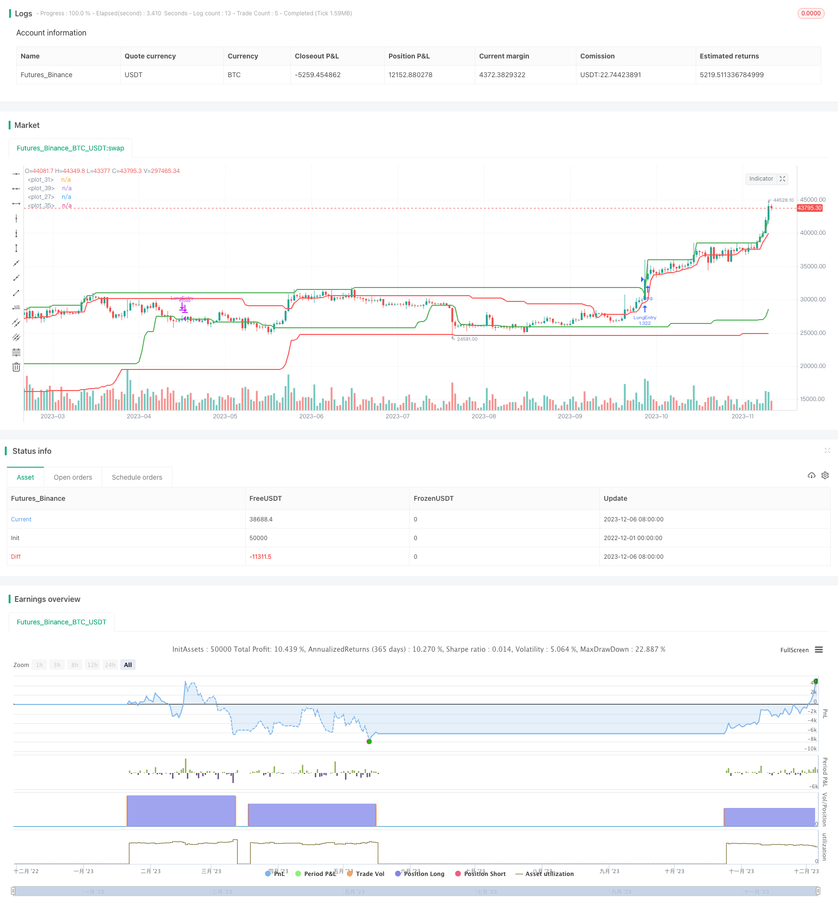

> Name

Breakout-Trend-Following-Strategy
> Author

ChaoZhang

> Strategy Description


[trans]

## Overview
This strategy tracks cryptocurrency price trends by setting highs and lows for price breakouts. Go long when the price breaks through the highest point, and go short when the price breaks through the lowest point to capture the trend.
## Strategy Principle
This strategy mainly uses the weighted smoothed moving average method to determine whether there is an obvious upward or downward trend in prices. Specifically, it will count the highest and lowest prices within a certain period. When the actual transaction price exceeds the highest statistical price, it is judged that an upward trend has occurred, and then a long position is entered; when the actual transaction price is lower than the lowest price, it is judged that a downward trend has occurred, and then a short position is entered.
The opening price for long and short positions is set through the input parameter "ENTRY", and the closing price is set through the "EXIT" parameter. The backtest period can also be set through parameters. In this way, you can find the best combo combination by adjusting parameters.
Specifically, the main logic of the strategy is:
1. Statistics of the highest and lowest prices within a certain period (can be set)
2. Determine whether the actual transaction price is higher than the highest price
   1. If it is higher, a long opportunity appears, and a long position is opened based on the price level set by the "ENTRY" parameter.
   2. If the actual transaction price is lower than the lowest price, a short-selling opportunity occurs, and a short position is opened based on the price level set by the "EXIT" parameter.
3. After opening a long position, the position will be closed when the price is lower than the price set by the "EXIT" parameter.
4. After a short position is opened, it will be closed when the price is higher than the price set by the "ENTRY" parameter.
Through this logic loop, the rising and falling trends of prices can be captured and trend tracking can be achieved.
## Strategic Advantages
The biggest advantage of this strategy is that through parameter adjustment, it can automatically capture the price trend without manual judgment of the trend direction. As long as the parameters are set appropriately, the price fluctuations of cryptocurrencies can be automatically tracked.
In addition, this strategy is very suitable for quantitative trading and can easily realize automated order placement. No manual operation is required, which reduces the risk of emotional trading and can greatly improve trading efficiency.
Finally, the strategy can also maximize returns through parameter adjustment. By testing different ENTRY and EXIT parameters, the optimal parameters can be found to maximize revenue.
## Strategy Risk
The biggest risk of this strategy is that improper parameter settings may lead to too frequent transactions, increased transaction fees and slippage losses. If the ENTRY setting is too low and the EXIT setting is too high, it is easy to generate false trading signals.
In addition, if the parameters are adjusted improperly, it may also result in the inability to capture the price trend in time and miss trading opportunities. This requires extensive backtesting to find the optimal parameters.
Finally, this strategy is too sensitive to short-term market noise and may generate false trading signals. This needs to be avoided by setting trading timeframe parameters appropriately.
## Strategy optimization direction
This strategy can continue to be optimized in the following directions:
1. Add stop loss logic. In this way, you can stop the loss and exit when the loss expands to a certain proportion, so as to avoid greater losses.
2. Add moving average and other technical indicator filters. Use MA, KDJ and other indicators to determine the general trend and avoid excessive trading caused by short-term noise.
3. Optimize parameter setting logic. The adaptive change mechanism of ENTRY and EXIT parameters can be set instead of static settings, so that the parameters can be adjusted according to the market environment.
4. Use machine learning to train optimal parameters. Through a large amount of historical data training, the optimal ENTRY and EXIT settings for the current market environment are obtained.
## Summarize
This strategy realizes automated trading by capturing price trends. Its biggest advantage is that it can reduce the impact of human emotions on trading, reduce risks, and improve efficiency. At the same time, the optimal profit point can be found through parameter adjustment.
The main risk of the strategy is improper parameter setting and being too sensitive to market noise. This needs to be improved through stop loss, indicator filtering, parameter adaptive optimization and other means.
Overall, this strategy is a simple and effective trend following strategy, suitable for quantitative and automatic trading. Through continuous optimization, the stability of the strategy can be further improved.
|| 

## Overview

This strategy tracks the price trend of cryptocurrencies by setting breakout high and low prices. It goes long when the price breaks above the highest price and goes short when the price breaks below the lowest price to capture the trend.

## Strategy Principle 

This strategy mainly uses the weighted moving average method to determine whether there is an obvious upward or downward trend. Specifically, it will record the highest and lowest prices over a certain period. When the actual trading price exceeds the recorded highest price, it is judged that an upward trend has occurred, and it will go long. When the actual trading price is lower than the recorded lowest price, it is judged that a downward trend has occurred, and it will go short.

The opening prices for long and short are set through the "ENTRY" input parameter, and the closing prices are set through the "EXIT" parameter. The backtest timeframe can also be set through parameters. This allows finding the best combo by adjusting parameters. 

Specifically, the main logic of the strategy is:

1. Record the highest and lowest prices over a certain period (adjustable)
2. Judge if the actual trading price is higher than the highest price
   1. If higher, there is a long opportunity, open long position based on the price level set by the "ENTRY" parameter  
   2. If the actual trading price is lower than the lowest price, there is a short opportunity, open short position based on the price level set by “EXIT” parameter
3. After opening long position, close it when price drops below the level set by “EXIT” parameter
4. After opening short position, close it when price rises above the level set by “ENTRY” parameter

Through this logic loop, it can capture upward and downward trends of the price and achieve trend following.

## Advantages

The biggest advantage of this strategy is that by adjusting parameters, it can automatically capture price trends without the need for manual judgment of trend direction. As long as the parameters are set appropriately, it can automatically track the price fluctuations of cryptocurrencies.

In addition, this strategy is very suitable for quantitative trading and can easily achieve automated order placement. Without manual operation, it reduces the risk of emotional trading and greatly improves trading efficiency.

Finally, this strategy can also maximize returns by adjusting parameters. By testing different ENTRY and EXIT parameters, the optimal parameters can be found to maximize returns.

## Risks

The biggest risk of this strategy is that improper parameter settings may lead to excessively frequent trading, increasing trading fees and slippage losses. If ENTRY is set too low and EXIT is set too high, false trading signals are easily generated.

In addition, improper parameter tuning may also lead to failure to capture price trends in time, missing trading opportunities. This requires a lot of backtesting to find the optimal parameters.

Finally, this strategy is too sensitive to short-term market noise, which may generate wrong trading signals. This needs to be avoided by appropriately setting the trading time cycle parameters.

## Optimization Directions

The following aspects can be further optimized for this strategy:

1. Add stop loss logic. This allows stopping loss when losses exceed a certain percentage to avoid greater losses.

2. Add technical indicators filters like moving average, KDJ to judge overall trend to avoid too much trading due to short-term noise.

3. Optimize parameter setting logic. The adaptive changing mechanism can be set for ENTRY and EXIT parameters rather than static setting so they can adjust based on market conditions.

4. Use machine learning to train optimal parameters. Obtain the optimal ENTRY and EXIT settings for the current market environment through massive historical data training.

## Conclusion

The biggest advantage of this strategy is that by capturing price trends it achieves automated trading, which can reduce the impact of human emotions on trading, lower risks, and improve efficiency. At the same time, optimal profit points can be found by adjusting parameters.

The main risks of the strategy are improper parameter settings and oversensitivity to market noise. This needs to be improved through stop loss, indicator filters, adaptive parameter optimization and more.

Overall, this is a simple and effective trend following strategy suitable for quantitative and automated trading. By continuous optimization, the stability of the strategy can be further improved.

[/trans]

> Strategy Arguments


|Argument|Default|Description|
|----|----|----|
|v_input_1|100|ENTRY H/L|
|v_input_2|50|EXIT H/L|
|v_input_3|2015|Backtest Start Year|
|v_input_4|true|Backtest Start Month|
|v_input_5|true|Backtest Start Day|
|v_input_6|2999|Backtest End Year|
|v_input_7|true|Backtest End Month|
|v_input_8|true|Backtest End Day|


> Source (PineScript)

``` pinescript
/*backtest
start: 2022-12-01 00:00:00
end: 2023-12-07 00:00:00
period: 1d
basePeriod: 1h
exchanges: [{"eid":"Futures_Binance","currency":"BTC_USDT"}]
*/

// This source code is subject to the terms of the Mozilla Public License 2.0 at https://mozilla.org/MPL/2.0/
// © JstMtlQC

//@version=4
strategy("Trend Following Breakout",calc_on_order_fills=true,calc_on_every_tick =false, overlay=true, initial_capital=2000,commission_value=.1,default_qty_type = strategy.percent_of_equity, default_qty_value = 100)


/////////////// INPUT ENTRY EXIT
entry= input(100, "ENTRY H/L")
exit= input(50, "EXIT H/L")

/////////////// Backtest Input
FromYear = input(2015, "Backtest Start Year")
FromMonth = input(1, "Backtest Start Month")
FromDay = input(1, "Backtest Start Day")
ToYear = input(2999, "Backtest End Year")
ToMonth = input(1, "Backtest End Month")
ToDay = input(1, "Backtest End Day")

/////////////// Backtest Setting
start     = timestamp(FromYear, FromMonth, FromDay, 00, 00)  
finish    = timestamp(ToYear, ToMonth, ToDay, 23, 59)       
window()  => time >= start and time <= finish ? true : false 

/////////////// BUY OPEN PLOT
highestpricelong = highest(high,entry)[1]
plot(highestpricelong, color=color.green, linewidth=2)

/////////////// BUY CLOSE PLOT
lowestpricelong = lowest(high,exit)[1]
plot(lowestpricelong, color=color.green, linewidth=2)

/////////////// SHORT OPEN PLOT
lowestpriceshort = lowest(low,entry)[1]
plot(lowestpriceshort, color=color.red, linewidth=2)

/////////////// SHORT CLOSE PLOT
highestpriceshort = highest(low,exit)[1]
plot(highestpriceshort, color=color.red, linewidth=2)

///////////////////////////////////////////////////////////////////////////////////////////
/////////////////////////////// CONDITION LONG SHORT //////////////////////////////////////
///////////////////////////////////////////////////////////////////////////////////////////

/////////////// SHORT 

entryshort= crossunder(close, lowestpriceshort)
exitshort= crossover(close,highestpriceshort)

/////////////// LONG 

exitlong= crossover(close, lowestpricelong)
entrylong= crossover(close,highestpricelong)

///////////////////////////////////////////////////////////////////////////////////////////
/////////////////////////////// LONG and SHORT ORDER //////////////////////////////////////
///////////////////////////////////////////////////////////////////////////////////////////

/////////////// LONG 

if (entrylong)
    strategy.entry("LongEntry", strategy.long, when = window())
if (exitlong or entryshort)
    strategy.close("LongEntry", when=window())

/////////////// SHORT 

if (entryshort)
    strategy.entry("short", strategy.short, when = window())
if (exitshort or entrylong)
    strategy.close("short", when=window())


```

> Detail

https://www.fmz.com/strategy/434719

> Last Modified

2023-12-08 17:16:34
