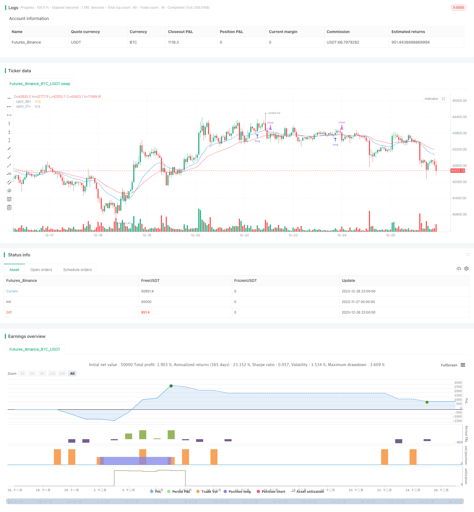

> Name

Breakthrough-Moving-Average-Trend-Tracking-Strategy
> Author

ChaoZhang

> Strategy Description


[trans]

## Overview
This strategy combines moving averages, amplitude indicators and parabolic steering indicators to realize the judgment of trends and confirmation of breakthrough points, and is a typical trend following strategy. When it is judged that there is an upward trend and the price breaks through the highest point, a long position will be established to realize trend tracking; when the trend is judged to be reversed, the position will be closed and the stop loss will be realized.
## Strategy Principle
This strategy uses double EMA to determine the price trend and SMA to assist in judgment. When the fast EMA is above the slow EMA and the fast SMA is above the slow SMA, it is considered to be in an uptrend.
Use the Parabolic SAR indicator to determine price reversal points. When the PSAR falls below the highest point of the price, it means that the price may reverse and fall, and the position should be closed with a stop loss at this time.
When it is judged to be an upward trend and PSAR crosses the highest price point, it means that the price continues to rise. At this time, go long to follow the trend.
## Advantage Analysis
- Use double EMA combined with SMA to determine the trend and filter out false breakthroughs.
- PSAR can effectively determine the reversal point and achieve quick stop loss.
- Ability to effectively identify trend turning points and establish positions in a timely manner for tracking.
- The rules are clear and easy to operate.
## Risk Analysis
- There is a possibility of errors in trend judgment.
- The strategy needs to optimize the trading parameters, otherwise the chasing risk may be large.
- There is a problem that transaction costs are not taken into account.
**Solution:**
- Optimize EMA and SMA parameters to improve judgment accuracy.  
- Optimize PSAR parameters for different varieties.
- Add transaction cost considerations.
## Optimization direction
- Add more indicators to judge trends, such as BOLL, MACD, etc.
- Training and optimization of variety parameters.  
- Consider adding a stop-loss strategy.
- Optimize the logic of position opening and stop loss.
## Summarize
Overall, this strategy is a more typical trend following strategy. The advantage is that the rules are relatively clear and simple and can identify trend turning points; the disadvantage is that it is sensitive to parameters and there is a certain chasing risk. Generally speaking, it is worthy of further optimization and real-time verification after adjustment. The main optimization directions lie in parameter optimization and the addition of stop-loss strategies.
||


## Overview

This strategy combines moving average, amplitude index and parabolic SAR indicator to judge the trend and confirm breakthrough points. It belongs to a typical trend following strategy. It will establish long position to track the trend when identifying an uptrend and price breakthrough. It will close position for stop loss when judging trend reversal.

## Principles  

The strategy uses double EMA to judge price trend and uses SMA as assistance. When fast EMA is above slow EMA and fast SMA is above slow SMA, it considers there is an uptrend.  

It uses parabolic SAR indicator to judge price reversal points. When PSAR goes below the highest price, it means price may reverse downwards. At this time it will close position for stop loss.

When judging an uptrend and PSAR goes above highest price, it means price keeps going up. At this time it will long to track the trend.

## Advantages

- Use double EMA with SMA to judge trend, which can filter false breakthrough.
- PSAR can effectively determine reversal points for quick stop loss.  
- Can effectively identify trend reversal points for timely establishing position to track.
- Simple and clear rules.

## Risks 

- Trend judgement may be wrong.
- The strategy needs parameter optimization for different products, otherwise chasing risk may be high.
- No consideration for trading cost.

**Solutions:**

- Optimize EMA and SMA parameters to improve judgement accuracy.
- Optimize PSAR parameters for different products.  
- Add in trading cost.

## Optimization

- Add more indicators like BOLL, MACD etc to judge trend.
- Train and optimize parameters for different products.
- Consider adding stop loss strategy.
- Optimize logics for opening position and stop loss.

## Summary  

The strategy belongs to a typical trend following strategy. The advantages are clear and simple rules and ability to identify trend reversal for timely position opening. The disadvantages are sensitivity to parameters and certain chasing risk. Overall it is worth further optimization and adjustment for live trading verification. The main optimization directions are parameter optimization, adding stop loss strategy etc.

[/trans]

> Strategy Arguments


|Argument|Default|Description|
|----|----|----|
|v_input_1|0.02|PSAR_start|
|v_input_2|0.02|PSAR_increment|
|v_input_3|0.2|PSAR_maximum|
|v_input_4|20|EMA_fast|
|v_input_5|40|EMA_slow|
|v_input_6|100|SMA_fast|
|v_input_7|200|SMA_slow|


> Source (PineScript)

``` pinescript
/*backtest
start: 2023-11-27 00:00:00
end: 2023-12-27 00:00:00
period: 1h
basePeriod: 15m
exchanges: [{"eid":"Futures_Binance","currency":"BTC_USDT"}]
*/

//@version=3
strategy("Buy Dip MA & PSAR", overlay=true)

PSAR_start = input(0.02)
PSAR_increment = input(0.02)
PSAR_maximum = input(0.2)

EMA_fast = input(20)
EMA_slow = input(40)
SMA_fast = input(100)
SMA_slow = input(200)

emafast = ema(close, EMA_fast)
emaslow = ema(close, EMA_slow)
smafast = sma(close, SMA_fast)
smaslow = sma(close, SMA_slow)

psar = sar(PSAR_start, PSAR_increment, PSAR_maximum)
uptrend = emafast > emaslow and smafast > smaslow
breakdown = not uptrend

if (psar >= high and uptrend)
    strategy.entry("Buy", strategy.long, stop=psar, comment="Buy")
else
    strategy.cancel("Buy")

if (psar <= low)
    strategy.exit("Close", "Buy", stop=psar, comment="Close")
else
    strategy.cancel("Close")

if (breakdown)
    strategy.close("Buy")


plot(emafast, color=blue)
plot(emaslow, color=red)
```

> Detail

https://www.fmz.com/strategy/436879

> Last Modified

2023-12-28 15:47:21
