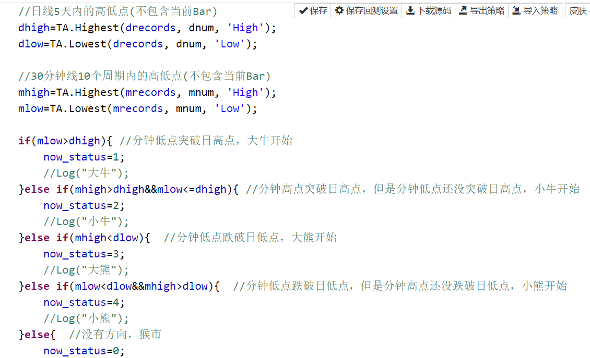
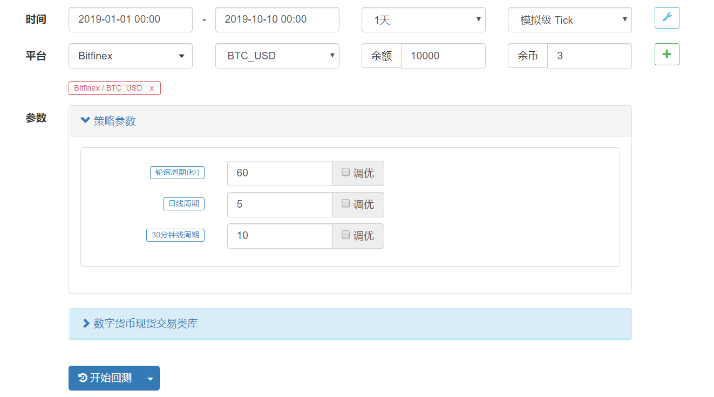
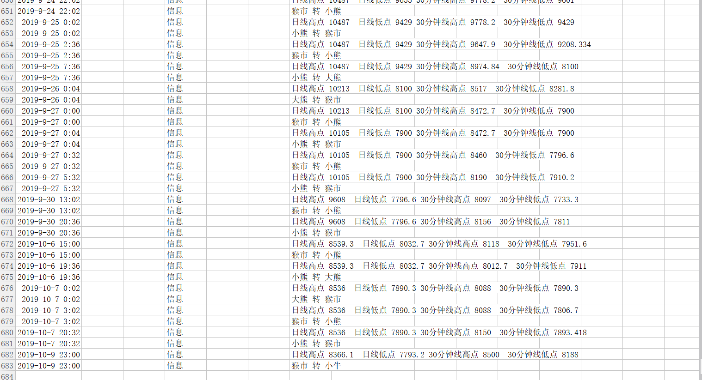
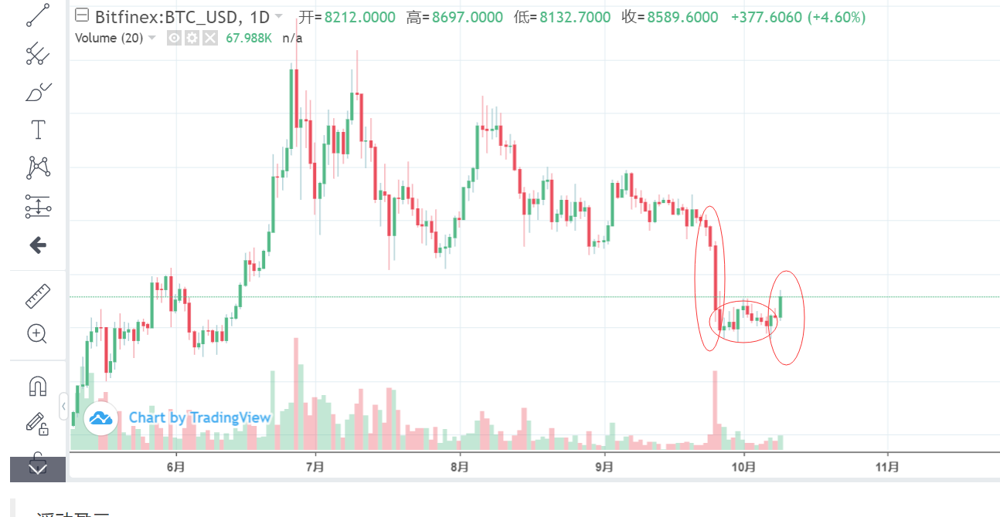

> Name

Bull, Bear, and Monkey Market Judgment V10_District Leader
> Author

District class quantification
> Strategy Description

We have found that the most important thing in quantitative investment is timing, which is to determine whether the current market is a bear market, a bull market, or a monkey market. In this article, the district class leader will discuss how to implement timing strategies.   
There are many ways to choose timing, such as moving average judgment, Bollinger Bands, trading volume and cycle high and low points.
Moving average judgment is to judge whether the current market is rising or falling through the inclination of the moving average. By judging whether it stands above the 5-day moving average, it is judged whether it is a bull market, and by judging whether it falls below the 120-day moving average, it is judged whether it has entered a bear market. Several factors combine to determine current market strength.   
Bollinger Bands is a good way to judge whether the market is rising or falling based on the inclination of the center line of Bollinger Bands. Selling high and buying low based on the highs and lows of the Bollinger Bands is a good practice in the monkey market. If the opening of Bollinger Bands increases, it is a precursor to market fluctuations.   
Trading volume is generally an auxiliary means, and generally there will be increased volume at the bottom and top. One benefit of digital currencies is that trading depth is easy to obtain. By analyzing the status of pending orders and combined with the trading volume, the current market heat can also be judged.   
The above strategies are somewhat difficult to implement and need to be fine-tuned slowly. Cycle high and low points are the key strategies discussed in this article, which have the advantages of simple implementation and direct effect. The idea of ​​cycle high and low points is very simple. It is to combine the short cycle high and low points and the long cycle high and low points to determine whether the current market is a bull market, a calf market, a bear market, a bear market, or a monkey market. With this timing judgment, we can cooperate with certain strategies when the market turns. For example, from calf to bull, you can increase your position. If the bull comes to the monkey market, you can close your position. From the monkey market to the bear market, you can initially establish a short position. If you enter Big Bear, go short.   
Let’s post part of the code first. The main ideas are in the comments, so people who are interested can naturally understand it. For long periods, choose the daily line, and 5 days is the period. For short periods, choose the 30-minute line, and 10 is the period, which is 5 hours. Parameters can be adjusted based on the volatility and position adjustment of relevant digital currencies.
 ](https://www.fmz.com)
 ](https://www.fmz.com)
Let’s post the execution results again. It can be seen that the little bear turned into a big bear from September 24 to September 25, the shock monkey market added a little bear from September 26 to October 7, and the calf signal appeared on October 9, all have correct prompts. It can be seen that the cycle high and low point strategy is simple but not simple.
 ](https://www.fmz.com)
 ](https://www.fmz.com)
Combining digital currency selection strategies and hedging strategies, there are more ways to play. If we rank the top 20 digital currencies in bull and bear status by market capitalization, and select two digital currency bears and bulls for hedging each time, we can basically achieve low-risk arbitrage, which will be a strategy that can be improved later.
Interested friends can also [find me on Bihu](https://m.bihu.com/signup?i=1ewtKO&c=4&s=4). Bihu is a place where you can earn digital currency by writing articles.
](https://www.fmz.com)
> Strategy Arguments


|Argument|Default|Description|
|----|----|----|
|Interval|60|Polling period (seconds)|
|dnum|5|Daily cycle|
|mnum|10|30 minute line period|

> Source (javascript)

``` javascript
/*backtest
start: 2019-01-01 00:00:00
end: 2019-10-10 00:00:00
period: 1d
exchanges: [{"eid":"Bitfinex","currency":"BTC_USD"}]
*/
//通过快慢周期的高低点判断当前处于什么市场
//注册币乎后https://m.bihu.com/signup?i=1ewtKO&s=4&c=4
//搜索 物联网区块链 可以联系到作者区班主
function main() {
    var dhigh;
    var dlow;
    var mhigh;
    var mlow;
    var status_name=["猴市","大牛","小牛","大熊","小熊"];  //定义并赋值
    var before_status=0;
    var now_status=0;
    while (true) {
        var drecords = exchange.GetRecords(PERIOD_D1);
        var mrecords = exchange.GetRecords(PERIOD_M30);
        //日线5天内的高低点(不包含当前Bar)
        dhigh=TA.Highest(drecords, dnum, 'High');
        dlow=TA.Lowest(drecords, dnum, 'Low');
       
        //30分钟线10个周期内的高低点(不包含当前Bar)
        mhigh=TA.Highest(mrecords, mnum, 'High');
        mlow=TA.Lowest(mrecords, mnum, 'Low');
        
        if(mlow>dhigh){ //分钟低点突破日高点，大牛开始
            now_status=1;
            //Log("大牛");
        }else if(mhigh>dhigh&&mlow<=dhigh){ //分钟高点突破日高点，但是分钟低点还没突破日高点，小牛开始
            now_status=2;
            //Log("小牛");
        }else if(mhigh<dlow){  //分钟低点跌破日低点，大熊开始
            now_status=3;
            //Log("大熊");
        }else if(mlow<dlow&&mhigh>dlow){  //分钟低点跌破日低点，但是分钟高点还没跌破日低点，小熊开始
            now_status=4;
            //Log("小熊");
        }else{  //没有方向，猴市
            now_status=0;
            //Log("猴市");
        }
        if(now_status!=before_status){
            Log("日线高点",dhigh," 日线低点",dlow,"30分钟线高点",mhigh," 30分钟线低点",mlow);
            Log(status_name[before_status],"转",status_name[now_status]);
            before_status=now_status;
        }
        Sleep(Interval*1000);
    }
}
```

> Detail

https://www.fmz.com/strategy/170014

> Last Modified

2019-11-15 15:48:27
