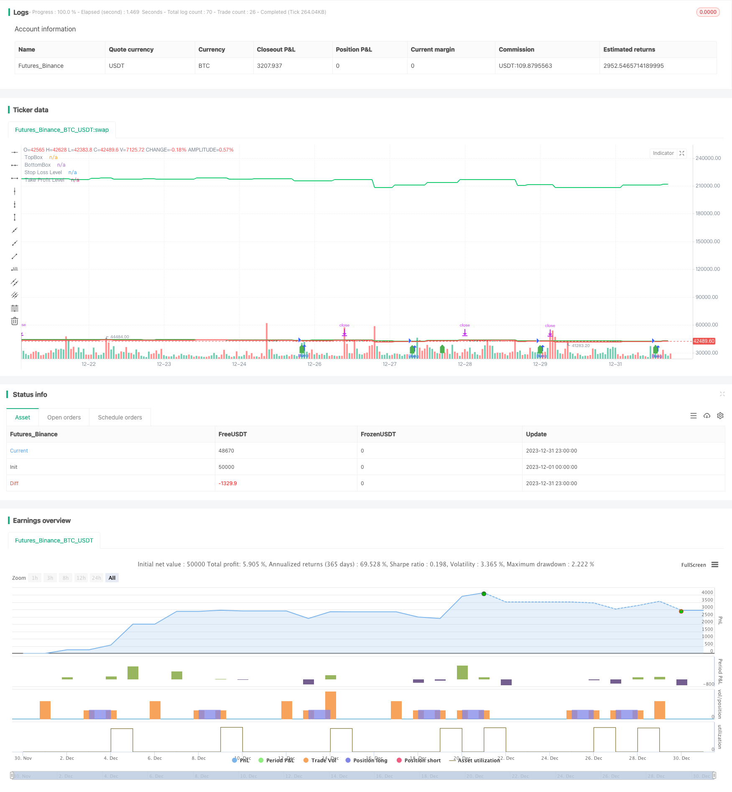

> Name

Bull-Market-Breakout-Darvas-Box-Buy-Strategy
> Author

ChaoZhang

> Strategy Description


 [trans]
## Overview
The bull market chasing box buying strategy is a modified version of the Darvas box strategy. This strategy only opens long positions during bull markets. The strategy first draws a box area based on the highest price. When the price breaks through the upper track of the box, the market enters long at the closing price.
## Strategy Principle
This strategy is improved based on Darvas box theory. Darvas box theory believes that when the price breaks through the upper edge of the box after moving sideways, it is a good time to go long. This strategy uses this theory to determine the timing of long entries.
Specifically, this strategy first calculates the lowest price in the last 5 days and draws the lower track of the box. Then calculate the highest price in the last 5 days and draw the upper track of the box. When the price closes above the upper track, it is judged that the market has entered a bull market and a long position is opened at the closing price.
After going long, the strategy will set the stop loss near the lower rail of the box, and set the take profit to 5 times the size of the stop loss.
## Advantage Analysis
This strategy has several advantages:
1. Using the box theory to judge the timing of chasing prices and going long can effectively filter out some noise.
2. Only go long at the clear signal point of breaking through the upper rail, avoiding many unnecessary random openings.
3. Set up stop loss and take profit logic, which can control risks well.
4. Only pursue long positions in bull markets to avoid the risks of long positions in volatile markets and bear markets.
## Risk Analysis
There are also some risks with this strategy:
1. The box theory is not perfect, and the price breaking through the upper track does not mean that it will continue to rise.
2. Failure to consider the risk of a correction after breaking through the upper rail of the box, and the loss may be stopped.
3. There is no exit mechanism, and the risks brought by long-term holding need to be noted.
4. Strategy parameters may need to be adjusted for different markets.
Corresponding risks can be optimized and improved through the following methods:
1. Combine with more indicators to judge the reliability of box breakthrough.
2. After breaking through the upper track, consider waiting for a certain period of time or a second breakthrough confirmation before entering the market.
3. Add late stop loss or trailing stop loss to lock in profits.
4. Test data from different markets and optimize parameters.
## Strategy optimization direction
This strategy can be optimized from the following directions:
1. Optimize the cabinet parameters and test whether different days parameters can achieve better results.
2. Add filter indicators to ensure that when the trend is upward, you can chase the rise and go long. For example, combined with moving average indicators, etc.
3. Optimize stop-loss and take-profit parameters to make them more suitable for different markets.
4. Add a trailing stop to track profits.
5. Add an exit signal to take profits promptly when the stock price falls back.
## Summarize
The bull market chasing box buying strategy is a simple and effective chasing strategy based on the Darvas theory. It only goes long when a clear buy signal appears, which can avoid many unnecessary random transactions. Stop loss and take profit are also set to control risks. This strategy is simple and practical, and is worthy of application in the bull market. However, it is also necessary to pay attention to the risks involved and conduct further testing and optimization to make it stable and profitable in more markets.
||

## Overview

The Bull Market Breakout Darvas Box Buy Strategy is a modified version of the Darvas Box strategy that only goes long during a bull market. The strategy first draws a box area based on recent high prices, and goes long at the closing price when the price breaks out above the top band of the box.

## Strategy Logic

This strategy is built upon the Darvas Box theory. The Darvas Box theory believes that when price breaks out of the box after a consolidation, it is a good long entry signal. This strategy identifies long entries based on this theory.  

Specifically, the strategy first calculates the lowest low over the past 5 days to plot the bottom band of the box. Then it calculates the highest high over the past 5 days to plot the top band. When the closing price breaks above the top band, it signals that the trend has turned bullish and goes long at the closing price.

After going long, the strategy sets the stop loss near the bottom band of the box, and the take profit at 5 times the size of the stop loss.

## Advantage Analysis 

The advantages of this strategy include:

1. Using the box theory to identify chasing breakout long entries can effectively filter out some noise.

2. Only going long at the clear breakout signal avoids many unnecessary random trades.  

3. Having predefined stop loss and take profit can control risk well. 

4. Only buying breakouts during bull market avoids risks of choppy and bear markets.

## Risk Analysis

There are also some risks with this strategy:

1. The box theory is not perfect, breakout does not guarantee further upside. 

2. It does not consider the pullback risk after breakout, which may hit stop loss.

3. There is no exit mechanism, long term holding can be risky.  

4. The parameters may need adjustments for different markets.

Some methods to optimize and improve based on the risks:

1. Combine with more indicators to confirm the reliability of breakout signals.  

2. Consider waiting for retest or second breakout for confirmation before entering.

3. Add trailing stop loss to lock in profits.

4. Test and optimize parameters using different market data.

## Optimization Directions 

Some directions this strategy can be improved on:

1. Optimize box parameter, test whether different day parameters can get better results.  

2. Add filtering indicators to ensure buying into an upward trend. E.g. combining with moving averages.

3. Optimize stop loss and take profit for different markets. 

4. Add trailing stop loss to follow profits.

5. Add exit signals to take profit when there is a pullback.

## Conclusion

The Bull Market Breakout Darvas Box Buy Strategy is a simple yet effective trend chasing strategy built on the Darvas theory. It only goes long at clear buy signals to avoid unnecessary random trades. It also has predefined stop loss and take profit to control risk. This strategy is simple and practical for bull markets, but risks need to be monitored and further optimizations can be explored for more stable profits across different markets.

[/trans]

> Strategy Arguments


|Argument|Default|Description|
|----|----|----|
|v_input_1|5|BOX LENGTH|


> Source (PineScript)

``` pinescript
/*backtest
start: 2023-12-01 00:00:00
end: 2023-12-31 23:59:59
period: 1h
basePeriod: 15m
exchanges: [{"eid":"Futures_Binance","currency":"BTC_USDT"}]
*/

//@version=4
strategy("Darvas Box Strategy - Buy Only", overlay=true)

start_date = timestamp(2023, 10, 15, 0, 0)

boxp = input(5, "BOX LENGTH")

LL = lowest(low, boxp)
k1 = highest(high, boxp)
k2 = highest(high, boxp - 1)
k3 = highest(high, boxp - 2)

NH = valuewhen(high > k1[1], high, 0)
box1 = k3 < k2
TopBox = valuewhen(barssince(high > k1[1]) == boxp - 2 and box1, NH, 0)
BottomBox = valuewhen(barssince(high > k1[1]) == boxp - 2 and box1, LL, 0)

plot(TopBox, linewidth=2, color=color.green, title="TopBox")
plot(BottomBox, linewidth=2, color=color.red, title="BottomBox")

// Define entry conditions
enterLong = crossover(close, TopBox)

// Define exit conditions
exitLong = false  // No specific exit condition mentioned in the original script

// Define stop loss level
stopLoss = BottomBox

// Define take profit level (2 times the stop loss)
takeProfit = stopLoss * 5

// Execute buy trade and set stop loss and take profit
strategy.entry("Buy", strategy.long, when = enterLong)
strategy.exit("Exit", "Buy", stop = stopLoss, limit = takeProfit)

// Plot buy signal arrow
plotshape(enterLong, title = "Buy Signal", style = shape.labelup, location = location.belowbar, color = color.green)

// Plot stop loss level
plot(stopLoss, linewidth=2, color=color.red, title="Stop Loss Level")

// Plot take profit level
plot(takeProfit, linewidth=2, color=color.rgb(19, 202, 111), title="Take Profit Level")

// Hide sell signal arrow
plotshape(false, title = "Sell Signal", style = shape.labeldown, location = location.abovebar, color = color.red, transp = 100)
```

> Detail

https://www.fmz.com/strategy/440292

> Last Modified

2024-01-29 09:53:55
