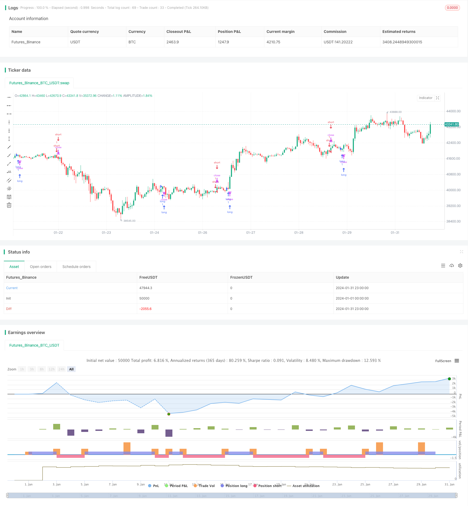

> Name

Byron-Serpent-Cloud-Quant-Strategy
> Author

ChaoZhang

> Strategy Description


[trans]
### Overview
Watkins Snake's Kiss Quantitative Strategy mainly combines the cloud chart indicator and the stochastic indicator RSI, and constructs quantitative trading strategy signals by weighting the judgment of the two indicator signals to achieve automated trading of securities varieties. This strategy comprehensively considers the cloud indicator signals and StochRSI indicator signals of different strengths, and makes trading decisions smoother and more stable by setting weights.
### Strategy Principles
This strategy uses indicators such as the conversion line, baseline, leading 1 and leading 2 in the cloud chart to combine with the K line and D line in StochRSI. In the cloud chart part, if the conversion line is higher than the baseline and Leading 1 is higher than Leading 2, it is a strong long signal. If the conversion line is lower than the baseline and Leading 1 is lower than Leading 2, it is a strong shorting signal. In addition, a conversion line above or below the base line can also generate a weak signal to go long or short. In the StochRSI part, if the K line is higher than the D line and the K line is lower than the overbought line and the D line is lower than the overbought line, it is a StochRSI long signal. If the K line is lower than the D line and the K line is higher than the oversold line and the D line is higher than the oversold line, it is a StochRSI short signal. By setting different weights for the Yiyuntu signal and the StochRSI signal of different strengths and comparing them with a decision weight value, a final long or short signal is formed when the decision weight value is exceeded.

### Advantage Analysis
This strategy combines two indicators, Yiyuntu and StochRSI, to determine the trend direction and overbought and oversold conditions at the same time, making the signal more comprehensive and reliable. Compared with using a single indicator, it can reduce the generation of false signals. The cloud chart indicator is more accurate in judging medium and long-term trends, and the StochRSI indicator can measure short-term overbought and oversold phenomena. The combination of the two makes the strategy suitable for different cycles. The design of decision-making weights also makes the strategy signal more stable and reliable. Generally speaking, this strategy can automatically determine the market trend turning point and generate trading signals. It has the advantages of simple operation, wide application, and stable signals.
### Risk Analysis
The biggest risk of this strategy is that both Yiyuntu and StochRSI indicators may produce false signals, especially in volatile markets, which will increase the number of unnecessary transactions. In addition, the setting of weights and parameter values ​​will also have a great impact on the effectiveness of the strategy. If the weights are set incorrectly, important signals may be missed or too many false signals may be generated. Some key parameters such as RSI length, Stoch length, etc. also need to be tested and optimized for different varieties and market environments, otherwise the strategy effect will be affected. Finally, data problems can also become strategic risks, and if the data quality is poor, it can also bias indicators and signals.
### Optimization direction
This strategy also has a lot of room for optimization. First, you can consider adding more indicators, such as Bollinger Bands, KD indicators, etc., to make signal judgment more comprehensive. Second, methods such as machine learning or genetic algorithms can be used to automatically optimize parameters instead of using fixed parameters, making the strategy more intelligent and adaptable. Third, we can study how to improve the indicator algorithm to reduce the generation of false signals. Fourth, the weight setting mechanism can also be further optimized, such as increasing the weight of strong signals. Fifth, parameters and rules can be optimized for more varieties or sub-markets to adapt to the changing market environment.
### Summarize
The Watkins Snake Kiss Quantitative Strategy combines two indicators, Yiyuntu and StochRSI, to form trading signals through weighting and parameter design. It can automatically capture market trend changes and has good adaptability to different varieties and cycles. It is a set of quantitative strategies worthy of in-depth study and application. This strategy also has the potential for further expansion and optimization, such as the introduction of more indicators and technical means, which is expected to achieve better trading results.
||

### Overview  

Byron Serpent Cloud Quant Strategy mainly combines Ichimoku indicators and the random indicator RSI to construct quantitative trading strategy signals by weighting the judgments of the two indicators, thereby achieving automated trading of securities varieties. This strategy comprehensively considers Ichimoku indicator signals and StochRSI signals of different intensities, and smooths and stabilizes trading decisions by setting weights.

### Strategy Principle   

This strategy uses indicators such as conversion lines, base lines, lead 1 and lead 2 in Ichimoku, combined with K lines and D lines in StochRSI. On the Ichimoku side, if the conversion line is above the baseline and lead 1 is above lead 2, it is a bullish signal. If the conversion line is below the baseline and lead 1 is below lead 2, it is a strong bearish signal. In addition, if the conversion line is above or below the baseline, it can also generate weak bullish or bearish signals. On the StochRSI side, if K line is above D line and K line is below the overbought line and D line is below the overbought line, it is a StochRSI buy signal. If K line is below D line and K line is above oversold line and D line is above oversold line, it is a StochRSI sell signal. By setting different weights for Ichimoku signals and StochRSI signals of different strengths, and comparing them with a decision weight value, final buy or sell signals are generated when exceeding the decision weight value.  

### Advantage Analysis   

This strategy combines Ichimoku and StochRSI indicators to simultaneously determine trend direction and overbought/oversold conditions for more comprehensive and reliable signals. Compared to using a single indicator, it can reduce the generation of false signals. The Ichimoku indicator is quite accurate in judging medium and long term trends, while the StochRSI indicator can measure short-term overbought/oversold phenomena, allowing the strategy to be suitable for different cycles. The design of adding decision weights also makes the strategy signals smoother and more reliable. Overall, this strategy can automatically determine turning points in market trends and generate trading signals with advantages such as easy operation, wide applicability and stable signals.  

### Risk Analysis     

The biggest risk of this strategy is that both Ichimoku and StochRSI indicators may generate false signals, especially in range-bound markets, which will increase unnecessary trades. In addition, the setting of weights and parameter values will also have a great impact on the effectiveness of the strategy. If the weights are set improperly, important signals may be missed or too many false signals may be generated. Some key parameters such as RSI length and Stoch length also need to be tested and optimized for different varieties and market environments, otherwise it will affect the strategy. Finally, data problems can also become risks to the strategy. If the data quality is not good, it will also cause deviations in indicators and signals.  

### Optimization Directions     

This strategy also has great optimization potential. First, consider adding more indicators such as Bollinger Bands and KD to make signal judgment more comprehensive. Second, use machine learning or genetic algorithms to automatically optimize parameters instead of using fixed parameters to make strategies more intelligent and adaptive. Third, research how to improve the indicator algorithms to reduce the generation of false signals. Fourth, the weight setting mechanism can also be further optimized, such as increasing the weight of strong signals. Fifth, parameters and rules can be optimized for more varieties or submarkets to adapt to the ever changing market environment.  

### Summary     

Byron Serpent Cloud Quant Strategy combines Ichimoku and StochRSI indicators to form trading signals through weighting and parameter design, which can automatically capture the trend changes of the market and has good adaptability to different varieties and cycles. It is a set of quantitative strategies worth in-depth research and application. The strategy also has the potential for further expansion and optimization, such as introducing more indicators and techniques, and is expected to achieve better trading results.

[/trans]

> Strategy Arguments


|Argument|Default|Description|
|----|----|----|
|v_input_1|50|BUY/SELL decision weight|
|v_input_2|35|Ichimoku strong weight|
|v_input_3|20|Ichimoku standard weight|
|v_input_4|20|Ichimoku weak weight|
|v_input_5|30|Stoch RSI weight|
|v_input_6|9|Conversion Line Periods|
|v_input_7|26|Base Line Periods|
|v_input_8|52|Lagging Span 2 Periods|
|v_input_9|5|Displacement|
|v_input_10|8|lengthRSI|
|v_input_11|5|lengthStoch|
|v_input_12|3|smoothK|
|v_input_13|3|smoothD|
|v_input_14|20|OverSold|
|v_input_15|80|OverBought|


> Source (PineScript)

``` pinescript
/*backtest
start: 2024-01-01 00:00:00
end: 2024-01-31 23:59:59
period: 1h
basePeriod: 15m
exchanges: [{"eid":"Futures_Binance","currency":"BTC_USDT"}]
*/

//@version=3
strategy("Baracuda Ichimoku/StochRSI Strategy", overlay=true)

DecisionWeight = input(50, minval = 0, title="BUY/SELL decision weight")

ichimokuStrong = input(35, minval = 0, title="Ichimoku strong weight")
ichimokuStandard = input(20, minval = 0, title="Ichimoku standard weight")
ichimokuWeak = input(20, minval = 0, title="Ichimoku weak weight")
stochRSIWweak = input(30, minval = 0, title="Stoch RSI weight")

conversionPeriods = input(9, minval=1, title="Conversion Line Periods")
basePeriods = input(26, minval=1, title="Base Line Periods")
laggingSpan2Periods = input(52, minval=1, title="Lagging Span 2 Periods")
displacement = input(5, minval=1, title="Displacement")

donchian(len) => avg(lowest(len), highest(len))

conversionLine = donchian(conversionPeriods)
baseLine = donchian(basePeriods)
leadLine1 = avg(conversionLine, baseLine)
leadLine2 = donchian(laggingSpan2Periods)

lengthRSI = input(8, minval=8) //14
lengthStoch = input(5, minval=5)//14
smoothK = input(3,minval=3) 
smoothD = input(3,minval=3)
OverSold = input(20)
OverBought = input(80)
rsi1 = rsi(close, lengthRSI)
k = sma(stoch(rsi1, rsi1, rsi1, lengthStoch), smoothK)
d = sma(k, smoothD)


stronglong = conversionLine > baseLine and leadLine1 > leadLine2
strongshort = conversionLine < baseLine and leadLine1 < leadLine2

weaklong = conversionLine > baseLine
weakshort = conversionLine < baseLine

RSIlong = k > d and k < OverSold and d < OverSold
RSIshort = k < d and k > OverBought and d > OverBought

long=(((stronglong ? 1:0)*ichimokuStrong) + ((weaklong? 1:0)*ichimokuWeak) + ((RSIlong? 1:0)*stochRSIWweak)) > DecisionWeight
short=(((strongshort? 1:0)*ichimokuStrong) + ((weakshort? 1:0)*ichimokuWeak) + ((RSIshort? 1:0)*stochRSIWweak)) > DecisionWeight

strategy.entry("long", strategy.long, when=long)
strategy.entry("short", strategy.short, when=short)
```

> Detail

https://www.fmz.com/strategy/442006

> Last Modified

2024-02-18 15:36:22
