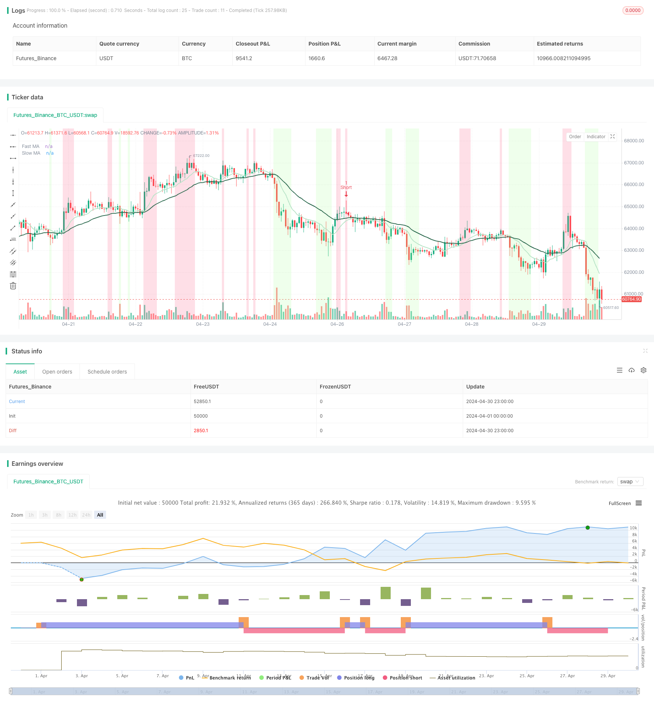

> Name

CCI Double Moving Average Crossover Pullback Buy Strategy-CCI-MA-Crossover-Pullback-Buy-Strategy
> Author

ChaoZhang

> Strategy Description



[trans]
#### Overview
The CCI + double moving average crossover retracement buying strategy is a quantitative trading strategy that comprehensively utilizes the trend indicator (CCI) and double moving average crossover signals. This strategy waits for the price to retrace to the fast line after the golden cross is formed and buy when the CCI indicator is oversold. After the dead cross is formed, the price rebounds to the fast line and sells when the CCI indicator is overbought. By combining CCI and double moving average crossover signals, this strategy can better capture trend opportunities, and at the same time obtain better entry and exit opportunities by waiting for retracement buying and rebound selling, thereby improving the risk-return ratio of the strategy.
#### Strategy Principle
1. Calculate the CCI indicator and calculate the current CCI value based on the CCI parameters set by the user (source data, period, moving average type, overbought and oversold thresholds).
2. Determine whether CCI is overbought or oversold. When CCI is greater than the overbought threshold, set the background color to red. When CCI is less than the oversold threshold, set the background color to green.
3. Calculate the fast and slow moving average, and calculate the current fast and slow moving average values ​​according to the fast and slow moving average parameters set by the user (source data, period, moving average type).
4. To judge the golden cross, draw a long signal when the fast line crosses the slow line to form a golden cross, and draw a short signal when the fast line crosses below the slow line to form a dead cross.
5. Make trading decisions:
   - Long entry: When the fast line is above the slow line, and the closing price of the previous K line is below the fast line, the current K line is a positive line, and the CCI is less than the oversold threshold, buy and open a long position.
   - Short entry: When the fast line is below the slow line, and the closing price of the previous K line is above the fast line, the current K line is a negative line, and the CCI is greater than the overbought threshold, sell and open a short position.
#### Strategic Advantages
1. Trend following: Judging the trend direction through the cross signal of double moving average, which can better comply with the market trend.
2. Enter against the trend: After the trend is established, wait for the price to retrace to buy or rebound to sell, you can get a relatively better entry price and improve the risk-return ratio.
3. Reduce false signals: Combining the CCI indicator with the moving average crossover signal can effectively reduce the false signals generated by a single indicator.
4. Flexible parameters: Users can flexibly set CCI and moving average parameters according to their own preferences to optimize strategy performance.
#### Strategy Risk
1. Risk of volatile markets: In volatile markets, frequent golden crosses and dead crosses may cause the strategy to generate more losing transactions.
2. Parameter risk: Improper parameter settings may lead to poor strategy performance, and it is necessary to fully backtest and analyze the optimal parameter combination under different market conditions.
3. Trend risk: When the market trend reverses, the strategy may delay exit and bear greater retracement risk.
#### Strategy optimization direction
1. Introduce position management and dynamically adjust the position of each transaction according to the current market trend intensity and volatility to better control risks.
2. Optimize entry conditions, such as adding trading volume indicators or other auxiliary judgment indicators, to improve the reliability of entry signals.
3. Optimize exit conditions, such as setting trailing stop loss or time stop loss, to reduce the maximum loss of a single transaction.
4. Carry out parameter optimization for different markets and varieties to improve the adaptability and robustness of the strategy.
#### Summary
The CCI + double moving average crossover retracement buying strategy is a quantitative trading strategy that combines the advantages of trend tracking and counter-trend entry. Capturing the trend direction through double moving averages, using the CCI indicator to identify overbought and oversold ranges, and waiting for price retracements and rebounds to obtain better entry prices can improve the profit potential and risk-return ratio of the strategy to a certain extent. However, this strategy also faces risks such as parameter optimization, market shocks, and trend mutations, and requires further optimization and improvement to enhance the robustness and profitability of the strategy. The strategy ideas are clear, the code structure is complete, and the overall strategy is suitable for real trading.
|| 

#### Overview
The CCI + MA Crossover Pullback Buy Strategy is a quantitative trading strategy that combines the Commodity Channel Index (CCI) and dual moving average crossover signals. The strategy buys when the price pulls back to the fast moving average and the CCI indicates oversold conditions after a bullish crossover. It sells when the price rallies to the fast moving average and the CCI indicates overbought conditions after a bearish crossover. By combining CCI and dual moving average crossover signals, this strategy can better capture trending opportunities while achieving better entry and exit points through pullback buys and rally sells, thus improving the risk-reward ratio.

#### Strategy Logic
1. Calculate the CCI indicator based on user-defined CCI parameters (source, period, moving average type, overbought/oversold thresholds).
2. Determine CCI overbought/oversold conditions. Set the background color to red when CCI is above the overbought threshold and green when below the oversold threshold.
3. Calculate the fast and slow moving averages based on user-defined parameters (source, period, moving average type).
4. Identify bullish and bearish crossovers. Plot a bullish signal when the fast MA crosses above the slow MA, and a bearish signal when the fast MA crosses below the slow MA.
5. Make trading decisions:
   - Long entry: When the fast MA is above the slow MA, the previous candle closes below the fast MA, the current candle is bullish, and the CCI is below the oversold threshold, buy to open a long position.
   - Short entry: When the fast MA is below the slow MA, the previous candle closes above the fast MA, the current candle is bearish, and the CCI is above the overbought threshold, sell to open a short position.

#### Strategy Advantages
1. Trend following: The dual moving average crossover signals help identify trend direction and better align with market trends.
2. Counter-trend entry: Waiting for price pullbacks to buy or price rallies to sell after trend confirmation can lead to better entry prices and improve the risk-reward ratio.
3. Reduced false signals: Combining CCI with moving average crossover signals can effectively reduce false signals generated by a single indicator.
4. Flexible parameters: Users can flexibly set CCI and moving average parameters according to their preferences to optimize strategy performance.

#### Strategy Risks
1. Choppy market risk: In a choppy market, frequent bullish and bearish crossovers may lead to more losing trades.
2. Parameter risk: Inappropriate parameter settings may result in poor strategy performance. Thorough backtesting and analysis of optimal parameter combinations for different market conditions are necessary.
3. Trend risk: When market trends reverse, the strategy may delay exits and suffer larger drawdowns.

#### Strategy Optimization Directions
1. Introduce position sizing to dynamically adjust the position size of each trade based on current trend strength and volatility for better risk control.
2. Optimize entry conditions by incorporating volume indicators or other auxiliary confirmation indicators to improve the reliability of entry signals.
3. Optimize exit conditions by setting trailing stops or time stops to reduce the maximum loss per trade.
4. Perform parameter optimization for different markets and instruments separately to enhance the adaptability and robustness of the strategy.

#### Summary
The CCI + MA Crossover Pullback Buy Strategy is a quantitative trading strategy that combines the advantages of trend following and counter-trend entry. By capturing trend direction with dual moving averages and identifying overbought/oversold zones with the CCI indicator, while waiting for price pullbacks and rallies to achieve better entry prices, the strategy can potentially improve profitability and risk-reward ratio to a certain extent. However, the strategy also faces risks such as parameter optimization, choppy markets, and sudden trend changes. Further optimization and improvements are needed to enhance the robustness and profitability of the strategy. The strategy logic is clear, the code structure is complete, and it is suitable for live trading overall.
[/trans]


> Source (PineScript)

``` pinescript
/*backtest
start: 2024-04-01 00:00:00
end: 2024-04-30 23:59:59
period: 1h
basePeriod: 15m
exchanges: [{"eid":"Futures_Binance","currency":"BTC_USDT"}]
*/

// This Pine Script™ code is subject to the terms of the Mozilla Public License 2.0 at https://mozilla.org/MPL/2.0/
// © tradedots

//@version=5
strategy("CCI + MA Crossover Pullback Buy Strategy [TradeDots]", overlay=true)


ma(source, length, type) =>
  type == "SMA" ? ta.sma(source[1], length) :
  type == "EMA" ? ta.ema(source[1], length) :
  type == "SMMA (RMA)" ? ta.rma(source[1], length) :
  type == "WMA" ? ta.wma(source[1], length) :
  type == "VWMA" ? ta.vwma(source[1], length) :
  na

//CCI settings
cci_coloring  = input.bool(true, "CCI Background Color", group = "Commodity channel index")
cci_length    = input.int(20,"CCI Length", group = "Commodity channel index")
cci_ma_type   = input.string("EMA","CCI MA Type", options=["SMA", "EMA", "SMMA (RMA)", "WMA", "VWMA"], group = "Commodity channel index")
cci_soruce    = input(hlc3, "CCI Source", group = "Commodity channel index")
cci_threshold = input.int(100, "CCI Threshold", group = "Commodity channel index")
cci_ma = ma(cci_soruce, cci_length, cci_ma_type)
cci = (cci_soruce - cci_ma) / (0.015 * ta.dev(cci_soruce, cci_length))

bgcolor(cci > cci_threshold and cci_coloring ? color.new(#f9396a, 80) : cci < -cci_threshold and cci_coloring? color.new(#9cff87, 80) : na, title = "CCI Overbought / Oversold")

//ma crossover settings
input_crossover_labels = input.bool(true, "Show Crossover Labels", group="Moving average")

fastma_type   = input.string("EMA","", inline="fastma", options=["SMA", "EMA", "SMMA (RMA)", "WMA", "VWMA"], group="Moving average")
fastma_source = input(close, "", inline="fastma", group="Moving average")
fastma_length = input.int(10, "", inline="fastma", minval=1,group="Moving average")
fastma_color  = input(#e2fdff, "", inline="fastma",group="Moving average")
fastma = ma(fastma_source, fastma_length, fastma_type)
fastmaPlot = plot(fastma, color = #b7e4c7, linewidth = 2, title = "Fast MA")

slowma_type   = input.string("EMA","", inline="slowma", options=["SMA", "EMA", "SMMA (RMA)", "WMA", "VWMA"], group="Moving average")
slowma_source = input(close, "", inline="slowma", group="Moving average")
slowma_length = input.int(30, "", inline="slowma", minval=1,group="Moving average")
slowma_color  = input(#e2fdff, "", inline="slowma",group="Moving average")
slowma = ma(slowma_source, slowma_length, slowma_type)
slowmaPlot = plot(slowma, color = #2d6a4f, linewidth = 2, title = "Slow MA")

bullish_crossover = ta.crossover(fastma, slowma)
bearish_crossover = ta.crossunder(fastma, slowma)

// // strategy
// if bullish_crossover and input_crossover_labels
//     line.new(bar_index, close, bar_index, close * 1.01, extend = extend.both, color = color.new(#9cff87, 30), style = line.style_dotted, width = 3)
//     label.new(bar_index,low, "Bullish Crossover", style = label.style_label_up, color = #9cff87)

// else if bearish_crossover and input_crossover_labels
//     line.new(bar_index, close, bar_index, close * 1.01, extend = extend.both, color = color.new(#f9396a, 30), style = line.style_dotted, width = 3)
//     label.new(bar_index, high, "Bearish Crossover", style = label.style_label_down, color = #f9396a, textcolor = color.white)

if fastma > slowma and close[1] < fastma and close > open and cci < -cci_threshold
    strategy.entry("Long", strategy.long)
    // if strategy.opentrades == 0 or strategy.opentrades.size(strategy.opentrades -1) < 0
    //     label.new(bar_index,low, "? Long", style = label.style_label_up, color = #9cff87)

if fastma < slowma and close[1] > fastma and close < open and cci > cci_threshold
    strategy.entry("Short", strategy.short)
    // if strategy.opentrades == 0 or strategy.opentrades.size(strategy.opentrades -1) > 0
    //     label.new(bar_index, high, "? Short", style = label.style_label_down, color = #f9396a, textcolor = color.white)
```

> Detail

https://www.fmz.com/strategy/452359

> Last Modified

2024-05-24 17:45:49
