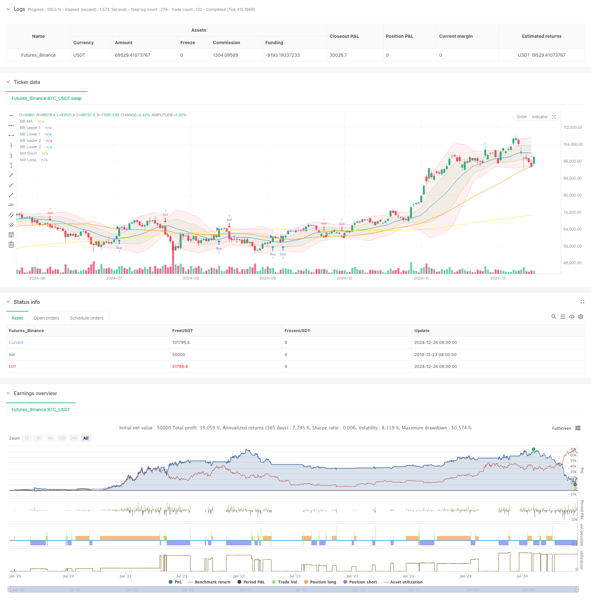

> Name

Multi-Indicator-Filtered-Trading-Strategy-with-Bollinger-Bands-and-Woodies-CCI
> Author

ChaoZhang

> Strategy Description



[trans]
#### Overview
This strategy is a multi-indicator trading system that combines Bollinger Bands, Woodies CCI, Moving Averages (MA) and Balance of Volume Indicator (OBV). The strategy provides market fluctuation ranges through the Bollinger Bands, uses the CCI indicator to filter trading signals, and then combines the moving average system and trading volume confirmation to trade when the market trend is clear. At the same time, use ATR to dynamically set the stop-profit and stop-loss positions to effectively control risks.
#### Strategy Principle
The core logic of the strategy is based on the following key elements:
1. Use two standard deviation Bollinger bands (1x and 2x) to construct a price fluctuation channel and provide a reference for the market fluctuation range.
2. Use the 6-period and 14-period CCI indicators as signal filters, requiring the CCI of the two periods to confirm in the same direction.
3. Combine the 50-period and 200-period moving averages to determine market trends, and generate initial trading signals when the moving averages cross.
4. Confirm the volume trend through the 10-period smoothing of the OBV indicator
5. Use 14-period ATR to dynamically set take profit and stop loss. The take profit for long positions is 2 times ATR, the stop loss is 1 times ATR, and the opposite is true for short positions.
#### Strategic Advantages
1. Multi-indicator cross-validation greatly reduces the probability of false signals
2. The combination of Bollinger Bands and CCI provides accurate judgment of market fluctuations.
3. The long- and short-term moving average system effectively grasps the general trend.
4. OBV confirms transaction volume support and improves signal reliability
5. Dynamic stop-profit and stop-loss settings to adapt to different market environments
6. The trading signals are clear, the execution is standard, and it is easy to realize quantitatively.
#### Strategy Risk
1. Multiple indicators may cause signal lag and miss the best entry opportunity.
2. Stop loss may be triggered frequently in volatile markets
3. Parameter optimization has the risk of overfitting
4. Stop loss may not be timely enough during periods of severe fluctuations.
Countermeasures:
- Dynamically adjust indicator parameters according to different market cycles
- Real-time monitoring of retracement control positions
- Regularly check the validity of parameters
- Set maximum loss limit
#### Strategy optimization direction
1. Introduce market volatility indicators to adjust positions during periods of high volatility
2. Add trend strength filtering to avoid volatile market trading
3. Optimize CCI cycle selection and improve signal sensitivity
4. Improve the stop-profit and stop-loss mechanism, such as considering taking profits in batches
5. Add an early warning mechanism for abnormal trading volume
#### Summary
This is a complete trading system based on a combination of technical indicators that improves trading accuracy through multiple signal confirmations. The strategy design is reasonable, the risks are properly controlled, and it has good practical application value. It is recommended to use conservative positions for testing in the real market, and continue to optimize parameters according to market conditions.
||

#### Overview
This strategy is a multi-indicator trading system combining Bollinger Bands, Woodies CCI (Commodity Channel Index), Moving Averages (MA), and On-Balance Volume (OBV). It uses Bollinger Bands to provide market volatility ranges, CCI indicators for signal filtering, and combines MA systems with volume confirmation to execute trades when market trends are clear. Additionally, it employs ATR for dynamic stop-loss and take-profit placement to effectively control risk.

#### Strategy Principles
The core logic is based on the following key elements:
1. Uses two standard deviation Bollinger Bands (1x and 2x) to construct price volatility channels
2. Employs 6-period and 14-period CCI indicators as signal filters, requiring confirmation from both periods
3. Combines 50-period and 200-period moving averages to determine market trends
4. Confirms volume trends through 10-period smoothed OBV
5. Uses 14-period ATR for dynamic stop-loss and take-profit levels

#### Strategy Advantages
1. Multiple indicator cross-validation significantly reduces false signals
2. Bollinger Bands and CCI combination provides accurate market volatility judgment
3. Long and short-term MA systems effectively capture major trends
4. OBV confirms volume support, increasing signal reliability
5. Dynamic stop-loss and take-profit settings adapt to different market conditions
6. Clear trading signals with standardized execution, suitable for quantitative implementation

#### Strategy Risks
1. Multiple indicators may lead to delayed signals
2. Frequent stop-losses in ranging markets
3. Risk of parameter optimization overfitting
4. Stop-losses may not trigger quickly enough in volatile periods
Mitigation measures:
- Dynamically adjust indicator parameters for different market cycles
- Monitor drawdown for position control
- Regular parameter validation
- Set maximum loss limits

#### Optimization Directions
1. Introduce volatility indicators to adjust positions in high volatility periods
2. Add trend strength filtering to avoid ranging market trades
3. Optimize CCI period selection for improved signal sensitivity
4. Enhance profit/loss management with partial profit-taking
5. Implement volume anomaly warning system

#### Summary
This is a complete trading system based on technical indicator combinations that improves trading accuracy through multiple signal confirmations. The strategy design is reasonable with proper risk control and has good practical application value. It is recommended to test with conservative positions in live trading and continuously optimize parameters based on market conditions.[/trans]


> Source (PineScript)

``` pinescript
/*backtest
start: 2019-12-23 08:00:00
end: 2024-12-25 08:00:00
period: 1d
basePeriod: 1d
exchanges: [{"eid":"Futures_Binance","currency":"BTC_USDT"}]
*/

//@version=6
strategy(shorttitle="BB Debug + Woodies CCI Filter", title="Debug Buy/Sell Signals with Woodies CCI Filter", overlay=true)

// Input Parameters
length = input.int(20, minval=1, title="BB MA Length")
src = input.source(close, title="BB Source")
mult1 = input.float(1.0, minval=0.001, maxval=50, title="BB Multiplier 1 (Std Dev 1)")
mult2 = input.float(2.0, minval=0.001, maxval=50, title="BB Multiplier 2 (Std Dev 2)")
ma_length = input.int(50, minval=1, title="MA Length")
ma_long_length = input.int(200, minval=1, title="Long MA Length")
obv_smoothing = input.int(10, minval=1, title="OBV Smoothing Length")
atr_length = input.int(14, minval=1, title="ATR Length") // ATR Length for TP/SL

// Bollinger Bands
basis = ta.sma(src, length)
dev1 = mult1 * ta.stdev(src, length)
dev2 = mult2 * ta.stdev(src, length)

upper_1 = basis + dev1
lower_1 = basis - dev1
upper_2 = basis + dev2
lower_2 = basis - dev2

plot(basis, color=color.blue, title="BB MA")
p1 = plot(upper_1, color=color.new(color.green, 80), title="BB Upper 1")
p2 = plot(lower_1, color=color.new(color.green, 80), title="BB Lower 1")
p3 = plot(upper_2, color=color.new(color.red, 80), title="BB Upper 2")
p4 = plot(lower_2, color=color.new(color.red, 80), title="BB Lower 2")

fill(p1, p2, color=color.new(color.green, 90))
fill(p3, p4, color=color.new(color.red, 90))

// Moving Averages
ma_short = ta.sma(close, ma_length)
ma_long = ta.sma(close, ma_long_length)
plot(ma_short, color=color.orange, title="MA Short")
plot(ma_long, color=color.yellow, title="MA Long")

// OBV and Smoothing
obv = ta.cum(ta.change(close) > 0 ? volume : ta.change(close) < 0 ? -volume : 0)
obv_smooth = ta.sma(obv, obv_smoothing)

// Debugging: Buy/Sell Signals
debugBuy = ta.crossover(close, ma_short)
debugSell = ta.crossunder(close, ma_short)

// Woodies CCI
cciTurboLength = 6
cci14Length = 14
cciTurbo = ta.cci(src, cciTurboLength)
cci14 = ta.cci(src, cci14Length)

// Filter: Only allow trades when CCI confirms the signal
cciBuyFilter = cciTurbo > 0 and cci14 > 0
cciSellFilter = cciTurbo < 0 and cci14 < 0

finalBuySignal = debugBuy and cciBuyFilter
finalSellSignal = debugSell and cciSellFilter

// Plot Debug Buy/Sell Signals
plotshape(finalBuySignal, title="Filtered Buy", location=location.belowbar, color=color.lime, style=shape.triangleup, size=size.normal)
plotshape(finalSellSignal, title="Filtered Sell", location=location.abovebar, color=color.red, style=shape.triangledown, size=size.normal)

// Change candle color based on filtered signals
barcolor(finalBuySignal ? color.lime : finalSellSignal ? color.red : na)

// ATR for Stop Loss and Take Profit
atr = ta.atr(atr_length)
tp_long = close + 2 * atr  // Take Profit for Long = 2x ATR
sl_long = close - 1 * atr  // Stop Loss for Long = 1x ATR
tp_short = close - 2 * atr // Take Profit for Short = 2x ATR
sl_short = close + 1 * atr // Stop Loss for Short = 1x ATR

// Strategy Execution
if (finalBuySignal)
    strategy.entry("Buy", strategy.long)
    strategy.exit("Take Profit/Stop Loss", "Buy", limit=tp_long, stop=sl_long)

if (finalSellSignal)
    strategy.entry("Sell", strategy.short)
    strategy.exit("Take Profit/Stop Loss", "Sell", limit=tp_short, stop=sl_short)

// Check for BTC/USDT pair
isBTCUSDT = syminfo.ticker == "BTCUSDT"

// Add alerts only for BTC/USDT
alertcondition(isBTCUSDT and finalBuySignal, title="BTCUSDT Buy Signal", message="Buy signal detected for BTCUSDT!")
alertcondition(isBTCUSDT and finalSellSignal, title="BTCUSDT Sell Signal", message="Sell signal detected for BTCUSDT!")
```

> Detail

https://www.fmz.com/strategy/476266

> Last Modified

2024-12-27 15:32:30
