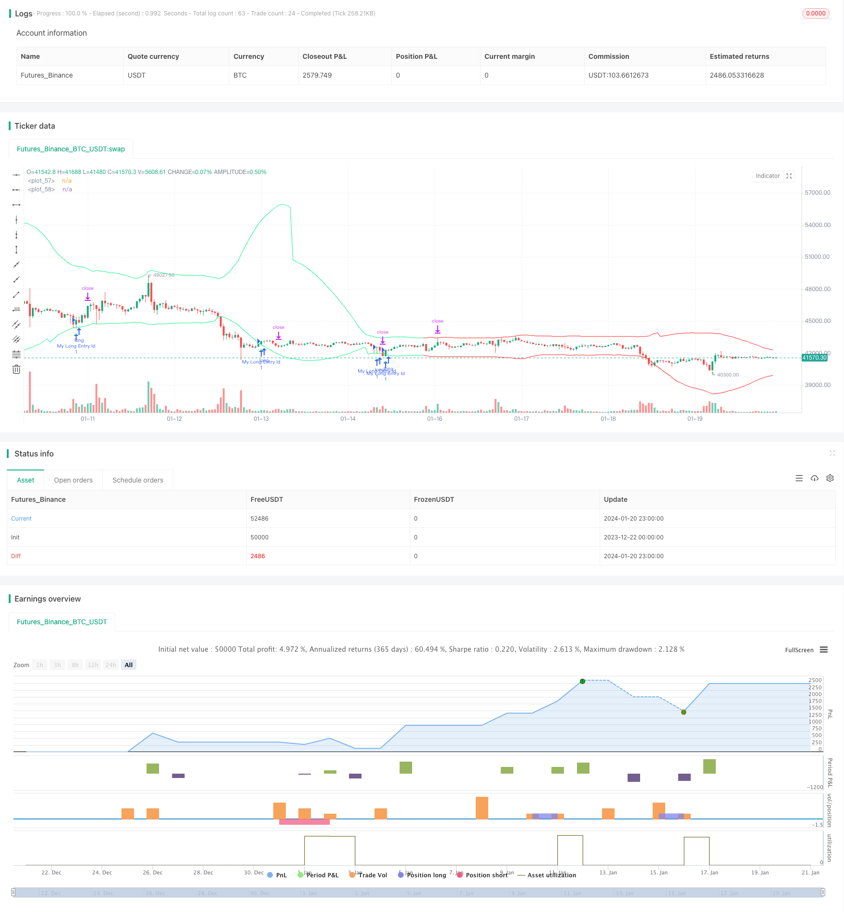

> Name

Dynamic-CCI-Support-and-Resistance-Strategy Dynamic-CCI-Support-and-Resistance-Strategy
> Author

ChaoZhang

> Strategy Description


 [trans]
### Overview
This strategy uses the pivot point of the CCI indicator to calculate dynamic support and resistance levels, and combines trend judgment to find buy and sell signals. This strategy combines CCI's reversal characteristics and trend tracking capabilities, aiming to seize the reversal point in the mid-term trend to achieve profitability.
### Strategy Principles
The CCI indicator can show whether the market is too weak or too strong. The two extreme values of 80 and -80 can be used to determine whether the market has entered an overbought or oversold state. This strategy uses this characteristic of CCI to obtain the upper pivot point and lower pivot point by calculating the pivot points of 50 K lines on the left and right sides, and then adds and subtracts buffer zones based on the pivot points to construct dynamic resistance lines and support lines.
A buy signal is generated when the closing price is higher than the opening price and below the upper support line; a sell signal is generated when the closing price is lower than the opening price and above the lower resistance line. In order to filter out trading signals in non-mainstream trend directions, the strategy also combines EMA and slope indicators to determine the current mainstream trend direction. Only when the trend is judged to be long, the buying operation will be carried out; only when the trend is judged to be short, the selling operation will be carried out.
Stop loss and take profit are dynamically calculated based on the ATR indicator, making the risk control of this strategy more reasonable.
### Advantage Analysis
1. Make use of the reversal characteristics of the CCI indicator and select the reversal point for buying and selling to increase the probability of profit.
2. Combine trend judgment to avoid counter-trend operations and reduce losses.
3. Dynamic stop loss and take profit settings make risk control more reasonable.
4. Customizable parameters such as CCI cycle, buffer size, etc. to adapt to more market environments.
### Risk Analysis
1. CCI indicators are prone to produce false signals and need to be filtered in conjunction with trends.
2. The reversal may not be successful, and there is a risk of loss with a certain probability.
3. Improper parameter settings may lead to too frequent transactions or missed trading opportunities.
Risks can be reduced by optimizing parameters, adjusting stop loss range, etc. In addition, this strategy can also be used as an auxiliary tool for other indicators without having to rely entirely on its trading signals.
### Optimization direction
1. Optimize the buffer size to adapt to markets with different volatility.
2. Optimize the ATR cycle parameters to obtain more accurate dynamic stop loss and take profit.
3. Try different CCI parameter settings.
4. Test the effects of other types of trend judgment indicators.
## Summary
This strategy integrates the long and short screening capabilities of the CCI indicator and the filtering and confirmation of trend judgment, and has certain practical value. Dynamic stop-loss and take-profit also make the risk controllable in practical application of the strategy. Through parameter optimization and improvement, better results can be expected.
|| 

### Overview 
This strategy uses the pivot points of the CCI indicator to calculate dynamic support and resistance levels, and combines trend judgment to find buy and sell signals. The strategy integrates the reversal characteristics of CCI and the trend tracking ability to capture reversal points in the medium-term trend for profit.

### Strategy Principle 
CCI indicator can show whether the market is too weak or too strong. The two extremes of 80 and -80 can be used to determine whether the market has entered an overbought or oversold state. This strategy utilizes this characteristic of CCI. By calculating the pivot points of the left and right 50 bars, the upper and lower pivot points are obtained. Then support and resistance lines are constructed dynamically by adding or subtracting a buffer on the basis of the pivot points. 

A buy signal is generated when the close is higher than the open and lower than the upper support level. A sell signal is generated when the close is lower than the open and higher than the lower resistance level. In order to filter out trading signals against the main trend direction, the strategy also combines EMA and slope indicators to determine the current main trend direction. Long entry trades are only placed when the trend is determined as bullish. Short entry trades are only placed when the trend is determined as bearish.

The stop loss and take profit are calculated dynamically based on the ATR indicator, making the risk control of this strategy more reasonable.

### Advantage Analysis 
1. Taking advantage of the reversal characteristic of CCI, entries are made near potential reversal points, increasing the probability of profit. 
2. Combining with trend judgment avoids trading against the trend and reduces losses.  
3. Dynamic stop loss and take profit settings make risk control more sensible.  
4. Customizable parameters such as CCI length, buffer size, etc. adapt to more market environments.

### Risk Analysis
1. CCI indicator tends to generate false signals, needing the filter from trend judgment.  
2. Reversals do not always succeed, with certain probability of loss risk.
3. Improper parameter settings may lead to over-trading or missing opportunities.  

Methods like parameter optimization, adjusting stop loss range, etc. can help reduce risks. Also, this strategy can be used as an auxiliary tool for other indicators, not having to completely rely on its signals.  

### Optimization Directions
1. Optimize buffer size to adapt to markets of different volatility levels.  
2. Optimize ATR period parameters for more accurate dynamic stop loss and take profit.
3. Test different CCI parameter settings.  
4. Test the effects of other types of trend judgment indicators.   

## Conclusion
This strategy integrates the long/short screening ability from CCI and the filter confirmation from trend judgment, possessing certain practical value. The dynamic stop loss and take profit also makes the risk controllable when applying the strategy in actual trading. Through parameter optimization and improvements, better results can be expected.
[/trans]

> Strategy Arguments


|Argument|Default|Description|
|----|----|----|
|v_input_int_1|50|cci length|
|v_input_int_2|50|right pivot|
|v_input_int_3|50|left pivot|
|v_input_float_1|10|buffer|
|v_input_bool_1|true|trend matter?|
|v_input_bool_2|false|show mid?|
|v_input_string_1|0|trend type: cross|slope|
|v_input_int_4|100|slow ma length|
|v_input_int_5|50|fast ma length|
|v_input_int_6|5|slope's length for trend detection|
|v_input_float_2|1.1|ksl|
|v_input_float_3|2.2|ktp|
|v_input_timeframe_1|D|Time Frame of Last Period for Calculating max|


> Source (PineScript)

``` pinescript
/*backtest
start: 2023-12-22 00:00:00
end: 2024-01-21 00:00:00
period: 1h
basePeriod: 15m
exchanges: [{"eid":"Futures_Binance","currency":"BTC_USDT"}]
*/

// This Pine Script™ code is subject to the terms of the Mozilla Public License 2.0 at https://mozilla.org/MPL/2.0/
// © AliSignals


//@version=5
strategy("CCI based support and resistance strategy", overlay=true  )


cci_length = input.int(50, "cci length")
right_pivot = input.int(50, "right pivot")
left_pivot = input.int(50, "left pivot")
buffer = input.float(10.0, "buffer")
trend_matter = input.bool(true, "trend matter?")
showmid = input.bool ( false , "show mid?")
trend_type = input.string("cross","trend type" ,options = ["cross","slope"])
slowma_l = input.int(100, "slow ma length")
fastma_l = input.int(50, "fast ma length")
slope_l = input.int(5,  "slope's length for trend detection")
ksl = input.float(1.1)
ktp = input.float(2.2)
restf = input.timeframe(title="Time Frame of Last Period for Calculating max" , defval="D")


// Calculating Upper and Lower CCI
cci = ta.cci(hlc3,cci_length)

uppercci = 0.0
lowercci = 0.0

uppercci := fixnan(ta.pivothigh(cci, left_pivot, right_pivot)) - buffer
lowercci := fixnan(ta.pivotlow (cci, left_pivot, right_pivot)) + buffer
midccci  = math.avg(uppercci,lowercci)


// Support and Resistance based on CCI
res = uppercci*(0.015*ta.dev(hlc3,cci_length))+ ta.sma(hlc3,cci_length)
sup = lowercci*(0.015*ta.dev(hlc3,cci_length))+ ta.sma(hlc3,cci_length)
mid =  midccci*(0.015*ta.dev(hlc3,cci_length))+ ta.sma(hlc3,cci_length)


// Calculating trend
t_cross  = 0
t_cross := ta.ema(close,fastma_l) > ta.ema(close,slowma_l) ? 1 : ta.ema(close,fastma_l) < ta.ema(close,slowma_l) ? -1 : t_cross[1] 

t_slope  = 0
t_slope := ta.ema(close,slowma_l) > ta.ema(close,slowma_l)[slope_l] ? 1 : ta.ema(close,slowma_l) < ta.ema(close,slowma_l)[slope_l]  ? -1 : t_slope[1] 

t  = 0
t := trend_type == "cross" ? t_cross : trend_type == "slope" ? t_slope : na

colort =  trend_matter == false ? color.rgb(201, 251, 0) : t == 1 ? color.rgb(14, 243, 132) :  t == -1 ? color.rgb(255, 34, 34) : na
bull_t = trend_matter == false or t ==  1
bear_t = trend_matter == false or t == -1

plot(res, color = colort)
plot(sup, color = colort)
plot(showmid == true ? mid : na)


// Long and Short enter condition
buy  = bull_t == 1 and ta.lowest (2) < sup and close > open and close > sup
sell = bear_t == 1 and ta.highest(2) > res and close < open and close < res

plotshape( buy , color=color.rgb(6, 255, 23) , location = location.belowbar, style = shape.triangleup  , size = size.normal)
plotshape( sell, color=color.rgb(234, 4, 4) ,  location = location.abovebar, style = shape.triangledown, size = size.normal)


atr = ta.atr(100)


CLOSE=request.security(syminfo.tickerid, restf, close)
max = 0.0
max := CLOSE == CLOSE[1] ? math.max(max[1], atr) : atr
act_atr = 0.0
act_atr := CLOSE == CLOSE[1] ? act_atr[1] : max[1]

atr1 =  math.max(act_atr, atr) 

dis_sl = atr1 * ksl
dis_tp = atr1 * ktp


var float longsl  = open[1] - dis_sl
var float shortsl = open[1] + dis_sl
var float longtp =   open[1] + dis_tp
var float shorttp =  open[1] - dis_tp


longCondition = buy
if (longCondition)
    strategy.entry("My Long Entry Id", strategy.long)

shortCondition = sell
if (shortCondition)
    strategy.entry("My Short Entry Id", strategy.short)


longsl  := strategy.position_size > 0  ? longsl[1]  : close - dis_sl
shortsl := strategy.position_size < 0 ? shortsl[1] : close + dis_sl
longtp  := strategy.position_size > 0  ? longtp[1]  : close + dis_tp
shorttp := strategy.position_size < 0 ? shorttp[1] : close - dis_tp


if strategy.position_size > 0 
    strategy.exit(id="My Long close Id", from_entry ="My Long Entry Id" , stop=longsl, limit=longtp)
if strategy.position_size < 0 
    strategy.exit(id="My Short close Id", from_entry ="My Short Entry Id" , stop=shortsl, limit=shorttp)


```

> Detail

https://www.fmz.com/strategy/439639

> Last Modified

2024-01-22 16:37:46
