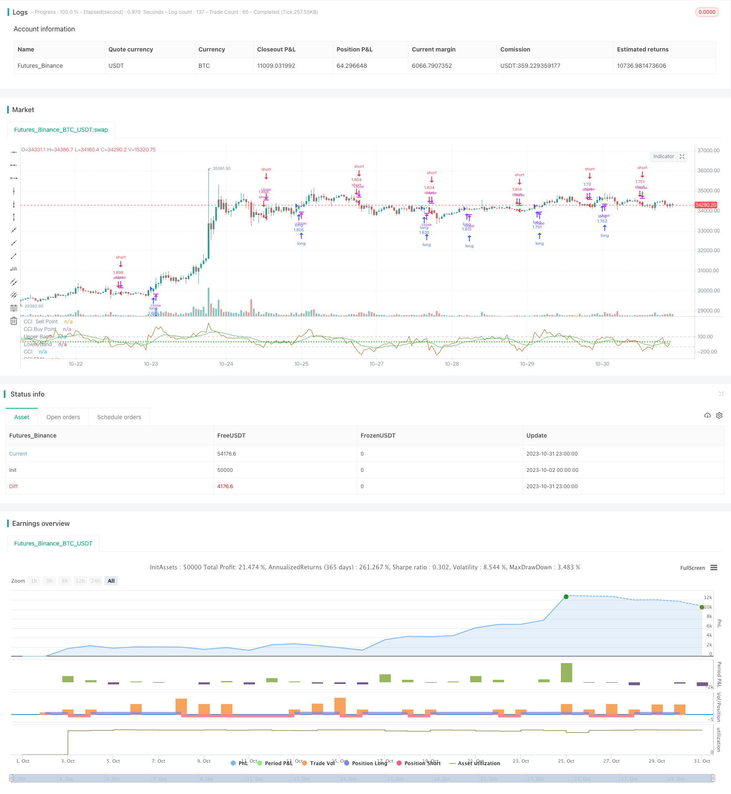

> Name

Trend following trading strategy based on CCI and EMACCI-and-EMA-Trend-Following-Trading-Strategy
> Author

ChaoZhang

> Strategy Description


[trans]


## Overview
The core idea of ​​this strategy is to use the CCI indicator to determine the market trend direction, and to use the EMA indicator to smooth the CCI to achieve trend following transactions. When CCI crosses the buying point, go long, and when CCI crosses the selling point, go short, to achieve the purpose of following the market trend.
## Strategy Principle
1. Calculate the CCI index. The CCI indicator uses the deviation of the day's closing price from the moving average of the past 20 days to determine whether the current stock price is overbought or oversold. The formula is: (typical price - 20-day SMA) / (0.015 * 20-day typical price standard deviation).
2. Perform EMA smoothing on the CCI indicator to obtain the CCI-EMA curve to reduce the shock of the CCI indicator and make the signal clearer.
3. Set buying and selling points for CCI. When CCI-EMA crosses the buying point, go long; when CCI-EMA crosses the selling point, go short.
4. Hold the position until CCI-EMA touches the buying point or selling point again and close the position.
## Strategic advantage analysis
1. Use CCI to determine the direction of the market trend, and then combine it with EMA to filter out false signals, which can effectively track the market trend.
2. The CCI indicator is extremely sensitive to price and can quickly capture the turning point of the trend. The EMA indicator can reduce the false alarm rate. Use the two together to seize opportunities at the beginning of a trend.
3. Using trend following strategies can minimize the number of transactions, reduce transaction costs and slippage losses.
4. The strategy backtesting effect is good, and it has certain feasibility of real trading.
## Strategy risk analysis
1. The CCI indicator is overly sensitive to the curve. EMA cannot completely filter out all false signals, and there is still a certain risk of false positives.
2. A pure trend following strategy is prone to losses when the trend fluctuates or reverses. It should be used appropriately with trend judgment indicators.
3. Purely mechanical trading strategies cannot flexibly adjust parameters according to market conditions, and there is a risk of over-optimization.
4. The backtest data is insufficient and cannot fully reflect the actual performance. When placing a real offer, parameters should be adjusted appropriately and stop loss should be strictly controlled.
## Strategy optimization direction
1. Optimize the parameters of CCI and test the parameter effects of different length periods.
2. Optimize EMA parameters and find the best EMA period length.
3. Test different combinations of buying and selling point parameters to find the optimal parameters.
4. Combine with other indicators to determine trend reversal and set stop loss levels to avoid loss expansion.
5. Add automatic parameter optimization function to automatically find the optimal parameter combination according to different varieties.
## Summarize
Overall, this strategy is a relatively simple trend following trading strategy. It uses CCI to determine the trend direction and is sensitive to price changes, and cooperates with EMA to filter to generate trading signals. The strategy has certain advantages, but there are also some risks that need to be noted. Through parameter optimization and the use of other indicators, the stability of the strategy and real performance can be further improved. Overall, this strategy provides a simple and reliable trend following strategy template for quantitative trading.
||


## Overview

The core idea of this strategy is to use the CCI indicator to determine the market trend direction and use the EMA indicator to smooth the CCI to implement trend following trading. Go long when the CCI crosses above the buy point and go short when the CCI crosses below the sell point to follow the market trend.

## Strategy Logic

1. Calculate the CCI indicator. The CCI indicator judges whether the current stock price is overbought or oversold based on the degree of deviation from the 20-day moving average. The formula is: (typical price - 20D SMA) / (0.015 * 20D TP standard deviation).

2. Smooth the CCI indicator with an EMA to get a CCI-EMA curve, which reduces the fluctuation of the CCI and makes the signal clearer.

3. Set the buy and sell points for CCI. Go long when CCI-EMA crosses above the buy point, and go short when CCI-EMA crosses below the sell point.  

4. Hold the position until CCI-EMA touches the buy or sell point again to close the position.

## Advantage Analysis  

1. Using CCI to determine market trend direction combined with EMA to filter false signals can effectively follow market trends.

2. CCI is sensitive to price anomalies and can quickly capture trend reversals. EMA reduces false signals. Used together, they can seize opportunities at the beginning of trends.

3. Trend following strategies minimize transactions, reduce trading costs and slippage. 

4. The backtest results are decent, giving the strategy some practical viability.

## Risk Analysis

1. CCI can be overly sensitive to curves and EMA cannot completely filter all false signals, some false signals remain.

2. Pure trend following strategies are prone to losses when trends consolidate or reverse. Trend judgment indicators should be used.

3. Mechanical trading systems cannot flexibly adjust parameters based on markets. Over optimization is a risk.

4. Limited backtest data cannot fully reflect live performance. Parameters should be adjusted carefully and stops managed strictly.

## Optimization Directions 

1. Optimize CCI parameters by testing different length periods.

2. Optimize EMA parameters to find the optimal EMA period.

3. Test different buy/sell point combinations to find the optimal parameters.

4. Incorporate other indicators to determine trend reversal and set stop losses.

5. Add auto parameter optimization to find the optimal parameters for different products.

## Summary

Overall this is a relatively simple trend following trading strategy. It uses CCI to determine trend direction and is sensitive to price changes, combined with EMA filtering to generate signals. The strategy has some advantages but also risks to note. Through parameter optimization and using other indicators, the stability and live performance can be further improved. Overall it provides a simple and reliable trend following template for quant trading.

[/trans]

> Strategy Arguments


|Argument|Default|Description|
|----|----|----|
|v_input_1|20|length|
|v_input_2_close|0|Source: close|high|low|open|hl2|hlc3|hlcc4|ohlc4|
|v_input_3|false|CCI Sell Point|
|v_input_4|false|CCI Buy Buy Point|
|v_input_5|12|length cci ema|


> Source (PineScript)

``` pinescript
/*backtest
start: 2023-10-02 00:00:00
end: 2023-11-01 00:00:00
period: 1h
basePeriod: 15m
exchanges: [{"eid":"Futures_Binance","currency":"BTC_USDT"}]
*/

//@version=4
strategy("CCI with EMA Strategy", overlay=false, pyramiding=1, default_qty_type= strategy.percent_of_equity, default_qty_value = 100, calc_on_order_fills=false, slippage=0,commission_type=strategy.commission.percent,commission_value=0.07)

length = input(20, minval=1)
src = input(close, title="Source")
cciSellPoint = input(0, title = 'CCI Sell Point', type = input.integer) 
cciBuyPoint = input(0, title = 'CCI Buy Buy Point', type = input.integer) 
lengthcci = input(12,"length cci ema", minval=1)

ma = sma(src, length)
cci = (src - ma) / (0.015 * dev(src, length))
cciema=ema(cci,lengthcci)
plot(cci, "CCI", color=#996A15)
plot(cciSellPoint, title = 'CCI  Sell Point', color = color.red, linewidth = 1, style = plot.style_cross, transp = 35)
plot(cciBuyPoint, title = 'CCI Buy Point', color = color.green, linewidth = 1, style = plot.style_cross, transp = 35)
plot(cciema, title = 'CCI EMA', color = color.green, linewidth = 1, transp = 35)
band1 = hline(100, "Upper Band", color=#C0C0C0, linestyle=hline.style_dashed)
band0 = hline(-100, "Lower Band", color=#C0C0C0, linestyle=hline.style_dashed)
fill(band1, band0, color=#9C6E1B, title="Background")

startLongTrade=  cciema >cciBuyPoint 
startShortTrade= cciema <cciSellPoint

//exitLong = cciema <cciSellPoint
//exitShort = cciema >cciBuyPoint 

strategy.entry("long",strategy.long, when = startLongTrade )
//strategy.close( "long", when=exitLong)
strategy.entry("short",strategy.short,when=startShortTrade )
//strategy.close("short", when=exitShort)
```

> Detail

https://www.fmz.com/strategy/430858

> Last Modified

2023-11-02 15:17:22
