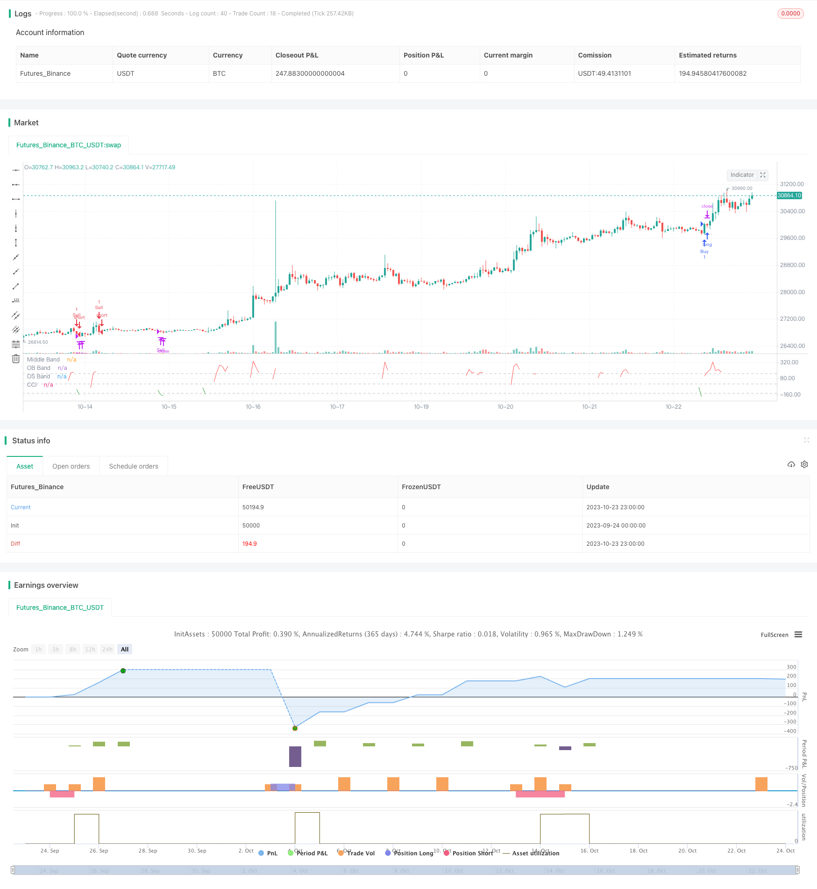

> Name

Momentum-Tracking-CCI-Strategy Momentum-Tracking-CCI-Strategy
> Author

ChaoZhang

> Strategy Description



[trans]

### Overview
This strategy is based on the Commodity Channel Index (CCI) indicator and aims to go long in oversold conditions and short in overbought conditions. It also optionally uses an Exponential Moving Average (EMA) filter to control trading only in the direction of the trend. The strategy also offers stop-loss and take-profit methods based on a fixed percentage or average true range (ATR).
### Strategy Principles
1. Use the CCI indicator to determine market trends
- CCI measures momentum by comparing the current price to the average price over a certain period    
- CCI above 150 is overbought, below -100 is oversold    
2. Optional use of EMA filter
- Only go long when the price is above the EMA and go short when the price is below the EMA    
- Use EMA to determine the trend direction and avoid counter-trend trading
3. Provide two stop-loss and stop-profit methods
- Fixed percentage based stop loss and take profit: Use a fixed percentage of the entry price to set your stop loss and take profit    
- Stop loss and take profit based on ATR: Use the multiple of ATR to set the stop loss, and then calculate the take profit based on the risk reward ratio    
4. Admission conditions
- Go long when CCI crosses -100 line    
- Go short when CCI crosses below 150 line    
- If EMA is enabled, you will only go long when the price is higher than the EMA, and go short when the price is lower than the EMA.    
5. Entry conditions
- Close the position when the price hits Stop Loss and Take Profit    
- Close positions when CCI re-enters overbought and oversold areas    
6. Drawing
- Draw CCI indicator, area coloring    
### Advantage Analysis
1. Use CCI to determine overbought and oversold conditions. This is a classic use of the CCI indicator.
2. Optional EMA ensures that you only trade in the direction of the trend and avoid reversals
3. Provide two stop-loss and take-profit methods, and the parameters of stop-loss and take-profit can be adjusted according to the market
4. If the CCI indicator enters the overbought and oversold area again to close the position, you can lock in trend reversal profits.
5. The drawing highlights the CCI signal and is easy to interpret.
6. The strategy logic is clear and simple, easy to understand and optimize
### Risk Analysis
1. The CCI indicator lags behind and may miss a reversal or generate false signals.
2. Improper EMA parameter settings may miss the trend or render the strategy ineffective
3. Percentage stop loss and take profit are difficult to adapt to market changes, and wider parameters should be set
4. ATR stop loss and take profit are sensitive to the interval period and should be adjusted to the optimal parameters
5. The risk of retracement is relatively high, so position management should be adjusted appropriately.
6. The effect changes with the market environment, and indicator parameters should be evaluated in a timely manner.
### Optimization direction
1. Evaluate CCI parameters of different periods and find the best parameter combination
2. Test different EMA periods to determine the most appropriate trend judgment period
3. Adjust stop-loss and take-profit parameters to obtain the best risk-return ratio
4. Add other filter conditions, such as trading volume, to further filter out false signals
5. Combine trend lines or graphics to make morphological judgments to improve the effect
6. Add position management strategies, such as fixed positions, to control drawdown risks
7. Comprehensive backtesting of different market environment data and dynamic adjustment of parameters
### Summarize
This strategy uses the classic overbought and oversold principles of the CCI indicator for entry. Adding EMA filter can control the trend direction. Two stop-loss and stop-profit methods are provided for easy adjustment. The plot highlights the signal and is easy to interpret. The strategy logic is simple and clear, easy to understand and optimize. The effect can be further improved through parameter adjustment, adding filter conditions, risk control, etc.
||


## Overview

This strategy is based on the Commodity Channel Index (CCI) indicator, aiming to go long in oversold conditions and go short in overbought conditions. It also optionally uses an Exponential Moving Average (EMA) filter to only trade in the direction of the trend. The strategy also provides fixed percentage or Average True Range (ATR) based stop loss and take profit.

## Strategy Logic  

1. Use CCI indicator to determine market trend

    - CCI measures momentum by comparing current price to the average price over a period
    
    - CCI above 150 is overbought, below -100 is oversold
    
2. Optionally use EMA filter

    - Only go long when price is above EMA, and short when below EMA 
    
    - Use EMA to determine trend direction, avoid counter-trend trading

3. Provide two types of stop loss and take profit

    - Fixed percentage based stop loss and take profit: Use fixed percentage of entry price
    
    - ATR based stop loss and take profit: Use ATR multiplier for stop loss, calculate take profit based on risk reward ratio
    
4. Entry conditions

    - Go long when CCI crosses above -100
    
    - Go short when CCI crosses below 150 
    
    - If EMA enabled, only enter when price is on right side of EMA
    
5. Exit conditions

    - Close position when stop loss or take profit is hit
    
    - Close position when CCI re-enters overbought/oversold region
    
6. Plotting

    - Plot CCI indicator, color code regions
    
## Advantage Analysis

1. Use CCI overbought/oversold for entry, a classic usage of CCI

2. Optional EMA ensures trading with the trend, avoid reversals

3. Provide two types of stop loss/take profit for flexibility

4. Close on CCI signal again locks in reversal profit 

5. Plotting highlights CCI signals clearly

6. Simple and clear logic, easy to understand and optimize

## Risk Analysis

1. CCI has lagging effect, may miss reversals or give false signals

2. Wrong EMA parameters may miss trends or render strategy ineffective

3. Fixed percentage stop loss/take profit less adaptive to market changes

4. ATR stop loss/take profit sensitive to ATR period, should optimize

5. Larger drawdown risk, position sizing should be adjusted

6. Performance varies across market conditions, re-evaluate parameters

## Optimization Directions 

1. Evaluate CCI periods to find optimal parameter combinations

2. Test different EMA periods for best trend estimation

3. Adjust stop loss/take profit for optimal risk reward ratio

4. Add other filters like volume to further avoid false signals

5. Combine with trendlines/chart patterns for pattern confirmation

6. Add position sizing rules like fixed size to control drawdown

7. Backtest across different market conditions, dynamically adjust

## Summary

The strategy utilizes the classic CCI overbought/oversold principles for entry. The EMA filter controls trend trading. Two types of stop loss/take profit provided for flexibility. Plotting highlights signals clearly. Simple and clear logic, easy to understand and optimize. Further improvements can be made via parameter tuning, adding filters, risk control etc.

[/trans]

> Strategy Arguments


|Argument|Default|Description|
|----|----|----|
|v_input_1|14|CCI Length|
|v_input_int_1|150|Overbought|
|v_input_int_2|-140|Oversold|
|v_input_2|true|Use EMA|
|v_input_3|55|EMA Length|
|v_input_4|true|(?TP/SL Method)Percentage TP/SL|
|v_input_5|false|ATR TP/SL|
|v_input_float_1|10|Take Profit (%)|
|v_input_float_2|10|Stop Loss (%)|
|v_input_6|20|ATR Length|
|v_input_7|4|ATR SL Multiplier|
|v_input_8|2|Risk Reward Ratio|


> Source (PineScript)

``` pinescript
/*backtest
start: 2023-09-24 00:00:00
end: 2023-10-24 00:00:00
period: 1h
basePeriod: 15m
exchanges: [{"eid":"Futures_Binance","currency":"BTC_USDT"}]
*/

// This source code is subject to the terms of the Mozilla Public License 2.0 at https://mozilla.org/MPL/2.0/
// © alifer123

//@version=5
// strategy("CCI+EMA Strategy with Percentage or ATR TP/SL [Alifer]", shorttitle = "CCI_EMA_%/ATR_TP/SL", overlay=false,
//      initial_capital=10000, default_qty_type=strategy.percent_of_equity, default_qty_value=10, commission_type=strategy.commission.percent, commission_value=0.045)

length = input(14, "CCI Length")
overbought = input.int(150, step = 10, title = "Overbought")
oversold = input.int(-140, step = 10, title = "Oversold")
src = hlc3
ma = ta.sma(src, length)
cci = (src - ma) / (0.015 * ta.dev(src, length))

// EMA
useEMA = input(true, "Use EMA", tooltip = "Only enters long when price is above the EMA, only enters short when price is below the EMA")
emaLength = input(55, "EMA Length")
var float ema = na
if useEMA
    ema := ta.ema(src, emaLength)

// Take Profit and Stop Loss Method
tpSlMethod_percentage = input(true, "Percentage TP/SL", group="TP/SL Method")
tpSlMethod_atr = input(false, "ATR TP/SL", group="TP/SL Method")

// Percentage-based Take Profit and Stop Loss
tp_percentage = input.float(10.0, title="Take Profit (%)", step=0.1, group="TP/SL Method")
sl_percentage = input.float(10.0, title="Stop Loss (%)", step=0.1, group="TP/SL Method")

// ATR-based Take Profit and Stop Loss
atrLength = input(20, title="ATR Length", group="TP/SL Method")
atrMultiplier = input(4, title="ATR SL Multiplier", group="TP/SL Method")
riskRewardRatio = input(2, title="Risk Reward Ratio", group="TP/SL Method")

// Calculate TP/SL levels based on the selected method, or leave them undefined if neither method is selected
longTP = tpSlMethod_percentage ? strategy.position_avg_price * (1 + tp_percentage / 100) : na
longSL = tpSlMethod_percentage ? strategy.position_avg_price * (1 - sl_percentage / 100) : na
shortTP = tpSlMethod_percentage ? strategy.position_avg_price * (1 - tp_percentage / 100) : na
shortSL = tpSlMethod_percentage ? strategy.position_avg_price * (1 + sl_percentage / 100) : na

if tpSlMethod_atr
    longSL := strategy.position_avg_price - ta.atr(atrLength) * atrMultiplier
    longTP := ((strategy.position_avg_price - longSL) * riskRewardRatio) + strategy.position_avg_price
    shortSL := strategy.position_avg_price + ta.atr(atrLength) * atrMultiplier
    shortTP := ((strategy.position_avg_price - shortSL) * riskRewardRatio) - strategy.position_avg_price

// Enter long position when CCI crosses below oversold level and price is above EMA
longCondition = ta.crossover(cci, oversold) and (not useEMA or close > ema)
if longCondition
    strategy.entry("Buy", strategy.long)

// Enter short position when CCI crosses above overbought level and price is below EMA
shortCondition = ta.crossunder(cci, overbought) and (not useEMA or close < ema)
if shortCondition
    strategy.entry("Sell", strategy.short)

// Close long positions with Take Profit or Stop Loss
if strategy.position_size > 0
    strategy.exit("Long Exit", "Buy", limit=longTP, stop=longSL)

// Close short positions with Take Profit or Stop Loss
if strategy.position_size < 0
    strategy.exit("Short Exit", "Sell", limit=shortTP, stop=shortSL)

// Close positions when CCI crosses back above oversold level in long positions or below overbought level in short positions
if ta.crossover(cci, overbought)
    strategy.close("Buy")
if ta.crossunder(cci, oversold)
    strategy.close("Sell")

// Plotting
color_c = cci > overbought ? color.red : (cci < oversold ? color.green : color.white)
plot(cci, "CCI", color=color_c)
hline(0, "Middle Band", color=color.new(#787B86, 50))
obband = hline(overbought, "OB Band", color=color.new(#78867a, 50))
osband = hline(oversold, "OS Band", color=color.new(#867878, 50))
fill(obband, osband, color=color.new(#787B86, 90))

```

> Detail

https://www.fmz.com/strategy/430170

> Last Modified

2023-10-25 17:37:39
