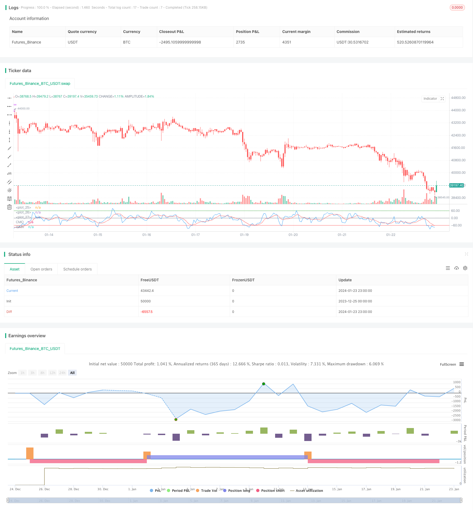

> Name

CMO-and-WMA-Based-Dual-Moving-Average-Trading-Strategy based on CMO and WMA
> Author

ChaoZhang

> Strategy Description


 [trans]

### Overview
This strategy is a dual moving average trading strategy based on the price momentum indicator Chandre Momentum Oscillator (CMO) and its Weighted Moving Average (WMA). It attempts to identify trend reversals and continuation Using CMO crossover and its WMA.
### Strategy Principles
The strategy first calculates CMO, which measures price's online momentum changes. Positive values ​​indicate upward momentum, and negative values ​​indicate downward momentum. Then calculate the WMA of the CMO. When the CMO crosses above its WMA, it takes a bullish stance; when the CMO crosses below its WMA, it takes a bearish stance. This strategy attempts to capture turning points in the trend Using the intersection of CMO and WMA.
The key steps in calculating CMO are:
1. Calculate daily price changes (xMom)
2. Find the n-day SMA for price changes as the "real" price momentum (xSMA_mom)
3. Calculate n-day net price change (xMomLength)
4. Standardize net price change (nRes) by dividing by SMA
5. Find the m-day WMA for the standardized net price change and get CMO (xWMACMO)
The advantage of this strategy is to capture turning points in the mid-term price trend. The absolute value of CMO reflects the strength of the price trend, and WMA is conducive to filtering out false breakthroughs.
### Advantage Analysis
The biggest advantage of this strategy is to use the absolute value of the CMO indicator to judge market sentiment and WMA filtering to identify the turning point of the mid-term trend. Compared with a single moving average strategy, it is better able to capture the mid-term trend with greater flexibility.
CMO standardizes price changes and maps them to the -100 to 100 range to facilitate judgment of market sentiment; the absolute value represents the strength of the current trend. WMA performs additional filtering on CMO to avoid excessive false signals.
### Risk Analysis
The main possible risks of this strategy are:
1. Improper setting of CMO and WMA parameters, resulting in too many false signals
2. Failure to effectively respond to trend fluctuations in the market will result in excessive trading frequency and slippage costs.
3. Unable to identify the true long-term trend, there may be a risk of loss in long-term positions
The corresponding optimization methods are:
1. Adjust the parameters of CMO and WMA to find the optimal parameter combination
2. Add additional filtering conditions, such as trading volume energy indicators, to avoid trading in volatile markets
3. Combine with longer-period indicators, such as the 90-day moving average, to avoid missed opportunities in the long-term trend
### Optimization direction
The optimization direction of this strategy mainly focuses on parameter optimization, signal filtering and stop loss:
1. Parameter optimization of CMO and WMA: find the optimal parameter combination through traversal
2. Combine trading volume, strength indicators and other auxiliary indicators to filter signals to avoid false breakthroughs
3. Add a dynamic stop loss mechanism to stop loss and exit when the price falls below CMO and WMA again.
4. You can consider the Breakout Failure mode as an entry signal, that is, the CMO and WMA first break through the key level, but soon fall below again.
5. Long-term cycle indicators can be combined to determine the general trend and avoid counter-trend trading.
### Summarize
This strategy uses the CMO indicator as a whole to judge the trend strength and turning points, and combines it with WMA to filter to generate trading signals. It is a typical double moving average system. Compared with a single MA strategy, it has a stronger advantage in capturing the elastic mid-term trend. However, there is still room for optimization in parameter settings and filtering. Appropriate control of transaction frequency and the introduction of dynamic stop loss can further improve system stability.
||

### Overview

This strategy is a dual moving average trading strategy based on the price momentum indicator Chandre Momentum Oscillator (CMO) and its Weighted Moving Average (WMA). It attempts to identify trend reversals and continuation using CMO crossover its WMA.  

### Strategy Logic

The strategy first calculates CMO, which measures the net change in price momentum. Positive values indicate upside momentum while negative values indicate downside momentum. It then calculates the WMA of CMO. When CMO crosses above its WMA, a long position is taken; when CMO crosses below its WMA, a short position is taken. The strategy attempts to capture turning points in the trend using CMO and WMA crossovers.

The key steps in calculating CMO are:
1. Calculate the daily price change (xMom) 
2. Take n-day SMA of price change as the "true" price momentum (xSMA_mom)
3. Calculate n-day net price change (xMomLength)  
4. Standardize the net price change (nRes) by dividing by the SMA
5. Take m-day WMA of the standardized net price change to get CMO (xWMACMO)

The advantage of this strategy is capturing medium-term trend reversals in price. The absolute magnitude of CMO reflects the strength of the price run, while the WMA helps filter out false breakouts.

### Advantage Analysis

The biggest advantage of this strategy is using the absolute value of CMO to gauge market crowd sentiment and using the WMA filter to identify turning points in the medium-term trend. Compared to single moving average strategies, it is better able to capture medium-term trends with higher elasticity.

CMO standardizes price changes and maps them into a -100 to 100 range for easier judgment of market crowd sentiment; absolute magnitude represents strength of current trend. The WMA provides additional filtering on CMO to avoid excessive false signals. 

### Risk Analysis

The main risks that may exist in this strategy are:

1. Improper CMO and WMA parameter settings leading to excessive false signals
2. Inability to effectively handle trending oscillations, resulting in high trading frequency and slippage costs  
3. Failure to identify true long term trends, leading to losses in long term positions

Corresponding optimization methods:

1. Adjust CMO and WMA parameters to find optimal combination
2. Add supplementary filters like volume energy to avoid trading in oscillating markets
3. Incorporate longer term indicators like 90-day MA to avoid missing opportunities in long term trends

### Optimization Directions

The main optimization directions for this strategy are around parameter tuning, signal filtering and stop losses:

1. CMO and WMA parameter optimization through brute force testing
2. Supplementary signal filtering using volume, strength indicators etc. to avoid false breakouts 
3. Incorporating dynamic stop losses to exit when price breaks back below CMO and WMA
4. Considering Breakout Failure patterns as entry signals when CMO and WMA first break key levels but quickly fall back
5. Judging the major trend using longer term indicators to avoid counter-trend trading

### Conclusion 

Overall this strategy uses CMO to judge trend strength and turning points, combined with the WMA filter to generate trading signals, a typical dual moving average system. Compared to single MA strategies, it has a stronger advantage in capturing elastic medium-term trends. But there is still room for optimization around parameters, filtering and stop losses. Controlling trade frequency and incorporating dynamic stops can further improve system stability.

[/trans]

> Strategy Arguments


|Argument|Default|Description|
|----|----|----|
|v_input_1|9|Length|
|v_input_2|9|LengthWMA|
|v_input_3|60|BuyZone|
|v_input_4|-60|SellZone|
|v_input_5|false|Trade reverse|


> Source (PineScript)

``` pinescript
/*backtest
start: 2023-12-25 00:00:00
end: 2024-01-24 00:00:00
period: 1h
basePeriod: 15m
exchanges: [{"eid":"Futures_Binance","currency":"BTC_USDT"}]
*/

//@version=3
////////////////////////////////////////////////////////////
//  Copyright by HPotter v1.0 18/10/2018
//    This indicator plots Chandre Momentum Oscillator and its WMA on the 
//    same chart. This indicator plots the absolute value of CMO.
//    The CMO is closely related to, yet unique from, other momentum oriented 
//    indicators such as Relative Strength Index, Stochastic, Rate-of-Change, 
//    etc. It is most closely related to Welles Wilder?s RSI, yet it differs 
//    in several ways:
//    - It uses data for both up days and down days in the numerator, thereby 
//        directly measuring momentum;
//    - The calculations are applied on unsmoothed data. Therefore, short-term 
//        extreme movements in price are not hidden. Once calculated, smoothing 
//        can be applied to the CMO, if desired;
//    - The scale is bounded between +100 and -100, thereby allowing you to clearly 
//        see changes in net momentum using the 0 level. The bounded scale also allows 
//        you to conveniently compare values across different securities.
////////////////////////////////////////////////////////////
strategy(title="CMO & WMA Backtest ver 2.0", shorttitle="CMO & WMA")
Length = input(9, minval=1)
LengthWMA = input(9, minval=1)
BuyZone = input(60, step = 0.01)
SellZone = input(-60, step = 0.01)
reverse = input(false, title="Trade reverse")
hline(BuyZone, color=green, linestyle=line)
hline(SellZone, color=red, linestyle=line)
hline(0, color=gray, linestyle=line)
xMom = abs(close - close[1])
xSMA_mom = sma(xMom, Length)
xMomLength = close - close[Length]
nRes = 100 * (xMomLength / (xSMA_mom * Length))
xWMACMO = wma(nRes, LengthWMA)
pos = 0.0
pos := iff(xWMACMO > BuyZone, 1,
	   iff(xWMACMO < SellZone, -1, nz(pos[1], 0))) 
possig = iff(reverse and pos == 1, -1,
          iff(reverse and pos == -1, 1, pos))	   
if (possig == 1) 
    strategy.entry("Long", strategy.long)
if (possig == -1)
    strategy.entry("Short", strategy.short)	   	    
barcolor(possig == -1 ? red: possig == 1 ? green : blue ) 
plot(nRes, color=blue, title="CMO")
plot(xWMACMO, color=red, title="WMA")
```

> Detail

https://www.fmz.com/strategy/440005

> Last Modified

2024-01-25 17:44:49
