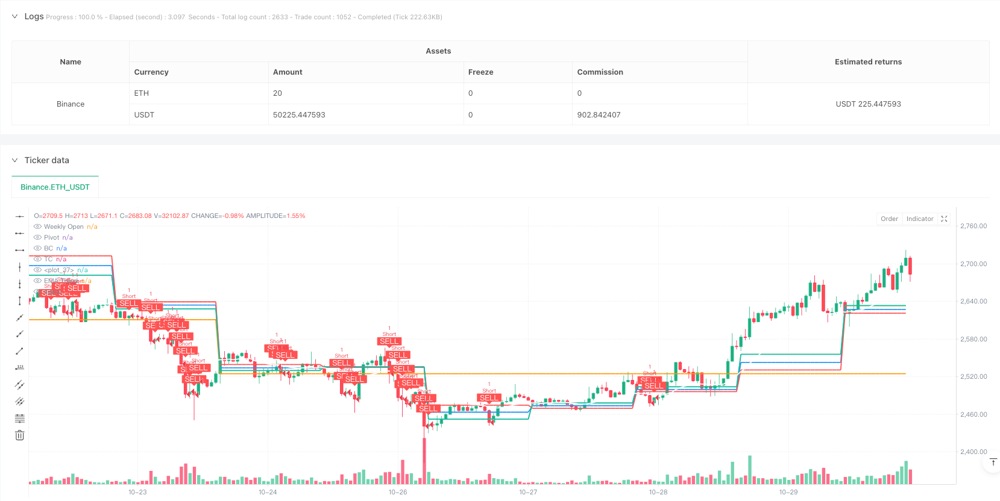
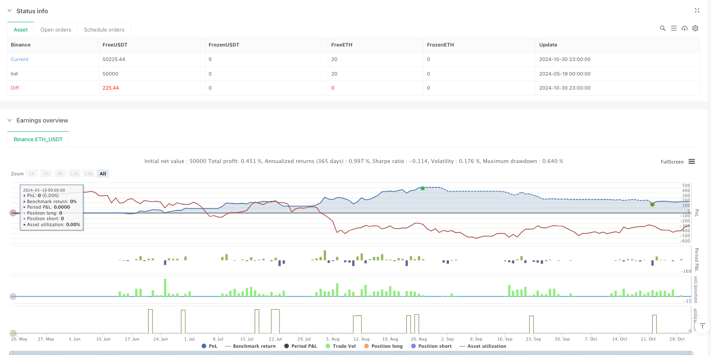

> Name

Multi-Timeframe CPR Breakout Momentum Trading Strategy-Multi-Timeframe-CPR-Breakout-Momentum-Trading-Strategy
> Author

ianzeng123

> Strategy Description





[trans]
#### Overview
This strategy is a trading system based on multiple time period analysis, mainly using the central price range (CPR), exponential moving average (EMA) and relative strength index (RSI) for trading. This strategy uses daily CPR levels, weekly opening prices, and 20-period EMAs to identify market trends and key support and resistance levels, and combines volume confirmation to execute trades.
#### Strategy Principle
The core of the strategy is to find trading opportunities by analyzing the relationship between price and CPR levels. CPR consists of pivot point (Pivot), bottom centerline (BC) and top centerline (TC). When the price breaks through TC and the market is in the long stage, the system will send out a long signal; when the price falls below BC and the market is in the short stage, the system will send out a short signal. The system also uses the 20-period EMA as a trend filter and requires volume to be above the 20-period EMA to confirm the validity of the breakout. In addition, the strategy can optionally use RSI divergence as an additional confirmation indicator.
#### Strategic Advantages
1. Multiple confirmation mechanism: combines triple confirmation of price action, trend direction and trading volume to improve the reliability of trading signals
2. Dynamic risk management: Set dynamic stop loss based on CPR width to adapt to different market environments
3. Flexible customization options: Adjustable CPR time period, EMA length and turning on/off RSI divergence confirmation
4. Asymmetric return ratio: adopting a return-to-risk ratio of 1.5:1 to improve long-term profitability
5. Multi-time cycle analysis: Provide a more comprehensive market perspective by integrating daily and weekly data
#### Strategy Risk
1. False breakthrough risk: False breakthrough signals may appear in volatile markets. It is recommended to use more stringent trading volume filter conditions.
2. Trend reversal risk: There may be a large retracement at the turning point of the trend. The risk can be controlled by narrowing the stop loss range.
3. Parameter sensitivity: Strategy performance is sensitive to parameters such as EMA length and trading volume threshold, and requires regular optimization.
4. Market environment dependence: It may be difficult to achieve the expected return-to-risk ratio in a low-volatility environment
5. Execution slippage: You may face large slippage in fast market conditions, which affects the actual trading effect.
#### Strategy optimization direction
1. Introduce a volatility adaptive mechanism: dynamically adjust stop loss and profit targets based on market volatility
2. Add market status classification: segment trends and consolidation markets, using different trading parameters
3. Optimize the volume filter: consider relative volume changes instead of simple moving average comparisons
4. Improve the exit mechanism: add trailing stop loss and partial profit-taking functions
5. Add time filtering: avoid trading during specific time periods, such as periods of high volatility before and after the market opens and closes
#### Summary
This is a trend following strategy with complete structure and clear logic, which effectively controls trading risks through the combined use of multiple technical indicators. The main advantage of the strategy lies in its flexible parameter settings and complete risk management mechanism, but it also requires traders to pay attention to changes in the market environment and adjust strategy parameters in a timely manner. Through the suggested optimization direction, the stability and profitability of the strategy are expected to be further improved. ||
#### Overview
This strategy is a multi-timeframe trading system that utilizes Central Pivot Range (CPR), Exponential Moving Average (EMA), and Relative Strength Index (RSI) for trading decisions. It identifies market trends and key support/resistance levels using daily CPR levels, weekly open prices, and 20-period EMA, combined with volume confirmation for trade execution.

#### Strategy Principles
The core principle revolves around analyzing price relationships with CPR levels. CPR consists of Pivot Point, Bottom Central (BC), and Top Central (TC) lines. Long signals are generated when price breaks above TC in bullish market phases, while short signals occur when price breaks below BC in bearish phases. The system employs a 20-period EMA as a trend filter and requires volume above the 20-period average to confirm breakouts. Additionally, RSI divergence can be optionally used for extra confirmation.

#### Strategy Advantages
1. Multiple confirmation mechanisms: Combines price action, trend direction, and volume triple confirmation to enhance signal reliability
2. Dynamic risk management: Sets dynamic stop-losses based on CPR width, adapting to different market conditions
3. Flexible customization options: Adjustable CPR timeframes, EMA length, and optional RSI divergence confirmation
4. Asymmetric reward ratios: Employs 1.5:1 reward-to-risk ratio for improved long-term profitability
5. Multi-timeframe analysis: Integrates daily and weekly data for a more comprehensive market perspective

#### Strategy Risks
1. False breakout risk: May generate false signals in ranging markets, suggesting stricter volume filtering
2. Trend reversal risk: Potential for larger drawdowns at trend turning points, manageable through tighter stops
3. Parameter sensitivity: Strategy performance is sensitive to EMA length and volume threshold parameters
4. Market environment dependency: May struggle to achieve target reward ratios in low volatility environments
5. Execution slippage: Can face significant slippage in fast-moving markets, affecting actual trading results

#### Strategy Optimization Directions
1. Implement volatility adaptation: Dynamically adjust stops and targets based on market volatility
2. Enhanced market state classification: Differentiate between trending and ranging markets with separate parameters
3. Refined volume filter: Consider relative volume changes instead of simple moving average comparison
4. Improved exit mechanics: Add trailing stops and partial profit-taking functionality
5. Time-based filtering: Avoid trading during specific periods like market open/close volatile sessions

#### Summary
This is a well-structured trend-following strategy with clear logic, effectively controlling trading risks through multiple technical indicators. Its main strengths lie in flexible parameter settings and comprehensive risk management mechanisms, though traders must remain attentive to changing market conditions and adjust parameters accordingly. Through the suggested optimization directions, the strategy's stability and profitability can be further enhanced.[/trans]


> Source (PineScript)

``` pinescript
//@version=5
strategy("Ahmad Ali Khan CPR Strategy", overlay=true, margin_long=100, margin_short=100)

// ———— Inputs ————
use_daily_cpr = input.bool(true, "Use Daily CPR Levels")
ema_length = input.int(20, "EMA Trend Filter Length")
show_week_open = input.bool(true, "Show Weekly Open Price")
enable_divergence = input.bool(true, "Enable RSI Divergence Check")

// ———— Daily CPR Calculation ————
daily_high = request.security(syminfo.tickerid, "D", high[1], lookahead=barmerge.lookahead_on)
daily_low = request.security(syminfo.tickerid, "D", low[1], lookahead=barmerge.lookahead_on)
daily_close = request.security(syminfo.tickerid, "D", close[1], lookahead=barmerge.lookahead_on)

pivot = (daily_high + daily_low + daily_close) / 3
bc = (daily_high + daily_low) / 2
tc = pivot + (pivot - bc)

// ———— Weekly Open Price ————
weekly_open = request.security(syminfo.tickerid, "W", open, lookahead=barmerge.lookahead_on)

// ———— Trend Analysis ————
ema_trend = ta.ema(close, ema_length)
market_phase = close > ema_trend ? "Bullish" : "Bearish"

// ———— Momentum Confirmation ————
rsi_length = 14
rsi = ta.rsi(close, rsi_length)
bullish_div = ta.valuewhen(ta.crossover(rsi, 30), low, 0) > ta.valuewhen(ta.crossover(rsi, 30), low, 1)
bearish_div = ta.valuewhen(ta.crossunder(rsi, 70), high, 0) < ta.valuewhen(ta.crossunder(rsi, 70), high, 1)

// ———— Plotting ————
// CPR Levels
plot(pivot, "Pivot", color=color.blue, linewidth=2)
plot(bc, "BC", color=color.red, linewidth=2)
plot(tc, "TC", color=color.green, linewidth=2)
fill(plot(bc), plot(tc), color=color.new(color.purple, 90))

// Weekly Open
plot(show_week_open ? weekly_open : na, "Weekly Open", color=color.orange, linewidth=2)

// EMA Trend
plot(ema_trend, "EMA Trend", color=color.white, linewidth=2)

// ———— Strategy Logic ————
long_condition = 
  close > tc and 
  market_phase == "Bullish" and 
  (not enable_divergence or bullish_div) and
  volume > ta.sma(volume, 20)

short_condition = 
  close < bc and 
  market_phase == "Bearish" and 
  (not enable_divergence or bearish_div) and
  volume > ta.sma(volume, 20)

// ———— Risk Management ————
cpr_width = tc - bc
stop_loss_long = bc - (0.5 * cpr_width)
take_profit_long = tc + (1.5 * cpr_width)
stop_loss_short = tc + (0.5 * cpr_width)
take_profit_short = bc - (1.5 * cpr_width)

// ———— Execute Orders ————
if long_condition
    strategy.entry("Long", strategy.long)
    strategy.exit("XL", "Long", stop=stop_loss_long, limit=take_profit_long)
    
if short_condition
    strategy.entry("Short", strategy.short)
    strategy.exit("XS", "Short", stop=stop_loss_short, limit=take_profit_short)

// ———— Signal Plotting ————
plotshape(long_condition, "Buy", shape.labelup, location.belowbar, color=color.green, text="BUY", textcolor=color.white)
plotshape(short_condition, "Sell", shape.labeldown, location.abovebar, color=color.red, text="SELL", textcolor=color.white)
```

> Detail

https://www.fmz.com/strategy/483075

> Last Modified

2025-02-21 11:45:06
