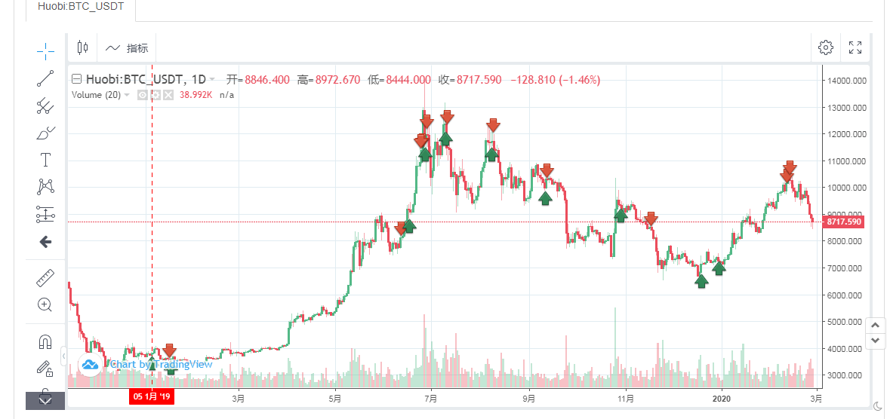
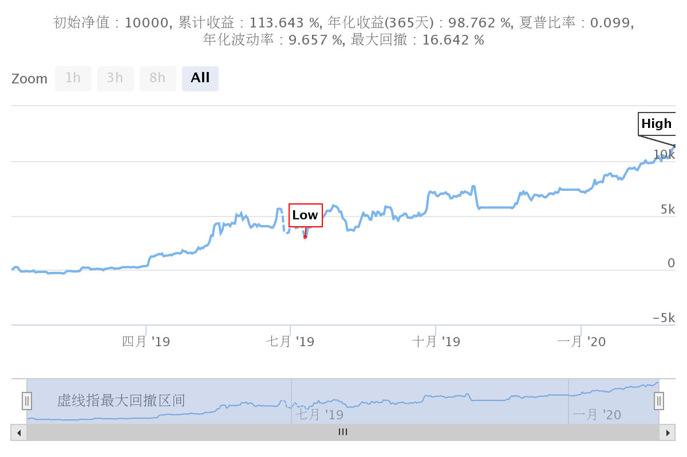

> Name

Calibration value or moving average crossover strategy
> Author

cyberking

> Strategy Description

Calibration value
 High point > btc 10000 || If MA(10)<MA(30), sell;
 The pivot point < btc 6725 || MA(10)>MA(30) is buy;
 Stoploss is 8, 8% stop loss point.
 The cycle is based on the daily line. The backtest data is okay; the backtest data for the cycle below the daily line is not good.
 This strategy uses trend indicators.
*The reason for choosing 10000 and 6725 is based on Gann's ideas.
  
> Strategy Arguments


|Argument|Default|Description|
|----|----|----|
|HGH|10000|High Point|
|MMD|6725|Backbone|
|STOPLOSS|8|Stop loss number|

> Source (MyLanguage)

``` pascal
(*backtest
start: 2019-01-05 00:00:00
end: 2020-02-29 00:00:00
period: 1d
exchanges: [{"eid":"Huobi","currency":"BTC_USDT"}]
*)
//
MA10:=MA(C,10);
MA30:=MA(C,30);

买入开仓价:=VALUEWHEN(BARSBK=1,O);
卖出开仓价:=VALUEWHEN(BARSSK=1,O);
//开仓条件

BUYCONDITION:=REF(C,1) < MMD OR CROSSUP(MA10,MA30);
SELLCONDITION:=REF(C,1) > HGH OR CROSSDOWN(MA10,MA30);

BKVOL=0 AND BUYCONDITION,BK;
SKVOL=0 AND SELLCONDITION,SK;

//离场条件
BKVOL>0 AND SELLCONDITION,SP;
SKVOL>0 AND BUYCONDITION,BP;
// 启动止损
SKVOL>0 AND HIGH>=卖出开仓价*(1+STOPLOSS*0.01),BP;
BKVOL>0 AND LOW<=买入开仓价*(1-STOPLOSS*0.01),SP;
AUTOFILTER;
```

> Detail

https://www.fmz.com/strategy/187874

> Last Modified

2020-03-02 11:22:35
