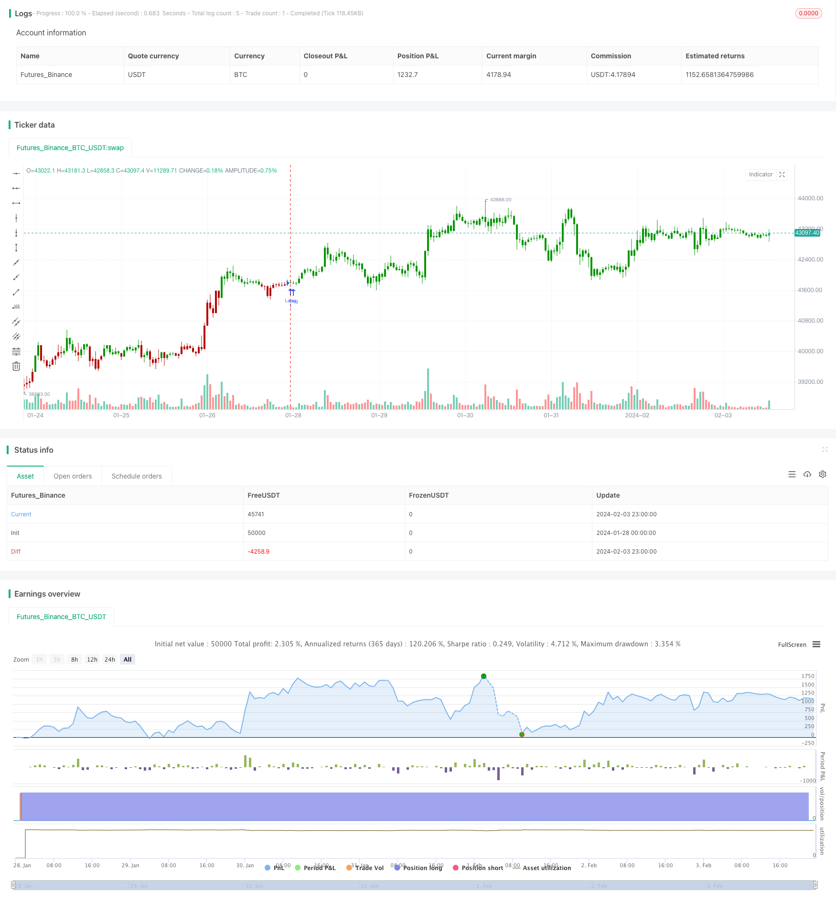

> Name

Quantitative strategy Camarilla-Pivot-Points-Strategy-Based-on-Bollinger-Bands based on Camarilla Pivot-Points-Strategy-Based-on-Bollinger-Bands
> Author

ChaoZhang

> Strategy Description


[trans]
### Overview
The strategy first calculates the Camachilla Pivot Point based on the previous trading day's high, low, and closing prices. Then combine the Bollinger Bands indicator to filter the price and generate a trading signal when the price breaks through the pivot point.
### Strategy Principles
1. Calculate the highest price, lowest price and closing price of the previous trading day
2. Calculate the Camachila pivot line according to the formula, including the upper rail H4, H3, H2, H1 and the lower rail L1, L2, L3, L4
3. Calculate the upper and lower tracks of the Bollinger Band on the 20th
4. Go long when the price crosses the upper rail and the lower rail, and go short when the price crosses the upper rail and the lower rail.
5. Set the stop loss point near the upper or lower track of Bollinger Bands
### Advantage Analysis
1. The Camachila Pivot Line contains multiple key support and resistance levels, enhancing the reliability of trading signals.
2. Combined with the Bollinger Bands indicator, it can effectively filter out false breakthroughs
3. Multiple parameter combinations, flexible transactions
### Risk Analysis
1. Improper setting of Bollinger Bands indicator parameters may lead to incorrect trading signals.
2. The calculation of the key level of Camachila pivot line depends on the price of the previous trading day and may be affected by the overnight gap.
3. There is a risk of loss in both long and short positions.
### Optimization direction
1. Optimize Bollinger Band parameters and find the best parameter combination
2. Combine with other indicators to filter out false breakthrough signals
3. Add stop loss strategy to reduce single loss
### Summarize
This strategy uses a combination of Camachira Pivot Lines and Bollinger Bands indicators to generate trading signals when price breaks through key support and resistance levels. Strategy profitability and stability can be improved through parameter optimization and signal filtering. Generally speaking, this strategy has clear trading ideas and strong operability, and is worthy of real-time verification.
||

### Overview

This strategy first calculates the Camarilla pivot points based on the previous trading day's highest price, lowest price and closing price. It then filters the price with Bollinger Bands indicator to generate trading signals when price breaks through the pivot points.

### Strategy Logic

1. Calculate highest price, lowest price and closing price of previous trading day
2. Calculate Camarilla pivot lines including upper rails H4, H3, H2, H1 and lower rails L1, L2, L3, L4 according to formulas 
3. Calculate 20-day Bollinger Bands upper band and lower band
4. Go long when price breaks above lower band, go short when price breaks below upper band
5. Set stop loss near Bollinger Bands upper or lower band

### Advantage Analysis

1. Camarilla pivot lines contain multiple key support and resistance levels to enhance reliability of trading signals  
2. Combining with Bollinger Bands effectively filters false breakouts
3. Multiple parameter combinations make trading flexible

### Risk Analysis 

1. Improper Bollinger Bands parameter settings may cause wrong trading signals
2. Camarilla pivot points rely on previous trading day's price, may be impacted by overnight gaps
3. Both long and short positions carry loss risks

### Optimization Directions

1. Optimize Bollinger Bands parameters to find best combination
2. Add other indicators to filter false breakout signals 
3. Increase stop loss strategies to reduce single loss

### Summary

This strategy combines Camarilla pivot lines and Bollinger Bands, generating trading signals when price breaks key support and resistance levels. Strategy profitability and stability can be improved through parameter optimization and signal filtering. Overall, this strategy has clear trading logic and high operability, worth live trading verification.

[/trans]

> Strategy Arguments


|Argument|Default|Description|
|----|----|----|
|v_input_1|D|Resolution|
|v_input_2|true|width|
|v_input_3|0|Sell from : R1|R2|R3|R4|
|v_input_4|0|Buu from : S1|S2|S3|S4|
|v_input_5|false|Trade reverse|


> Source (PineScript)

``` pinescript
/*backtest
start: 2024-01-28 00:00:00
end: 2024-02-04 00:00:00
period: 1h
basePeriod: 15m
exchanges: [{"eid":"Futures_Binance","currency":"BTC_USDT"}]
*/

//@version=4
////////////////////////////////////////////////////////////
//  Copyright by HPotter v1.0 12/05/2020
// Camarilla pivot point formula is the refined form of existing classic pivot point formula. 
// The Camarilla method was developed by Nick Stott who was a very successful bond trader. 
// What makes it better is the use of Fibonacci numbers in calculation of levels.
//
// Camarilla equations are used to calculate intraday support and resistance levels using 
// the previous days volatility spread. Camarilla equations take previous day’s high, low and 
// close as input and generates 8 levels of intraday support and resistance based on pivot points. 
// There are 4 levels above pivot point and 4 levels below pivot points. The most important levels 
// are L3 L4 and H3 H4. H3 and L3 are the levels to go against the trend with stop loss around H4 or L4 . 
// While L4 and H4 are considered as breakout levels when these levels are breached its time to 
// trade with the trend.
//
// WARNING:
//  - For purpose educate only
//  - This script to change bars colors.
////////////////////////////////////////////////////////////
strategy(title="Camarilla Pivot Points V2 Backtest", shorttitle="CPP V2", overlay = true)
res = input(title="Resolution", type=input.resolution, defval="D")
width = input(1, minval=1)
SellFrom = input(title="Sell from ", defval="R1", options=["R1", "R2", "R3", "R4"])
BuyFrom = input(title="Buu from ", defval="S1", options=["S1", "S2", "S3", "S4"])
reverse = input(false, title="Trade reverse")
xHigh  = security(syminfo.tickerid,res, high)
xLow   = security(syminfo.tickerid,res, low)
xClose = security(syminfo.tickerid,res, close)
H4 = (0.55*(xHigh-xLow)) + xClose
H3 = (0.275*(xHigh-xLow)) + xClose
H2 = (0.183*(xHigh-xLow)) + xClose
H1 = (0.0916*(xHigh-xLow)) + xClose
L1 = xClose - (0.0916*(xHigh-xLow))
L2 = xClose - (0.183*(xHigh-xLow))
L3 = xClose - (0.275*(xHigh-xLow))
L4 = xClose - (0.55*(xHigh-xLow))
pos = 0
S = iff(BuyFrom == "S1", H1, 
      iff(BuyFrom == "S2", H2,
       iff(BuyFrom == "S3", H3,
         iff(BuyFrom == "S4", H4,0))))
B = iff(SellFrom == "R1", L1, 
      iff(SellFrom == "R2", L2,
       iff(SellFrom == "R3", L3,
         iff(SellFrom == "R4", L4,0))))
pos := iff(close > B, 1,
       iff(close < S, -1, nz(pos[1], 0))) 
possig = iff(reverse and pos == 1, -1,
          iff(reverse and pos == -1 , 1, pos))	   
if (possig == 1) 
    strategy.entry("Long", strategy.long)
if (possig == -1)
    strategy.entry("Short", strategy.short)	 
if (possig == 0) 
    strategy.close_all()
barcolor(possig == -1 ? #b50404: possig == 1 ? #079605 : #0536b3 )
```

> Detail

https://www.fmz.com/strategy/441083

> Last Modified

2024-02-05 14:23:59
