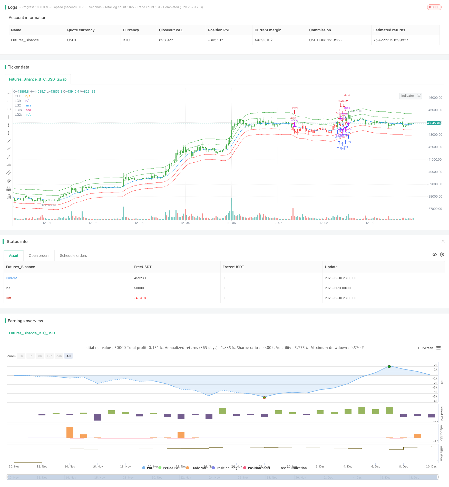

> Name

Center-of-Gravity-Backtesting-Trading-Strategy
> Author

ChaoZhang

> Strategy Description


[trans]

## Overview
The Center of Gravity backtesting trading strategy is a trading strategy based on moving averages. It calculates the "center" of the price, that is, the location of the center of gravity, and constructs a price channel, which serves as a corridor for asset quotes. This strategy can be changed from long to short in the input settings.
## Strategy Principle
This strategy calculates the center of gravity position through a linear regression function. Specifically, it calculates the linear regression value of the closing price for a period of length Length, which is the price "center". Then move up and down Percent% on this basis to build a price channel. The upper and lower boundaries of the price channel serve as long and short signals respectively. When the price breaks through the upper band, go long; when the price falls below the lower band, go short. The SignalLine parameter is used to select whether to use the upper and lower rails of the first channel or the second channel as a trading signal. The reverse parameter is used to reverse long and short positions.
## Advantage Analysis
This is a very simple breakthrough strategy. The main advantages are:
1. The ideas are clear and easy to understand and implement.
2. The backtest results are good and have certain practical feasibility.
3. Parameter settings are flexible and can be adapted to different market environments by adjusting parameters.
4. Configurable reversal method, suitable for two-way operation.
## Risk Analysis
There are also some risks with this strategy:
1. There may be a risk of overfitting during the backtesting process. The real parameters need to be re-optimized.
2. Failure to break through may result in larger losses.
3. The transaction frequency may be relatively high, and the capital utilization rate needs to be controlled.
Risks can be controlled by adjusting parameters Bands, Length, etc. You can also set a stop loss to limit the maximum loss.
## Optimization direction
This strategy can be further optimized:
1. Use trend indicators to filter signals to avoid counter-trend trading.
2. Add a stop loss mechanism.
3. Optimize parameter settings and improve the profit-loss ratio.
4. Increase position control and reduce risks.
## Summarize
The Centered Backtest trading strategy is a simple breakout strategy. It has clear ideas, strong practicality, and flexible parameter settings. At the same time, there are certain risks that require appropriate optimization and control. This strategy is suitable for practice and optimization as a basic strategy, and is also suitable for novices to learn.
||

## Overview

The Center of Gravity backtesting trading strategy is a trading strategy based on moving averages. It calculates the "center" of the price, i.e. the position of the center of gravity, and constructs price channels as corridors for asset quotes. The strategy can change long to short in the Input Settings.

## Strategy Principle  

The strategy calculates the center of gravity position through linear regression function. Specifically, it calculates the linear regression value of the closing price over the Length period, which is the "center" of the price. Price channels are then constructed by moving up and down Percent% on this basis. The upper and lower boundaries of the price channel serve as long and short signals respectively. When the price breaks through the upper rail, go long; when the price breaks below the lower rail, go short. The SignalLine parameter is used to select whether to use the first channel or the second channel's upper and lower rails as trading signals. The reverse parameter is used to reverse long and short.

## Advantage Analysis

This is a very simple breakout strategy with the following main advantages:

1. The idea is clear and easy to understand and implement.  
2. Good backtest results with certain practical feasibility.
3. Flexible parameter settings to adapt to different market environments. 
4. Configurable reversal trading, suitable for two-way operation.

## Risk Analysis

The strategy also has some risks:

1. There may be overfitting risks in the backtest process. Parameters need to be re-optimized for live trading.
2. Failed breakouts can lead to large losses.
3. The trading frequency may be relatively high, so the capital usage ratio needs to be controlled.  

Risks can be controlled by adjusting parameters like Bands, Length, etc. Stop loss can also be set to limit maximum loss.

## Optimization Directions  

The strategy can be further optimized in the following ways:

1. Combine with trend indicators to filter signals and avoid trading against the trend.
2. Add stop loss mechanism.  
3. Optimize parameter settings to increase profit ratio.
4. Add position control to reduce risk.

## Summary  

The Center of Gravity backtesting trading strategy is a simple breakout strategy. It has clear logic, good practicability, and flexible parameter settings. At the same time, there are also certain risks that need to be properly optimized and controlled. The strategy is suitable as a basic strategy for live trading and optimization, and is also very suitable for beginners to learn.

[/trans]

> Strategy Arguments


|Argument|Default|Description|
|----|----|----|
|v_input_1|20|Length|
|v_input_2|5|m|
|v_input_3|true|Percent|
|v_input_4|true|Trade from line (1 or 2)|
|v_input_5|false|Trade reverse|


> Source (PineScript)

``` pinescript
/*backtest
start: 2023-11-11 00:00:00
end: 2023-12-11 00:00:00
period: 1h
basePeriod: 15m
exchanges: [{"eid":"Futures_Binance","currency":"BTC_USDT"}]
*/

//@version=2
////////////////////////////////////////////////////////////
//  Copyright by HPotter v1.0 15/03/2018
// The indicator is based on moving averages. On the basis of these, the 
// "center" of the price is calculated, and price channels are also constructed, 
// which act as corridors for the asset quotations.
//
// You can change long to short in the Input Settings
// WARNING:
//  - For purpose educate only
//  - This script to change bars colors.
////////////////////////////////////////////////////////////
strategy(title="Center Of Gravity Backtest", shorttitle="CFO", overlay = true)
Length = input(20, minval=1)
m = input(5, minval=0)
Percent = input(1, minval=0)
SignalLine = input(1, minval=1, maxval = 2, title = "Trade from line (1 or 2)")
reverse = input(false, title="Trade reverse")
xLG = linreg(close, Length, m)
xLG1r = xLG + ((close * Percent) / 100)
xLG1s = xLG - ((close * Percent) / 100)
xLG2r = xLG + ((close * Percent) / 100) * 2
xLG2s = xLG - ((close * Percent) / 100) * 2
xSignalR = iff(SignalLine == 1, xLG1r, xLG2r)
xSignalS = iff(SignalLine == 1, xLG1s, xLG2s)
pos = iff(close > xSignalR, 1,
       iff(close < xSignalS, -1, nz(pos[1], 0))) 
possig = iff(reverse and pos == 1, -1,
          iff(reverse and pos == -1, 1, pos))	   
if (possig == 1) 
    strategy.entry("Long", strategy.long)
if (possig == -1)
    strategy.entry("Short", strategy.short)	   	    
barcolor(possig == -1 ? red: possig == 1 ? green : blue ) 
plot(xLG, color=blue, title="CFO")
plot(xLG1r, color=green, title="LG1r")
plot(xLG2r, color=green, title="LG2r")
plot(xLG1s, color=red, title="LG1s")
plot(xLG2s, color=red, title="LG2s")
```

> Detail

https://www.fmz.com/strategy/435152

> Last Modified

2023-12-12 16:56:51
