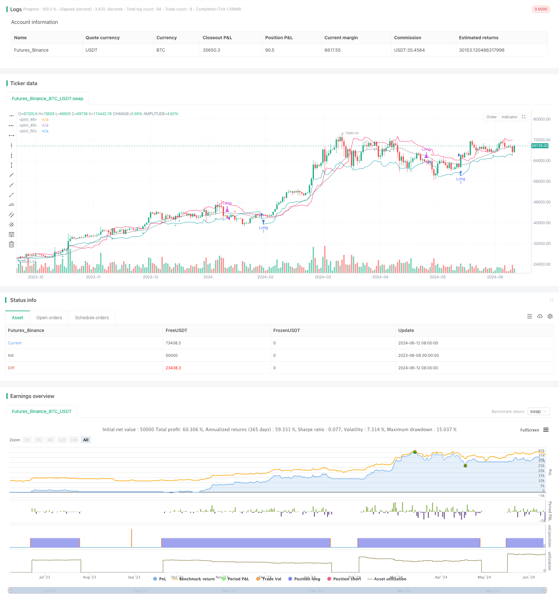

> Name

Chande-Kroll Stop-Dynamic-ATR Trend Following Strategy-Chande-Kroll-Stop-Dynamic-ATR-Trend-Following-Strategy
> Author

ChaoZhang

> Strategy Description



[trans]
#### Overview
The Chande-Kroll Stop Loss Dynamic ATR Trend Following Strategy is a quantitative trading strategy based on the Chande-Kroll Stop Loss indicator and the Simple Moving Average (SMA). This strategy is designed to capture the market's upward trend while using dynamic stops to manage risk. The Chande-Kroll stop loss indicator dynamically adjusts the stop loss level based on the average true range (ATR) to adapt to different market fluctuations. The 21-period SMA is used as a trend filter to ensure trades are placed in the direction of the main trend.
#### Strategy Principle
The core of this strategy is the Chande-Kroll Stop Loss indicator, which uses ATR to calculate dynamic stop loss levels. ATR measures market volatility, and stop loss levels are dynamically adjusted based on ATR and multipliers. This ensures that stop loss positions are adapted to current market conditions. At the same time, the 21-period SMA serves as a trend filter. Only when the closing price is higher than the SMA, the long signal will be triggered. This helps avoid trading in a bear market.
Conditions for going long: When the closing price breaks through the Chande-Kroll lower track and is higher than the 21-period SMA, start going long.
Conditions for closing the position: When the closing price falls below the Chande-Kroll upper track, the position will be closed.
#### Strategic Advantages
1. Dynamic stop loss: The Chande-Kroll stop loss indicator calculates the dynamic stop loss level based on ATR, which can adapt to different market fluctuations and improve the effectiveness of the stop loss.
2. Trend following: The 21-period SMA serves as a trend filter to ensure that transactions follow the main trend direction and reduce the risk of counter-trend trading.
3. Parameter flexibility: Strategy parameters such as ATR period, ATR multiplier, stop loss period and SMA period can be adjusted according to user preferences to improve the adaptability of the strategy.
4. Position size management: The position size is dynamically adjusted according to the risk multiplier and current market fluctuations to achieve dynamic risk management.
#### Strategy Risk
1. Parameter optimization risk: Strategy parameters need to be optimized according to different market conditions and trading varieties. Improper parameter settings may lead to poor strategy performance.
2. Trend identification risk: In a volatile market or early stage of trend reversal, the strategy may generate wrong signals, leading to losses.
3. Slippage and transaction costs: In actual transactions, slippage and transaction costs will affect the net income of the strategy.
Risk management measures include: comprehensive backtesting and parameter optimization of the strategy; in actual transactions, strictly follow the strategy rules and control the risk of each transaction; regularly evaluate the strategy performance and make adjustments when necessary.
#### Strategy optimization direction
1. Long and short two-way trading: The current strategy only has long signals, which can be expanded to long and short two-way trading to fully capture opportunities in different market environments.
2. Dynamic parameter optimization: Use machine learning or optimization algorithms to adjust strategy parameters in real time according to market conditions to improve adaptability.
3. Combine other technical indicators: introduce other trend or oscillator indicators, build a multi-factor strategy, and improve the reliability of signals.
4. Add market sentiment indicators: Combined with market sentiment indicators such as VIX, etc., control transactions during extreme market sentiments and improve risk management capabilities.
#### Summary
The Chande-Kroll stop loss dynamic ATR trend following strategy is a quantitative trading strategy based on the principles of dynamic stop loss and trend following. Through the combination of Chande-Kroll stop loss indicator and SMA trend filter, this strategy can effectively manage risks while capturing the upward trend. The flexibility of strategy parameters and dynamic adjustment of position sizes further enhance the adaptability of the strategy. Although the strategy has certain risks, through reasonable risk management measures and continuous optimization and improvement, the strategy is expected to achieve long-term stable returns.
|| 

#### Overview
The Chande-Kroll Stop Dynamic ATR Trend Following Strategy is a quantitative trading strategy based on the Chande-Kroll stop indicator and the Simple Moving Average (SMA). The strategy aims to capture upward market trends while managing risk using dynamic stop-loss levels. The Chande-Kroll stop indicator dynamically adjusts stop-loss levels based on the Average True Range (ATR) to adapt to different market volatility conditions. The 21-period SMA is used as a trend filter to ensure trades are made in the direction of the primary trend.

#### Strategy Principles
The core of the strategy is the Chande-Kroll stop indicator, which uses ATR to calculate dynamic stop-loss levels. ATR measures market volatility, and the stop-loss levels are dynamically adjusted based on ATR and a multiplier. This ensures that the stop-loss positions adapt to current market conditions. Additionally, the 21-period SMA acts as a trend filter, and long signals are triggered only when the closing price is above the SMA. This helps avoid trading during bear markets.
Long entry condition: When the closing price breaks above the Chande-Kroll lower band and is above the 21-period SMA, a long position is initiated.
Exit condition: When the closing price falls below the Chande-Kroll upper band, the position is closed.

#### Strategy Advantages
1. Dynamic stop-loss: The Chande-Kroll stop indicator calculates dynamic stop-loss levels based on ATR, adapting to different market volatility conditions and improving the effectiveness of stop-losses.
2. Trend following: The 21-period SMA acts as a trend filter, ensuring trades align with the primary trend direction and reducing the risk of counter-trend trading.
3. Parameter flexibility: Strategy parameters such as ATR period, ATR multiplier, stop-loss period, and SMA period can be adjusted according to user preferences, enhancing the adaptability of the strategy.
4. Position sizing: Position sizes are dynamically adjusted based on the risk multiplier and current market volatility, achieving dynamic risk management.

#### Strategy Risks
1. Parameter optimization risk: Strategy parameters need to be optimized based on different market conditions and trading instruments. Improper parameter settings may lead to poor strategy performance.
2. Trend identification risk: During range-bound markets or early trend reversals, the strategy may generate false signals, resulting in losses.
3. Slippage and transaction costs: In actual trading, slippage and transaction costs will affect the net returns of the strategy.
Risk management measures include: conducting comprehensive backtesting and parameter optimization of the strategy; strictly following strategy rules and controlling the risk of each trade in actual trading; regularly evaluating strategy performance and making adjustments when necessary.

#### Strategy Optimization Directions
1. Long-short trading: Currently, the strategy only has long signals. It can be extended to long-short trading to fully capture opportunities in different market environments.
2. Dynamic parameter optimization: Use machine learning or optimization algorithms to adjust strategy parameters in real-time based on market conditions, improving adaptability.
3. Combining other technical indicators: Introduce other trend or oscillator indicators to build a multi-factor strategy and improve signal reliability.
4. Incorporating market sentiment indicators: Combine market sentiment indicators such as VIX to control trading during extreme market sentiment and enhance risk management capabilities.

#### Summary
The Chande-Kroll Stop Dynamic ATR Trend Following Strategy is a quantitative trading strategy based on dynamic stop-loss and trend-following principles. By combining the Chande-Kroll stop indicator and the SMA trend filter, the strategy can capture upward trends while effectively managing risk. The flexibility of strategy parameters and dynamic position sizing further enhance the adaptability of the strategy. Although the strategy has certain risks, with reasonable risk management measures and continuous optimization and improvement, the strategy has the potential to achieve long-term stable returns.

[/trans]


> Source (PineScript)

``` pinescript
/*backtest
start: 2023-06-08 00:00:00
end: 2024-06-13 00:00:00
period: 1d
basePeriod: 1h
exchanges: [{"eid":"Futures_Binance","currency":"BTC_USDT"}]
*/

//@version=5
strategy("Chande Kroll Stop Strategy", overlay=true, initial_capital = 1000, commission_type = strategy.commission.percent, commission_value = 0.01, slippage = 3)

// Chande Kroll Stop parameters
calcMode = input.string(title="Calculation Mode", defval="Exponential", options=["Linear", "Exponential"])
riskMultiplier = input(5, "Risk Multiplier")
atrPeriod = input(10, "ATR Period")
atrMultiplier = input(3, "ATR Multiplier")
stopLength = input(21, "Stop Length")
smaLength = input(21, "SMA Length")

// Calculate ATR
atr = ta.atr(atrPeriod)

// Calculate Chande Kroll Stop
highStop = ta.highest(high, stopLength) - atrMultiplier * atr
lowStop = ta.lowest(low, stopLength) + atrMultiplier * atr

sma21 = ta.sma(close, smaLength)

// Entry and Exit conditions
longCondition = ta.crossover(close, lowStop) and close > sma21
exitLongCondition = close < highStop

// Funktion zur Berechnung der Menge
calc_qty(mode, riskMultiplier) =>
    lowestClose = ta.lowest(close, 1560)
    if mode == "Exponential"
        qty = riskMultiplier / lowestClose * 1000 * strategy.equity / strategy.initial_capital
    else
        qty = riskMultiplier / lowestClose * 1000

// Berechnung der Menge basierend auf der Benutzerwahl
qty = calc_qty(calcMode, riskMultiplier)

// Execute strategy
if (longCondition)
    strategy.entry("Long", strategy.long, qty=qty)
    alert("Buy Signal", alert.freq_once_per_bar_close)

if (exitLongCondition)
    strategy.close("Long")
    alert("Sell Signal", alert.freq_once_per_bar_close)

// Plotting
plotshape(series=longCondition, location=location.belowbar, color=#0097a7, style=shape.triangleup, size=size.small, title="Buy Signal")
plotshape(series=ta.crossunder(close, highStop), location=location.abovebar, color=#ff195f, style=shape.triangledown, size=size.small, title="Sell Signal")
plot(sma21, color=color.gray)
plot(highStop, color=#0097a7)
plot(lowStop, color=#ff195f)


```

> Detail

https://www.fmz.com/strategy/454137

> Last Modified

2024-06-14 15:15:43
