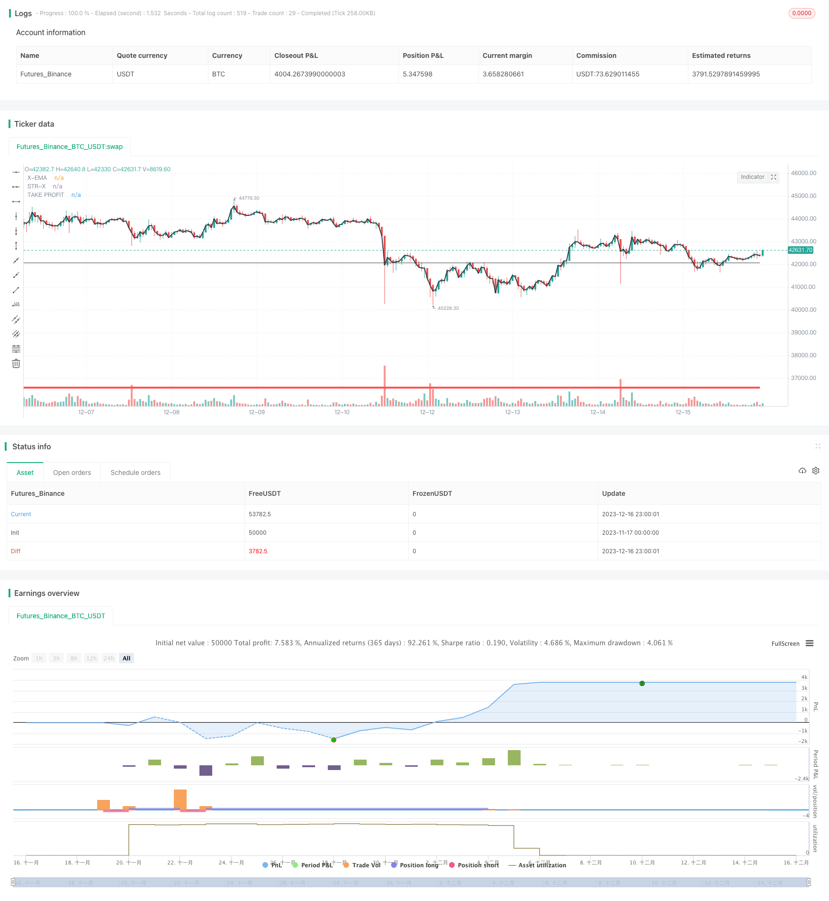

> Name

Channel-Trend-Strategy based on opening price channel trend strategy
> Author

ChaoZhang

> Strategy Description


 [trans]

### Overview
The channel trend strategy is a trend following strategy based on the opening price and the Donchian channel. It identifies the trend direction by drawing a trend line from the current price to the opening price, combined with the price channel formed by the Donchian channel. Trading signals are generated when price breaks out of the channel.
### Strategy Principles
1. Select a time period (daily, weekly, etc.) and obtain the opening price of that period as the base price.
2. Use the Donchian channel indicator to calculate the N-day moving average of the highest price and lowest price of the period to form a price channel.
3. Draw a straight line from the current closing price to the opening price of the period as the trend baseline.
4. When the closing price breaks through the upper edge of the Donchian channel, a buy signal is generated; when the closing price breaks through the lower edge of the channel, a sell signal is generated.
5. Set up a stop-profit and stop-loss strategy.
This strategy can lock the trend direction through the combination of baseline and channel lines, generate continuous signals when the trend exists, and filter out some noise.
### Advantage Analysis
1. Using the opening price as the strategy baseline can effectively determine price trend changes in different time periods.
2. The Donchian channel indicator can effectively filter out the impact of short-term fluctuations on the baseline.
3. Combined with the baseline and Donchian channel, signals can be generated when the trend is clear to avoid false breakthroughs.
4. Automatically set the stop-profit and stop-loss positions, which can lock in part of the profit and control risks.
5. This strategy has fewer parameters, is not difficult to implement, and is easy to master.
### Risk Analysis
1. It is easy to generate many invalid signals in the consolidation market.
2. If the parameters are set improperly and the stop loss point is too close, the trade may be stopped prematurely.
3. This strategy relies more on trend market conditions and is not suitable for the FREQ strategy.
4. In abnormal market conditions, the price may directly break through the stop loss line, resulting in huge losses.
### Optimization direction
1. You can test different cycle parameters and choose the cycle that generates the smoothest signal.
2. Donchian channel parameters can be adjusted to set a more appropriate channel width.
3. The take-profit and stop-loss ratios can be optimized according to the characteristics of different varieties.
4. Other indicator filters can be added to avoid the generation of signals under abnormal market conditions.
### Summarize
The channel trend strategy uses the channel line formed by the opening price and the Donchian channel to identify the price trend direction. It can generate easy-to-read continuous signals, lock in profits and control risks by setting take-profit and stop-loss, and is a very practical trend following strategy. By continuously testing and optimizing parameters, this strategy can be applied to different varieties and obtain better returns in trending markets.
|| 

### Overview

The Channel Trend strategy is a trend following strategy based on the opening price and Donchian Channel. It identifies trend direction by plotting a line from current price to the trend line benchmarked on opening price, combined with the price channel formed by Donchian Channel. Trading signals are generated when price breaks through the channel.

### Strategy Logic  

1. Select a timeframe (daily, weekly etc.) and get its opening price as the benchmark price.

2. Calculate the N-day moving average of highest price and lowest price using Donchian Channel indicator, forming a price channel.  

3. Draw a straight line from current closing price to the opening price of that timeframe, as the trend benchmark line.

4. When closing price breaks through the upper band of Donchian Channel, a buy signal is generated. When closing price breaks through the lower band, a sell signal is generated.

5. Set stop loss and take profit strategy.

The combination of benchmark line and channel lines locks in trend direction and generates persistent signals when trend exists, while filtering out some noise.

### Advantage Analysis

1. Using opening price as strategy benchmark line can effectively determine price trend changes within different timeframes.

2. Donchian Channel indicator can effectively eliminate the impact of short-term fluctuations on the benchmark line.  

3. The combination of benchmark line and Donchian Channel can generate signals when trend is clear, avoiding false breakouts.

4. Automatic stop loss and take profit setting locks in some profits and controls risks.

5. This strategy has few parameters and is easy to implement.

### Risk Analysis  

1. It may generate more invalid signals during range-bound market.

2. If parameters are set improperly, stop loss may be triggered prematurely.

3. This strategy relies more on trending market and is not suitable for mean-reversion strategies.

4. In abnormal market condition, price may break through stop loss line directly resulting in huge loss.

### Optimization Direction  

1. Test different timeframe parameters to select the smoothest one for signal generation.

2. Adjust parameters of Donchian Channel to set more suitable channel width.

3. Optimize stop loss and take profit ratios based on different product characteristics. 

4. Add other indicator filters to avoid signals generated in abnormal market conditions.

### Summary

The Channel Trend strategy utilizes the channel lines formed by opening price and Donchian Channel to identify price trend direction. It can generate easy-to-read persistent signals, locks in profits and controls risks through stop loss and take profit setting, making it a very practical trend following strategy. Through constant testing and parameter optimization, this strategy can be applied to different products and achieve good returns in trending markets.

[/trans]

> Strategy Arguments


|Argument|Default|Description|
|----|----|----|
|v_input_string_1|M|TIMELINE|
|v_input_int_1|21|length|
|v_input_int_2|15|Take Profit %|


> Source (PineScript)

``` pinescript
/*backtest
start: 2023-11-17 00:00:00
end: 2023-12-17 00:00:00
period: 1h
basePeriod: 15m
exchanges: [{"eid":"Futures_Binance","currency":"BTC_USDT"}]
*/

//@version=5
//
strategy("STR-TREND", overlay=true)

emax = ta.ema(close,1)
plot(emax,title="X-EMA",color=color.black,linewidth=2)

XDX = input.string(title="TIMELINE", defval="M")
xdaily = request.security(syminfo.tickerid, XDX, open,barmerge.gaps_off, barmerge.lookahead_on)
length = input.int(21, minval=1)
lower = ta.lowest(xdaily,length)
upper = ta.highest(xdaily,length)
XXX = close>upper?lower:upper
plot(XXX,title="STR-X",color=color.red,linewidth=4)

TAKEPROFIT = input.int(15,title="Take Profit %", minval=1)
SELLTAKEPROFIT = XXX * (1-(TAKEPROFIT/100))
BUYTAKEPROFIT = XXX * (1+(TAKEPROFIT/100))
TAKEPROFITX = close<XXX?SELLTAKEPROFIT:BUYTAKEPROFIT
plot(TAKEPROFITX,title="TAKE PROFIT",color=color.black,linewidth=1)


//////////////STRATEGY ///////////////////

buystat= ta.crossover(close,XXX) 
sellstat = ta.crossunder(close,XXX) 

plotshape(buystat==true, title='long', text='BUY', textcolor=color.new(color.white, 0), style=shape.labelup, location=location.belowbar, color=color.new(color.green, 0), size=size.tiny) 
plotshape(sellstat==true, title='short', text='SELL', textcolor=color.new(color.white, 0), style=shape.labeldown, location=location.abovebar, color=color.new(color.red, 0), size=size.tiny) 

//////////////STRATEGY ///////////////////

strategy.entry("LONG", strategy.long, when = buystat==true, comment="")
strategy.exit("BUY TP", "LONG", qty_percent = 50 ,limit = BUYTAKEPROFIT)
strategy.close("LONG", when = sellstat==true, comment="")

strategy.entry("SHORT", strategy.short, when = sellstat==true, comment="")
strategy.exit("SELL TP", "SHORT", qty_percent = 50 ,limit = SELLTAKEPROFIT)
strategy.close("SHORT", when = buystat==true , comment="")


```

> Detail

https://www.fmz.com/strategy/435725

> Last Modified

2023-12-18 12:35:42
