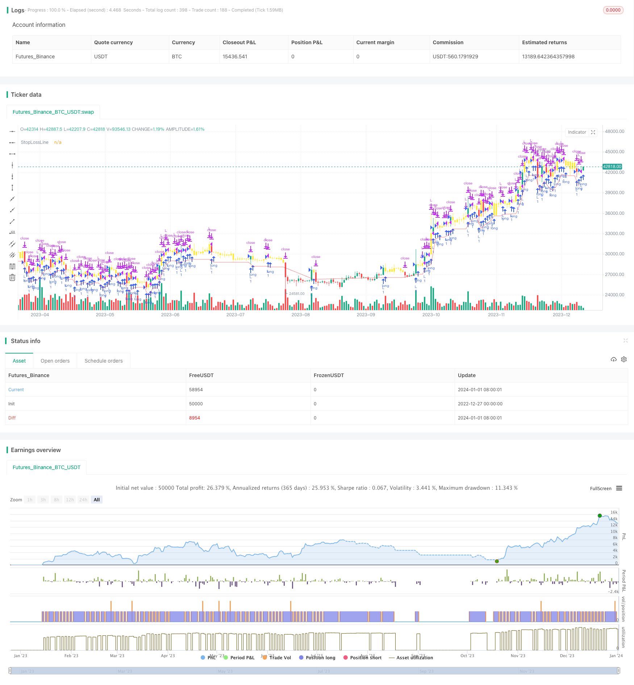

> Name

Close-Buying-Next-Open-Profit-Taking-Strategy Close-Buying-Next-Open-Profit-Taking-Strategy
> Author

ChaoZhang

> Strategy Description



[trans]

## Overview
The main idea of ​​this strategy is to buy before the closing of the day, and after the opening of the next day, determine whether the price is higher than the buying price. If it is higher, take profit and sell. If it is not higher, continue to hold until stop loss or take profit.
## Strategy Principle
This strategy first sets the 200-day simple moving average as an indicator of market status, and only allows trading when the price is higher than the 200-day moving average. In addition, the daily buying time is set to be within half an hour before the closing time, and the selling time is set to be within half an hour after the opening of the next day. During the buying time, if the market condition meets the market price, buy at the market price. During the selling time, judge whether the price is higher than the buying price. If it is higher than the market price, sell and take profit. If it is not higher, continue to hold until the stop loss or judge again at tomorrow's selling time. At the same time, a 5% stop loss line was set to prevent losses from expanding.
## Advantage Analysis
This strategy has the following advantages:
1. Taking advantage of the closing effect, the market will fluctuate greatly at the closing time and easily form a large gap. The opening price of the next day may rise or fall significantly.
2. With a shorter holding period, you can quickly stop losses and profits and reduce risks.
3. Relatively simple logic, easy to understand and implement.
4. You can flexibly set stop loss lines and market status judgment indicators to control risks.
## Risk Analysis
There are also some risks with this strategy:
1. If you buy at the closing time, the price may be high, which increases the risk of loss.
2. The holding period is short and it is easy to get stuck. If there is no price limit the next day, it may be held.
3. Rely on the emergence of a large gap. If there is no gap, you may lose money or hold a position.
4. If you choose the wrong target, such as the stock index trading sideways, you may suffer multiple losses.
Corresponding solutions:
1. Technical indicators can be combined to determine whether the closing price is at a relatively low level.
2. The holding period can be appropriately lengthened, such as holding for 2-3 days.
3. Choose a position to buy when there is an effective breakthrough.
4. Screen the targets and select those with an upward trend.
## Optimization direction
This strategy can also be optimized from the following aspects:
1. Add more technical indicator judgments to the buying conditions to ensure higher certainty of closing buying timing.
2. Test different holding periods and find the optimal take-profit time.
3. Optimize the stop loss line and find the optimal stop loss point.
4. Test which specific targets and market environments perform better, and adopt dynamic target and position management.
## Summarize
The overall idea of ​​this strategy is clear, and it uses the gap formed by the closing effect to conduct fast-paced stop-profit and stop-loss transactions. It has the advantages of simple operation and easy implementation. However, there is also a greater risk of being trapped, and stock selection and stop loss are very important. In the later stage, optimization can be carried out from aspects such as determining buy signals, optimizing holding cycles and stop loss points, dynamic position management, etc., to improve system stability and profitability while controlling risks.
||

## Overview

The main idea of this strategy is to buy at the close on the current day and sell at open on the next day if the price is higher than the buying price, otherwise continue holding until stop loss or profit taking.

## Strategy Logic

The strategy first sets a 200-day simple moving average as the market state indicator, allowing trading only when the price is above the 200-day line. The buying time is set to the last half hour before the close every day, and the selling time is set to the first half hour after the next open. When the market state meets the requirement during buying time, it will place a market order to buy. During selling time, it will check if the price is higher than the buying price, if yes, it will place a market order to sell and take profit, otherwise, it continues holding until stop loss or profit taking tomorrow. It also sets a 5% stop loss line to limit losses.

## Advantage Analysis  

The strategy has the following advantages:

1. Utilize the closing effect where price fluctuation and gap are larger during closing. The next open price may have a large swing.

2. The short holding period allows quick stop loss and profit taking to reduce risks.

3. The logic is simple and easy to understand and implement.  

4. Flexible configuration on stop loss line and market state indicator to control risks.

## Risk Analysis

There are also some risks:  

1. Buying at the closing price may take positions at high prices, increasing loss risk.

2. The short holding period makes it easy to be trapped. There may be no limit up or down the next day.

3. It relies on large gaps, which may not always form, leading to losses or trapped positions.  

4. Choosing the wrong symbol, like index consolidation, may lead to multiple losses.

Solutions:

1. Combine technical indicators to ensure buying at a relative bottom at closing.  

2. Extend holding period to 2-3 days. 

3. Only buy at valid breakout moments.  

4. Careful symbol selection, choose symbols with an uptrend.

## Optimization Directions

The strategy can be optimized in the following aspects:

1. Add more technical indicators for buying signal to improve certainty.  

2. Test different holding periods to find the optimal profit-taking time.

3. Optimize the stop loss line to find the optimal stop loss point.

4. Test performance across different symbols and market environments, adopt dynamic symbol and position management.

## Summary  

The strategy has clear logic, utilizing the closing gap effect for quick stop loss/profit trading. It is easy to implement and understand. But it also has high trap risks. Position sizing, stop loss management and stock picking are critical. It can be further optimized on improving buying certainty, optimal holding period and stop loss point, and dynamic position sizing to improve stability and profitability while controlling risk.

[/trans]

> Strategy Arguments


|Argument|Default|Description|
|----|----|----|
|v_input_1|200|MarketFilterLen|
|v_input_2|0.95|StopLossPerc|


> Source (PineScript)

``` pinescript
/*backtest
start: 2022-12-27 00:00:00
end: 2024-01-02 00:00:00
period: 1d
basePeriod: 1h
exchanges: [{"eid":"Futures_Binance","currency":"BTC_USDT"}]
*/

//  @version=4
//  © HermanBrummer
//  This source code is subject to the terms of the Mozilla Public License 2.0 at https://mozilla.org/MPL/2.0/
strategy("M8 BUY @ END OF DAY", "", 1)

///         BUYS AT THE END OF THE DAY
///         SELLS THE NEXT MORNING IF PRICE IS HIGHER THEN THE ENTRY PRICE
///         IF PRICE IS NOT HIGHER THEN IT WILL KEEP THE POSITION AND WAIT FOR EITHER A STOP OUT OR FOR PRICE TO BE HIGHER THAN THE ENTRY
///         USES A 5% STOP LOSS ON THE REDLINE  -- SETTABLE IN SETTINGS
///         USES A 200 DAY MARKET FILTER        -- SETTABLE IN SETTINGS -- IMPORTS DATA FROM HIGHER TIMEFRAME, BUT USES CLOSE[2] << SO THIS IS FIXED, NON-REPAITING DATA


MarketFilterLen = input(200)
StopLossPerc    = input(.95, step=0.01)

buyTime         = time(timeframe.period, "1429-1500")
sellTime        = time(timeframe.period, "0925-0935")

F1              = close > sma(security(syminfo.tickerid, "D", close[2]), MarketFilterLen) // HIGH OF OLD DATA -- SO NO REPAINTING

enter           = buyTime and F1
exit            = sellTime


StopLossLine    = strategy.position_avg_price * StopLossPerc

plot(StopLossLine, "StopLossLine", color.new(#FF0000, 50))

strategy.entry("L", true, when=enter)
strategy.exit("StopLoss", stop=StopLossLine )
if  close > strategy.position_avg_price
    strategy.close("L", when=exit)

barcolor(strategy.opentrades != 0 ? color.new(color.yellow, 0) : na ) 

```

> Detail

https://www.fmz.com/strategy/437544

> Last Modified

2024-01-03 16:19:01
