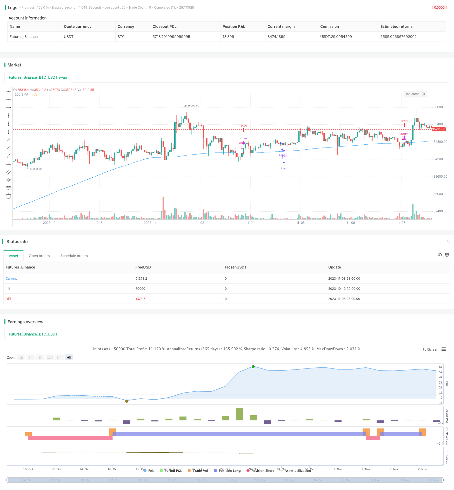

> Name

Closing-Position-Strategy Closing-Position-Strategy
> Author

ChaoZhang

> Strategy Description


[trans]

## Overview
The core idea of ​​this strategy is to buy the underlying price at the close of the day and sell it at the opening of the next day, in order to profit from the increase in the price of the underlying price at the opening.
## Strategy Principle
This strategy is mainly based on two judgments:
1. Day traders usually tend to buy at the opening, thereby driving up the stock price at the opening.
2. The underlying price at closing is relatively more reflective of the true value of the underlying.
Specifically, this strategy first determines whether the closing price of the day is higher than the 200-day simple moving average at the close of each day (20:00). If it is higher than the average, it goes long at the close; if the closing price is lower than the average, it goes short at the close.
At the opening of the next day (9:30), if a long position was held on the previous day, the position will be closed at the opening; if a short position was held, the position will be closed at the opening.
By buying at a low closing price and selling at a high opening price, you can make profits by taking advantage of the increase in the opening stock price.
## Advantage Analysis
This strategy mainly has the following advantages:
1. Take advantage of the inertial thinking of day traders, that is, the characteristics of stock prices rising at the opening, and sell the underlying stock at the opening to obtain profits.
2. Using the 200-day moving average to determine the price trend is helpful for grasping the general trend and operating.
3. The operation frequency is low. There are only two time points for judgment and trading every day, the opening and closing time, which reduces transaction costs.
4. The backtest data is sufficient, and historical data can be used to judge the rationality of the rule parameters to increase confidence.
5. The programmed trading system has high execution efficiency and prevents human emotions from affecting trading decisions.
## Risk Analysis
This strategy also has certain risks:
1. The probability of the opening price reversal exists. If the opening price reverses significantly in the opposite direction, losses will occur.
2. The possibility of the closing price being artificially manipulated. If the closing price is deliberately pushed up or down, it will affect decision-making.
3. The suspension of the underlying trading may result in the inability to close the position at the opening, resulting in losses.
4. Targets with higher transaction costs are not suitable for this higher frequency strategy.
5. Unreasonable parameter settings may lead to excessive transaction frequency or poor results.
Risk-based solutions include:
1. Set a stop loss point to control the maximum loss.
2. Use methods such as trading volume or right restoration to judge the reliability of the closing price.
3. Give priority to targets with better liquidity.
4. Adjust the moving average parameters and position opening and closing time to improve the strategy effect.
## Optimization direction
This strategy can be optimized in the following ways:
1. Set a stop loss or take profit when the opening price reverses to avoid further losses.
2. Use other indicators or models to determine the reasonable range of stock prices to avoid losses.
3. Consider the liquidity risk of the target and give priority to targets with better liquidity.
4. Test different moving average parameters to find the best parameter combination.
5. Optimize the opening and closing time of positions and consider opening and closing positions in advance or delaying them for a certain period of time.
6. Judge the rationality of the closing price based on current major news.
7. Consider transaction costs and select targets with lower transaction costs.
8. Integrate multi-factor models and fully consider various influencing factors.
## Summarize
This strategy earns profits by buying at a low price at the daily closing price and selling at a high price at the opening of the next day, taking advantage of the large increase in the opening price. This strategy has certain advantages, but there are also some risks that need to be noted. By continuing to optimize parameter settings, stop loss methods, target selection, etc., better strategic effects can be achieved. Overall, this strategy provides a simple and feasible closing strategy for day traders.
|| 

## Overview

The core idea of this strategy is to buy stocks at market close and sell them at next day's market open, in order to profit from the price increase at open.

## Strategy Logic

The strategy is based on two judgments:

1. Intraday traders tend to go long at market open, driving up opening prices.

2. Closing prices reflect the true value of stocks.

Specifically, the strategy checks if the closing price is above the 200-day simple moving average at market close (20:00). If yes, it goes long. If not, it goes short. 

At next day's market open (9:30), it closes long positions opened on previous day, and closes short positions as well.

By buying at low closing prices and selling at high opening prices, it aims to profit from the opening price increase.

## Advantage Analysis

The advantages of this strategy:

1. Utilize intraday traders' inertia to go long at open and sell for profit.

2. The 200-day MA helps identify the trend.

3. Low frequency with only two trade points daily reduces transaction costs.

4. Backtesting provides confidence in parameters.

5. Automated system minimizes emotional interference.

## Risk Analysis

The risks to consider:

1. Opening price may reverse sharply resulting in losses.

2. Closing price may be manipulated.

3. Stock suspension may prevent opening positions. 

4. High transaction costs make frequent trading expensive.

5. Improper parameter tuning leads to excessive trading or losses.

Solutions include:

1. Set stop loss to limit losses.

2. Check volume and adjustments to validate closing price.

3. Prioritize liquid stocks.  

4. Optimize MA length and trade times.

## Improvement Directions

The strategy can be improved by:

1. Adding stops to cut losses on opening reversal.

2. Using other indicators to determine price range.

3. Considering liquidity risk and selecting liquid stocks.

4. Testing different MA parameters. 

5. Optimizing open/close times.

6. Checking news for closing price validity. 

7. Considering transaction costs and selecting low-cost stocks.

8. Using multifactor models.

## Conclusion

The strategy profits from the opening price increase by buying low at close and selling high at open. It has some advantages but also risks to consider. Further optimizations on parameters, stops, stock selection can improve performance. Overall it provides a simple closing position strategy idea for intraday traders.

[/trans]


> Source (PineScript)

``` pinescript
/*backtest
start: 2023-10-10 00:00:00
end: 2023-11-09 00:00:00
period: 1h
basePeriod: 15m
exchanges: [{"eid":"Futures_Binance","currency":"BTC_USDT"}]
*/

// This source code is subject to the terms of the Mozilla Public License 2.0 at https://mozilla.org/MPL/2.0/
// © Youngmoneyinvestments

//@version=5
strategy("End of Day Trading Strategy", overlay=true)

// Get the daily open, high, low, and close prices
daily_open = request.security(syminfo.tickerid, "D", open)
daily_close = request.security(syminfo.tickerid, "D", close)

// Calculate the 200 period SMA on daily close
sma200 = ta.sma(daily_close, 200)

// Define the entry and exit conditions
end_of_day = (hour == 20) and (minute == 0) // Assuming the end of the regular trading hours is 20:00
start_of_day = (hour == 9) and (minute == 30) // Assuming the start of the trading session is 09:30

long_condition = end_of_day and (daily_close > sma200)
short_condition = end_of_day and (daily_close < sma200)

// Execute the strategy logic
if (long_condition)
    strategy.entry("Long", strategy.long)
if (short_condition)
    strategy.entry("Short", strategy.short)

// Exit conditions
if (strategy.position_size > 0 and start_of_day) // If we are long, sell at the open of the session
    strategy.close("Long")
if (strategy.position_size < 0 and start_of_day) // If we are short, buy at the open of the session
    strategy.close("Short")

// Plot the SMA on the chart
plot(sma200, "200 SMA", color=color.blue)

```

> Detail

https://www.fmz.com/strategy/431676

> Last Modified

2023-11-10 14:25:30
