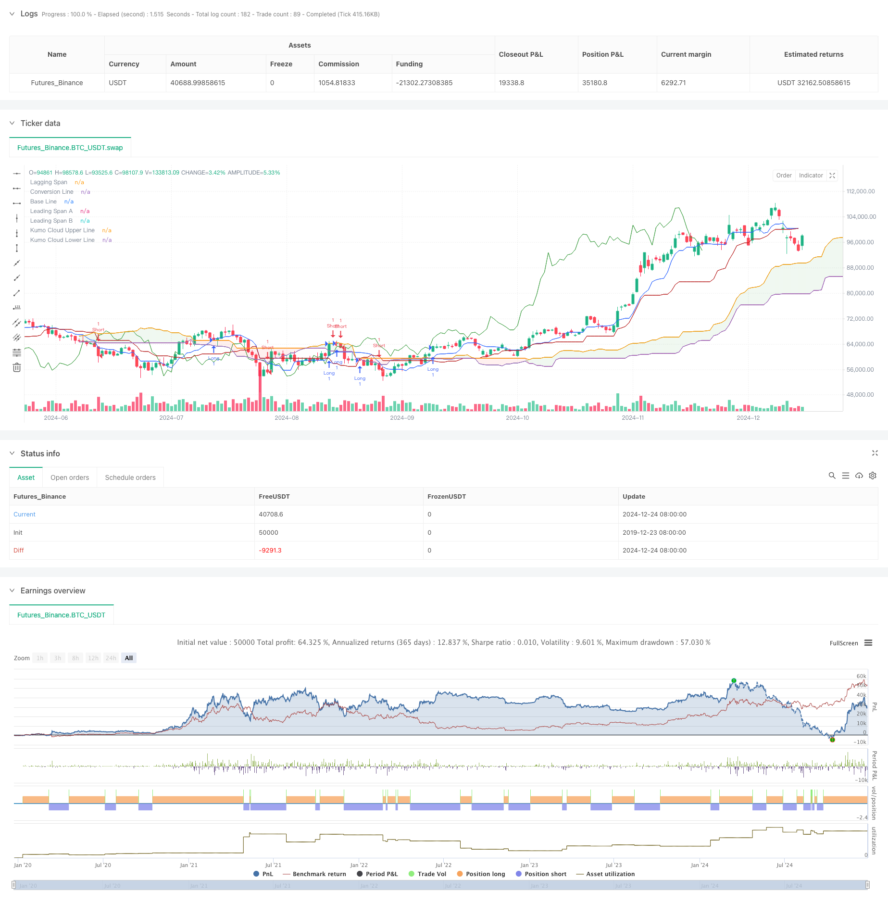

> Name

Cloud-Based-Bollinger-Bands-Double-Moving-Average-Quantitative-Trend-Strategy
> Author

ChaoZhang

> Strategy Description



[trans]
#### Overview
This strategy is a quantitative trading system based on the Ichimoku Cloud. This strategy mainly uses the cross signals of Leading Span A (Leading Span A) and Leading Span B (Leading Span B) to determine the market trend direction and generate trading signals. The strategy adopts a dynamic price range judgment method, combined with the calculation principle of the Donchian Channel, which can effectively capture the turning point of the market trend.
#### Strategy Principle
The core logic of the strategy is based on the following key components:
1. Conversion Line: Use the 9-period Donchian channel median as a quick response indicator
2. Base Line: Use the 26-period Donchian Channel median as the mid-term trend indicator
3. Leading Span A: Calculated from the average of the conversion line and the baseline
4. Leading Span B: Use the 52-period Donchian Channel median as a long-term trend indicator
5. Lagging Span: Move the closing price back 26 periods
The trigger conditions for trading signals are as follows:
- Long signal: when leading band A crosses leading band B upwards
- Short signal: when the leading band A crosses the leading band B downwards
#### Strategic Advantages
1. Multi-dimensional trend confirmation: Through a combination of indicators in different periods, market trends can be comprehensively assessed
2. High signal reliability: Using cloud layer crossing as signal triggering condition can effectively filter out false signals
3. Perfect risk control: The cloud structure itself has the function of supporting pressure and provides a natural stop loss position for transactions.
4. Strong adaptability: strategy parameters can be adjusted according to different market characteristics and have strong universality
#### Strategy Risk
1. Lagging risk: Due to the use of a longer period calculation method, there may be a certain delay in entry and exit signals.
2. Risk of volatile market: In a volatile market, frequent false breakthrough signals may occur.
3. Parameter sensitivity: Different parameter combinations may lead to large differences in strategy performance
4. Retracement risk: When the trend reverses, you may face a larger retracement
#### Strategy optimization direction
1. Introduce trading volume indicators: you can combine changes in trading volume to confirm the validity of the trend
2. Optimize parameter selection: dynamically adjust various parameters according to different market cycle characteristics
3. Add auxiliary indicators: You can add indicators such as RSI or MACD as auxiliary confirmation signals
4. Improve the stop loss mechanism: design a more flexible stop loss strategy, such as trailing stop loss
#### Summary
This strategy is a quantitative trading system that combines classic technical analysis tools to capture market opportunities through multi-dimensional trend analysis. Although there is a certain lag, it has good reliability and adaptability overall. Through continuous optimization and improvement, this strategy is expected to maintain stable performance in different market environments. ||
#### Overview
This strategy is a quantitative trading system based on the Ichimoku Cloud. It primarily uses the crossover signals between Leading Span A and Leading Span B to determine market trend direction and generate trading signals. The strategy employs a dynamic price range assessment method, incorporating Donchian Channel calculation principles to effectively capture market trend turning points.

#### Strategy Principles
The core logic of the strategy is based on the following key components:
1. Conversion Line: Uses the 9-period Donchian Channel median as a fast-response indicator
2. Base Line: Employs the 26-period Donchian Channel median as a medium-term trend indicator
3. Leading Span A: Calculated as the average of the Conversion Line and Base Line
4. Leading Span B: Uses the 52-period Donchian Channel median as a long-term trend indicator
5. Lagging Span: Shifts the closing price 26 periods backward

Trading signals are triggered under the following conditions:
- Long signal: When Leading Span A crosses above Leading Span B
- Short signal: When Leading Span A crosses below Leading Span B

#### Strategy Advantages
1. Multi-dimensional trend confirmation: Combines indicators of different periods for comprehensive market trend assessment
2. High signal reliability: Uses cloud crossovers as signal triggers, effectively filtering false signals
3. Robust risk control: The cloud structure inherently provides support and resistance levels, offering natural stop-loss points
4. High adaptability: Strategy parameters can be adjusted according to different market characteristics

#### Strategy Risks
1. Lag risk: The use of longer period calculations may result in delayed entry and exit signals
2. Sideways market risk: May generate frequent false breakout signals in ranging markets
3. Parameter sensitivity: Different parameter combinations may lead to significant variations in strategy performance
4. Drawdown risk: May face significant drawdowns during trend reversals

#### Strategy Optimization Directions
1. Incorporate volume indicators: Combine volume changes to confirm trend validity
2. Optimize parameter selection: Dynamically adjust parameters based on different market cycle characteristics
3. Add auxiliary indicators: Include indicators like RSI or MACD as supplementary confirmation signals
4. Improve stop-loss mechanism: Design more flexible stop-loss strategies, such as trailing stops

#### Summary
This strategy is a quantitative trading system that combines classical technical analysis tools, capturing market opportunities through multi-dimensional trend analysis. While it has some inherent lag, it demonstrates good reliability and adaptability overall. Through continuous optimization and improvement, the strategy has the potential to maintain stable performance across different market conditions.[/trans]


> Source (PineScript)

``` pinescript
/*backtest
start: 2019-12-23 08:00:00
end: 2024-12-25 08:00:00
period: 1d
basePeriod: 1d
exchanges: [{"eid":"Futures_Binance","currency":"BTC_USDT"}]
*/

// This Pine Script™ code is subject to the terms of the Mozilla Public License 2.0 at https://mozilla.org/MPL/2.0/
// © mrbakipinarli

//@version=6
strategy(title="Ichimoku Cloud Strategy", shorttitle="Ichimoku Strategy", overlay=true)

// Inputs for Ichimoku Cloud
conversionPeriods = input.int(9, minval=1, title="Conversion Line Length")
basePeriods = input.int(26, minval=1, title="Base Line Length")
laggingSpan2Periods = input.int(52, minval=1, title="Leading Span B Length")
displacement = input.int(26, minval=1, title="Lagging Span")

// Functions
donchian(len) => math.avg(ta.lowest(len), ta.highest(len))

// Ichimoku Components
conversionLine = donchian(conversionPeriods)
baseLine = donchian(basePeriods)
leadLine1 = math.avg(conversionLine, baseLine)
leadLine2 = donchian(laggingSpan2Periods)

// Plotting Ichimoku Components
plot(conversionLine, color=color.new(#2962FF, 0), title="Conversion Line")
plot(baseLine, color=color.new(#B71C1C, 0), title="Base Line")
plot(close, offset = -displacement + 1, color=color.new(#43A047, 0), title="Lagging Span")
p1 = plot(leadLine1, offset = displacement - 1, color=color.new(#A5D6A7, 0), title="Leading Span A")
p2 = plot(leadLine2, offset = displacement - 1, color=color.new(#EF9A9A, 0), title="Leading Span B")

// Kumo Cloud
plot(leadLine1 > leadLine2 ? leadLine1 : leadLine2, offset = displacement - 1, title = "Kumo Cloud Upper Line", display = display.none) 
plot(leadLine1 < leadLine2 ? leadLine1 : leadLine2, offset = displacement - 1, title = "Kumo Cloud Lower Line", display = display.none) 
fill(p1, p2, color = leadLine1 > leadLine2 ? color.rgb(67, 160, 71, 90) : color.rgb(244, 67, 54, 90))

// Trading Logic
longCondition = ta.crossover(leadLine1, leadLine2)
shortCondition = ta.crossunder(leadLine1, leadLine2)

if (longCondition)
    strategy.entry("Long", strategy.long)

if (shortCondition)
    strategy.entry("Short", strategy.short)

```

> Detail

https://www.fmz.com/strategy/476280

> Last Modified

2024-12-27 15:54:08
