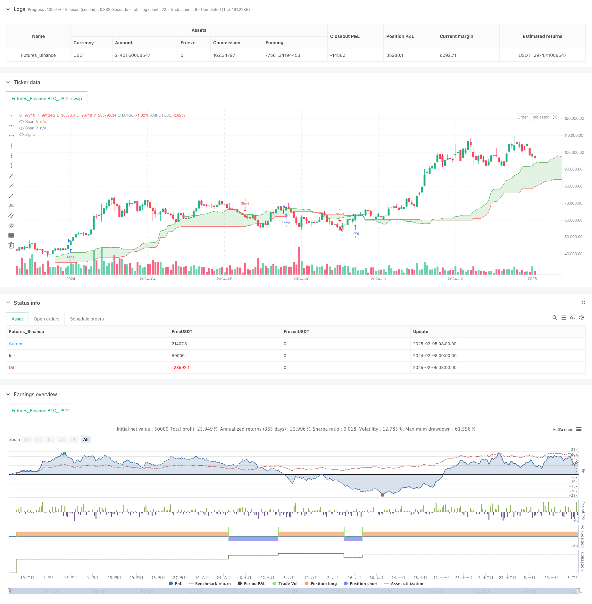

> Name

Cloud-Based-Dual-Moving-Average-Momentum-Strategy
> Author

ChaoZhang

> Strategy Description



[trans]
#### Overview
This strategy is a momentum trading system based on cloud breakouts and double moving average crossovers. It combines multiple components of the Ichimoku Cloud indicator to identify market trend direction and momentum changes, generating trading signals through the position of price in relation to the cloud and the intersection of the conversion line and the baseline. The core idea of ​​the strategy is to capture momentum opportunities in strong trends.
#### Strategy Principle
The strategy uses the following key components:
1. Conversion line (Tenkan-Sen): Calculate the midpoint of the highest price and lowest price within 9 periods, reflecting the short-term market trend
2. Baseline (Kijun-Sen): Calculate the midpoint of the highest price and lowest price within 26 periods, reflecting the mid-term market trend
3. Senkou Span A: the average of the conversion line and the baseline, shifted forward by 26 periods
4. Senkou Span B: Calculate the midpoint of the highest price and lowest price within 52 periods, and shift forward 26 periods
5. Lagging line (Chikou Span): the current closing price moves backward 26 periods
Admission conditions:
- Long: Price is above the clouds (above leading bands A and B) and the conversion line crosses the base line
- Short: Price is below the clouds (below leading bands A and B) and the conversion line crosses below the baseline
Exit conditions: close the position when an opposite trading signal appears
#### Strategic Advantages
1. Multiple time frame analysis: Provide a more comprehensive market perspective through a combination of indicators in different periods
2. Trend confirmation: Use cloud position as a trend filter to reduce the risk of false breakthroughs
3. Momentum identification: Capture momentum changes through moving average crossovers to improve the accuracy of entry timing
4. Adaptability: indicator parameters will automatically adjust according to market fluctuations to adapt to different market environments.
5. Visually intuitive: The visual display of clouds makes the trend direction and intensity clear at a glance
#### Strategy Risk
1. Risk of volatile market: Frequent false signals may occur during the sideways consolidation phase.
2. Lagging risk: Due to the use of longer-period moving averages, some rapid market opportunities may be missed.
3. Parameter sensitivity: Different parameter settings will significantly affect strategy performance
4. Trend reversal risk: May suffer a large retracement when the trend suddenly reverses
Risk control suggestions:
- Cross-validate with other technical indicators
- Set appropriate stop loss positions
- Dynamically adjust parameters according to different market cycles
- Implement position management strategies
#### Strategy optimization direction
1. Parameter optimization:
- Conduct parameter sensitivity analysis for different market environments
-Introducing an adaptive parameter adjustment mechanism
2. Signal filtering:
- Added transaction volume confirmation mechanism
- Added volatility filter
- Combined with market structure analysis
3. Risk management:
- Develop dynamic stop loss mechanism
- Implement volatility-based position management
- Added retracement control module
#### Summary
This is a comprehensive strategy system that combines trend following and momentum trading. Through the combined use of cloud breakthroughs and moving average crossovers, it is possible to effectively capture market trend opportunities while maintaining strategic stability. Successful application of the strategy requires careful attention to the three key aspects of parameter optimization, risk control and market adaptability. ||
#### Overview
This strategy is a momentum trading system based on cloud breakouts and dual moving average crossovers. It combines multiple components of the Ichimoku Cloud indicator to identify market trend direction and momentum changes, generating trading signals through price position relative to the cloud and crossovers between the conversion and base lines. The core concept is to capture momentum opportunities in strong trends.

#### Strategy Principle
The strategy utilizes the following key components:
1. Conversion Line (Tenkan-Sen): Calculates the midpoint of the highest high and lowest low over 9 periods, reflecting short-term market trends
2. Base Line (Kijun-Sen): Calculates the midpoint of the highest high and lowest low over 26 periods, reflecting medium-term market trends
3. Leading Span A (Senkou Span A): Average of conversion and base lines, displaced 26 periods forward
4. Leading Span B (Senkou Span B): Midpoint of the highest high and lowest low over 52 periods, displaced 26 periods forward
5. Lagging Span (Chikou Span): Current closing price displaced 26 periods backward

Entry conditions:
- Long: Price above the cloud (higher than both Spans A and B) and conversion line crosses above base line
- Short: Price below the cloud (lower than both Spans A and B) and conversion line crosses below base line

Exit conditions: Positions are closed when opposite trading signals appear

#### Strategy Advantages
1. Multiple timeframe analysis: Provides comprehensive market perspective through indicator combinations across different periods
2. Trend confirmation: Uses cloud position as trend filter to reduce false breakout risks
3. Momentum identification: Captures momentum changes through moving average crossovers for better entry timing
4. Adaptability: Indicator parameters automatically adjust to market volatility, adapting to different market environments
5. Visual intuition: Cloud visualization makes trend direction and strength immediately apparent

#### Strategy Risks
1. Choppy market risk: May generate frequent false signals during consolidation phases
2. Lag risk: May miss some rapid market opportunities due to longer-period moving averages
3. Parameter sensitivity: Different parameter settings significantly affect strategy performance
4. Trend reversal risk: May experience larger drawdowns during sudden trend reversals

Risk control suggestions:
- Cross-validate with other technical indicators
- Set appropriate stop-loss levels
- Dynamically adjust parameters for different market cycles
- Implement position management strategies

#### Strategy Optimization Directions
1. Parameter optimization:
- Conduct parameter sensitivity analysis for different market environments
- Introduce adaptive parameter adjustment mechanisms

2. Signal filtering:
- Add volume confirmation mechanisms
- Incorporate volatility filters
- Integrate market structure analysis

3. Risk management:
- Develop dynamic stop-loss mechanisms
- Implement volatility-based position sizing
- Add drawdown control modules

#### Summary
This is a comprehensive strategy system combining trend following and momentum trading. Through the coordinated use of cloud breakouts and moving average crossovers, it effectively captures market trend opportunities while maintaining strategy stability. Successful implementation requires careful attention to parameter optimization, risk control, and market adaptability.[/trans]


> Source (PineScript)

``` pinescript
/*backtest
start: 2024-02-08 00:00:00
end: 2025-02-06 08:00:00
period: 2d
basePeriod: 2d
exchanges: [{"eid":"Futures_Binance","currency":"BTC_USDT"}]
*/

//@version=5
strategy("Ichimoku Cloud Strategy", shorttitle="IchimokuStrat", overlay=true)

//=== Užívateľské vstupy ===//
tenkanLen          = input.int(9,   "Tenkan-Sen Length")
kijunLen           = input.int(26,  "Kijun-Sen Length")
senkouSpanBLen     = input.int(52,  "Senkou Span B Length")
displacement       = input.int(26,  "Cloud Displacement")

//=== Výpočet Ichimoku liniek ===//

// Tenkan-Sen (Conversion Line)
tenkanHigh = ta.highest(high, tenkanLen)
tenkanLow  = ta.lowest(low, tenkanLen)
tenkan     = (tenkanHigh + tenkanLow) / 2.0

// Kijun-Sen (Base Line)
kijunHigh = ta.highest(high, kijunLen)
kijunLow  = ta.lowest(low, kijunLen)
kijun     = (kijunHigh + kijunLow) / 2.0

// Senkou Span A = (Tenkan + Kijun)/2, posunutý dopredu
spanA = (tenkan + kijun) / 2.0

// Senkou Span B = (highest high + lowest low)/2, posunutý dopredu
spanBHigh = ta.highest(high, senkouSpanBLen)
spanBLow  = ta.lowest(low, senkouSpanBLen)
spanB     = (spanBHigh + spanBLow) / 2.0

// Chikou Span (voliteľný) = current close, posunutý dozadu
chikou = close[displacement]

//=== Podmienky pre LONG / SHORT ===//
// Cena NAD oblakom => close > spanA a close > spanB
// Tenkan NAD Kijun => tenkan > kijun
longCondition = (close > spanA and close > spanB) and (tenkan > kijun)

// Cena POD oblakom => close < spanA a close < spanB
// Tenkan POD Kijun => tenkan < kijun
shortCondition = (close < spanA and close < spanB) and (tenkan < kijun)

//=== Vstup do pozícií ===//
if longCondition
    strategy.entry("Long", strategy.long)
if shortCondition
    strategy.entry("Short", strategy.short)

//=== Výstup pri opačnom signáli ===//
if strategy.position_size > 0 and shortCondition
    strategy.close("Long", comment="Exit Long")
if strategy.position_size < 0 and longCondition
    strategy.close("Short", comment="Exit Short")

//=== Vykreslenie Ichimoku = vyplnený oblak ===//

// Najskôr si ulož premenne (plot) pre spanA, spanB
plotA = plot(spanA, title="Span A", offset=displacement, color=color.new(color.green, 0))
plotB = plot(spanB, title="Span B", offset=displacement, color=color.new(color.red, 0))

// Namiesto plotfill() použijeme fill()
fill(plotA, plotB, title="Cloud Fill", color=color.new(color.green, 80))

```

> Detail

https://www.fmz.com/strategy/481103

> Last Modified

2025-02-08 15:10:06
