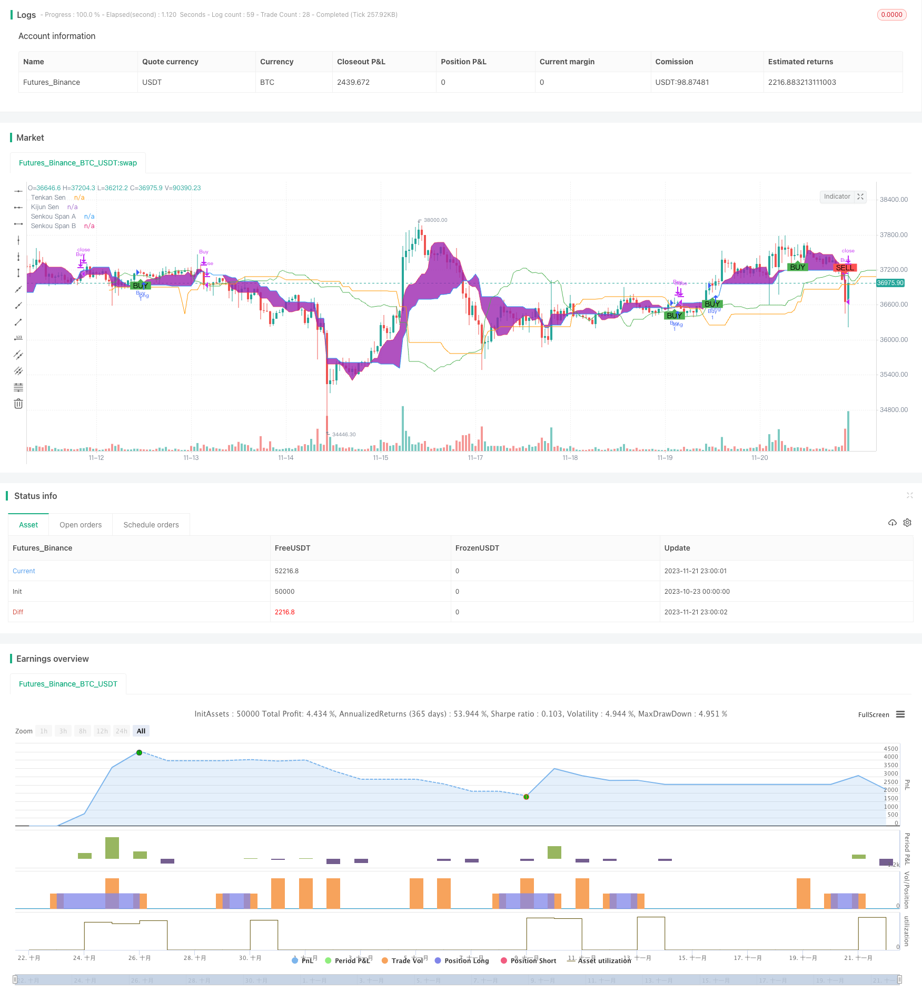

> Name

High Yield Daily Trading Strategy Cloud-Soaring-High-Yield-Daily-Trading-Strategy
> Author

ChaoZhang

> Strategy Description



[trans]

## Overview
This strategy uses the famous Ichimoku technical indicator to identify the trend and momentum of stock prices and enable automated intraday trading. Buy when the price breaks through the cloud and the conversion line crosses the baseline; close the position when it crosses the conversion below or the price falls below the cloud support line.
## Principle
The core indicators are the conversion line, baseline, A cloud line and B cloud line of the Ichimoku balance chart. The buy signal is when the price is above the cloud layer and the conversion line crosses the baseline; the sell signal is when the conversion line crosses below the baseline or the price is below the cloud layer.
This strategy combines both trend following and momentum characteristics. The conversion line and the base line depict short-term and medium-term momentum through the average of the highest and lowest prices in different periods respectively; while the clouds mark the long-term support and pressure areas. When the short-term momentum indicator conversion line crosses the mid-line indicator baseline, it means that the strength of the bulls has increased and the price has risen; when the price completely breaks above the clouds, it shows that the long-term trend has turned upward, so the strategy generates a buy signal at this time.
On the contrary, when the conversion line crosses the baseline and the momentum switches to short direction; or when the price falls below the clouds and the long term turns to short, the closing signal is activated. The alternating transformation of one and the other avoids chasing highs and selling lows, and locks in the best buying and selling points with unified long- and short-term trends.
## Advantage Analysis
The biggest advantage of Yunfeixiang's high-yield strategy is that it integrates trend and momentum characteristics, balances the frequency of operations and the level of profitability, not only ensures a sufficient number of transactions, but also avoids the problem of excessive trading of chasing ups and downs. As an evergreen indicator, the Ichimoku equilibrium chart has long-lasting prosperity, is widely used, and its reliability is guaranteed.
What needs special emphasis is the advanced nature of this strategy's selection of buying and selling points. The conversion line and the baseline form adaptive parameter settings to avoid the subjectivity and limitations of manual parameter tuning; the cloud layer plays the role of a filter to accurately locate the optimal time point for the strategy to coincide with the long and short lines. In addition, the combined use of crossovers and breakthroughs, combined with trends and momentum, also greatly enhances the actual effectiveness of the strategy. Generally speaking, Yunfeixiang's strategy is extraordinary in terms of higher winning rate and more accurate entry and exit control.
## Risk Analysis
It should be noted that clouds may expand or contract abnormally during specific periods, which will affect the frequency of buy and sell signals. If you encounter a range market with low volatility and no clear trend, the strategy may have fewer buying and selling points. In addition, the Ichimoku balance chart indicator combination is relatively complex, and when individual components fail, the applicability of this strategy will be reduced.
In response to these situations, optimization can be carried out by dynamically adjusting the parameters of the Ichimoku equilibrium diagram. For example, when volatility is low, the cloud range can be narrowed and the frequency of transactions can be increased; additional judgment indicators can also be introduced, such as trading volume, to avoid misoperations. Generally speaking, the Yunfeixiang strategy has reliable real-time results under most market conditions.
## Optimization direction
This strategy can also be expanded to introduce more auxiliary technical indicators, such as Bollinger Bands, to further optimize buying and selling points. It is also possible to establish a dynamic Ichimoku equilibrium chart parameter adjustment mechanism and switch parameter combinations based on different volatility and trend states to further improve the adaptability of the strategy.
Generally speaking, the framework of the intersection of the Ichimoku equilibrium chart filter and the kinetic energy indicator is not easy to change, but methods such as machine learning can be introduced to achieve more intelligent and dynamic parameter setting, range adjustment, and optimization of stop-profit and stop-loss standards. This will undoubtedly further lock in the precise buying and selling points for both long and short-term trends.
## Summarize
Yunfeixiang's high-yield Ichimoku equilibrium chart trading strategy successfully combines trend band identification and momentum indicators to achieve automatic entry and exit. The scientific and advanced nature of its buying and selling point selection algorithm provides a powerful tool for participants who pursue long-term and short-term conversion and high winning rate transactions. Facing the future, there is a vast space for intelligent dynamic parameter tuning, which will surely enable this strategy to deliver better results.
||

## Overview
This strategy leverages the renowned Ichimoku Kinko Hyo technology indicator to identify trend and momentum of asset prices and enables automated intraday trading. It goes long when price breaks through the cloud and the Tenkan line crosses over the Kijun line, and closes positions when the lines cross under or prices break down the cloud support level.

## Principles  
The core indicators consist of Tenkan line, Kijun line, Senkou Span A and Senkou Span B of the Ichimoku system. The buy signal activates when prices trade above the cloud and the Tenkan line crosses over the Kijun line. The sell signal triggers when the Tenkan line crosses below the Kijun line or prices drop below the cloud.  

The strategy combines both trend following and momentum characteristics. The Tenkan and Kijun lines represent short-term and medium-term momentum respectively by averaging highest high and lowest low over different lookback periods. The cloud on the other hand identifies longer term support and resistance levels. When the momentum gauge Tenkan line crosses over the Kijun line, it signals strengthening upside momentum and prices tend to push higher. Together with prices breaking out above the top of the cloud decisively, it gives the confirmation that the longer term trend has turned bullish, hence a buy signal is generated.  

On the contrary, when the Tenkan line crosses below the Kijun line, momentum flips bearish. Or when prices collapse below the cloud support, the long term trend turns downward.  The sell signals get activated. This wax and wane configuration avoids chasing tops and selling lows. It locks in the optimal buy and sell points when both short term and long term trends align in the same direction.

## Advantage Analysis   
The biggest advantage of the Cloud Soaring High Yield strategy is integrating both trend and momentum lenses, achieving an excellent balance between trading frequency and profitability. It ensures adequate trading opportunities while avoiding excessive whipsaws from chasing surges and catching falls. The versatility and reliability of Ichimoku as a evergreen indicator cannot be understated.  

What’s worth highlighting in particular is the sophistication in timing the strategy’s entry and exit signals. The adaptive parameter configuration of the Tenkan and Kijun lines avoids the subjectivity and restrictedness of manual parameter tuning. The cloud further acts as the filter to pinpoint the optimal ticks when both short term and long term trends concur. On top of that, the combination of crossovers and breakouts enriches the strategy by encapsulating both momentum and trend following, thereby enhancing its real world performance. In a nutshell, Cloud Soaring combines higher win rates and more precise entry/exit control to stand out from average strategies.

## Risk Analysis  
One caveat is that the cloud bands can expand or contract abnormally during certain periods, impacting the frequency of signal generation. In range-bound, low volatility environments with unclear trends, fewer trade signals may occur. In addition, with multiple intertwined components of Ichimoku, dysfunction of individual building blocks can dampen applicability of this strategy.  

To address these weaknesses, dynamic adjustment of Ichimoku parameters can be explored for optimization, such as narrowing the cloud bands during low volatility regimes to increase participation rate. Supplementary indicators like trading volumes can also help validate signals and avoid false signals. Overall despite the limitations stated, satisfactory live performance of the Cloud Soaring strategy can still be achieved in most market conditions.

## Enhancement Opportunities
The strategy can be further improved by introducing more complementary technical indicators, like Bollinger Bands, to refine entry and exit levels. Dynamic mechanism of tuning Ichimoku parameter settings can also be established, allowing alternating configurations based on changing volatility and trend landscapes, hence lifting adaptiveness.  

In essence, the framework of Ichimoku filter and momentum oscillator crossover is robust. But methods like machine learning can be leveraged to enable smarter, more dynamic parameter configuration, range adjustment and stop loss/profit taking criteria setting - further optimizing the precise timing when long term and short term trends align.

## Conclusion  
The Cloud Soaring High Yield Ichimoku Trading Strategy succeeds in blending trend regime recognition and momentum indication for automated entries and exits. Its scientifically superior algorithms in locating buys and sells provide compelling solutions for those pursuing transitions between long term and short term trends while demanding high win rates. Moving forward, with ample room for intelligent dynamic parameter tuning, this strategy is poised to deliver even more exceptional outcomes.

[/trans]

> Strategy Arguments


|Argument|Default|Description|
|----|----|----|
|v_input_1|9|Tenkan Sen Periods|
|v_input_2|26|Kijun Sen Periods|
|v_input_3|52|Senkou Span B Periods|
|v_input_4|26|Displacement|


> Source (PineScript)

``` pinescript
/*backtest
start: 2023-10-23 00:00:00
end: 2023-11-22 00:00:00
period: 1h
basePeriod: 15m
exchanges: [{"eid":"Futures_Binance","currency":"BTC_USDT"}]
*/

//@version=4
strategy("High Yield Ichimoku Cloud Strategy", shorttitle="HY Ichimoku", overlay=true)

// Ichimoku Cloud settings
tenkanPeriods = input(9, title="Tenkan Sen Periods")
kijunPeriods = input(26, title="Kijun Sen Periods")
senkouSpanBPeriods = input(52, title="Senkou Span B Periods")
displacement = input(26, title="Displacement")

// Calculating the Ichimoku lines
tenkanSen = (highest(high, tenkanPeriods) + lowest(low, tenkanPeriods)) / 2
kijunSen = (highest(high, kijunPeriods) + lowest(low, kijunPeriods)) / 2
senkouSpanA = (tenkanSen + kijunSen) / 2
senkouSpanB = (highest(high, senkouSpanBPeriods) + lowest(low, senkouSpanBPeriods)) / 2
chikouSpan = close[displacement]

// Plotting the Ichimoku Cloud
p1 = plot(tenkanSen, color=color.red, title="Tenkan Sen")
p2 = plot(kijunSen, color=color.blue, title="Kijun Sen")
p3 = plot(senkouSpanA, color=color.green, title="Senkou Span A", offset=displacement)
p4 = plot(senkouSpanB, color=color.orange, title="Senkou Span B", offset=displacement)
fill(p1, p2, color=color.purple, transp=80, title="Cloud")

// Buy and Sell conditions
buyCondition = crossover(tenkanSen, kijunSen) and close > max(senkouSpanA, senkouSpanB)[displacement]
sellCondition = crossunder(tenkanSen, kijunSen) and close < min(senkouSpanA, senkouSpanB)[displacement]

// Execute trade if conditions are met
if (buyCondition)
    strategy.entry("Buy", strategy.long)
    
if (sellCondition)
    strategy.close("Buy")

// Strategy exit conditions
strategy.close("Buy", when = crossunder(tenkanSen, kijunSen) or close < min(senkouSpanA, senkouSpanB)[displacement])

// Plot buy/sell signals
plotshape(series=buyCondition, title="Buy Signal", location=location.belowbar, color=color.green, style=shape.labelup, text="BUY")
plotshape(series=sellCondition, title="Sell Signal", location=location.abovebar, color=color.red, style=shape.labeldown, text="SELL")


```

> Detail

https://www.fmz.com/strategy/432970

> Last Modified

2023-11-23 10:56:49
