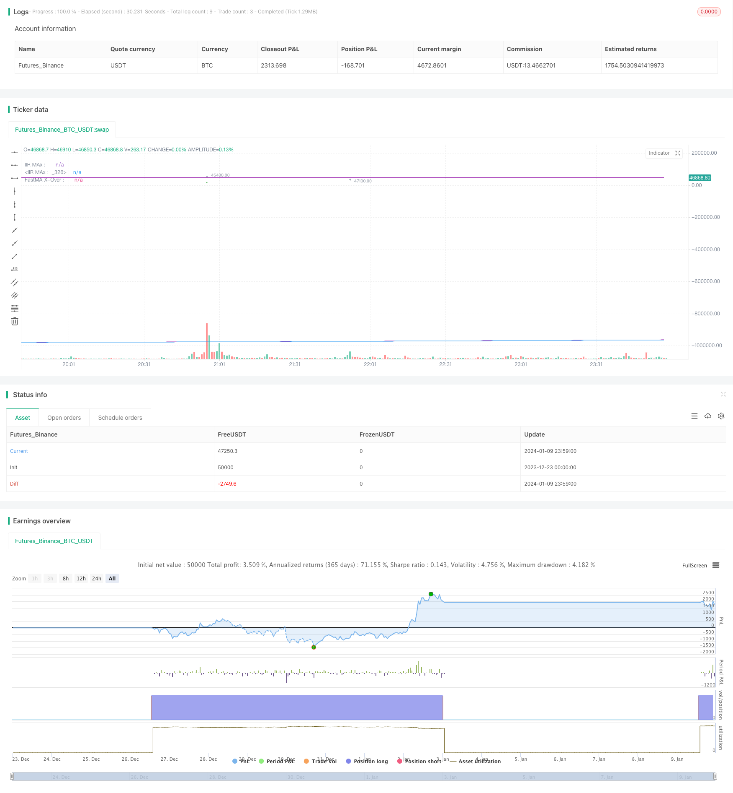

> Name

Combined-Moving-Average-and-Infinite-Impulse-Response-Line-Strategy
> Author

ChaoZhang

> Strategy Description


 [trans]
## Overview
This is a quantitative strategy that uses a combination of moving averages, infinite impulse response averages (IIR), and adaptive linear moving averages (ALMA). This strategy has a variety of indicator combinations that can provide traders with rich trading signals.
## Strategy Principle
This strategy mainly includes the following parts:
1. Use simple moving average (SMA), ALMA and IIR in parallel and detect the cross signals between them as trading entry opportunities.
2. Use three IIRs with different periods and calculate the distance between them to determine whether the price is in a squeeze state. The squeeze state represents a decrease in volatility and often indicates that the price is about to change significantly.
3. Judge the slope of IIR. When the slope rises, it is green, and when it falls, it is blue. The trend of IIR can be judged intuitively.
4. Calculate whether the distance between SMAs is expanding, and if so, make a special mark to represent "fan-shaped" expansion, which usually means that the price has entered a trend state.
5. Combine the overbought and oversold signals of the Relative Strength Index (RSI) to supplement trading signals.
By combining the above parts, this strategy can provide relatively comprehensive and rich trading entry, judgment and exit signals.
## Strategic advantage analysis
The biggest advantage of this strategy is that the indicator combination is comprehensive and rich, taking into account not only trend judgment, but also volatility and overbought and oversold conditions, providing a multi-dimensional reference for trading decisions.
Another advantage is that parameters and indicators are easy to adjust and optimize, and users can choose to enable relevant indicators and parameters according to their own needs.
From a risk management perspective, this strategy focuses on both fast moving averages and slow moving averages, which can reduce the probability of false signals caused by price shocks.
## Risk Analysis
The main risks of this strategy are:
1. It is too complex and can easily cause index conflicts. Selecting certain parameter combinations may lead to overfitting.
2. Using a multiple moving average system, large losses may still occur when the market changes drastically (such as major economic events).
3. Insufficient in-depth backtesting, there may be a certain risk of survival bias in actual combat.
During the application process, we need to pay attention to risk management and appropriately adjust the position size. And conduct multiple backtests on longer time spans and larger data sets to ensure the actual effectiveness of the strategy.
## Strategy optimization direction
Considering that the indicator combination of this strategy is relatively complex and has many parameters, subsequent optimization can be carried out from the following aspects:
1. Simplify indicator selection and remove indicators that are not highly relevant or conflicting.
2. Optimize the selection of IIR moving averages and select a length that better matches the market characteristics.
3. Optimize the combination of fast and slow moving averages to improve the stability of cross signals.
4. Add machine learning models to assist judgment and improve the adaptive ability of the strategy.
5. Optimize the correlation with the global index and improve the success rate of trend judgment.
## Summarize
Through the flexible combination and optimization of indicators, this strategy can more comprehensively reflect the market status and provide multi-dimensional support for trading decisions. However, there is also a certain risk of actual combat and data overfitting. We still need to continuously optimize and adjust strategies in practice to adapt to market changes.
||

## Overview

This is a quantitative strategy that combines the use of moving averages, infinite impulse response lines (IIR) and adaptive linear moving averages (ALMA). The strategy has a combination of multiple indicators to provide traders with rich trading signals.

## Strategy Principle  

The main components of the strategy include:  

1. Use a combination of simple moving averages (SMA), ALMA and IIR to detect cross signals between them as timing for trade entry.

2. Use 3 IIRs with different periods and calculate the distance between them to determine if the price is in a squeeze state. The squeeze state represents decreasing volatility and often presages significant price changes.  

3. Judging the slope of the IIR, when the slope rises it is green, and when it falls it is blue. It can visually determine the trend of IIR.

4. Calculate if the distance between SMAs is widening, if so, make a special mark, representing the "fan" expansion, usually meaning the price is entering a trend state.  

5. Combine the overbought and oversold signals of the relative strength index (RSI) to supplement the trading signals.

By combining the use of the above sections, the strategy can provide relatively comprehensive and rich trading entry, judgment and exit signals.
  
## Advantage Analysis

The biggest advantage of this strategy is that the combination of indicators is comprehensive and rich, taking into account both trend judgments and volatility ratios and overbought/oversold states, providing multidimensional references for trading decisions.

Another advantage is that the parameters and indicators are easy to adjust and optimize so users can enable relevant indicators and parameters according to their needs.  

From the perspective of risk management, this strategy pays attention to both fast and slow moving averages, which reduces the probability of incorrect signals caused by price fluctuations.

## Risk Analysis  

The main risks of this strategy are:  

1. Too complex to easily cause conflicts between indicators and improper parameter combinations can lead to overfitting.  

2. Adopting multiple moving average systems still carries large losses in the event of severe market turmoil (such as major economic events).  

3. Insufficient in-depth backtesting may pose some survival bias risk in real trading.

In practice, we need to pay attention to risk management and appropriately adjust the position size. We also need to conduct multiple backtests over longer time frames and larger datasets to ensure practical effectiveness of the strategy.

## Strategy Optimization
  

Considering the complex combination of indicators and large number of parameters in this strategy, future optimizations can be made in the following aspects:

1. Simplify indicator selections, remove indicators with low correlations or conflicts.  

2. Optimize the selection of IIR moving averages to better match market characteristics.

3. Optimize combinations of fast and slow moving averages to increase stability of crossover signals.  

4. Increase machine learning models to assist in judgments and improve the adaptability of strategies.

5. Optimize correlation with global indexes to improve success rate of trend judgments.

## Conclusion  

Through flexible combinations and optimizations of indicators, this strategy can reflect market status relatively comprehensively and provide multi-dimensional support for trading decisions. But there are still risks of real trading and data overfitting. We still need to constantly optimize and adjust the strategy in practice to adapt to market changes.

[/trans]

> Strategy Arguments


|Argument|Default|Description|
|----|----|----|
|v_input_1|false|═══════════════ Show Fibby MAs ═══════════════|
|v_input_2|960|MA-Cross Resolution|
|v_input_3|8|MA#1 Length|
|v_input_4|13|MA#2 Length|
|v_input_5|34|MA#3 Length|
|v_input_6|1.1|SMA LooseSqueeze Percent|
|v_input_7|false|═══════════════════ Show IIRs ═══════════════════|
|v_input_8|60|IIR Resolution|
|v_input_9|0.8|IIR Squeeze PercentClose|
|v_input_10|34|IIR Length 1|
|v_input_11|144|IIR Length 2|
|v_input_12|720|IIR Length 3|
|v_input_13|true|Show IIR1|
|v_input_14|true|Show IIR2|
|v_input_15|true|Show IIR3|
|v_input_16|true|═════════════ Show Parabolic MA Counts ════════════|
|v_input_17|true|══════════════ Show Buy/Sell Signals ══════════════|
|v_input_18|true|══════════════ Show Background Colors ══════════════|
|v_input_19|false|══════════════ Show Debug ══════════════|
|v_input_20|5|══ Bar Lookback Period ══|
|v_input_21|true|══ Percentage Lookback Period ══|
|v_input_22|true|══════════ Show misc MA Cross Strategy ══════════|
|v_input_23|555|IIRx Length: |
|v_input_24|30|IIRx Period/TF: |
|v_input_25|13|IIRx2 Length: |
|v_input_26|5|IIRx2 Period/TF: |
|v_input_27|15|Alma of IIR1 Period: |
|v_input_28|0.7|Alma Alpha Value: |
|v_input_29|500|Alma Sigma Value: |
|v_input_30|true|═══════════════════ Show RSI Arrows ═══════════════════|
|v_input_31_close|0|RSI Source: close|high|low|open|hl2|hlc3|hlcc4|ohlc4|
|v_input_32|14|RSI Length|
|v_input_33|80|RSI Overbought Level|
|v_input_34|20|RSI Oversold Level|


> Source (PineScript)

``` pinescript
/*backtest
start: 2023-12-23 00:00:00
end: 2024-01-10 00:00:00
period: 1m
basePeriod: 1m
exchanges: [{"eid":"Futures_Binance","currency":"BTC_USDT"}]
*/

//The plotchar UP/DOWN Arrows  is the crossover of the fastest MA and fastest IIR MAs
//
//The dots at the bottom are the two simple averages crossing over
//
//The count over/under the candles is the count of bars that the SMAs on their
//respective resolution are fanning out.
//
//The colored background indicates a squeeze, lime=kinda tight : green=very tight squeeze.  based on the 3 IIRs
//
//To answer my own question in a forum, looking at the code, i couldn't figure out how to get it from another timeframe
//and run the same calculations with the same results.  My answer in the end was to scale the chosen MA length
//in the corresponding CurrentPeriod/ChosenMAPeriod proportion.  This results in the same line in the same place when browsing through the
//different time resolutions.  Somebody might find this invaluable
//
//The counts are for MA's fanning out, or going parabolic.  Theres IIRs, Almas, one done of the other.  A lot.  
//The arrows above and below bars are from standard RSI numbers for OB/OS
//
//The IIRs changes color depending on their slope, which can be referenced easily with a variable.
//
//The backgrond on a bar-by-bar basis is colored when 2 sets of moving averages are in a squeeze, aka
//when price is consolidating.  
//
//This aims to help the trader combine conditions and entry criteria of the trade and explore these options visually.  
//They detail things from all time-frames on the current one.  I prefer it because of the fractal nature of price-action, both large and small,
//either yesterday or last year.  For best results, go long in short-term trades when the long-term trend is also up.
//and other profitable insights.  This is also a great example of an automation algorith.  
//
//The pretty ribbon is my script called 'Trading With Colors'. Use them together for fanciest results.  55/233 is my Fib Cross (golden/death)  Compare it to the classic 50/200 if
//you get bored.  I believe it simply works better, at least for Crypto.
//
//Evidently, I am a day-trader.  But this yields higher profits on larger time-frames anyways, so do play around with it. Find what works for you.

//Thanks and credit for code snippets goes to:
//matryskowal
//ChrisMoody, probably twice
//Alex Orekhov (everget)
//author=LucF and midtownsk8rguy, for PineCoders
//If you use code from this, real quick search for perhaps the original and give them a shoutout too.  I may have missed something

//Author: Sean Duffy
//@version=4
strategy(title = "Combination Parabolic MA/IIR/ALMA Strategy",
         shorttitle = "MA-QuickE", 
         overlay = true )
        //  calc_on_order_fills = true,
        //  calc_on_every_tick = true,
// Input Variables
showFIBMAs = input(false, type=input.bool, title="═══════════════ Show Fibby MAs ═══════════════")
maRes = input(960, type=input.integer, title="MA-Cross Resolution")
mal1 = input(8, type=input.integer, title="MA#1 Length")
mal2 = input(13, type=input.integer, title="MA#2 Length")
mal3 = input(34, type=input.integer, title="MA#3 Length")
loosePercentClose = input(1.1, type=input.float, title="SMA LooseSqueeze Percent")
showIIRs = input(false, type=input.bool, title="═══════════════════ Show IIRs ═══════════════════")
iirRes = input(60, type=input.integer, title="IIR Resolution")
percentClose = input(title="IIR Squeeze PercentClose", type=input.float, defval=.8)
iirlength1 = input(title="IIR Length 1", type=input.integer, defval=34)
iirlength2 = input(title="IIR Length 2", type=input.integer, defval=144)//input(title="ATR Period", type=input.integer, defval=1)
iirlength3 = input(title="IIR Length 3", type=input.integer, defval=720)//input(title="ATR Period", type=input.integer, defval=1)
showIIR1 = input(true, type=input.bool, title="Show IIR1")
showIIR2 = input(true, type=input.bool, title="Show IIR2")
showIIR3 = input(true, type=input.bool, title="Show IIR3")
showCounts = input(true, type=input.bool, title="═════════════ Show Parabolic MA Counts ════════════")
showSignals = input(true, type=input.bool, title="══════════════ Show Buy/Sell Signals ══════════════")
showBackground = input(true, type=input.bool, title="══════════════ Show Background Colors ══════════════")
//runStrategy = input(true, type=input.bool, title="══════════════ Run Strategy  ══════════════")
debug = input(false, type=input.bool, title="══════════════ Show Debug ══════════════")

barLookbackPeriod = input(title="══ Bar Lookback Period ══", type=input.integer, defval=5)
percentageLookbackPeriod = input(title="══ Percentage Lookback Period ══", type=input.integer, defval=1)

bullcolor = color.green
bearcolor = color.red
color bgcolor = na

var bool slope1Green = na
var bool slope2Green = na
var bool slope3Green = na

var bool buySignal = na
var bool sellSignal = na
var bool bigbuySignal = na
var bool bigsellSignal = na
bool smbuySignal = false
bool smsellSignal = false
var bool insqueeze = na
var bool intightsqueeze = na
var bool infastsqueeze = na
var bool awaitingEntryIn = false

// My counting variables
var int count1 = 0
var float madist1 = 0
var int count2 = 0
var float madist2 = 0
var int sinceSmSignal = 0

var entryPrice = 0.0
var entryBarIndex = 0
var stopLossPrice = 0.0
// var updatedEntryPrice = 0.0
// var alertOpenPosition = false
// var alertClosePosition = false
// var label stopLossPriceLabel = na
// var line stopLossPriceLine = na
positionType = "LONG" // Strategy type, and the only current option

hasOpenPosition = strategy.opentrades != 0
hasNoOpenPosition = strategy.opentrades == 0

strategyClose() =>
    if (hasOpenPosition)
        if positionType == "LONG"
            strategy.close("LONG", when=true)
        else 
            strategy.close("SHORT", when=true)
strategyOpen() =>
    if (hasNoOpenPosition)
        if positionType == "LONG"
            strategy.entry("LONG", strategy.long, when=true)
        else 
            strategy.entry("SHORT", strategy.short, when=true)
checkEntry() =>
    buysignal = false
    if (hasNoOpenPosition)
        strategyOpen()
        buysignal := true
    // if (slope1Green and (trend1Green or trend2Green) and awaitingEntryIn and hasNoOpenPosition)
    //     strategyOpen()
    //     buysignal := true
    buysignal
checkExit() =>
    sellsignal = false
    // if (trend1Green == false and trend2Green == false) // to later have quicker exit strategy
    //     sellsignal := true
    //     strategyClose()
    if (hasOpenPosition)
        sellsignal := true
        strategyClose()
    sellsignal

multiplier(_adjRes, _adjLength) => // returns adjusted length
    multiplier = _adjRes/timeframe.multiplier
    round(_adjLength*multiplier)
    
    
//reset the var variables before new calculations
buySignal := false
sellSignal := false
smbuySignal := false
smsellSignal := false
bigbuySignal := false
bigsellSignal := false

ma1 = sma(close, multiplier(maRes, mal1))
ma2 = sma(close, multiplier(maRes, mal2))
ma3 = sma(close, multiplier(maRes, mal3))


madist1 := abs(ma1 - ma2)
madist2 := abs(ma1 - ma3) // check if MA's are fanning/going parabolic
if (ma1 >= ma2 and ma2 >= ma3 and madist1[0] > madist1[1]) //and abs(dataB - dataC >= madist2)  // dataA must be higher than b, and distance between gaining, same with C
    count1 := count1 + 1
else 
    count1 := 0
if (ma1 <= ma2 and ma2 <= ma3 and madist1[0] > madist1[1])  //<= madist2 and dataB <= dataC) //and abs(dataB - dataC >= madist2)  // dataA must be higher than b, and distance between gaining, same with C
    count2 := count2 + 1
else 
    count2 := 0


crossoverAB = crossover(ma1, ma2) 
crossunderAB = crossunder(ma1, ma2)

plot(showFIBMAs ? ma1 : na, linewidth=3)
plot(showFIBMAs ? ma2 : na)
plot(showFIBMAs ? ma3 : na)


// Fast Squeese Check WORK IN PROGRESS
// 
float singlePercent = close / 100 
if max(madist1, madist2) <= singlePercent*loosePercentClose
    bgcolor := color.yellow
    infastsqueeze := true
else
    infastsqueeze := false


// IIR MOVING AVERAGE
f(a) => a[0] // fixes mutable error
iirma(iirlength, iirsrc) =>
    cf = 2*tan(2*3.14159*(1/iirlength)/2)
    a0 = 8 + 8*cf + 4*pow(cf,2) + pow(cf,3)
    a1 = -24 - 8*cf + 4*pow(cf,2) + 3*pow(cf,3)
    a2 = 24 - 8*cf - 4*pow(cf,2) + 3*pow(cf,3)
    a3 = -8 + 8*cf - 4*pow(cf,2) + pow(cf,3)
    //----
    c = pow(cf,3)/a0
    d0 = -a1/a0
    d1 = -a2/a0
    d2 = -a3/a0
    //----
    out = 0.
    out := nz(c*(iirsrc + iirsrc[3]) + 3*c*(iirsrc[1] + iirsrc[2]) + d0*out[1] + d1*out[2] + d2*out[3],iirsrc)
    f(out)


iirma1 = iirma(multiplier(iirRes, iirlength1), close)
iirma2 = iirma(multiplier(iirRes, iirlength2), close)
iirma3 = iirma(multiplier(iirRes, iirlength3), close)

// adjusts length for current resolution now, length is lengthened/shortened accordingly, upholding exact placement of lines
// iirmaD1 = security(syminfo.tickerid, tostring(iirRes), iirma1, barmerge.gaps_on, barmerge.lookahead_on)
// iirmaD2 = security(syminfo.tickerid, tostring(iirRes), iirma2, barmerge.gaps_on, barmerge.lookahead_on)
// iirmaD3 = security(syminfo.tickerid, tostring(iirRes), iirma3, barmerge.gaps_on, barmerge.lookahead_on)

slope1color = slope1Green ? color.lime : color.blue
slope2color = slope2Green ? color.lime : color.blue
slope3color = slope3Green ? color.lime : color.blue

plot(showIIR1 and showIIRs ? iirma1 : na, title="IIR1", color=slope1color, linewidth=2, transp=30)
plot(showIIR2 and showIIRs ? iirma2 : na, title="IIR2", color=slope2color, linewidth=3, transp=30)
plot(showIIR3 and showIIRs ? iirma3 : na, title="IIR3", color=slope3color, linewidth=4, transp=30)

// checks slope of IIRs to create a boolean variable and and color it differently
if (iirma1[0] >= iirma1[1])
    slope1Green := true
else
    slope1Green := false
if (iirma2[0] >= iirma2[1])
    slope2Green := true
else
    slope2Green := false
if (iirma3[0] >= iirma3[1])
    slope3Green := true
else
    slope3Green := false

// calculate space between IIRs and then if the price jumps above both
//float singlePercent = close / 100  // = a single percent
var float distIIR1 = na
var float distIIR2 = na
distIIR1 := abs(iirma1 - iirma2)
distIIR2 := abs(iirma1 - iirma3)

if (distIIR1[0] < percentClose*singlePercent and close[0] >= iirma1[0])
    if close[0] >= iirma2[0] and close[0] >= iirma3[0]
        bgcolor := color.green
        insqueeze := true
        intightsqueeze := true
    else
        bgcolor := color.lime
        insqueeze := true
        intightsqueeze := false
else
    insqueeze := false
    intightsqueeze := false


// if (true)//sinceSmSignal > 0) //  cutting down on fastest MAs noise
//     sinceSmSignal := sinceSmSignal + 1
//     if (crossoverAB)
//         //checkEntry()
//         //smbuySignal := true
//         sinceSmSignal := 0
//     if (crossunderAB) // and all NOT greennot (slope1Green and slope2Green and slope3Green)
//         //checkExit()
//         //smsellSignal := true
//         sinceSmSignal := 0
// else
//     sinceSmSignal := sinceSmSignal + 1


f_draw_infopanel(_x, _y, _line, _text, _color)=>
    _rep_text = ""
    for _l = 0 to _line
        _rep_text := _rep_text + "\n"
    _rep_text := _rep_text + _text
    var label _la = na
    label.delete(_la)
    _la := label.new(
         x=_x, y=_y, 
         text=_rep_text, xloc=xloc.bar_time, yloc=yloc.price, 
         color=color.black, style=label.style_labelup, textcolor=_color, size=size.normal)

posx = timenow + round(change(time)*60)
posy = highest(50)

// CONSTRUCTION ZONE
// TODO:  program way to eliminate noise and false signals
// MAYBEDO: program it to differentiate between a moving average bump and a cross
//          I think the best way would be to calculate the tangent line... OR
//          Take the slope of both going back a couple bars and if it's close enough, its a bounce off
//          and an excellent entry signal
// program in quickest exit, 2 bars next to eachother both closing under, as to avoid a single wick from
// prompting to close the trade
// Some other time, have it move SMA up or down depending on whether trending up or down.  Then use those MA crosses

//THIS CHECKS THE SLOPE FROM CURRENT PRICE TO BACK 10 BARS
checkSlope(_series) =>  (_series[0]/_series[10])*100 // it now returns it as a percentage

doNewX = input(true, type=input.bool, title="══════════ Show misc MA Cross Strategy ══════════")

iirX = input(555, title="IIRx Length: ", type=input.integer)
iirXperiod = input(30, title="IIRx Period/TF: ", type=input.integer)

iirX2 = input(13, title="IIRx2 Length: ", type=input.integer)
iirX2period = input(5, title="IIRx2 Period/TF: ", type=input.integer) //15

almaXperiod = input(defval=15, title="Alma of IIR1 Period: ", type=input.integer)
almaXalpha = input(title="Alma Alpha Value: ", defval=.7, maxval=.95, type=input.float) // dont forget to try .99
almaXsigma = input(title="Alma Sigma Value: ", defval=500, type=input.float)

iirmaOTF = iirma(multiplier(iirXperiod, iirX), close)
iirma2OTF = iirma(multiplier(iirX2period, iirX2), close)
smaOTF = alma(iirmaOTF, almaXperiod, almaXalpha, almaXsigma) // maybe dont touch, its precise  // I took the ALMA of the IIRMA, and i hope thats not cheating ;)

// I could have removed this.  the multiplier function adjusts the length to fit the current timeframe while displaying the same
// smaXOTF = security(syminfo.tickerid, smaXperiod, smaOTF, barmerge.gaps_on, barmerge.lookahead_on)
// iirmaXOTF = security(syminfo.tickerid, iirXperiod, iirmaOTF, barmerge.gaps_on, barmerge.lookahead_on)
// iirmaX2OTF = security(syminfo.tickerid, iirX2period, iirma2OTF, barmerge.gaps_on, barmerge.lookahead_on)
plot(doNewX ? smaOTF : na, title="FastMA X-Over :  ", color=color.blue, linewidth=1, transp=40)
plot(doNewX ? iirmaOTF : na, title="IIR MAx :  ", color=color.purple, linewidth=1, transp=30)
plot(doNewX ? iirma2OTF : na, title="IIR MAx :  ", color=color.purple, linewidth=2, transp=20)

iirma2Up = checkSlope(iirma2OTF) > 0 // just another slope up/down variable. 

//calculate spaces between averages
distiiralma = abs(iirmaOTF - smaOTF)

crossoverFast = crossover(iirmaOTF, smaOTF) // and (iirmaOTF[1] <= smaOTF[1])
crossunderFast = crossunder(iirmaOTF, smaOTF) // and (iirmaOTF[1] >= smaOTF[1])

if (crossoverFast and iirma2Up == true and infastsqueeze == false and intightsqueeze == false) // and (count1 != 0))// or close[0] < (lowest(barLookbackPeriod) + singlePercent*3))) // must be at most a few percent up from a recent low.  Avoid buying highs :P
    buySignal := true
    strategyOpen()
    // if (slope1Green and slope2Green and slope3Green and infastsqueeze == false)
    //     checkEntry()
if (crossunderFast)
    sellSignal := true
    checkExit()

// I feel like I didn't cite the OG author for this panel correctly. I hope I did, but there are extentions of his/her work in multiple places.
// I could have gotten it confused.
if (debug)
    f_draw_infopanel(posx, posy, 18, "distiiralma from IIR: " + tostring(distiiralma), color.lime)
    //f_draw_infopanel(posx, posy, 16, "distiirs: " + tostring(distiirX1), color.lime)
    f_draw_infopanel(posx, posy, 14, "Value of iirmaOTF: " + tostring(iirmaOTF), color.lime)
    f_draw_infopanel(posx, posy, 6, "slope X: " + tostring(abs(100 - checkSlope(iirmaOTF))), color.lime)
    f_draw_infopanel(posx, posy, 12, "value of smaOTF: " + tostring(smaOTF), color.lime)
    f_draw_infopanel(posx, posy, 6, "slopeAlma: " + tostring(abs(100 - checkSlope(smaOTF))), color.lime)
    f_draw_infopanel(posx, posy, 2, "slopeIIR2 " + tostring(abs(100 - checkSlope(iirma2OTF))), color.lime)
    f_draw_infopanel(posx, posy, 2, "slopeIIR2 " + tostring(abs(100 - checkSlope(iirma2OTF))), color.lime)


// I kept this separate because it discludes the calculations.  Its hard to hold a train of thought while fishing for the right section
bgcolor(showBackground ? bgcolor : na)
plotshape(showSignals ? buySignal : na, location=location.bottom, style=shape.circle, text="", size=size.tiny, color=color.blue, transp=60)
plotshape(showSignals ? sellSignal : na, location=location.bottom, style=shape.circle, text="", size=size.tiny, color=color.red, transp=60)
plotchar(showSignals and smbuySignal, title="smBuy", location=location.belowbar, char='↑', size=size.tiny, color=color.green, transp=0)
plotchar(showSignals and smsellSignal, title="smSell", location=location.abovebar, char='↓', size=size.tiny, color=color.orange, transp=0)

// can not display a variable. Can only match the count to a corresponding plotchar
// to display a non-constant variable, use the debug box, which was so kindly offered up by our community.
plotchar(showCounts and count1==1, title='', char='1', location=location.belowbar, color=#2c9e2c, transp=0)
plotchar(showCounts and count1==2, title='', char='2', location=location.belowbar, color=#2c9e2c, transp=0)
plotchar(showCounts and count1==3, title='', char='3', location=location.belowbar, color=#2c9e2c, transp=0)
plotchar(showCounts and count1==4, title='', char='4', location=location.belowbar, color=#2c9e2c, transp=0)
plotchar(showCounts and count1==5, title='', char='5', location=location.belowbar, color=#2c9e2c, transp=0)
plotchar(showCounts and count1==6, title='', char='6', location=location.belowbar, color=#2c9e2c, transp=0)
plotchar(showCounts and count1==7, title='', char='7', location=location.belowbar, color=#2c9e2c, transp=0)
plotchar(showCounts and count1==8, title='', char='8', location=location.belowbar, color=#2c9e2c, transp=0)
plotchar(showCounts and count1==9, title='', char='9', location=location.belowbar, color=#2c9e2c, transp=0)
plotchar(showCounts and count1>=10, title='', char='$', location=location.belowbar, color=#2c9e2c, transp=0)
    
plotchar(showCounts and count2==1, title='', char='1', location=location.abovebar, color=#e91e63, transp=0)
plotchar(showCounts and count2==2, title='', char='2', location=location.abovebar, color=#e91e63, transp=0)
plotchar(showCounts and count2==3, title='', char='3', location=location.abovebar, color=#e91e63, transp=0)
plotchar(showCounts and count2==4, title='', char='4', location=location.abovebar, color=#e91e63, transp=0)
plotchar(showCounts and count2==5, title='', char='5', location=location.abovebar, color=#e91e63, transp=0)
plotchar(showCounts and count2==6, title='', char='6', location=location.abovebar, color=#e91e63, transp=0)
plotchar(showCounts and count2==7, title='', char='7', location=location.abovebar, color=#e91e63, transp=0)
plotchar(showCounts and count2==8, title='', char='8', location=location.abovebar, color=#e91e63, transp=0)
plotchar(showCounts and count2==9, title='', char='9', location=location.abovebar, color=#e91e63, transp=0)
plotchar(showCounts and count2>=10, title='', char='$', location=location.abovebar, color=#e91e63, transp=0)

showRSIind = input(true, type=input.bool, title="═══════════════════ Show RSI Arrows ═══════════════════")
// Get user input
rsiSource = input(title="RSI Source", type=input.source, defval=close)
rsiLength = input(title="RSI Length", type=input.integer, defval=14)
rsiOverbought = input(title="RSI Overbought Level", type=input.integer, defval=80)
rsiOversold = input(title="RSI Oversold Level", type=input.integer, defval=20)
// Get RSI value
rsiValue = rsi(rsiSource, rsiLength)
isRsiOB = rsiValue >= rsiOverbought
isRsiOS = rsiValue <= rsiOversold
// Plot signals to chart
plotshape(isRsiOB, title="Overbought", location=location.abovebar, color=color.red, transp=0, style=shape.triangledown)
plotshape(isRsiOS, title="Oversold", location=location.belowbar, color=color.green, transp=0, style=shape.triangleup)

//reset the var variables before new calculations
buySignal := false
sellSignal := false
smbuySignal := false
smsellSignal := false
bigbuySignal := false
bigsellSignal := false

```

> Detail

https://www.fmz.com/strategy/439763

> Last Modified

2024-01-23 15:46:48
