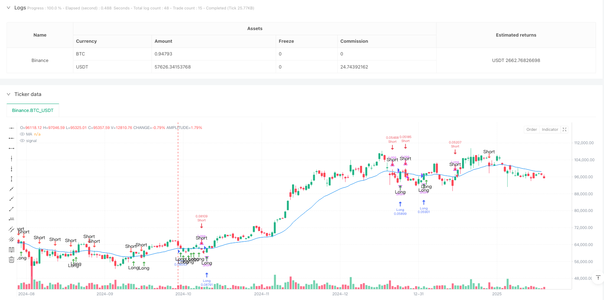
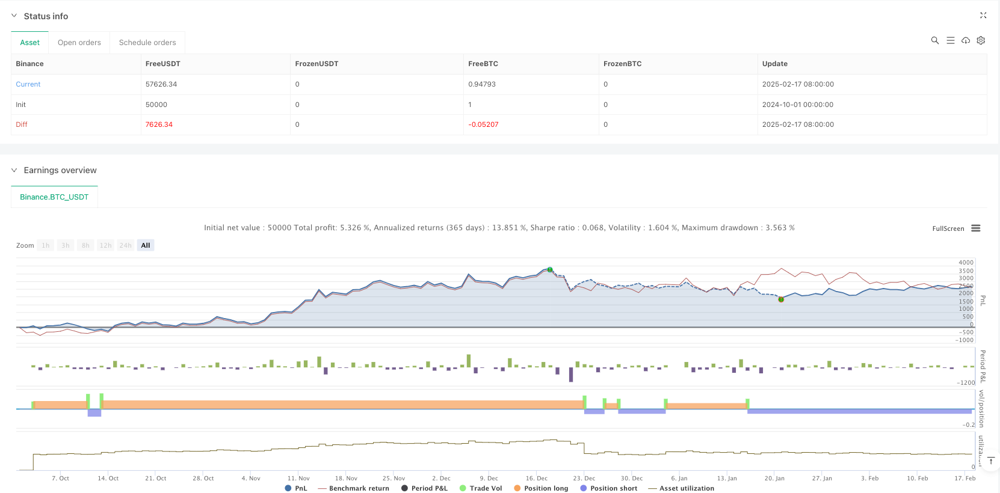

> Name

Composite Trend Moving Average Reversal Trading Strategy-Composite-Trend-Moving-Average-Reversal-Trading-Strategy
> Author

ianzeng123

> Strategy Description





[trans]
#### Overview
This strategy is a trend following and reversal trading system based on compound moving averages. It identifies trading opportunities by combining moving averages of different periods and combining price reactions to the moving averages. The core of the strategy is to judge trade timing by observing the relationship between price and the moving average and the reaction when the price pulls back to a specific threshold.
#### Strategy Principle
The strategy uses a combination of multiple moving average types (EMA, TEMA, DEMA, WMA, SMA) to construct a composite average through a weighted or arithmetic average of two different periods (default 20 and 30). When the price is above the moving average, it is considered an upward trend, and when it is below the moving average, it is considered a downward trend. The strategy will wait for the price to pull back near the moving average (controlled by the reaction percentage parameter) after the trend is established, and then trade if a reversal signal appears. Specifically, in an uptrend, a long position is opened when the price retraces to a specific percentage below the moving average and re-closes above the moving average; in a downtrend, a short position is opened when the price rebounds to a specific percentage above the moving average and re-closes below the moving average.
#### Strategic Advantages
1. The system has good adaptability, supports multiple moving average types, and can select the most suitable moving average according to different market characteristics.
2. Through the method of composite moving average, it effectively reduces the false signals that may be caused by a single period moving average.
3. The strategy adds the concept of reaction percentage, which avoids simple moving average crossing transactions and improves the reliability of transactions.
4. When the trend direction is clear, you can get a better trading price by waiting for a pullback to enter the market.
#### Strategy Risk
1. Frequent false signals may occur in volatile markets, leading to increased transaction costs.
2. The lagging nature of the composite moving average may cause delays in entry and exit timing.
3. The fixed response percentage may need to be adjusted under different market conditions.
4. In markets with rapid trend transitions, larger retracements may occur.
#### Strategy optimization direction
1. The volatility indicator can be introduced to dynamically adjust the reaction percentage to better adapt the strategy to different market environments.
2. Add volume factors to confirm the validity of price reversals.
3. Consider adding stop-loss and take-profit mechanisms to better control risks.
4. It can increase the judgment of trend strength and adopt more radical parameter settings in strong trends.
5. Consider adding the judgment of the market environment and use different parameter combinations under different market characteristics.
#### Summary
This is a strategy that combines trend following and reversal trading concepts, using compound moving averages and price reaction mechanisms to capture trading opportunities. The core advantage of the strategy lies in its flexibility and ability to filter false signals, but at the same time, attention must be paid to parameter optimization issues in different market environments. Through reasonable risk control and continuous optimization and improvement, this strategy is expected to achieve stable returns in actual transactions. ||
#### Overview
This strategy is a trend following and reversal trading system based on composite moving averages. It identifies trading opportunities by combining moving averages of different periods and monitoring price reactions to these averages. The core concept involves observing the relationship between price and moving averages, and trading based on price reactions at specific threshold levels.

#### Strategy Principle
The strategy employs various types of moving averages (EMA, TEMA, DEMA, WMA, SMA) and combines two different periods (default 20 and 30) through weighted or arithmetic averaging to construct a composite moving average. An uptrend is identified when price is above the average, and a downtrend when below. The strategy waits for price pullbacks near the moving average (controlled by a reaction percentage parameter) after a trend is established. Specifically, in an uptrend, it opens long positions when price pulls back below a specific percentage of the average and closes above it; in a downtrend, it opens short positions when price rebounds above a specific percentage and closes below the average.

#### Strategy Advantages
1. The system demonstrates good adaptability, supporting multiple types of moving averages to suit different market characteristics.
2. The composite moving average approach effectively reduces false signals that might occur with single-period averages.
3. The inclusion of a reaction percentage concept avoids simple moving average crossover trades, improving trading reliability.
4. Waiting for pullbacks in established trends allows for better entry prices.

#### Strategy Risks
1. May generate frequent false signals in choppy markets, increasing trading costs.
2. The lag inherent in composite moving averages can delay entry and exit timing.
3. Fixed reaction percentages may need adjustment in different market environments.
4. Significant drawdowns may occur during rapid trend transitions.

#### Strategy Optimization Directions
1. Incorporate volatility indicators to dynamically adjust reaction percentages for better market adaptation.
2. Add volume factors to confirm price reversal validity.
3. Implement stop-loss and take-profit mechanisms for better risk control.
4. Add trend strength evaluation for more aggressive parameter settings in strong trends.
5. Consider market environment analysis for different parameter combinations in various market conditions.

#### Summary
This strategy combines trend following and reversal trading concepts, capturing opportunities through composite moving averages and price reaction mechanisms. Its core strengths lie in flexibility and false signal filtering capability, though parameter optimization across different market environments requires attention. With proper risk control and continuous improvement, the strategy shows potential for stable returns in practical trading.[/trans]


> Source (PineScript)

``` pinescript
/*backtest
start: 2024-10-01 00:00:00
end: 2025-02-18 08:00:00
period: 1d
basePeriod: 1d
exchanges: [{"eid":"Binance","currency":"BTC_USDT"}]
*/

//@version=5
strategy("Ultrajante MA Reaction Strategy", overlay=true, initial_capital=10000, 
     default_qty_type=strategy.percent_of_equity, default_qty_value=10)

// ===== Custom Functions for DEMA and TEMA =====
dema(src, length) =>
    ema1 = ta.ema(src, length)
    ema2 = ta.ema(ema1, length)
    2 * ema1 - ema2

tema(src, length) =>
    ema1 = ta.ema(src, length)
    ema2 = ta.ema(ema1, length)
    ema3 = ta.ema(ema2, length)
    3 * ema1 - 3 * ema2 + ema3

// ===== Configuration Parameters =====

// MA Type Selection
maType = input.string(title="MA Type", defval="EMA", options=["SMA", "EMA", "WMA", "DEMA", "TEMA"])

// Parameters for composite periods
periodA = input.int(title="Period A", defval=20, minval=1)
periodB = input.int(title="Period B", defval=30, minval=1)
compMethod = input.string(title="Composite Method", defval="Average", options=["Average", "Weighted"])

// Reaction percentage (e.g., 0.5 means 0.5%)
reactionPerc = input.float(title="Reaction %", defval=0.5, step=0.1)

// ===== Composite Period Calculation =====
compPeriod = compMethod == "Average" ? math.round((periodA + periodB) / 2) : math.round((periodA * 0.6 + periodB * 0.4))

// ===== Moving Average Calculation based on selected type =====
ma = switch maType
    "SMA"  => ta.sma(close, compPeriod)
    "EMA"  => ta.ema(close, compPeriod)
    "WMA"  => ta.wma(close, compPeriod)
    "DEMA" => dema(close, compPeriod)
    "TEMA" => tema(close, compPeriod)
    => ta.ema(close, compPeriod)  // Default value

plot(ma, color=color.blue, title="MA")

// ===== Trend Definition =====
trendUp = close > ma
trendDown = close < ma

// ===== Reaction Threshold Calculation =====
// In uptrend: expect the price to retrace to or below a value close to the MA
upThreshold = ma * (1 - reactionPerc / 100)
// In downtrend: expect the price to retrace to or above a value close to the MA
downThreshold = ma * (1 + reactionPerc / 100)

// ===== Quick Reaction Detection =====
// For uptrend: reaction is detected if the low is less than or equal to the threshold and the close recovers and stays above the MA
upReaction = trendUp and (low <= upThreshold) and (close > ma)
// For downtrend: reaction is detected if the high is greater than or equal to the threshold and the close stays below the MA
downReaction = trendDown and (high >= downThreshold) and (close < ma)

// ===== Trade Execution =====
if upReaction
    // Close short position if exists and open long position
    strategy.close("Short", comment="Close Short due to Bullish Reaction")
    strategy.entry("Long", strategy.long, comment="Long Entry due to Bullish Reaction in Uptrend")

if downReaction
    // Close long position if exists and open short position
    strategy.close("Long", comment="Close Long due to Bearish Reaction")
    strategy.entry("Short", strategy.short, comment="Short Entry due to Bearish Reaction in Downtrend")

// ===== Visualization of Reactions on the Chart =====
plotshape(upReaction, title="Bullish Reaction", style=shape.arrowup, location=location.belowbar, color=color.green, size=size.small, text="Long")
plotshape(downReaction, title="Bearish Reaction", style=shape.arrowdown, location=location.abovebar, color=color.red, size=size.small, text="Short")

```

> Detail

https://www.fmz.com/strategy/482906

> Last Modified

2025-02-27 17:23:21
