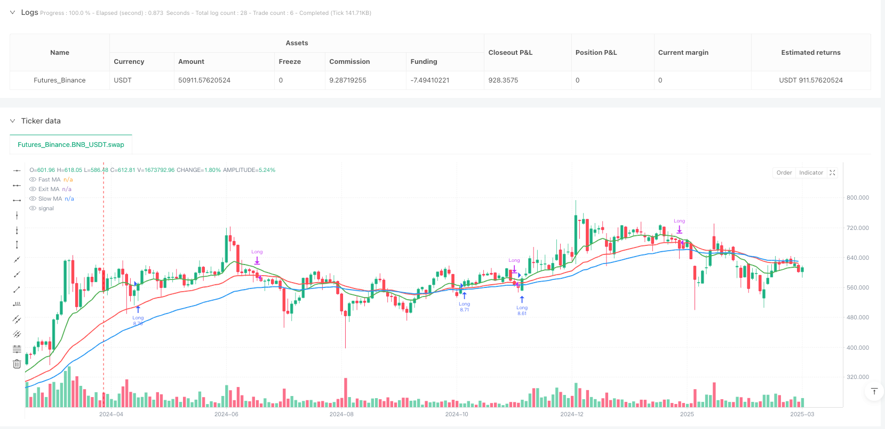
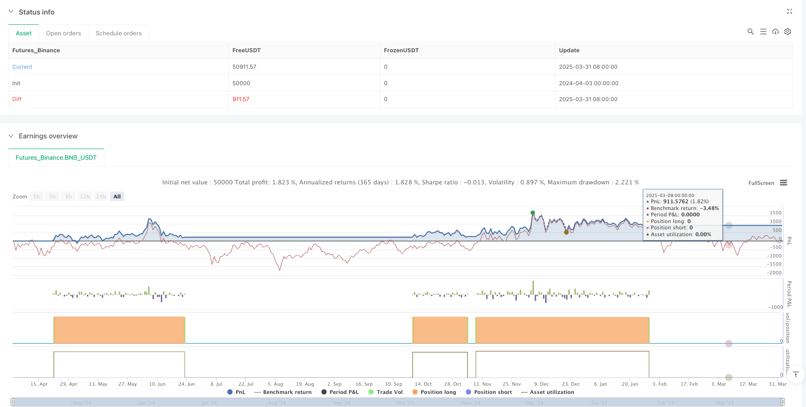

> Name

Configurable-Moving-Average-Crossover-Strategy
> Author

ianzeng123

> Strategy Description





[trans]
#### Overview
This article introduces a flexible and powerful moving average crossover trading strategy that allows traders to customize the moving average parameters and types based on different market conditions. The core of the strategy is the use of moving averages of different periods and types for trend following and signal generation.
#### Strategy Principle
The strategy generates trading signals by calculating moving averages of three different periods (fast, slow and exit). The main principles include:
1. Moving average type selection: Supports simple moving average (SMA), exponential moving average (EMA), weighted moving average (WMA) and Hull Moving Average (HMA).
2. Admission conditions:
   - Long entry: the closing price is higher than the fast line, the fast line is higher than the slow line, and the closing price is higher than the exit line
   - Short entry: the closing price is lower than the fast line, the fast line is lower than the slow line, and the closing price is lower than the exit line
3. Entry conditions:
   - Long exit: After entering at least two K lines, the closing price is lower than the exit line
   - Short exit: After entering at least two K lines, the closing price is higher than the exit line
#### Strategic Advantages
1. Highly configurable: traders can flexibly adjust the moving average period and type
2. Multi-market adaptability: It can be applied to trading varieties with different liquidity by adjusting parameters
3. Strong trend tracking ability: Use multiple moving averages to filter out false signals
4. Risk control: The default setting is position management of 10% of account equity
5. Flexible trading direction: you can choose whether to enable short trading
#### Strategy Risk
1. Parameter sensitivity: Different markets may require different moving average parameters
2. Trending markets perform better: more invalid signals may be generated in volatile markets
3. Transaction cost: The strategy defaults to a trading commission of 0.06%, which needs to be considered in actual transactions.
4. Limitations of backtesting: Currently, preliminary verification has only been conducted on some varieties (such as BTCUSD and NIFTY)
#### Strategy optimization direction
1. Dynamic parameter adjustment: introducing adaptive moving average period
2. Combine with other technical indicators: add RSI, MACD and other indicators for signal filtering
3. Stop loss mechanism: Add a stop loss strategy based on volatility
4. Multi-time frame verification: comprehensive backtesting in different time periods
5. Machine learning optimization: Use algorithms to automatically find the optimal parameter combination
#### Summarize
The configurable Moving Average Crossover strategy (MA-X) provides a flexible trend following framework. With proper allocation and continuous optimization, this strategy can become a powerful tool in the quantitative trading toolbox. Traders need to make personalized adjustments based on specific market characteristics and conduct sufficient backtesting and verification.
|| 

#### Overview

This article introduces a flexible and powerful moving average crossover trading strategy that allows traders to customize moving average parameters and types based on different market conditions. The core of the strategy is to use moving averages of different periods and types for trend tracking and signal generation.

#### Strategy Principles

The strategy generates trading signals by calculating three moving averages of different periods (fast, slow, and exit lines). The main principles include:

1. Moving Average Type Selection: Supports Simple Moving Average (SMA), Exponential Moving Average (EMA), Weighted Moving Average (WMA), and Hull Moving Average (HMA).
2. Entry Conditions:
   - Long Entry: Close price above fast MA, fast MA above slow MA, and close price above exit MA
   - Short Entry: Close price below fast MA, fast MA below slow MA, and close price below exit MA
3. Exit Conditions:
   - Long Exit: After at least two bars, close price below exit MA
   - Short Exit: After at least two bars, close price above exit MA

#### Strategy Advantages

1. High Configurability: Traders can flexibly adjust moving average periods and types
2. Multi-Market Adaptability: Applicable to different liquidity instruments by adjusting parameters
3. Strong Trend Tracking Capability: Uses multiple moving averages to filter false signals
4. Risk Control: Default position management of 10% of account equity
5. Flexible Trading Direction: Option to enable or disable short trading

#### Strategy Risks

1. Parameter Sensitivity: Different markets may require different moving average parameters
2. Performance in Trending Markets: May generate more invalid signals in range-bound markets
3. Transaction Costs: Default setting of 0.06% commission needs consideration in actual trading
4. Backtesting Limitations: Currently validated only on a few instruments (e.g., BTCUSD and NIFTY)

#### Strategy Optimization Directions

1. Dynamic Parameter Adjustment: Introduce adaptive moving average periods
2. Combine with Other Technical Indicators: Add RSI, MACD for signal filtering
3. Stop Loss Mechanism: Add volatility-based stop loss strategy
4. Multi-Timeframe Verification: Comprehensive backtesting across different time periods
5. Machine Learning Optimization: Use algorithms to automatically find optimal parameter combinations

#### Summary

The Configurable Moving Average Crossover Strategy (MA-X) provides a flexible trend-tracking framework. Through reasonable configuration and continuous optimization, this strategy can become a powerful tool in the quantitative trading toolbox. Traders need to make personalized adjustments based on specific market characteristics and conduct thorough backtesting and verification.
[/trans]


> Source (PineScript)

``` pinescript
/*backtest
start: 2024-04-03 00:00:00
end: 2025-04-02 00:00:00
period: 2d
basePeriod: 2d
exchanges: [{"eid":"Futures_Binance","currency":"BNB_USDT"}]
*/

// This Pine Script™ code is subject to the terms of the Mozilla Public License 2.0 at https://mozilla.org/MPL/2.0/
// © YetAnotherTA

//@version=6
strategy("Configurable MA Cross (MA-X) Strategy", "MA-X", overlay=true, default_qty_type=strategy.percent_of_equity, default_qty_value=10, commission_type = strategy.commission.percent, commission_value = 0.06)

// === Inputs ===
// Moving Average Periods
maPeriodA = input.int(13, title="Fast MA")
maPeriodB = input.int(55, title="Slow MA")
maPeriodC = input.int(34, title="Exit MA")

// MA Type Selection
maType = input.string("EMA", title="MA Type", options=["SMA", "EMA", "WMA", "HMA"])

// Toggle for Short Trades (Disabled by Default)
enableShorts = input.bool(false, title="Enable Short Trades", tooltip="Enable or disable short positions")

// === Function to Select MA Type ===
getMA(src, length) =>
    maType == "SMA" ? ta.sma(src, length) : maType == "EMA" ? ta.ema(src, length) : maType == "WMA" ? ta.wma(src, length) : ta.hma(src, length)

// === MA Calculation ===
maA = getMA(close, maPeriodA)
maB = getMA(close, maPeriodB)
maC = getMA(close, maPeriodC)

// === Global Variables for Crossover Signals ===
var bool crossAboveA = false
var bool crossBelowA = false

crossAboveA := ta.crossover(close, maA)
crossBelowA := ta.crossunder(close, maA)

// === Bar Counter for Exit Control ===
var int barSinceEntry = na

// Reset the counter on new entries
if (strategy.opentrades == 0)
    barSinceEntry := na

// Increment the counter on each bar
if (strategy.opentrades > 0)
    barSinceEntry := (na(barSinceEntry) ? 1 : barSinceEntry + 1)

// === Entry Conditions ===
goLong = close > maA and maA > maB and close > maC and crossAboveA
goShort = enableShorts and close < maA and maA < maB and close < maC and crossBelowA  // Shorts only when toggle is enabled

// === Exit Conditions (only after 1+ bar since entry) ===
exitLong = (strategy.position_size > 0) and (barSinceEntry >= 2) and (close < maC)
exitShort = enableShorts and (strategy.position_size < 0) and (barSinceEntry >= 2) and (close > maC)

// === Strategy Execution ===
// Long entry logic
if (goLong)
    strategy.close("Short")         // Close any short position
    strategy.entry("Long", strategy.long)
    alert("[MA-X] Go Long")
    barSinceEntry := 1               // Reset the bar counter

// Short entry logic (only if enabled)
if (enableShorts and goShort)
    strategy.close("Long")          // Close any long position
    strategy.entry("Short", strategy.short)
    alert("[MA-X] Go Short")
    barSinceEntry := 1               // Reset the bar counter

// Exit logic (only after at least 1 bar has passed)
if (exitLong)
    strategy.close("Long")
    alert("[MA-X] Exit Long")

if (enableShorts and exitShort)
    strategy.close("Short")
    alert("[MA-X] Exit Short")

// === Plotting ===
plot(maA, color=color.green, linewidth=2, title="Fast MA")
plot(maB, color=color.blue, linewidth=2, title="Slow MA")
plot(maC, color=color.red, linewidth=2, title="Exit MA")
```

> Detail

https://www.fmz.com/strategy/489300

> Last Modified

2025-04-03 11:31:33
