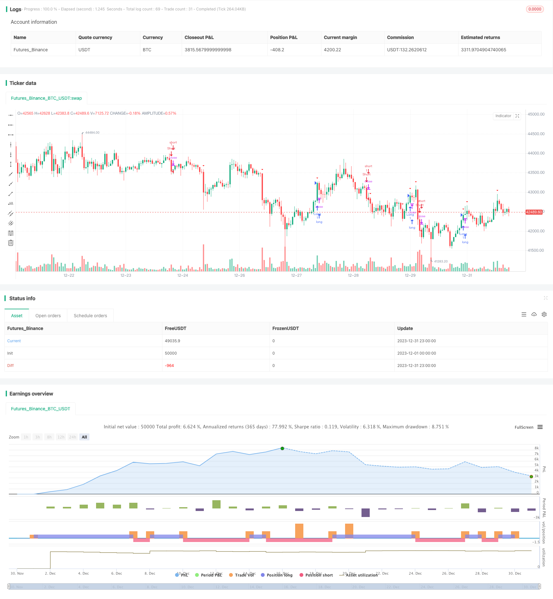

> Name

Using Bollinger Band Breakout Consolidation Strategy Consolidation-Breakout-Strategy
> Author

ChaoZhang

> Strategy Description


[trans]

## Overview
This strategy uses the Bollinger Bands indicator to determine whether the price is in a consolidation period, and uses breakouts to determine entry and exit. Overall, this strategy mainly takes advantage of the dramatic market movements brought about by price consolidation to make profits.
## Strategy Principle
This strategy first calculates the simple moving average of the closing prices within 20 days as the middle track of the Bollinger Bands, and calculates 2 times the standard deviation as the bandwidth of the Bollinger Bands. When the price is higher than the upper rail, it is judged to be a breakthrough of the upper rail. When the price is lower than the lower rail, it is judged to be a breakthrough of the lower rail.
When the price is above and below the middle track of the Bollinger Bands, it is judged to be a consolidation period. When a breakout signal is detected, enter the market long. When it breaks through the lower track again, close the position. Same goes for short selling.
The stop loss is set to 2 times the ATR indicator.
## Advantage Analysis
This strategy mainly relies on the integration and breakthrough properties of Bollinger Bands and has the following advantages:
1. Taking advantage of the violent market movements brought about by price consolidation, the potential for profit is huge.
2. Bollinger Bands indicators are intuitive and parameter optimization is simple.
3. Follow the general trend and avoid chasing the top and falling.
## Risk Analysis
There are also some risks with this strategy:
1. Breakthrough signals may appear as false breakthroughs, resulting in losses
2. The stop loss setting is too large and the loss in a single transaction increases.
3. Improper setting of Bollinger Band parameters and loss of indicator effectiveness
Countermeasures:
1. Combine price and volume indicators to filter out false breakthroughs
2. Optimize the stop loss range and reduce single losses
3. Test different Bollinger Band parameters and choose the optimal parameters
## Optimization direction
This strategy can be optimized from the following directions:
1. Integrating judgment rules can introduce more indicators to avoid false signals
2. Add trend filtering and decide whether to go long or short based on the trend direction.
3. Add stop loss methods, such as trailing stop loss, to better control risks
## Summarize
The overall strategy is relatively simple and direct, and it achieves greater profits by capturing the energy accumulation brought about by price integration. There is a lot of room for optimization, and you can adjust entry rules, stop loss methods, etc. to obtain more stable returns while controlling risks.
||

## Overview  

This strategy uses the Bollinger Bands indicator to determine if prices are in a consolidation period, and breakouts to determine entries and exits. Overall, this strategy mainly takes advantage of the violent moves brought by price consolidations to make profits.  

## Strategy Logic  

The strategy first calculates the 20-day simple moving average of the closing price as the middle band of the Bollinger Bands, and 2 times the standard deviation as the band width. A close above the upper band indicates an upper band breakout, while a close below the lower band indicates a lower band breakout.  

When prices are between the upper and lower Bollinger Bands, it is considered a consolidation period. When a breakout signal is detected, go long. When prices break below the lower band again, close the position. Going short works similarly.  

The stop loss is set at 2 times the ATR indicator.

## Advantage Analysis

The main advantages of this strategy are:

1. Taking advantage of violent moves brought by price consolidations for potentially huge profits  
2. Bollinger Bands indicator is intuitive and easy to optimize parameters
3. Following major trends, avoiding buying tops and selling bottoms

## Risk Analysis  

There are also some risks:

1. Breakout signals may turn out to be false breaks, causing losses
2. Stop loss set too wide, leading to large losses
3. Bollinger Bands parameters set improperly, losing effectiveness

Counter measures:

1. Add volume filters to detect false breaks 
2. Optimize stop loss range to limit losses  
3. Test different BB parameters to find optimum  

## Optimization Directions

Some ways to improve the strategy:

1. Add more indicators to consolidate detection rules to avoid false signals
2. Add trend filter to determine long/short based on trend direction 
3. Enhance stop loss methods like trailing stop to better control risks

## Conclusion  

The strategy is simple and straight forward, profiting from energy buildup during consolidations. Huge optimization space exists around entry rules, stop loss methods etc to obtain more steady profits while controlling risks.

[/trans]

> Strategy Arguments


|Argument|Default|Description|
|----|----|----|
|v_input_1|20|Bollinger Bands Length|
|v_input_2|2|Bollinger Bands Multiplier|
|v_input_float_1|true|Risk per Trade (%)|
|v_input_float_2|2|Stop Loss Multiplier|


> Source (PineScript)

``` pinescript
/*backtest
start: 2023-12-01 00:00:00
end: 2023-12-31 23:59:59
period: 1h
basePeriod: 15m
exchanges: [{"eid":"Futures_Binance","currency":"BTC_USDT"}]
*/

//@version=5
strategy("Consolidation Breakout Strategy", shorttitle="CBS", overlay=true)

// Parameters
length = input(20, title="Bollinger Bands Length")
mult = input(2.0, title="Bollinger Bands Multiplier")
risk = input.float(1, title="Risk per Trade (%)") / 100

// Calculate Bollinger Bands
basis = ta.sma(close, length)
dev = mult * ta.stdev(close, length)
upper = basis + dev
lower = basis - dev

// Entry Conditions
consolidating = ta.crossover(close, upper) and ta.crossunder(close, lower)

// Exit Conditions
breakout = ta.crossover(close, upper) or ta.crossunder(close, lower)

// Risk Management
atrVal = ta.atr(14)
stopLoss = atrVal * input.float(2, title="Stop Loss Multiplier", minval=0.1, maxval=5)

// Entry and Exit Conditions
longEntry = breakout and close > upper
shortEntry = breakout and close < lower

if (longEntry)
    strategy.entry("Long", strategy.long)

if (shortEntry)
    strategy.entry("Short", strategy.short)

if (longEntry and close < basis - stopLoss)
    strategy.close("Long Exit")

if (shortEntry and close > basis + stopLoss)
    strategy.close("Short Exit")

// Plot Entry and Exit Points
plotshape(consolidating, style=shape.triangleup, location=location.belowbar, color=color.rgb(30, 255, 0), title="Entry Signal")
plotshape(breakout, style=shape.triangledown, location=location.abovebar, color=color.rgb(255, 0, 0), title="Exit Signal")


```

> Detail

https://www.fmz.com/strategy/440542

> Last Modified

2024-01-31 15:08:46
