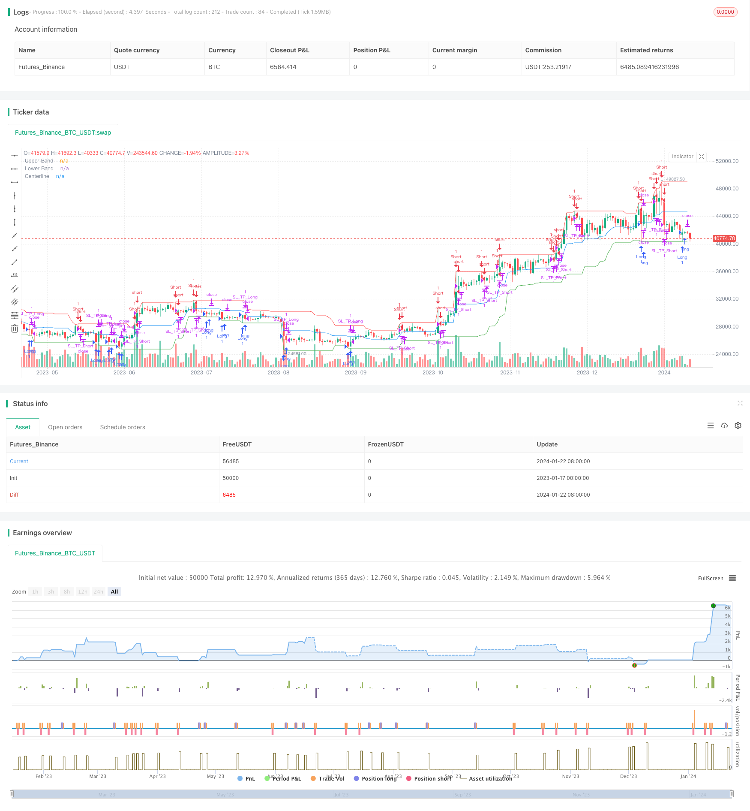

> Name

Contrarian-Donchian-Channel-Touch-Entry-Strategy-with-Post-Stop-Loss-Pause-and-Trailing-Stop-Loss
> Author

ChaoZhang

> Strategy Description


 [trans]
## Overview
The reverse Tang Xiao channel pressure trading strategy is a quantitative trading strategy based on the Tang Xiao channel indicator. This strategy combines stop-loss and trailing stops for risk management.
When the price touches the upper and lower boundaries of the Tang Xiao channel, open a long or short position, and set a stop loss and a take profit at the same time. If a stop loss occurs, a new position will be opened after a certain period of time. During the holding period, profits are locked in by trailing stop loss.
## Strategy Principle
This strategy uses the 20-day Tang Xiao channel indicator, which includes the upper track, lower track and midline.
### Position opening logic
Open a long position when the price touches the lower track; open a short position when the price touches the upper track.
If a stop loss occurred in the same direction transaction before, it should be suspended for a certain period (such as 3 K lines) to avoid chasing the dragon.
### Stop loss and take profit logic
Set a fixed ratio of stop loss and dynamically adjusted take profit every time you open a position.
Take profit is calculated based on the risk-benefit ratio (such as 2) and stop loss percent (such as 22%).
### Trailing stop loss logic
Enable trailing stop during the position phase:
When holding a long position, if the price crosses the midline, adjust the stop loss to the midpoint between the entry price and the midline price.
The same applies when short positions cross the midline.
## Strategic Advantages
1. Use the Tang Xiao channel indicator to have a certain ability to capture breakthrough market trends.
2. Opening a position under pressure is in line with the trading idea of ​​reverse operation.
3. Stop loss and pause to avoid chasing the dragon, follow stop loss to lock in profits, and have good risk management.
4. The policy rules are clear, easy to understand and easy to implement.
## Strategy Risk
1. As a trend indicator, the Tang Xiao Channel is prone to false breakthroughs during consolidation, which may lead to losses.
2. Fixed stop loss is easy to be trapped, so the stop loss range should be adjusted appropriately.
3. If the trailing stop loss adjustment range is large, it is easy to be hit out. The adjustment frequency should be balanced.
4. Improper parameter settings can also affect strategy performance.
## Strategy optimization direction
1. The Tang Xiao channel length can be optimized to find the best parameter combination.
2. Add a position management module, such as regularly resetting the suspension cycle.
3. Combine with other indicators to judge the trend and avoid trend false breakthroughs.
4. Enable dynamic stop loss and adjust the stop loss position in real time.
## Summarize
The reverse Tang Xiao channel pressure trading strategy integrates many functions such as trend judgment and risk management, and its fundamentals are relatively complete. Through continuous optimization of parameters and combination with other indicators or models, the robustness of the strategy can be further enhanced and the rate of return improved. This strategy is suitable for investors with certain trading experience.
||

## Overview

The Contrarian Donchian Channel Touch Entry Strategy is a quantitative trading strategy based on the Donchian Channel indicator. It incorporates stop loss pause and trailing stop loss for risk management. 

The strategy enters long/short positions when price touches the upper/lower band of Donchian Channel. Stop loss and take profit levels are set for each trade. After a stop loss hit, there would be a pause for a number of bars before taking a new trade in the same direction. During a trade, trailing stop loss is used to lock in profits.

## Strategy Logic

The strategy uses 20-period Donchian Channel, consisting of Upper Band, Lower Band and Middle Line. 

### Entry Logic

Go long when price touches the lower band; go short when price touches the upper band.  

A pause (e.g. 3 bars) is required after previous stop loss in the same direction to avoid chasing trends.

### Stop Loss and Take Profit

For each trade, set a fixed percentage stop loss (e.g. 22%) and a dynamic take profit calculated based on risk-reward ratio (e.g. 2)

### Trailing Stop Loss

Use a trailing stop loss during trades:

For long trades, if price crosses above middle line, adjust stop loss to the mid-point of entry price and middle line.

Vice versa for short positions crossing below middle line. 

## Advantages

1. Catch trending moves using Donchian Channel breakouts.

2. Contrarian touch entry aligns with trading against the trend idea.  

3. Effective risk management with stop loss pause and trailing stop.

4. Clear and easy-to-implement rules.

## Risks

1. Whipsaws on sideways markets for a trend-following system.

2. Fixed stop loss could be prone to getting stopped out prematurely. 

3. Overly aggressive trailing stop adjustment could knock out profitable trades too early.  

4. Parameter optimization is crucial.

## Enhancement Opportunities

1. Optimize Donchian Channel lookback period for best parameters.

2. Incorporate position sizing rules e.g. reset pause count periodically.

3. Add filters using other indicators to avoid false breakouts.   

4. Experiment with dynamic stop loss.

## Summary

The Contrarian Donchian Channel Touch Entry Strategy integrates trend identification, risk management and more. With further parameter tuning and combinations with other models, it can achieve better robustness and profitability for experienced traders.

[/trans]

> Strategy Arguments


|Argument|Default|Description|
|----|----|----|
|v_input_1|20|Donchian Channel Length|
|v_input_2|2|Risk/Reward Ratio|
|v_input_3|0.22|Stop Loss (%)|
|v_input_4|3|Pause After SL (Candles)|


> Source (PineScript)

``` pinescript
/*backtest
start: 2023-01-17 00:00:00
end: 2024-01-23 00:00:00
period: 1d
basePeriod: 1h
exchanges: [{"eid":"Futures_Binance","currency":"BTC_USDT"}]
*/

//@version=4
strategy("Contrarian Donchian Channel Strategy - Touch Entry with Post-SL Pause and Trailing Stop", overlay=true, default_qty_value=0.01, default_qty_type=strategy.percent_of_equity)

// Inputs
length = input(20, minval=1, title="Donchian Channel Length")
riskRewardRatio = input(2, title="Risk/Reward Ratio")
stopLossPercent = input(0.22, title="Stop Loss (%)") / 100
pauseCandles = input(3, minval=1, title="Pause After SL (Candles)")

// Donchian Channel Calculation
upper = highest(high, length)
lower = lowest(low, length)
centerline = (upper + lower) / 2  // Calculating the Centerline

// Plotting Donchian Channel and Centerline
plot(upper, color=color.red, title="Upper Band")
plot(lower, color=color.green, title="Lower Band")
plot(centerline, color=color.blue, title="Centerline")

// Tracking Stop Loss Hits and Pause
var longSLHitBar = 0
var shortSLHitBar = 0
var int lastTradeDirection = 0 // 1 for long, -1 for short, 0 for none

// Update SL Hit Bars
if (strategy.position_size[1] > 0 and strategy.position_size == 0)
    if (close[1] < strategy.position_avg_price[1])
        longSLHitBar := bar_index
        lastTradeDirection := 1

if (strategy.position_size[1] < 0 and strategy.position_size == 0)
    if (close[1] > strategy.position_avg_price[1])
        shortSLHitBar := bar_index
        lastTradeDirection := -1

// Entry Conditions - Trigger on touch
longCondition = (low <= lower) and (bar_index - longSLHitBar > pauseCandles or lastTradeDirection != 1)
shortCondition = (high >= upper) and (bar_index - shortSLHitBar > pauseCandles or lastTradeDirection != -1)

// Trade Execution
if (longCondition)
    strategy.entry("Long", strategy.long)
if (shortCondition)
    strategy.entry("Short", strategy.short)

// Initial Stop Loss and Take Profit Calculation
stopLoss = strategy.position_avg_price * (1 - stopLossPercent)
takeProfit = strategy.position_avg_price * (1 + stopLossPercent * riskRewardRatio)

// Trailing Stop Loss Logic
var float trailingStopLong = na
var float trailingStopShort = na

// Update Trailing Stop for Long Position
if (strategy.position_size > 0)
    if (close > centerline)
        trailingStopLong := (strategy.position_avg_price + centerline) / 2
    stopLoss := na(trailingStopLong) ? stopLoss : max(trailingStopLong, stopLoss)

// Update Trailing Stop for Short Position
if (strategy.position_size < 0)
    if (close < centerline)
        trailingStopShort := (strategy.position_avg_price + centerline) / 2
    stopLoss := na(trailingStopShort) ? stopLoss : min(trailingStopShort, stopLoss)

// Setting Stop Loss and Take Profit for each trade
strategy.exit("SL_TP_Long", "Long", stop=stopLoss, limit=takeProfit)
strategy.exit("SL_TP_Short", "Short", stop=stopLoss, limit=takeProfit)

```

> Detail

https://www.fmz.com/strategy/439872

> Last Modified

2024-01-24 15:07:18
