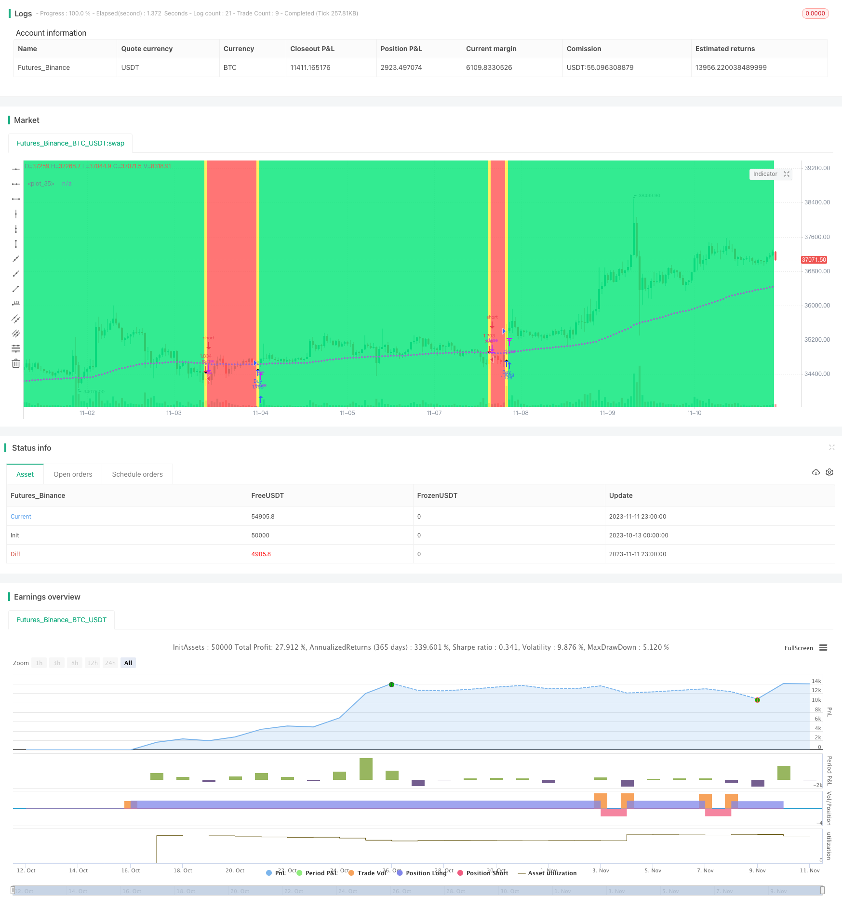

> Name

Corn-Moving-Average-Balance-Trading-Strategy
> Author

ChaoZhang

> Strategy Description


[trans]

## Overview
The moving average long-short balanced trading strategy is a strategy that uses the golden and death moving averages of different periods to cross for long-short balanced trading. This strategy also combines K-line display color, background color, shape mark and other visual effects to assist in observing trend changes. This strategy is suitable for intermediate and advanced traders who are familiar with moving average theory.
## Strategy Principle
The strategy first defines two user-adjustable parameters: active moving average period len1 and base moving average period len2. The active moving average has a short period and can capture short-term trend changes; the base moving average has a long period and can filter out short-term market noise. Users are free to choose from 5 different types of moving averages: EMA exponential moving average, SMA simple moving average, WMA weighted moving average, DEMA double exponential moving average and VWMA volume weighted moving average. The code judges the user's choice through if logic and calculates different types of moving averages.
When the short-term moving average crosses the long-term moving average, a golden cross signal is generated, and a long order is opened; when the short-term moving average crosses below the long-term moving average, a dead cross signal is generated, and a short order is opened. Long-short balanced trading increases profit opportunities. In addition, the color of the K line also shows the current long and short trend.
Shape markers visually show the locations of the golden and dead crosses. The background color helps determine the trend direction. This strategy has both "long-short balance" and "long-only" trading modes available.
## Strategic Advantages
1. Combined with multiple moving average indicators at the same time, trading signals are more reliable
2. Balance long and short transactions to increase profit opportunities
3. The moving average type and period length can be customized to adapt to different market environments.
4. Combine a variety of visual effects to intuitively judge trend changes
5. The code structure is clear, easy to understand and secondary development
## Risks and Solutions
1. Risk of moving averages producing misleading signals
- Use moving average combinations of different periods to reduce misleading signals
    - Add other exit conditions, such as stop loss line
2. The risk that a specific period is more suitable for the strategy
- Test different cycle parameters to find the best cycle
    - Optimize the code so that cycle parameters can be dynamically adjusted
3. Long and short transactions increase the risk of loss
- Properly adjust position management
    - Select only long trading mode
## Optimization direction
1. Add a stop loss line to control single loss
2. Add conditions for re-entering the market
3. Optimize position management strategy
4. Explore new trading signals such as volatility indicators
5. Dynamically optimize cycle parameters
6. Optimize the weight of moving average types
## Summarize
The moving average long-short balanced trading strategy integrates the advantages of moving average indicators and achieves long-short balanced trading. This strategy has rich visual effects and is easy to grasp market trends; while the parameters can be customized and have strong adaptability. But you need to be aware of misleading signals and position management issues. This strategy provides a customizable and optimized frame of reference for intermediate and advanced traders.
|| 

## Overview

The Corn Moving Average Balance Trading Strategy utilizes the golden and dead crossovers of moving averages with different periods for long and short balance trading. It also incorporates various visual effects like candle colors, background colors and shape markers to assist in observing trend changes. This strategy is suitable for intermediate to advanced traders who are familiar with moving average theories.

## Strategy Logic

The strategy first defines two user-adjustable parameters: the active moving average period len1 and the baseline moving average period len2. The active moving average has a shorter period to capture short-term trend changes, while the baseline moving average has a longer period to filter out market noises. Users can freely choose between 5 different types of moving averages: EMA, SMA, WMA, DEMA and VWMA. The code uses if logic to calculate different types of moving averages based on user's selection.

When the short-term moving average crosses over the long-term one, a golden cross is generated for opening long positions. When a dead cross happens, the strategy opens short positions. The long and short balance trading increases profit opportunities. In addition, the candle colors also display the current trend direction.

The shape markers visually show the positions of golden and dead crosses. The background color assists in determining the trend direction. This strategy has both the "long and short balance" and "long only" trading modes available.

## Advantages

1. More reliable trading signals with multiple indicators combined 
2. Increased profit potential with long and short balance trading
3. Customizable moving average types and periods adaptable to different market environments
4. Intuitive trend spotting with various visual effects
5. Clear code structure easy to understand and customize

## Risks and Solutions

1. Misleading signals from moving averages

    - Use moving average combos of different periods to reduce misleading signals
    - Add other exit conditions like stop loss

2. Certain periods may fit the strategy better

    - Test different period parameters to find the optimal ones
    - Make the period parameter dynamic and adjustable in the code

3. Increased loss risk with long and short trading

    - Adjust position sizing properly
    - Select long only trading mode

## Optimization Directions

1. Add stop loss to control single trade loss
2. Build conditions for re-entering the market
3. Optimize position sizing strategies
4. Explore new trading signals like volatility indicators
5. Dynamically optimize the period parameters
6. Optimize the weights between different moving average types

## Summary

The Corn Moving Average Balance Trading Strategy integrates the strengths of moving average indicators and enables long and short balance trading. It has rich visual effects for trend spotting and customizable parameters for adaptability. But misleading signals and position sizing need to be watched out for. This strategy provides intermediate to advanced traders a customizable framework for reference.

[/trans]

> Strategy Arguments


|Argument|Default|Description|
|----|----|----|
|v_input_1|0|Active MA: EMA|SMA|WMA|DEMA|VWMA|
|v_input_2|0|Base MA: EMA|SMA|WMA|DEMA|VWMA|
|v_input_3|20|Active Length|
|v_input_4|100|Base Length|
|v_input_5_close|0|Source: close|high|low|open|hl2|hlc3|hlcc4|ohlc4|
|v_input_6|0|strat: Long+Short|Long Only|


> Source (PineScript)

``` pinescript
/*backtest
start: 2023-10-13 00:00:00
end: 2023-11-12 00:00:00
period: 1h
basePeriod: 15m
exchanges: [{"eid":"Futures_Binance","currency":"BTC_USDT"}]
*/

//@version=3
strategy("MASelect Crossover Strat", overlay=true, default_qty_type=strategy.percent_of_equity, default_qty_value=100)
av1 = input(title="Active MA", defval="EMA", options=["EMA", "SMA", "WMA", "DEMA", "VWMA"])
av2 = input(title="Base MA", defval="EMA", options=["EMA", "SMA", "WMA", "DEMA", "VWMA"])
len1 = input(20, "Active Length")
len2 = input(100, "Base Length")
src = input(close, "Source")
strat = input(defval="Long+Short", options=["Long+Short", "Long Only"])

ema1 = ema(src, len1)
ema2 = ema(src, len2)
sma1 = sma(src, len1)
sma2 = sma(src, len2)
wma1 = wma(src, len1)
wma2 = wma(src, len2)
e1 = ema(src, len1)
e2 = ema(e1, len1)
dema1 = 2 * e1 - e2
e3 = ema(src, len2)
e4 = ema(e3, len2)
dema2 = 2 * e3 - e4
vwma1 = vwma(src, len1)
vwma2 = vwma(src, len2)

ma1 = av1 == "EMA"?ema1:av1=="SMA"?sma1:av1=="WMA"?wma1:av1=="DEMA"?dema1:av1=="VWMA"?vwma1:na
ma2 = av2 == "EMA"?ema2:av2=="SMA"?sma2:av2=="WMA"?wma2:av2=="DEMA"?dema2:av2=="VWMA"?vwma2:na

co = crossover(ma1, ma2)
cu = crossunder(ma1, ma2)
barcolor(co?lime:cu?yellow:na)
col = ma1 >= ma2?lime:red
bgcolor(co or cu?yellow:col)
plotshape(co, style=shape.triangleup, location=location.belowbar)
plotshape(cu, style=shape.triangledown)
plot(ma1, color=col, linewidth=3), plot(ma2, style=circles, linewidth=1)

strategy.entry("Buy", strategy.long, when=co)
if strat=="Long+Short"
    strategy.entry("Sell", strategy.short, when=cu)
else
    strategy.close("Buy", when=cu)
```

> Detail

https://www.fmz.com/strategy/431973

> Last Modified

2023-11-13 18:00:09
