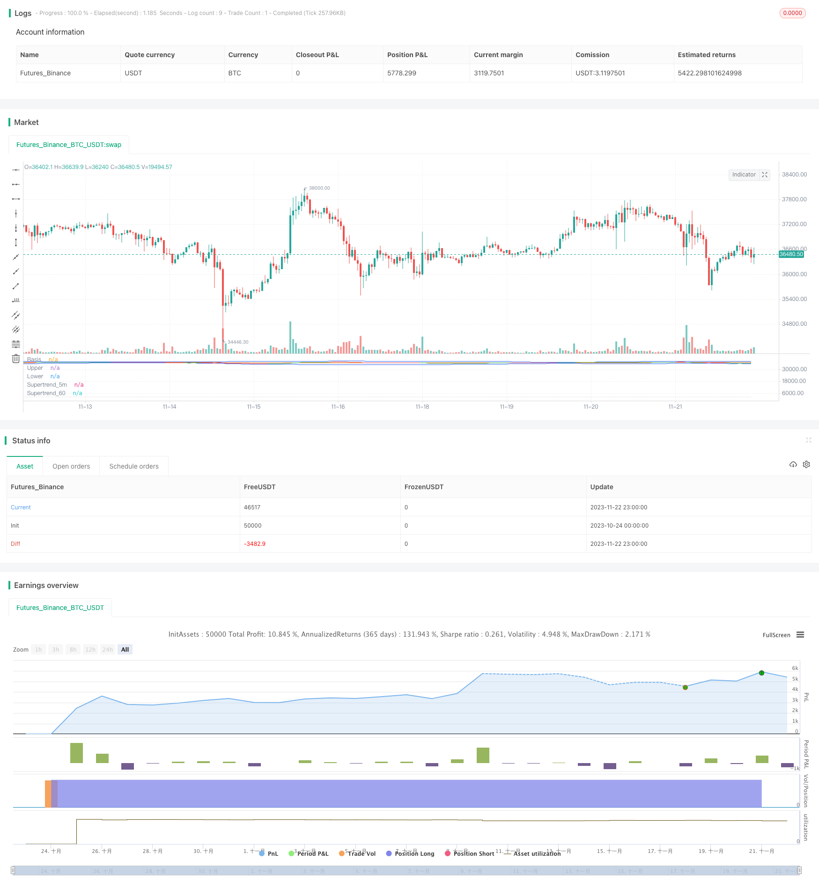

> Name

Cross-Timeframe-SuperTrend-Breakout-Strategy Cross-Timeframe-SuperTrend-Breakout-Strategy
> Author

ChaoZhang

> Strategy Description


[trans]

## Overview
This strategy combines multi-time frame supertrend indicators with Bollinger Bands indicators to identify trend directions and key support and resistance levels, make entries on shock breakouts, and exit positions based on crossovers. This strategy is mainly suitable for highly volatile commodity futures, such as gold, silver, crude oil, etc.
## Strategy Principle
Based on the custom multi-time frame super trend function `pine_supertrend()` written in Pine Script, it combines the super trends of different periods (such as 1 minute and 5 minutes) to determine the trend direction of the large cycle.
At the same time, calculate the upper and lower rails of Bollinger Bands and judge channel breakthroughs. When the price breaks above the upper Bollinger Band, it is considered a bullish breakthrough; when the price falls below the lower Bollinger Band, it is considered a bearish breakthrough.
Strategy signals:
Bull Signal: Close Price > Upper Bollinger Bands and Close Price > Multi Time Frame Super Trend Indicator
Short Signal: Closing Price < Lower Bollinger Bands and Closing Price < Multi Time Frame Super Trend Indicator
Stop loss:
Long stop loss: closing price < 5-minute super trend indicator
Short Stop Loss: Close Price > 5 Minute Super Trend Indicator
Therefore, the strategy captures the resonance breakthroughs of the Super Trend indicator and the Bollinger Band indicator and performs transactions in high-volatility markets.
## Advantage Analysis
- Use multi-time frame super trend indicators to determine the trend direction of large cycles and improve signal quality
- The upper and lower Bollinger Bands serve as key support and resistance levels, which can reduce false breakthroughs
- Super trend indicators serve as stop loss levels to reduce losses and control risks
## Risk Analysis
- The super trend indicator has hysteresis and may miss the trend reversal point
- Improper setting of Bollinger Band parameters may lead to too frequent or too missing trades
- Commodity futures prices fluctuate violently during night trading or when major events occur, making it easy to stop losses.
Risk resolution:
- Combine a variety of auxiliary indicators to confirm signals to avoid false breakthroughs
- Optimize Bollinger Band parameters and find the best balance point
- Adjust stop loss position and expand stop loss distance
## Optimization direction
- Try other trend indicators, such as KDJ, MACD, etc. as auxiliary judgments
- Add machine learning model judgment probability as a boost
- Perform parameter optimization to find the best hyperparameter combination
## Summarize
This strategy integrates two efficient indicators, super trend and Bollinger Bands, and achieves high-probability trading through cross-time frame analysis and channel breakthrough judgment. The strategy effectively controls capital risks and confirms that better returns can be obtained in high-volatility varieties. Through further optimization and combination of INDICATORS, the effectiveness of the strategy can be improved.
||

## Overview

The strategy incorporates the SuperTrend indicator across multiple timeframes and Bollinger Bands to identify trend direction and key support/resistance levels, and enters trades on breakouts during volatility. It is designed mainly for highly volatile commodity futures like gold, silver, crude oil etc.


## Strategy Logic

Custom Pine Script function `pine_supertrend()` implemented to compute SuperTrend across different timeframes (e.g. 1 min and 5 min) and determine the direction of larger timeframe trend.

Bollinger Bands upper/lower bands act as channels. Breakouts signals trend directionality. Close above upper band signifies bullish breakout. Close below lower band signifies bearish breakdown.

Entry Signals:

Long: Close > Upper Band AND Close > SuperTrend (multiple TF) 
Short: Close < Lower Band AND Close < SuperTrend (multiple TF)


Exits:

Long Exit: Close < 5m SuperTrend
Short Exit: Close > 5m SuperTrend


So it aims to capture resonance breakouts between SuperTrend and BB in volatile momentum.


## Advantage Analysis

- Uses SuperTrend across timeframes to determine high-conviction trend directionality
- BB Bands act as key support/resistance levels to avoid false breakouts
- SuperTrend acts as dynamic stop loss to control risk


## Risk Analysis

- SuperTrend can lag turning points and trend reversals
- Suboptimal BB parameters may cause too many or few trades
- Sharp overnight gaps or news events can hit stop loss


Risk Mitigations:

- Add more indicators to confirm signals and avoid false breakouts
- Optimize BB parameters for best balance
- Widen stop loss buffer to accommodate gaps


## Enhancement Opportunities

- Test other trend indicators like KDJ MACD for additional signal confirmation
- Add ML model for breakout probability
- Parameter tuning for optimal parameter set


## Conclusion

The strategy combines the power of SuperTrend and Bollinger Bands using cross timeframe analysis and channel breakouts for high-probability trading. It effectively controls risk and can generate good profits in volatile instruments. Further optimizations and indicator combinations can improve performance.

[/trans]

> Strategy Arguments


|Argument|Default|Description|
|----|----|----|
|v_input_1|75|MA_SMA_ST|
|v_input_2|10|ATR Length|
|v_input_3|3|Factor|
|v_input_int_1|75|length|
|v_input_string_1|0|Basis MA Type: SMA|EMA|SMMA (RMA)|WMA|VWMA|
|v_input_4_close|0|Source: close|high|low|open|hl2|hlc3|hlcc4|ohlc4|
|v_input_float_1|2.5|StdDev|
|v_input_int_2|false|Offset|
|v_input_5|1|Timeframe 1|
|v_input_6|5|Timeframe 2|


> Source (PineScript)

``` pinescript
/*backtest
start: 2023-10-24 00:00:00
end: 2023-11-23 00:00:00
period: 1h
basePeriod: 15m
exchanges: [{"eid":"Futures_Binance","currency":"BTC_USDT"}]
*/

// This source code is subject to the terms of the Mozilla Public License 2.0 at https://mozilla.org/MPL/2.0/
// © ambreshc95

//@version=5
strategy("Comodity_SPL_Strategy_01", overlay=false)

// function of st
// [supertrend, direction] = ta.supertrend(3, 10)
// plot(direction < 0 ? supertrend : na, "Up direction", color = color.green, style=plot.style_linebr)
// plot(direction > 0 ? supertrend : na, "Down direction", color = color.red, style=plot.style_linebr)

// VWAP
// src_vwap = input(title = "Source", defval = hlc3, group="VWAP Settings")
// [_Vwap,stdv,_] = ta.vwap(src_vwap,false,1)
// plot(_Vwap, title="VWAP", color = color.rgb(0, 0, 0))


// The same on Pine Script®
pine_supertrend(factor, atrPeriod,len_ma) =>
    
    h= ta.sma(high,len_ma)
    l= ta.sma(low,len_ma)
    hlc_3 = (h+l)/2
    src = hlc_3
    atr = ta.atr(atrPeriod)
    upperBand = src + factor * atr
    lowerBand = src - factor * atr
    prevLowerBand = nz(lowerBand[1])
    prevUpperBand = nz(upperBand[1])

    lowerBand := lowerBand > prevLowerBand or close[1] < prevLowerBand ? lowerBand : prevLowerBand
    upperBand := upperBand < prevUpperBand or close[1] > prevUpperBand ? upperBand : prevUpperBand
    int direction = na
    float superTrend = na
    prevSuperTrend = superTrend[1]
    if na(atr[1])
        direction := 1
    else if prevSuperTrend == prevUpperBand
        direction := close > upperBand ? -1 : 1
    else
        direction := close < lowerBand ? 1 : -1
    superTrend := direction == -1 ? lowerBand : upperBand
    [superTrend, direction]
len_ma_given = input(75, title="MA_SMA_ST")
[Pine_Supertrend, pineDirection] = pine_supertrend(3, 10,len_ma_given)
// plot(pineDirection < 0 ? Pine_Supertrend : na, "Up direction", color = color.green, style=plot.style_linebr)
// plot(pineDirection > 0 ? Pine_Supertrend : na, "Down direction", color = color.red, style=plot.style_linebr)
// 
// Define Supertrend parameters
atrLength = input(10, title="ATR Length")
factor = input(3.0, title="Factor")

// // Calculate Supertrend
[supertrend, direction] = ta.supertrend(factor, atrLength)

st_color = supertrend > close ? color.red : color.green
// // Plot Supertrend
// plot(supertrend, "Supertrend", st_color)
// 

// BB Ploting
length = input.int(75, minval=1)
maType = input.string("SMA", "Basis MA Type", options = ["SMA", "EMA", "SMMA (RMA)", "WMA", "VWMA"])
src = input(close, title="Source")
mult = input.float(2.5, minval=0.001, maxval=50, title="StdDev")

ma(source, length, _type) =>
    switch _type
        "SMA" => ta.sma(source, length)
        "EMA" => ta.ema(source, length)
        "SMMA (RMA)" => ta.rma(source, length)
        "WMA" => ta.wma(source, length)
        "VWMA" => ta.vwma(source, length)

basis = ma(src, length, maType)
dev = mult * ta.stdev(src, length)
upper = basis + dev
lower = basis - dev
offset = input.int(0, "Offset", minval = -500, maxval = 500)
plot(basis, "Basis", color=#FF6D00, offset = offset)
p1 = plot(upper, "Upper", color=#2962FF, offset = offset)
p2 = plot(lower, "Lower", color=#2962FF, offset = offset)
fill(p1, p2, title = "Background", color=color.rgb(33, 150, 243, 95))


// h= ta.sma(high,60)
// l= ta.sma(low,60)
// c= sma(close,60)
// hlc_3 = (h+l)/2
// supertrend60 = request.security(syminfo.tickerid,  supertrend)

// // Define timeframes for signals
tf1 = input(title="Timeframe 1", defval="1")
tf2 = input(title="Timeframe 2",defval="5")
// tf3 = input(title="Timeframe 3",defval="30")


// // // Calculate Supertrend on multiple timeframes
supertrend_60 = request.security(syminfo.tickerid, tf1, Pine_Supertrend)
supertrend_5m = request.security(syminfo.tickerid, tf2, supertrend)
// supertrend3 = request.security(syminfo.tickerid, tf3, supertrend)

// // Plot Supertrend_60
st_color_60 = supertrend_60 > close ? color.rgb(210, 202, 202, 69) : color.rgb(203, 211, 203, 52)
plot(supertrend_60, "Supertrend_60", st_color_60)

// // Plot Supertrend_5m
st_color_5m = supertrend_5m > close ? color.red : color.green
plot(supertrend_5m, "Supertrend_5m", st_color_5m)


ma21 = ta.sma(close,21)
// rsi = ta.rsi(close,14)
// rsima = ta.sma(rsi,14)

// Define the Indian Standard Time (IST) offset from GMT
ist_offset = 5.5 // IST is GMT+5:30

// Define the start and end times of the trading session in IST
// start_time = timestamp("GMT", year, month, dayofmonth, 10, 0) + ist_offset * 60 * 60
// end_time = timestamp("GMT", year, month, dayofmonth, 14, 0) + ist_offset * 60 * 60
// Check if the current time is within the trading session
// in_trading_session = timenow >= start_time and timenow <= end_time

in_trading_session = not na(time(timeframe.period, "0945-1430"))
// bgcolor(inSession ? color.silver : na)
out_trading_session = not na(time(timeframe.period, "1515-1530"))
// // // Define buy and sell signals
buySignal = close>upper and close > supertrend_5m and close > supertrend_60 and close > ma21  and in_trading_session //close > supertrend and
sellSignal = close<lower and close < supertrend_5m and close < supertrend_60 and close < ma21  and in_trading_session //close < supertrend and

var bool long_position = false
var bool long_exit = false
var float long_entry_price = 0
var float short_entry_price = 0

if buySignal and not long_position
    // label.new(bar_index, na, yloc = yloc.belowbar, style = label.style_label_up, color = color.green, size = size.small)
    long_position := true
    strategy.entry("Buy",strategy.long)

long_exit := (close < supertrend_5m)
if long_position and long_exit
    // label.new(bar_index, na, yloc = yloc.belowbar, style = label.style_xcross, color = color.green, size = size.tiny)
    long_position := false
    strategy.exit("Exit","Buy",stop = close)

var bool short_position = false
var bool short_exit = false
if sellSignal and not short_position
    // label.new(bar_index, na, yloc = yloc.abovebar, style = label.style_label_down, color = color.red, size = size.small)
    short_position := true
    strategy.entry("Sell",strategy.short)

short_exit := (close > supertrend_5m)
if short_position and short_exit
    // label.new(bar_index, na, yloc = yloc.belowbar, style = label.style_xcross, color = color.red, size = size.tiny)
    short_position := false
    strategy.exit("Exit","Sell", stop = close)

if out_trading_session
    long_position := false
    strategy.exit("Exit","Buy",stop = close)
    short_position := false
    strategy.exit("Exit","Sell", stop = close)

// if long_position
//     long_entry_price := close[1] + 50//bar_index

// if short_position
//     short_entry_price := close[1] - 50//bar_index

// if (long_position and high[1] > long_entry_price)
//     label.new(bar_index, na, yloc = yloc.abovebar, style = label.style_triangledown, color = color.yellow, size = size.tiny)

// if (short_position and low[1] < short_entry_price)
//     label.new(bar_index, na, yloc = yloc.belowbar, style = label.style_triangleup, color = color.yellow, size = size.tiny)


```

> Detail

https://www.fmz.com/strategy/433074

> Last Modified

2023-11-24 10:27:52
