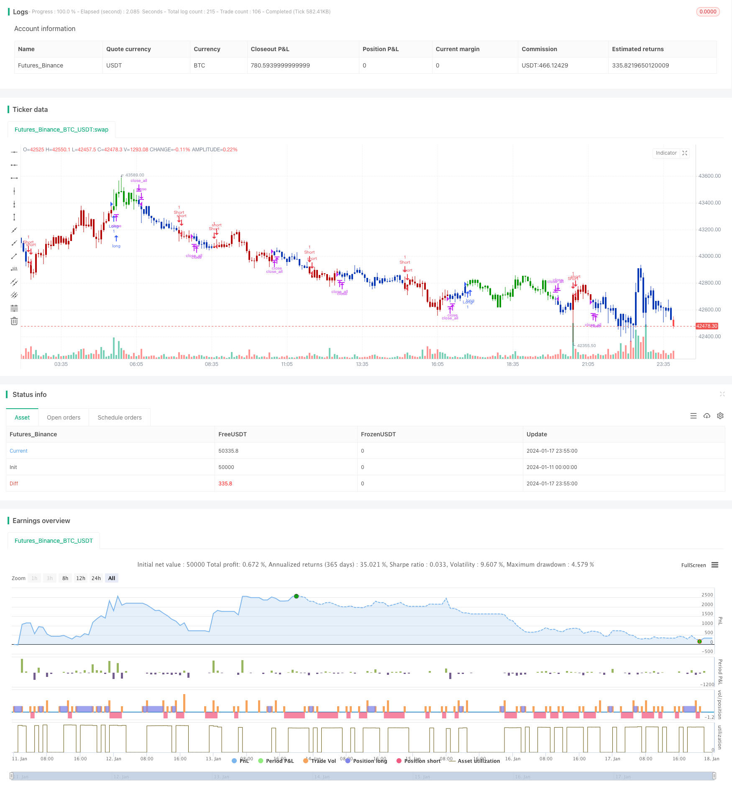

> Name

Cross-Trend-Reversal-Combined-with-Three-Ten-Oscillator-Dual-Strategies
> Author

ChaoZhang

> Strategy Description


 [trans]
## Overview
This strategy mainly combines two different types of strategy signals to achieve the superposition of strategy signals to achieve the effect of improving signal quality. The first signal is the Crossed Reversal strategy, and the second signal is the Thirty Oscillator strategy.
### Strategy 1: Cross-trend reversal strategy
This strategy is derived from page 183 of the book How I Tripled My Gains in the Futures Market. A reversal type of strategy. The specific logic is: when the closing price is higher than the closing price of the previous day for two consecutive days, and the 9-day slow K-line is lower than 50, go long; when the closing price is lower than the previous day's closing price for two consecutive days, and the 9-day fast K-line is higher than 50, go short.
### Strategy 2: Thirty Oscillator Strategy
This strategy uses the difference between the 3-day moving average and the 10-day moving average to construct an indicator. Specifically, the 3-day exponential moving average minus the 10-day exponential moving average is the fast line, and then the 16-day simple moving average is applied to the fast line to get the slow line. When the fast line breaks through the slow line from bottom to top, go long; when the fast line breaks through the slow line from top to bottom, go short.
## Strategy Principle
- First calculate the trading signal posReversal123 for the cross-trend reversal strategy;
- Then calculate the trading signals posD_Three for the thirty oscillator strategy;
- When the two signals are in the same direction (double long or double short), the comprehensive signal is output;
- Determine the specific trading direction and price based on the comprehensive signal pos;
- Draw K lines in different colors.
## Advantage Analysis
This comprehensive signal superimposed by multiple strategies has the following advantages:
1. Filter false signals and improve signal quality
Since two strategies are required to give signals in the same direction at the same time, the influence of false signals in a single strategy can be avoided, thereby improving the reliability of the signal.
2. Integrate multiple trading concepts
Combining the two concepts of reversal strategy and trend strategy can reduce strategic blind spots to a certain extent and obtain a more comprehensive market perspective.
3. High flexibility
According to actual needs, the strategy combination of participating comprehensive strategies can be adjusted and combined with different types of strategies to create a more diversified comprehensive strategy.
## Risk Analysis
1. Hypothetical contradiction
The basic assumption of this strategy is that multiple strategies can verify each other's signals. But there is also the theoretical possibility that all strategies may send wrong signals at the same time.
2. Inconsistent signals
When the signals of the two strategies are inconsistent, it is impossible to judge which strategy is more reliable, and there is a certain decision-making risk.
3. Parameter mismatch
If the parameters are set improperly, some strategies may not function properly and the expected effect of the strategy combination cannot be achieved.
Countermeasures:
1. Increase the number of strategies and conduct majority voting
2. Set a stop loss point to control the loss of a single signal
3. Optimize parameters to ensure the normal operation of the strategy
## Optimization direction
This strategy can also be optimized from the following directions:
1. Add more strategy combinations
You can continue to add more different types of strategies to form combination strategies to further improve signal quality.
2. Pre-filtering conditions
According to the market characteristics, some early conditions can be set, such as market filtering, to avoid opening positions under inappropriate market conditions.
3. Dynamically adjust strategy weights
According to the past performance of different strategies, their weights can be dynamically adjusted to participate in the combination, so that strategies with better performance can play a greater role.
4. Optimize parameter details
The parameters within each strategy can be carefully tested and optimized through a more systematic approach to obtain the best parameters.
## Summarize
This strategy is a multi-strategy superposition comprehensive strategy. It integrates two sub-strategies, the cross-trend reversal strategy and the thirty-year oscillation strategy. By making their trading signals go in the same direction, trading instructions are generated, which can effectively filter out false signals in a single strategy and improve signal quality. Compared with a single strategy, this type of strategy combination has the advantages of higher signal reliability and stronger fault tolerance. However, we also need to pay attention to the risks that may be caused by the consistency assumption, and take appropriate measures to control it. Overall, this multi-strategy combination framework has great potential for expansion and can be deepened by adding more sub-strategies, optimizing parameters, and setting filter conditions.
||

## Overview

This strategy mainly combines signals from two different types of strategies to superimpose strategy signals and improve signal quality. The first type of strategy is the cross trend reversal strategy and the second type of signal is the three ten oscillator strategy.

### Strategy 1: Cross Trend Reversal Strategy

This strategy originates from page 183 of the book "How I Tripled My Money in the Futures Market". It belongs to the reversal type of strategy. The specific logic is: when the closing price is higher than the previous closing price for two consecutive days, and the 9-day slow K-line is lower than 50, go long; when the closing price is lower than the previous closing price for two consecutive days, and the 9-day fast K-line is higher than 50, go short.

### Strategy 2: Three Ten Oscillator Strategy

This strategy uses the difference between the 3-day moving average and the 10-day moving average to construct an indicator. Specifically, it is the 3-day exponential moving average minus the 10-day exponential moving average. The difference is the fast line. Taking a 16-day simple moving average of this fast line gives the slow line. When the fast line breaks through the slow line from bottom to top, go long; when the fast line breaks through the slow line from top to bottom, go short.

## Strategy Principle 

- First calculate the trading signal posReversal123 of the cross trend reversal strategy;
- Then calculate the trading signal posD_Three of the three ten oscillator strategy;
- When the two signals are in the same direction (dual multi or dual short), output a combined signal;
- Determine the specific trading direction and price based on the combined signal pos;
- Draw K-lines in different colors.

## Advantage Analysis

This composite signal of multi-strategy stacking has the following advantages:

1. Filter fake signals and improve signal quality

   As two strategies are required to give signals in the same direction at the same time, the impact of fake signals in a single strategy can be avoided, thereby improving signal reliability.

2. Integrate multiple trading ideas

   Combining reversal strategies and trend strategies integrates two ideas to some extent Reduce the blind spots of the strategy and get a more comprehensive market perspective.

3. High flexibility

   According to actual needs, the combination of participating strategies can be adjusted to create more diversified combination strategies by combining different types of strategies.

## Risk Analysis  

1. Contradictory assumptions

   The basic assumption of this strategy is that multiple strategies can verify signals with each other. But in theory, it is also possible for all strategies to give wrong signals at the same time.

2. Inconsistent signals

   When the two strategy signals are inconsistent, it is impossible to determine which strategy is more reliable, and there is a certain decision risk.

3. Parameter mismatch

   Improper parameter settings may cause some strategies to fail to function properly, resulting in failure to achieve the expected effects of strategy combinations.

Countermeasures:

1. Increase the number of strategies for majority vote

2. Set stop loss points to control losses from individual signals  

3. Optimize parameters to ensure normal strategy operation   

## Optimization Directions

The strategy can also be optimized in the following directions:

1. Increase combination of more strategies

   Continue to add more different types of strategies to form combination strategies, so as to further improve signal quality.

2. Prior filtering conditions

   According to market conditions, some prior conditions can be set, such as market filtering, to avoid opening positions in unsuitable market conditions.

3. Dynamically adjust strategy weights

   The weights of different strategies in the combination can be dynamically adjusted according to their historical performance, so that strategies with better performance can play a greater role.

4. Optimize parameter details

   A more systematic approach can be used to carefully test and optimize the internal parameters of each strategy in order to obtain the optimal parameters.

## Summary  

This strategy belongs to a multi-strategy overlay composite strategy. It integrates two sub-strategies, the cross-trend reversal strategy and the three-ten oscillation strategy. It generates trading orders only when their trading signals are in the same direction, which can effectively filter out fake signals in a single strategy and improve signal quality. Compared with a single strategy, this type of strategy combination has advantages such as higher signal reliability and stronger fault tolerance. But the risks brought by consistency assumptions also need to be noted, and appropriate measures should be taken to control them. In general, this multi-strategy combination framework has great potential for expansion, and can be deepened through adding more sub-strategies, optimizing parameters and setting filtering conditions.

[/trans]

> Strategy Arguments


|Argument|Default|Description|
|----|----|----|
|v_input_1|14|Length|
|v_input_2|true|KSmoothing|
|v_input_3|3|DLength|
|v_input_4|50|Level|
|v_input_5|3|Length1|
|v_input_6|10|Length2|
|v_input_7|16|Length3|
|v_input_8|false|Trade reverse|


> Source (PineScript)

``` pinescript
/*backtest
start: 2024-01-11 00:00:00
end: 2024-01-18 00:00:00
period: 5m
basePeriod: 1m
exchanges: [{"eid":"Futures_Binance","currency":"BTC_USDT"}]
*/

//@version=4
////////////////////////////////////////////////////////////
//  Copyright by HPotter v1.0 04/12/2019
// This is combo strategies for get a cumulative signal. 
//
// First strategy
// This System was created from the Book "How I Tripled My Money In The 
// Futures Market" by Ulf Jensen, Page 183. This is reverse type of strategies.
// The strategy buys at market, if close price is higher than the previous close 
// during 2 days and the meaning of 9-days Stochastic Slow Oscillator is lower than 50. 
// The strategy sells at market, if close price is lower than the previous close price 
// during 2 days and the meaning of 9-days Stochastic Fast Oscillator is higher than 50.
//
// Second strategy
// TradeStation does not allow the user to make a Multi Data Chart with 
// a Tick Bar Chart and any other type a chart. This indicator allows the 
// user to plot a daily 3-10 Oscillator on a Tick Bar Chart or any intraday interval.
// Walter Bressert's 3-10 Oscillator is a detrending oscillator derived 
// from subtracting a 10 day moving average from a 3 day moving average. 
// The second plot is an 16 day simple moving average of the 3-10 Oscillator. 
// The 16 period moving average is the slow line and the 3/10 oscillator is 
// the fast line.
// For more information on the 3-10 Oscillator see Walter Bressert's book 
// "The Power of Oscillator/Cycle Combinations" 
//
// WARNING:
// - For purpose educate only
// - This script to change bars colors.
////////////////////////////////////////////////////////////
Reversal123(Length, KSmoothing, DLength, Level) =>
    vFast = sma(stoch(close, high, low, Length), KSmoothing) 
    vSlow = sma(vFast, DLength)
    pos = 0.0
    pos := iff(close[2] < close[1] and close > close[1] and vFast < vSlow and vFast > Level, 1,
	         iff(close[2] > close[1] and close < close[1] and vFast > vSlow and vFast < Level, -1, nz(pos[1], 0))) 
	pos

D_Three(Length1, Length2, Length3) =>
    pos = 0.0
    xPrice =  security(syminfo.tickerid,"D", hl2)
    xfastMA = ema(xPrice, Length1)
    xslowMA = ema(xPrice, Length2)
    xMACD = xfastMA - xslowMA
    xSignal = sma(xMACD, Length3)
    pos := iff(xSignal > xMACD, -1,
    	     iff(xSignal < xMACD, 1, nz(pos[1], 0)))     
    pos

strategy(title="Combo Backtest 123 Reversal & D_Three Ten Osc", shorttitle="Combo", overlay = true)
Length = input(14, minval=1)
KSmoothing = input(1, minval=1)
DLength = input(3, minval=1)
Level = input(50, minval=1)
//-------------------------
Length1 = input(3, minval=1)
Length2 = input(10, minval=1)
Length3 = input(16, minval=1)
reverse = input(false, title="Trade reverse")
posReversal123 = Reversal123(Length, KSmoothing, DLength, Level)
posD_Three = D_Three(Length1, Length2, Length3)
pos = iff(posReversal123 == 1 and posD_Three == 1 , 1,
	   iff(posReversal123 == -1 and posD_Three == -1, -1, 0)) 
possig = iff(reverse and pos == 1, -1,
          iff(reverse and pos == -1 , 1, pos))	   
if (possig == 1) 
    strategy.entry("Long", strategy.long)
if (possig == -1)
    strategy.entry("Short", strategy.short)	 
if (possig == 0) 
    strategy.close_all()
barcolor(possig == -1 ? #b50404: possig == 1 ? #079605 : #0536b3 )
```

> Detail

https://www.fmz.com/strategy/439351

> Last Modified

2024-01-19 14:41:02
