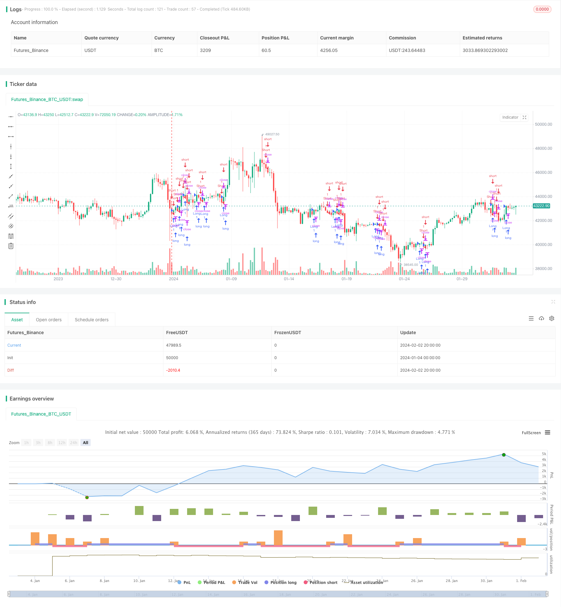

> Name

Crossover-Strategy-between-Multiple-Moving-Averages Crossover-Strategy-between-Multiple-Moving-Averages
> Author

ChaoZhang

> Strategy Description


[trans]

## Overview
This strategy realizes trend judgment in multiple time frames by calculating moving averages of multiple different time periods. When the price breaks through the moving averages of different periods, corresponding long and short operations are performed. At the same time, combine stop loss and take profit methods to achieve a balance between risk and return.
## Strategy Principle
This strategy is mainly based on the following key points:
1. Calculate the simple moving averages of four different time periods: 21-day, 50-day, 100-day and 200-day.
2. When the price crosses any of the average lines, go long; when the price crosses any of the average lines, go short.
3. After entering a long situation, the stop loss point is set near the lowest price of the previous K line; after entering a short situation, the stop loss point is set near the highest price of the previous K line.
4. The long-selling take-profit point is set to a certain range below the lowest price; the short-selling take-profit point is set to a certain range above the highest price.
5. When the price hits the stop loss point or take profit point, close the position and leave the market.
Through this multi-time frame judgment method, the reliability of trading signals can be improved and the trend can be tracked when it is clear. At the same time, stop loss and take profit settings can control risks and exit the market after losses expand or profits reach a certain level.
## Advantage Analysis
This strategy mainly has the following advantages:
1. Multi-time frame judgment to improve signal reliability. The cross combination of moving averages of different periods can filter out some false signals and choose the time when the trend is clearer to trade.
2. Dynamic stop-loss and stop-profit methods facilitate risk control. Combining K-line data to calculate stop-loss and stop-profit levels, you can set a reasonable range based on the actual market fluctuations and effectively control the maximum value of a single loss.
3. The code structure is clear and simple. Based on the Pine editor's strategy syntax, the code structure is clear and easy to read, making it easy to adjust and optimize parameters.
4. Easy to apply in real market. Moving average crossover is a relatively classic trading strategy idea. After parameter adjustment, it is easy to apply in real trading and the effect is relatively stable.
## Risk Analysis
This strategy also has certain risks, mainly reflected in the following aspects:
1. Risk of incorrect trend judgment. As a trend judgment indicator, the moving average will also suffer from confusion and lag, which may lead to deviations in trading signals.
2. The risk of loss due to significant market shocks. When there is a large gap or huge reversal in the market, the stop loss point may be easily triggered, resulting in larger losses.
3. Improper parameter settings may expand losses. If the stop loss point is set too wide or the profit stop point is set too tight, the size of a single loss will also be enlarged.
4. Long-term holding risk. This strategy focuses on trend tracking, but does not consider the issue of long-term return drawdown ratio. Long-term full position holding may consume a large amount of funds.
5. Platform differences bring real offer risks. In a full-featured trading platform, the rate of return may be affected by issues such as transaction costs and slippage.
Countermeasures:
1. Verify the signal in combination with other indicators. For example, KDJ, MACD and other indicators can assist in judgment.
2. Adjust the stop loss range according to market conditions. Plenty of space prevents stops from being triggered easily.
3. Optimize parameters and evaluate long-term return drawdowns. The best parameter combination is obtained through repeated testing.
4. Fully test the strategy in simulated trading and supplement manual stop loss methods.
## Optimization direction
There is room for further optimization of this strategy, and the main directions are as follows:
1. Add quantitative entry and exit conditions. For example, you can set up filters for new high and new low prices to ensure that you choose the time to trade when the trend is clear.
2. Combine fund management and position control methods. Dynamically adjust the position ratio for each transaction based on account and market conditions.
3. Add judgment logic for trend indicators. Combine PRZ, ATR, DMI and other indicators to set the selection and filtering rules for trend trading.
4. Set up the alternating long and short exit mechanism. After making a profit, set a trailing stop loss of the price retracement range to achieve profit protection.
5. Construct an underlying pool that meets intelligent stock selection standards. Evaluate the scores of various indicators to construct and adjust the stock pool.
6. Add machine learning risk control methods. Use deep learning models such as LSTM and RNN to assist judgment and reduce the risk of manual misoperation.
## Summarize
This strategy uses the multi-time frame intersection of simple moving averages to judge trends, and is easy to operate. It also has dynamic stop loss and take profit settings, which can effectively control risks. However, there is also a certain risk of signal misjudgment and the problem of capital loss under volatile market conditions. By further optimizing parameters and adding auxiliary technical indicators, risk control methods, etc., more excellent and stable trading performance can be achieved.
||

## Overview

This strategy calculates moving average lines of multiple timeframes to determine the trend across different periods. It goes long when the price crosses over the moving averages and goes short when the price crosses below the moving averages. Additionally, stop loss and take profit are incorporated to balance risks and returns.  

## Principles

The strategy is based on the following key points:

1. Calculate 21-day, 50-day, 100-day and 200-day simple moving averages.  

2. Go long when the price crosses over any of the moving averages, and go short when it crosses below.

3. Set the stop loss near the lowest price of the previous bar after opening long positions, and near the highest price after opening short positions.  

4. Set take profit targets below the lowest price for longs and above the highest price for shorts within certain ranges.

5. Close positions when the price hits the stop loss or take profit levels.

Judging trends across multiple timeframes can improve the reliability of trading signals and allow us to follow the trends when they are relatively clear. The stop loss and take profit mechanics control risks by exiting positions when losses expand or profits reach certain levels.  

## Advantages

The main advantages of this strategy are:

1. Improved signal reliability with multiple timeframe analysis. Different moving average crossovers help filter out some false signals and allow us to trade at clearer trend moments.  

2. Dynamic stops facilitate risk control. Calculating stops based on price action provides reasonable ranges to limit max loss on a per trade basis.

3. Simple and clear code structure. The Pine syntax offers readable structures to easily adjust parameters and optimize.  

4. Easy practical application. Moving average crossovers are a classic strategy idea that can be easily implemented in live trading with proper parameter tuning.

## Risks

There are also some risks to consider:

1. Inaccurate trend judgement. Moving averages can produce mixed signals and lag, leading to improper trade signals.  

2. Loss exposure in volatile markets. Stop losses may get triggered easily in huge price gaps or reversals, incurring large losses.

3. Improper parameter setting enlarges losses. Overly wide stops or tight take profits can increase the max loss per trade.  

4. Long holding risks. This trend following strategy does not consider long-term profitability and can consume significant capital over time. 

5. Real trading differences. Trading costs, slippage etc. can affect returns when applied in actual trading platforms.

Solutions:

1. Add signal confirmation with other indicators like KDJ, MACD etc.  

2. Adjust stop width based on market conditions to avoid premature trigger.

3. Optimize parameters and evaluate long-term returns and drawdowns. Obtain best parameter combinations through rigorous backtesting.  

4. Thoroughly test strategies in paper trading and add manual stops.

## Enhancement Opportunities 

There is room for further improvements:

1. Add quantitative entry and exit rules. For example, check for new highs and lows to ensure trading at clearer trends.

2. Incorporate position sizing and risk management. Dynamically size positions based on account size and market conditions.   

3. Enhance trend validation. Use indicators like PRZ, ATR, DMI etc. to filter and select appropriate trends. 

4. Alternate long and short holding periods. Set trailing stops on profits to lock in gains.
 
5. Construct stock pool using factor investing models. Score and filter stocks on various factors.

6. Add machine learning for risk control. Use LSTM, RNN etc. to assist in judgement and prevent human errors.

## Conclusion

This simple moving average crossover strategy offers easy implementation for trend following. The dynamic stops help control risks. But some signal inaccuracies and whipsaw risks exist. Further optimizations on parameters and additional techniques can lead to more robust performance.

[/trans]


> Source (PineScript)

``` pinescript
/*backtest
start: 2024-01-04 00:00:00
end: 2024-02-03 00:00:00
period: 4h
basePeriod: 15m
exchanges: [{"eid":"Futures_Binance","currency":"BTC_USDT"}]
*/

//@version=5
strategy("DolarBasar by AlperDursun", shorttitle="DOLARBASAR", overlay=true)

// Input for Moving Averages
ma21 = ta.sma(close, 21)
ma50 = ta.sma(close, 50)
ma100 = ta.sma(close, 100)
ma200 = ta.sma(close, 200)

// Calculate the lowest point of the previous candle for stop loss
lowestLow = ta.lowest(low, 2)

// Calculate the highest point of the previous candle for stop loss
highestHigh = ta.highest(high, 2)

// Calculate take profit levels
takeProfitLong = lowestLow - 3 * (lowestLow - highestHigh)
takeProfitShort = highestHigh + 3 * (lowestLow - highestHigh)

// Entry Conditions
longCondition = ta.crossover(close, ma21) or ta.crossover(close, ma50) or ta.crossover(close, ma100) or ta.crossover(close, ma200)
shortCondition = ta.crossunder(close, ma21) or ta.crossunder(close, ma50) or ta.crossunder(close, ma100) or ta.crossunder(close, ma200)

// Stop Loss Levels
stopLossLong = lowestLow * 0.995
stopLossShort = highestHigh * 1.005

// Exit Conditions
longExitCondition = low < stopLossLong or high > takeProfitLong
shortExitCondition = high > stopLossShort or low < takeProfitShort

if (longCondition)
    strategy.entry("Long", strategy.long)

if (shortCondition)
    strategy.entry("Short", strategy.short)

if (longExitCondition)
    strategy.exit("Long Exit", from_entry="Long", stop=stopLossLong, limit=takeProfitLong)

if (shortExitCondition)
    strategy.exit("Short Exit", from_entry="Short", stop=stopLossShort, limit=takeProfitShort)

```

> Detail

https://www.fmz.com/strategy/441008

> Last Modified

2024-02-04 17:21:25
