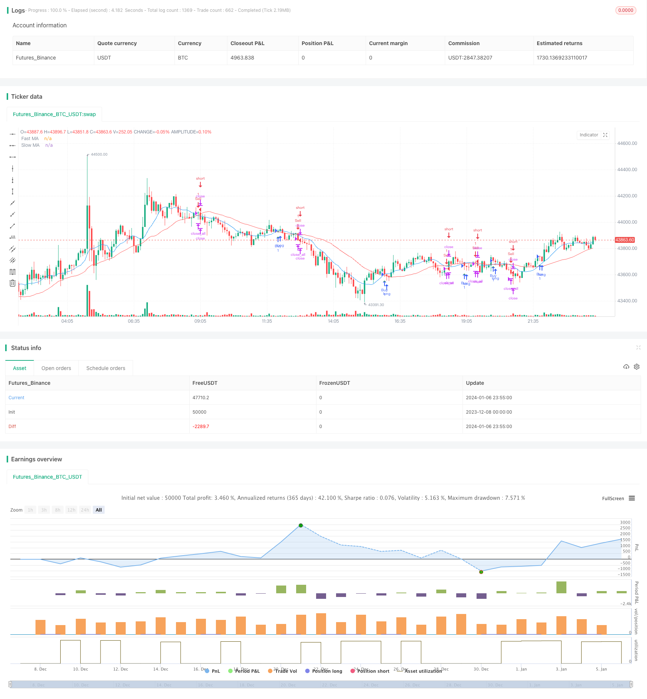

> Name

Crude-Oil-Moving-Average-Crossover-Strategy
> Author

ChaoZhang

> Strategy Description


[trans]

### Overview
This strategy uses two moving averages with different parameters, the fast moving average and the slow moving average. When the fast moving average crosses above the slow moving average, a buy signal is generated; when the fast moving average crosses below the slow moving average, a sell signal is generated. At the same time, if the slow moving average crosses the fast moving average from below, a sell signal will also be generated to close all positions.
### Strategy Principles
The core logic of this strategy is based on the golden cross principle of moving averages. The so-called golden cross means that the short-term moving average crosses the long-term moving average, which is regarded as a signal of market reversal and usually indicates a rise in stock prices. The death cross is when the short-term moving average crosses below the long-term moving average, indicating a decline in stock prices.
Specifically, the strategy defines two moving averages, the fast moving average is 10 days in length and the slow moving average is 30 days in length. At the end of each K line, calculate the values ​​of these two moving averages. If the fast moving average crosses the slow moving average, a buy signal is generated; if the fast moving average crosses below the slow moving average, a sell signal is generated.
In order to stop losses in time, if the slow moving average crosses the fast moving average, a sell signal will be generated to directly close all positions.
### Analysis of strategic advantages
This strategy has the following advantages:
1. Using the golden cross theory of moving averages, this is a simple and effective technical indicator trading strategy.
2. The fast moving average parameter is 10 days, which can quickly respond to price changes; the slow moving average parameter is 30 days, which can effectively filter market noise.
3. The strategy incorporates a stop-loss mechanism. If an adverse situation occurs, the loss will be stopped quickly to effectively control risks.

4. The strategy has simple logic, is easy to understand and implement, and is suitable for automatic execution of quantitative transactions.
5. Indicator parameters can be flexibly adjusted to adapt to different types of transactions.

### Risk Analysis
Although this strategy has obvious advantages, there are also certain risks that need to be noted:
1. If there is a long-term trend market, this strategy may produce frequent false signals. It can be optimized by adjusting the moving average parameters.
2. The moving average itself has lagging characteristics, which may cause some lag in the signal.
3. A single indicator strategy is easily misleading and should be combined with other factors to determine the final entry.

4. Improperly set stop loss points may cause unnecessary losses. Reasonable stop loss positions should be set for different varieties.
### Strategy optimization direction
There is room for further optimization of this strategy:
1. You can test more combinations of parameters to find the best lengths of fast moving averages and slow moving averages.
2. You can add confirmation of other indicators, such as trading volume, Bollinger Bands, etc., to improve the accuracy of the signal.
3. Adaptive moving averages can be used according to different states of the market to optimize parameters in real time.
4. Slippage control can be set up to avoid unnecessary slippage losses during high fluctuations.
5. You can add an automatic stop loss strategy and dynamically set the stop loss level based on ATR.
### Summary
This strategy uses the simple double moving average golden cross theory to provide a simple and practical technical indicator trading strategy for quantitative trading. This strategy is easy to understand and implement, and can be applied to different varieties and market environments after parameter optimization. It deserves the attention and testing of quantitative investors.
In general, the moving average strategy has a probability advantage, and with strict risk control, it has the possibility of long-term profits. However, traders also need to be aware of its limitations and should use it flexibly and supplement it with other analysis tools.
|| 

### Overview

This strategy utilizes two moving averages with different parameters, a faster moving average and a slower moving average. When the faster moving average crosses above the slower moving average, a buy signal is generated. When the faster moving average crosses below the slower moving average, a sell signal is generated. Additionally, a sell signal is generated if the slower moving average crosses above the faster moving average.

### Strategy Logic  

The core logic of this strategy is based on the golden cross theory of moving averages. The so-called golden cross refers to the fast moving average crossing above the slow moving average, which is regarded as a signal of market reversal and usually indicates upward movement in price. The death cross, on the other hand, refers to the fast moving average crossing below the slow moving average, indicating downward price movement.

Specifically, this strategy defines two moving averages - a fast moving average with length 10 days and a slow moving average with length 30 days. At the end of each candlestick bar, the values of these two moving averages are calculated. If the fast moving average crosses above the slow moving average, a buy signal is generated. If the fast moving average crosses below the slow moving average, a sell signal is generated. 

To cut losses in a timely manner, if the slow moving average crosses above the fast moving average, a sell signal is also generated to close all positions directly.

### Advantage Analysis

This strategy has the following advantages:

1. It utilizes the golden cross theory of moving averages, which is a simple and effective technical indicator trading strategy.

2. The fast moving average has a parameter of 10 days, which can respond quickly to price changes. The slow moving average has a parameter of 30 days which can filter out market noise effectively.

3. The strategy incorporates a stop loss mechanism which cuts losses fast when unfavorable patterns emerge, effectively controlling risks.

4. The strategy logic is simple to understand and implement, suitable for automated execution in quantitative trading.  

5. Indicator parameters can be adjusted flexibly for trading different products.

### Risk Analysis  

While the strategy has obvious advantages, there are also certain risks to be aware of:

1. If prolonged trending occurs in the market, it may generate frequent false signals. This can be optimized by adjusting moving average parameters.  

2. Moving averages themselves have a lagging nature, which may cause some lag in signal generation.

3. Single indicator strategies are easily misguided and should be combined with other factors to determine final entry.

4. Improper stop loss positioning may lead to unnecessary losses. Reasonable stop loss levels should be set for different products.


### Optimization Directions

There is room for further optimization of this strategy:

1. More parameter combinations can be tested to find the optimal lengths for fast and slow moving averages.

2. Confirmation from other indicators like volume, Bollinger bands etc. can be added to improve signal accuracy.  

3. Adaptive moving averages can be used to optimize parameters dynamically based on varying market conditions.

4. Slippage control can be implemented to avoid unnecessary slippage loss in times of high volatility.

5. A dynamic stop loss strategy can be added based on ATR to set stops.

### Conclusion
This strategy utilizes the simple double moving average golden cross theory to provide a simple and practical technical indicator trading strategy for quantitative trading. It is easy to understand and implement, and can be applied to different products and market environments after parameter optimization, making it worthwhile for quantitative investors to pay attention to and test.

Overall, moving average strategies have a probability edge, and with strict risk control, can be profitable in the long run. But traders also need to be aware of its limitations, apply it flexibly, and complement it with other analysis tools.

[/trans]

> Strategy Arguments


|Argument|Default|Description|
|----|----|----|
|v_input_1|10|Fast Length|
|v_input_2|30|Slow Length|


> Source (PineScript)

``` pinescript
/*backtest
start: 2023-12-08 00:00:00
end: 2024-01-07 00:00:00
period: 5m
basePeriod: 1m
exchanges: [{"eid":"Futures_Binance","currency":"BTC_USDT"}]
*/

//@version=5
strategy("Crude Oil Moving Average Crossover", overlay=true)

// Define inputs
fastLength = input(10, "Fast Length")
slowLength = input(30, "Slow Length")

// Calculate moving averages
fastMA = ta.sma(close, fastLength)
slowMA = ta.sma(close, slowLength)

// Plot moving averages
plot(fastMA, color=color.blue, title="Fast MA")
plot(slowMA, color=color.red, title="Slow MA")

// Entry conditions
longCondition = ta.crossover(fastMA, slowMA)
shortCondition = ta.crossunder(fastMA, slowMA)

// Exit conditions
exitCondition = ta.crossover(slowMA, fastMA)

// Execute strategy
if longCondition
    strategy.entry("Buy", strategy.long)
if shortCondition
    strategy.entry("Sell", strategy.short)
if exitCondition
    strategy.close_all()

// Plot buy and sell signals
plotshape(longCondition, title="Buy Signal", location=location.belowbar, color=color.green, style=shape.triangleup, size=size.small)
plotshape(shortCondition, title="Sell Signal", location=location.abovebar, color=color.red, style=shape.triangledown, size=size.small)


```

> Detail

https://www.fmz.com/strategy/438010

> Last Modified

2024-01-08 10:25:00
