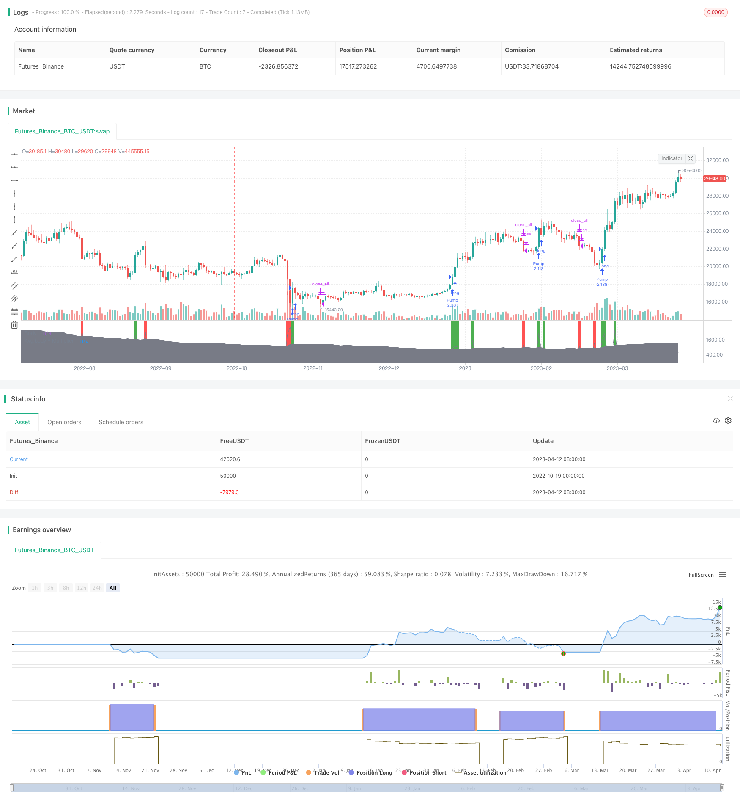

> Name

Cryptocurrency Momentum Breakout StrategyCryptocurrency-Momentum-Breakout-Strategy
> Author

ChaoZhang

> Strategy Description



[trans]

### Overview
This strategy uses the momentum indicator to identify the main trend direction of the Cryptocurrency market, establish a long position at the breakthrough point, and realize the trading idea of ​​chasing the rise and killing the fall.
### Strategy Principles
This strategy uses a custom "Pump&Dump Oscillator" as the only indicator. This oscillator uses the size of the K-line body to identify the market's main trend direction. Specifically, it calculates the average of the K-line entities and multiplies it by a user-set multiplier. When the real body is greater than the moving average, it means that the current trend is up; when the real body is less than the moving average, it means that the current trend is down.
This strategy only opens long positions based on the oscillator's indicators. When the indicator shows that it is currently in an upward phase, establish a long position when the K line closes. After that, if a down signal appears or the stop loss point is triggered, all positions will be closed.
This strategy provides two stop-loss methods, which can be used either one or at the same time:
1. Percent stop loss: Users can set the percentage of the maximum allowable loss for a position. If the price falls below this percentage stop, the position is closed.
2. Stop loss breakthrough: When opening a position, record the lowest point of the K line. If the price then falls below that point, close the position.
### Advantage Analysis
This strategy has the following advantages:
1. Use custom indicators to identify market trends, which is more sensitive and accurate.
2. Only go long and avoid the unlimited loss risk caused by short selling.
3. Adopt the idea of ​​chasing the rise and killing the fall, which is in line with the classic method of trend trading.
4. Provide dual stop loss methods, you can freely choose the stop loss mode that is more suitable for you.
5. The code is simple and clear, easy to understand and modify.
6. There is no need to set a dynamic take-profit to avoid loss of profits caused by premature take-profit.
### Risk Analysis
This strategy also has some risks:
1. Custom indicators may not be stable and reliable enough, and there is a risk of misjudgment.
2. If you only establish a long position, you may miss the short-term opportunity during a short-term correction.
3. The stop loss setting may be too conservative to hold long-term positions.
4. There is no dynamic stop-profit setting, and manual and timely stop-profit is required, which involves operational risks.
5. Although the two stop loss methods can be combined arbitrarily, the best stop loss point may still not be found.
6. The strategy of chasing the rise and killing the fall is easily misled by the volatile market and produces too many invalid transactions.
### Optimization direction
This strategy can be optimized from the following aspects:
1. Try other indicators. For example, KDJ, MACD, etc., find a more stable and reliable way to identify trends.
2. Increase short selling opportunities. Allows short selling when the trend turns, improving strategic returns.
3. Optimize stop loss strategy. Test different parameters to find better stop loss points. Or use ATR, MA and other indicators to dynamically set stop loss.
4. Add dynamic take profit. For example, setting a take profit after breaking through the previous high can reduce the risk of manual operations.
5. Carry out parameter optimization. Adjust the moving average parameters, position opening conditions, etc. to find the best parameter combination.
6. Add filter conditions. Only Long or bottom indicators, etc., to avoid invalid transactions.
7. Test different varieties. Evaluate the effectiveness of strategies in mainstream currencies and optimize the scope of application.
8. Use backtesting and simulation optimization strategies to find optimal parameters and stop loss and profit points.
### Summarize
This strategy is overall a relatively simple strategy of chasing ups and killing downs. It uses customized momentum indicators to determine market trends, establish long positions at the beginning of the trend, and provide double stop loss methods. The main advantages are clear strategic ideas, limited risks, and easy operation. But there is also some room for optimization, such as stop loss strategies, parameter selection, etc. Overall, this strategy provides a basic trend strategy idea for the Cryptocurrency market, which is very suitable for novices to learn and practice. However, before actual application, it still needs to be fully backtested to verify its effect and further optimized.
||
### Overview

This strategy utilizes momentum indicators to identify the main trend direction in the Cryptocurrency market and establishes long positions at breakout points, realizing the trading idea of trend following.

### Strategy Logic

The strategy uses a custom "Pump&Dump Oscillator" as the only indicator. The oscillator uses the size of candlestick bodies to identify the main trend direction of the market. Specifically, it calculates the moving average of candlestick bodies and multiplies it by a user-set multiplier. When the body is greater than the moving average, it signals an uptrend. When the body is less than the moving average, it signals a downtrend.

Based on the oscillator indicator, this strategy only establishes long positions. When the indicator shows that the market is currently in an uptrend, a long position is established on the close of that candlestick. Afterwards, if a downtrend signal appears, or the stop loss is triggered, all positions will be closed. 

The strategy provides two stop loss methods, either one or both can be used:

1. Percentage stop loss: Users can set the maximum percentage loss allowed for each position. If the price drops below this percentage stop loss level, the position will be closed.

2. Breakout stop loss: Record the lowest point of the candlestick when opening the position. If the price then drops below this point later, close the position.

### Advantage Analysis 

This strategy has the following advantages:

1. Uses a custom indicator to identify market trends, which is more sensitive and accurate.

2. Only goes long, avoiding the unlimited loss risk of short selling.

3. Adopts the idea of trend trading, which is a classic trend following approach.

4. Provides dual stop loss methods, allowing free choice of the more suitable stop loss mode.

5. Simple and clear code, easy to understand and modify.

6. No need to set dynamic take profit, avoiding premature profit taking leading to lost profits.

### Risk Analysis

This strategy also has some risks:

1. Custom indicators may not be stable and reliable, with the risk of misjudgement. 

2. Only establishing long positions may miss short-term pullback shorting opportunities.

3. Stop loss settings may be too conservative, unable to hold longer trending positions.

4. Lack of dynamic take profit requires timely manual profit taking, with operational risks.

5. Although both stop loss methods can be freely combined, the optimal stop loss point may still not be found.

6. Trend chasing strategies are prone to be misguided by ranging markets, producing excessive invalid trades.

### Optimization Directions

This strategy can be optimized from the following aspects:

1. Try other indicators, such as KDJ, MACD etc, to find more stable and reliable trend identification methods.

2. Increase shorting opportunities by allowing short positions when trends reverse, improving strategy profitability. 

3. Optimize stop loss strategies by testing different parameters to find better stop loss points, or use ATR, MA etc to set dynamic stops.

4. Add dynamic take profit, such as setting profit taking after breaking previous highs, reducing manual operation risks.

5. Conduct parameter optimization by adjusting MA periods, entry conditions etc to find optimal parameter combinations.

6. Add filtering conditions like Only Long or bottom indicators to avoid invalid trades.

7. Test on different products to evaluate strategy effectiveness across major coin pairs and optimize applicability.

8. Utilize backtesting and demo trading to optimize parameters and stop loss/take profit points.

### Summary 

Overall this is a relatively simple trend chasing strategy. It uses a custom momentum indicator to judge market trends, establishes long positions at the start of trends, and provides dual stop loss methods. The main advantages are a clear strategy logic, limited risks, and ease of operation. But there is also room for optimization in areas like stop loss strategies and parameter selection. In general, this strategy provides a fundamental trend trading idea for the Cryptocurrency market, and is very suitable for beginners to learn and practice. But sufficient backtesting should still be conducted to validate its effectiveness and optimize further before applying it in live trading.

[/trans]

> Strategy Arguments


|Argument|Default|Description|
|----|----|----|
|v_input_1|3|multiplier|
|v_input_2|100|length|
|v_input_3|100|Stop loss, %|


> Source (PineScript)

``` pinescript
/*backtest
start: 2022-10-19 00:00:00
end: 2023-04-13 00:00:00
period: 1d
basePeriod: 1h
exchanges: [{"eid":"Futures_Binance","currency":"BTC_USDT"}]
*/

//@version=3
strategy("[BoTo] Pump&Dump Strategy", shorttitle = "[BoTo] P&D Strategy", default_qty_type = strategy.percent_of_equity, default_qty_value = 100, pyramiding = 0)

//Settings
multiplier = input(3.0)
length = input(100)
stop = input(100.0, title = "Stop loss, %")

//Indicator
body = abs(close - open)
sma = sma(body, length) * multiplier
plot(body, color = gray, linewidth = 1, transp = 0, title = "Body")
plot(sma, color = gray, style = area, linewidth = 0, transp = 90, title = "Avg.body * Multiplier")

//Signals
pump = body > sma and close > open
dump = body > sma and close < open
color = pump ? green : dump ? red : na
bgcolor(color, transp = 0)

//Stops
size = strategy.position_size
autostop = 0.0
autostop := pump and size == 0 ? low : autostop[1]
userstop = 0.0
userstop := pump and size == 0 ? close - (close / 100 * stop) : userstop[1]

//Strategy
if pump
    strategy.entry("Pump", strategy.long)
if dump or low < autostop or low < userstop
    strategy.close_all()
```

> Detail

https://www.fmz.com/strategy/430280

> Last Modified

2023-10-26 17:23:20
